# 起因
今天下午，收到了一封邮件。

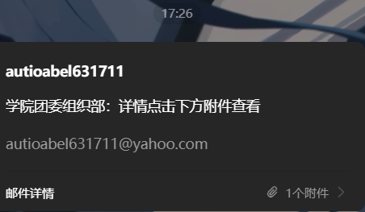

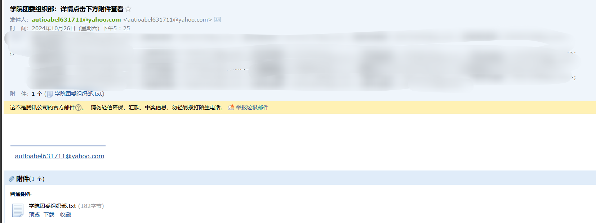

附件点开是一个网站。

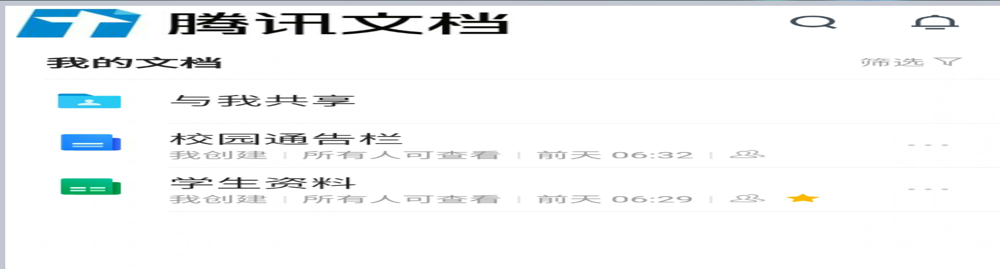

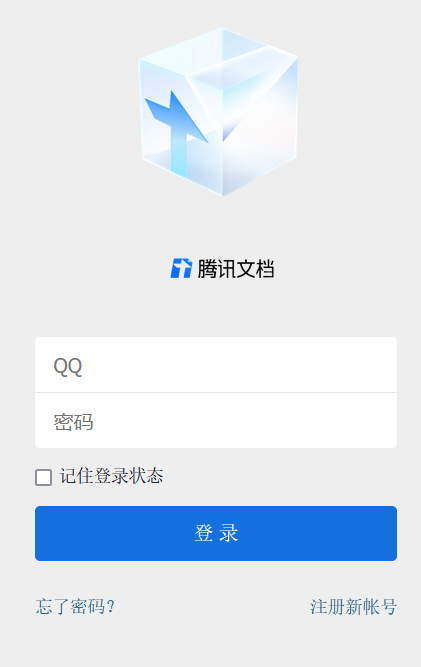

一眼盗号的，开始渗透。

# 渗透
在填写 QQ 账号和密码的界面抓包，得到一串 base64.

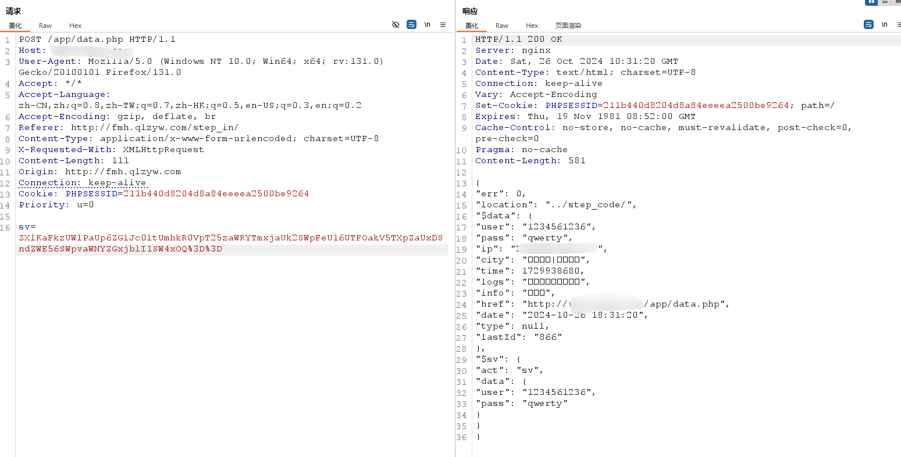

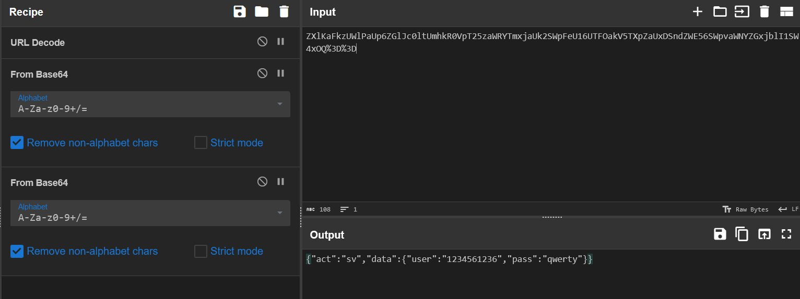

其实就是将输入信息的 json 进行了两次 base64。

有 XSS 漏洞，直接用 XSS 平台生一个 payload，然后两次 base64 替换回去。

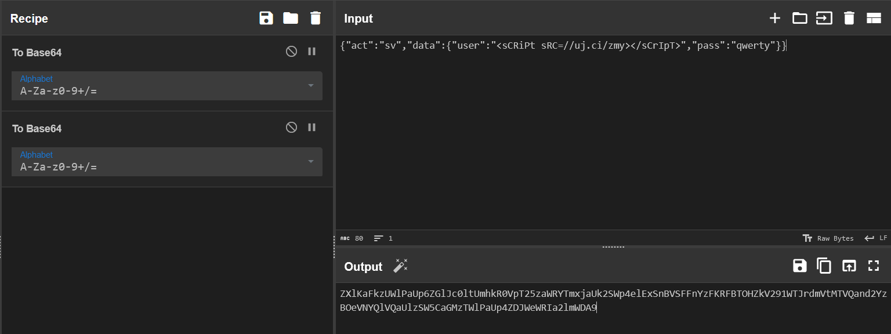

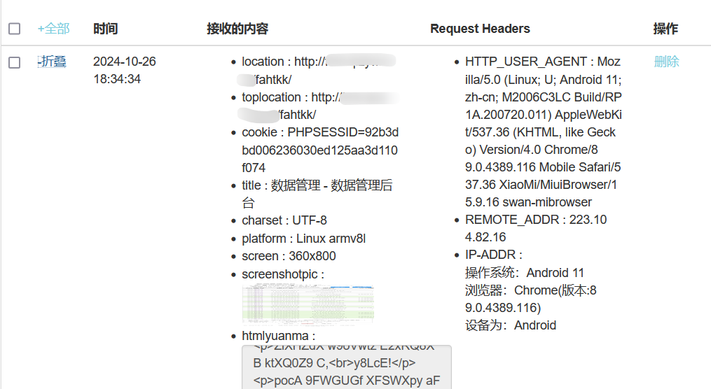

成功接受。

用管理员的 PHPSESSID 进入后台。

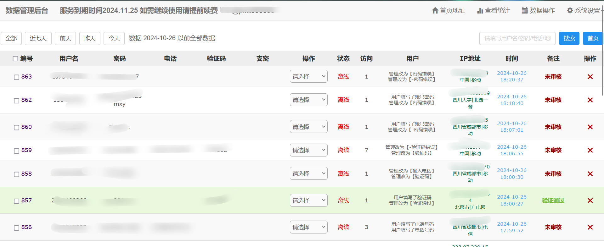

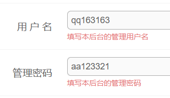

骗了好多人。。。把数据清空了。

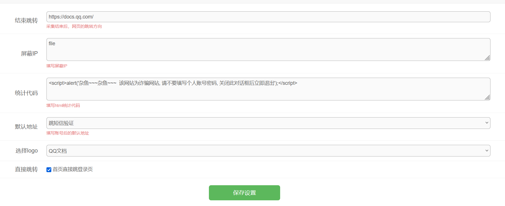

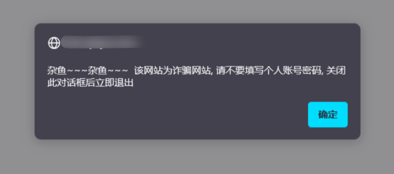

