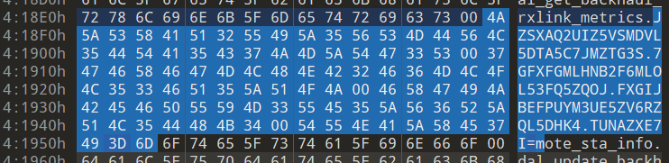

选手：Aura

## MISC
### NepMagic —— CheckIn
简单签到，玩到通关即可，其中有一层需要把隐藏砖都撞出来，不然后面会卡死。


### Nemophila
```python
import base64

print("这里有一个藏宝室，镇守着一个宝箱怪，当你说出正确的口令时，你也就快获得了这个屋子里最至高无上的宝物。")
print("提示：宝箱怪只会提示你口令正确与否，请你试试吧！")
flag = input('Turn in your guess: ')

if len(flag) !=48:
    print("长度不对！")
    exit(1)

if ord(flag.capitalize()[0]) != 83 or not flag[0].islower():
    print("Please try again!")
    exit(1)

if flag[-3:] != "ve}":
    print("Please try again!")
    exit(1)    

if flag.count(chr(95)) != 4:
    print("Please try again!")
    exit(1)

if base64.b64encode((flag[10:13]+flag[28:31]).encode('utf-8')).decode() != 'RnJpSGlt':
    print("Please try again!")
    exit(1)

if int(flag[24:26]) > 10 and int(flag[24:26]) < 20 and pow(int(flag[24:26]),2,5) != 0:
    print("好像有点不对！")
    exit(1)

number = flag[33] + flag[41] + flag[43:45]
if int(number) * 9_27 != 1028970 and not number.isnumeric():
    print(1028970//9_27)
    print("还是不对呢！")
    exit(1)

if flag[35:41].replace("e", "1") != "1t1rna":
    print("Please try again!")
    exit(1)

if flag[31:33].swapcase() != "ME":
    print("这不是我!")
    exit(1)

if list(map(len,flag.split("_"))) != [6, 12, 14, 7, 5] and list(map(len,flag.split("&"))) != [17, 9, 20]:
    print("换个顺序！")
    exit(1)    

if ord(min(flag[:2].swapcase())) != 69:
    print("Please try again!")
    exit(1)    

if flag[2] + flag[4:6] != "cet4"[:3]:
    print("我不想考四级！")
    exit(1)

new=""
for i in flag[7:10] + flag[18] + flag[26]: new += chr(ord(i) + 1)
if new != "jt|Df":
    temp = "jt|Df"
    res = ""
    for i in temp:
        res+=chr(ord(i)-1)
    print(res)
    print("Please try again!")
    exit(1)    

if "SunR" in flag and "eren" in flag:
    print("好像对了！可以先去试试！")
    exit(1)

print("恭喜你~发现了上个世纪的秘密~快去向冒险家协会索要报酬吧！")
```

输入的正确字符串就是压缩包的密码，只需要挨个条件满足尝试即可。

```plain
secret_is{Frieren&C_SunR15e&Himme1_eterna1_10ve}
```

解开压缩包，得到一个损坏的 PNG 文件，并且文件头不是 PNG 的文件头。

可能文件经过了异或处理，尝试用 PNG 的文件头异或此文件，发现文件异或加密的字符串就是刚才的压缩包密码。

那么就用刚才的压缩包密码去异或此文件，得到 PNG 图片。

图片的 CRC 有问题，使用宽高爆破得到修复后的图片，flag 就在其中。


### 3DNep
未知文件类型，拖入010看一下。


搜了一下，是 .gltf文件，可以用在线查看器查看。

[https://gltf.nsdt.cloud/](https://gltf.nsdt.cloud/)


可以在模型底部找到汉信码，扫一下就能出 flag。


### NepCamera
流量分析，流量包里面很多东西，而且有很多 JPG 头，我这里直接先批量导出 16 进制分组字节流，使用 scapy。

```python
from scapy.all import rdpcap
def save_combined_hex(pcapng_file, output_file):
    packets = rdpcap(pcapng_file)
    all_bytes = b''
    for packet in packets:
        all_bytes += bytes(packet)
    hex_string = all_bytes.hex()
    with open(output_file, 'w') as f:
        f.write(hex_string)
    print(f"Combined hex data saved to {output_file}")
save_combined_hex('NepCamera.pcapng', 'final.hex')

```

如何提取那么多张 JPG 图像呢，由于刚才已经把所有包的内容都合并到一个文件中了，我们可以每到一个 JPG 头就开始生成新的一张图像，这样就可以把所有图像提取出来。

```python
def hex_to_bytes(hex_string):
    return bytes.fromhex(hex_string)
def save_jpeg(data, filename):
    with open(filename, 'wb') as f:
        f.write(data)
def extract_jpegs_from_hex(hex_file):
    with open(hex_file, 'r') as f:
        hex_data = f.read().strip()
    start_marker = 'ffd8ffe0'
    start_index = 0
    part_index = 1
    while True:
        start_index = hex_data.find(start_marker, start_index)
        if start_index == -1:
            break
        start_index //= 2  
        start_byte_index = start_index * 2
        next_start_marker_index = hex_data.find(start_marker, start_byte_index + len(start_marker))
        if next_start_marker_index == -1:
            next_start_marker_index = len(hex_data)
        next_start_marker_index //= 2
        end_byte_index = next_start_marker_index * 2
        jpeg_data = hex_to_bytes(hex_data[start_byte_index:end_byte_index])
        save_jpeg(jpeg_data, f'image_{part_index}.jpg')
        print(f'Saved image_{part_index}.jpg')
        part_index += 1
        start_index = next_start_marker_index * 2
extract_jpegs_from_hex('final.hex')

```

导出的图片挑几个清楚的看看，就能拼出 flag。


## Reverse
### Super Neuro : Escape from Flame!
Unity 逆向，赛后看到有很多解法，我这里是找 bug 硬打的。

玩家只要碰撞就会恢复跳跃次数，那么可以借助两边的墙直接卡够 1024 分。

### 0ezAndroid
jadx 看一下，有一个 TEA，用 IDA 看一下 .so，发现有个 RC4。

整理一下，大致逻辑就是 RC4 加密了点击次数，并且密钥通过 TEA 加密变为 keyCipher。

RC4 加密后的结果与 array 比较，符合条件则导出一个文件。

不妨先想办法拿到这个导出的文件。

这里直接爆破点击次数，测试出点击次数为 10714 时，能够满足条件。

导出的文件为 pdf，里面有一个很奇怪的地方。

```plain
var cipher = [

	0x69, 0x7c, 0x70, 0x75, 0x68, 0x71, 0x7b, 0x73, 0x79, 0x76, 0x7c, 0x7f,

	0x75, 0x72, 0x78, 0x70, 0x7a, 0x45, 0x4f, 0xe, 0x4d, 0x41, 0x4b, 0x43, 0x42,

	0x46, 0x4c, 0x44, 0x4e, 0x42, 0xc, 0x40, 0x4a, 0x55, 0x5f, 0x13, 0x4e,

];

flag = "";

for \(i = 0x0; i < cipher[_0x1bd3c0\(0x185\)]; i++\) {

	flag += String[_0x1bd3c0\(0x181\)]\(cipher[i] ^ \(i + 0xf\)\);

}

console[_0x1bd3c0\(0x187\)]\(flag\), alert\(flag\);
```

这个应该就是最终的 flag，解密也很简单，异或回去即可。

```cpp
#include<bits/stdc++.h>
using namespace std;
int main() {
    char cipher[] = { 0x69, 0x7c, 0x70, 0x75, 0x68, 0x71, 0x7b, 0x73, 0x79, 0x76, 0x7c, 0x7f,0x75, 0x72, 0x78, 0x70, 0x7a, 0x45, 0x4f, 0xe, 0x4d, 0x41, 0x4b, 0x43, 0x42,0x46, 0x4c, 0x44, 0x4e, 0x42, 0xc, 0x40, 0x4a, 0x55, 0x5f, 0x13, 0x4e };
    for (int i = 0; i < sizeof(cipher); ++i)
        printf("%c", cipher[i] ^ (i + 0xf));
    return 0;
}
```


## Hardware
### 火眼金睛
当成杂项做的，硬是做了出来。

首先用 binwalk 把附件分一下，然后定位到 19047F。

题目提示 有个函数名好像不太正常 ，我没恢复符号表，直接用 010 查看 19047F。

翻找一会可以看到一串诡异的字符串，用 base32 解出来就是 flag。




