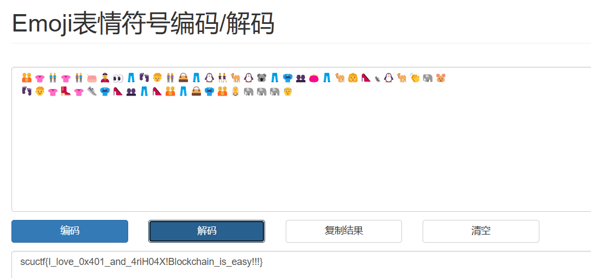
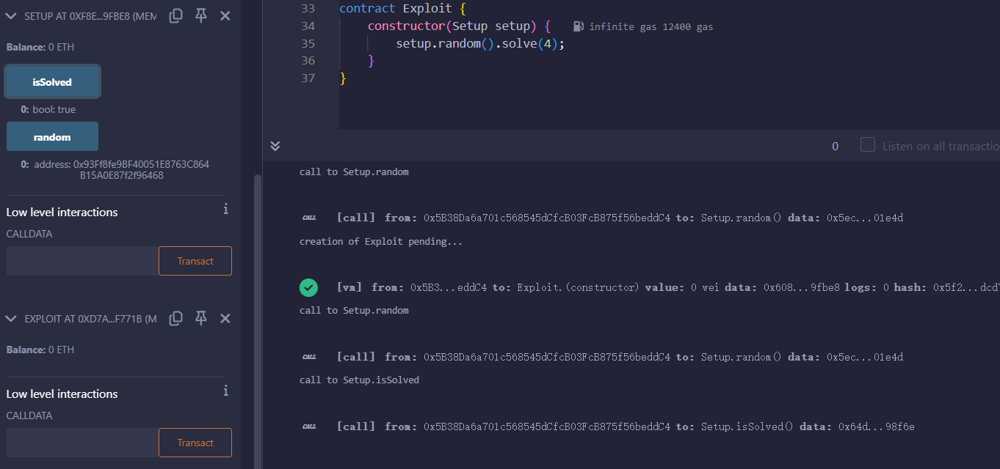

# Blockchain
## ez_Sign
里面有一堆 emoji，有个在线网站可以解。

[http://www.atoolbox.net/Tool.php?Id=937](http://www.atoolbox.net/Tool.php?Id=937)

## Hello BlockChain！
上一题的文档给了 wp 了，那我就不写了，照着做即可。

## Hello BlockChain 2！
和 SHCTF 2023 的签到题一模一样，参考这个。

[https://luoingly.top/post/shctf-2023-blockchain-writeup/](https://luoingly.top/post/shctf-2023-blockchain-writeup/)

照着做就行了，写不动了。

## 川大交易所
非预期了，可能是没部署好。

合约地址出来以后，isSolved 就是 true，直接选 3 就有 flag 了。

## Gambling

GPT 秒了，部署一下合约，直接攻击。

