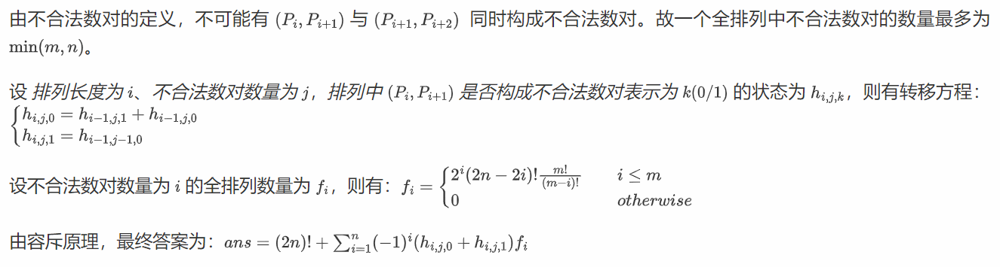

# <font style="color:#601BDE;">R</font><font style="color:#AE146E;">everse</font>
## <font style="color:#5C8D07;">ez_IDA</font>


IDA 打开就是 flag。


## <font style="color:#5C8D07;">BabyApk</font>
```java
package com.example.apk1;

import android.os.Bundle;
import android.view.View;
import android.view.ViewGroup;
import android.widget.Button;
import android.widget.EditText;
import android.widget.Toast;
import androidx.activity.j;
import com.example.apk1.MainActivity;

/* loaded from: classes.dex */
public final class MainActivity extends j {

    /* renamed from: r, reason: collision with root package name */
    public static final /* synthetic */ int f431r = 0;

    /* JADX WARN: Type inference failed for: r2v0, types: [Q.a, java.lang.Object] */
    @Override // androidx.activity.j, B.a, android.app.Activity
    public final void onCreate(Bundle bundle) {
        super.onCreate(bundle);
        View inflate = getLayoutInflater().inflate(R.layout.input_layout, (ViewGroup) null);
        final EditText editText = (EditText) inflate.findViewById(R.id.editText);
        Button button = (Button) inflate.findViewById(R.id.submit_button);
        final ?? obj = new Object();
        obj.f145a = "HappyHappyHappy!";
        obj.f146b = new int[256];
        for (int i2 = 0; i2 < 256; i2++) {
            obj.f146b[i2] = i2;
        }
        button.setOnClickListener(new View.OnClickListener() { // from class: Q.b
            @Override // android.view.View.OnClickListener
            public final void onClick(View view) {
                String str;
                int i3 = MainActivity.f431r;
                a aVar = obj;
                W.a.k(aVar, "$baby");
                MainActivity mainActivity = this;
                W.a.k(mainActivity, "this$0");
                String obj2 = editText.getText().toString();
                W.a.k(obj2, "value");
                aVar.f145a = obj2;
                int i4 = aVar.f147c + 1;
                aVar.f147c = i4;
                int[] iArr = aVar.f146b;
                if (i4 == 987654321) {
                    String valueOf = String.valueOf(i4);
                    int i5 = 0;
                    for (int i6 = 0; i6 < 256; i6++) {
                        i5 = (valueOf.charAt(i6 % valueOf.length()) + (i5 + iArr[i6])) % 256;
                        int i7 = iArr[i6];
                        iArr[i6] = iArr[i5];
                        iArr[i5] = i7;
                    }
                }
                Integer[] numArr = {236, 200, 172, 220, 111, 134, 57, 11, 151, 230, 221, 180, 7, 230, 75, 152, 178, 118, 70, 186, 142, 31, 10};
                String str2 = aVar.f145a;
                int length = str2.length();
                int[] iArr2 = new int[length];
                int length2 = str2.length();
                int i8 = 0;
                int i9 = 0;
                for (int i10 = 0; i10 < length2; i10++) {
                    char charAt = str2.charAt(i10);
                    i8 = (i8 + 1) % 256;
                    int i11 = iArr[i8];
                    i9 = (i9 + i11) % 256;
                    iArr[i8] = iArr[i9];
                    iArr[i9] = i11;
                    iArr2[i8 - 1] = charAt ^ iArr[(iArr[i8] + i11) % 256];
                }
                int i12 = 0;
                int i13 = 0;
                while (true) {
                    if (i12 < length) {
                        int i14 = i13 + 1;
                        if (iArr2[i12] != numArr[i13].intValue()) {
                            str = "Try again";
                            break;
                        } else {
                            i12++;
                            i13 = i14;
                        }
                    } else {
                        str = "You know what you want";
                        break;
                    }
                }
                Toast.makeText(mainActivity, str, 0).show();
            }
        });
        setContentView(inflate);
    }
}


```

jadx 反编译一下，发现加密程序就是个 RC4，注意 key 是 987654321。


## <font style="color:#5C8D07;">白给蟒蛇</font>
python 逆向，用工具反编译出源码。

```python
# uncompyle6 version 3.9.1
# Python bytecode version base 3.8.0 (3413)
# Decompiled from: Python 3.6.12 (default, Feb  9 2021, 09:19:15) 
# [GCC 8.3.0]
# Embedded file name: main.py
flag = [
 18, 19, 42, 84, 75, 113, 53, 42, 60, 98, 109, 126, 73, 42, 21, 44, 
 82, 54, 84, 32, 140, 48, 101, 218, 92, 83, 210, 55, 51, 160, 148, 
 129, 253]
input_str = input("input your str:")
if len(input_str) != 33:
    print("Oh your input is wrong!!!")
result = [ord(i) for i in list(input_str)]
for i in range(33):
    result[i] ^= result[(i - 3 + 33) % 33]
    result[i] += i
else:
    for i, j in zip(result, flag):
        if i != j:
            print("Oh your input is wrong!!!")
            exit(0)
    else:
        print("you get the flag! it's: ", input_str)
        

```

简单异或，倒着写回去即可。

```python
enc = [
 18, 19, 42, 84, 75, 113, 53, 42, 60, 98, 109, 126, 73, 42, 21, 44,
 82, 54, 84, 32, 140, 48, 101, 218, 92, 83, 210, 55, 51, 160, 148,
 129, 253]
flag = ""
for i in range(len(enc)-1,0,-1):
    enc[i] = enc[i] - i
    enc[i] ^= enc[(i-3+33)%33]
for i in enc:
    flag += chr(i)
print(flag)


```


:::danger
这里程序有点小问题，把第一个字符换成 S 就行。

:::


## <font style="color:#5C8D07;">简单算术</font>


这里是主要逻辑，上面有一大堆验证等式，可以用 z3 求解器解决。

```python
import z3
s = z3.Solver()
v3,v4,v5,v6,v7,v8,v9,v10,v11,v12,v13,v14,v15,v16,v17,v18,v19,v20,v21,v22 = z3.Ints('v3 v4 v5 v6 v7 v8 v9 v10 v11 v12 v13 v14 v15 v16 v17 v18 v19 v20 v21 v22')
s.add(253 * v22
     + 299 * v21
     + 88 * v20
     + 323 * v19
     + 764 * v18
     + 349 * v17
     + 758 * v16
     + 233 * v15
     + 255 * v14
     + 343 * v13
     + 613 * v12
     + 629 * v11
     + 596 * v10
     + 183 * v9
     + 43 * v8
     + 482 * v7
     + 771 * v6
     + 42 * v5
     + 244 * v4
     + 651 * v3 == 403332)
...#太长了，省略一部分
s.add( 418 * v22
     + 937 * v21
     + 929 * v20
     + 419 * v19
     + 487 * v18
     + 985 * v17
     + 565 * v16
     + 601 * v15
     + 918 * v14
     + 293 * v13
     + 25 * v12
     + 593 * v11
     + 519 * v10
     + 301 * v9
     + 404 * v8
     + 719 * v7
     + 747 * v6
     + 108 * v5
     + 1001 * v4
     + 389 * v3 == 395149)
s.check()
print(s.model())
'''
enc = [92,8,44,68,35,37,39,25,68,74,63,33,13,96,3,34,45,23,7,28]
[v12 = 74,
 v21 = 7,
 v10 = 25,
 v16 = 96,
 v18 = 34,
 v14 = 33,
 v13 = 63,
 v22 = 28,
 v17 = 3,
 v19 = 45,
 v20 = 23,
 v11 = 68,
 v15 = 13,
 '''


```

解出来的东西直接运行 exe 输进去，不需要再写脚本了。


## <font style="color:#5C8D07;">ez_csgo</font>
```python
import hashlib
import uuid

cost = [1, 7, 17, 23, 49, 68, 79, 100]
num = [8, 6, 6, 6, 6, 6, 7, 8]

def main():
    print("某天，小k闲来无事，翻找自己的库存并卖出了一些东西")
    print("但他没有记录下他卖的东西，现在他求助于你，如果你能告诉他的话他就给你你想要的东西")
    print("要不要猜一下他怎么选的呢？输入8个整数：")
    
    input_values = []
    input_str=input().split()
    for i in range(8):
        try:
            value = int(input_str[i])
            if value < 0 or value > num[i]:
                print("输入数量超出范围，请重新输入")
                return
            input_values.append(value)
        except ValueError:
            print("输入无效，请输入整数")
            return
    
    total_cost = sum(input_values[i] * cost[i] for i in range(8))
    if total_cost != 1072:
        print("你猜错了，gg")
    
    str_input = ''.join(map(str, input_values))
    print(str_input)
    md5_hash = hashlib.md5(str_input.encode()).hexdigest()
    if md5_hash != "bd91b333c2c76df11963d2e78255462b":
        print("你猜错了，gg")
        return
    
    print("你猜对了，恭喜你！")
    
    sha1_hash = hashlib.sha1(str_input.encode()).hexdigest()
    uuid_v5 = uuid.uuid5(uuid.NAMESPACE_URL, sha1_hash)
    
    print(f"SCUCTF{{{uuid_v5}}}")

if __name__ == "__main__":
    main()

    
```

就是一个 DFS 题，不想写了，直接爆破哈希就行。

```python
import hashlib
for p1 in range(9):
    for p2 in range(7):
        for p3 in range(7):
            for p4 in range(7):
                for p5 in range(7):
                    for p6 in range(7):
                        for p7 in range(8):
                            for p8 in range(9):
                                str_input = str(p1) + str(p2) + str(p3) + str(p4) + str(p5) + str(p6) + str(p7) + str(p8)
                                md5_hash = hashlib.md5(str_input.encode()).hexdigest()
                                if md5_hash == "bd91b333c2c76df11963d2e78255462b":
                                    print(str_input)

                                    
```

## <font style="color:#5C8D07;">ChildApk</font>
```java
package com.example.apk2;

import android.os.Bundle;
import android.view.View;
import android.view.ViewGroup;
import android.widget.Button;
import android.widget.EditText;
import android.widget.Toast;
import androidx.activity.j;
import com.example.apk2.Boss;
import com.example.apk2.MainActivity;

/* loaded from: classes.dex */
public final class MainActivity extends j {

    /* renamed from: r, reason: collision with root package name */
    public static final /* synthetic */ int f429r = 0;

    /* JADX WARN: Type inference failed for: r6v1, types: [com.example.apk2.Boss, java.lang.Object] */
    @Override // androidx.activity.j, B.a, android.app.Activity
    public final void onCreate(Bundle bundle) {
        super.onCreate(bundle);
        final ?? obj = new Object();
        View inflate = getLayoutInflater().inflate(R.layout.input, (ViewGroup) null);
        final EditText editText = (EditText) inflate.findViewById(R.id.editTextUsername);
        final EditText editText2 = (EditText) inflate.findViewById(R.id.editTextPassword);
        ((Button) inflate.findViewById(R.id.login_button)).setOnClickListener(new View.OnClickListener() { // from class: Q.a
            @Override // android.view.View.OnClickListener
            public final void onClick(View view) {
                boolean z2;
                String str;
                int i2 = MainActivity.f429r;
                MainActivity mainActivity = this;
                W.a.k(mainActivity, "this$0");
                Boss boss = obj;
                W.a.k(boss, "$boss");
                String obj2 = editText.getText().toString();
                String obj3 = editText2.getText().toString();
                boolean z3 = true;
                if (obj2.length() > 0) {
                    z2 = true;
                } else {
                    z2 = false;
                }
                if (obj3.length() <= 0) {
                    z3 = false;
                }
                if (z2 & z3) {
                    str = boss.stringFromJNI(obj2, obj3);
                } else {
                    str = "Not good enough";
                }
                Toast.makeText(mainActivity, str, 0).show();
            }
        });
        setContentView(inflate);
    }
}


```

看不出来什么东西，需要逆一下 .so 文件。

```c
__int64 __fastcall sub_830(__int64 a1, __int64 a2, __int64 a3, __int64 a4)
{
  const char *v6; // r13
  const char *v7; // r15
  unsigned __int64 v8; // rbx
  __int64 i; // rax
  size_t v10; // rbx
  size_t v11; // rbp
  size_t v12; // r12
  size_t v13; // rax
  unsigned __int64 v14; // r11
  size_t v15; // r10
  __int64 v16; // r9
  size_t v17; // rsi
  int v18; // r8d
  char v19; // cl
  int v20; // ebp
  __int64 v21; // rbx
  int v22; // esi
  int v23; // edi
  bool v24; // bl
  char v25; // dl
  __int64 v26; // rcx
  char v27; // cl
  __int64 v28; // r9
  __int64 v29; // rax
  unsigned __int64 v30; // rbp
  __int128 v32[6]; // [rsp+0h] [rbp-A8h] BYREF
  int v33; // [rsp+60h] [rbp-48h]
  char v34[9]; // [rsp+64h] [rbp-44h] BYREF
  char v35; // [rsp+6Dh] [rbp-3Bh]
  unsigned __int64 v36; // [rsp+70h] [rbp-38h]

  v36 = __readfsqword(0x28u);
  v6 = (*(*a1 + 1352LL))(a1, a3, 0LL);
  v7 = (*(*a1 + 1352LL))(a1, a4, 0LL);
  v35 = 0;
  v34[6] = 0;
  *&v34[7] = 0;
  strcpy(v34, "`exyp");
  if ( __strlen_chk(v34, 10LL) )
  {
    v8 = 0LL;
    do
      v34[v8++] ^= 0x17u;
    while ( __strlen_chk(v34, 10LL) > v8 );
  }
  if ( strlen(v6) != 64 )
    return (*(*a1 + 1336LL))(a1, v34);
  for ( i = 0LL; i != 64; i += 2LL )
  {
    if ( dword_2E50[i] != (v6[i] ^ 0x71) || dword_2E50[i + 1] != (v6[i + 1] ^ 0x71) )
      return (*(*a1 + 1336LL))(a1, v34);
  }
  memset(v32, 0, sizeof(v32));
  v33 = 0;
  if ( !*v7 )
  {
LABEL_36:
    v34[4] = byte_2E4A;
    *v34 = dword_2E46;
    if ( __strlen_chk(v34, 10LL) )
    {
      v30 = 0LL;
      do
        v34[v30++] ^= 0x18u;
      while ( __strlen_chk(v34, 10LL) > v30 );
    }
    return (*(*a1 + 1336LL))(a1, v34);
  }
  v10 = strlen(v7);
  v11 = strlen(v7);
  v12 = strlen(v7);
  v13 = strlen(v7);
  v14 = v11;
  v15 = v10;
  v16 = 0LL;
  v17 = 0LL;
  v18 = 0;
  do
  {
    if ( v15 <= v17 )
    {
      v20 = 0;
    }
    else
    {
      ++v18;
      v20 = v7[v17];
    }
    v21 = v18;
    v22 = 0;
    if ( v14 <= v18 )
    {
      v23 = 0;
      if ( v12 <= v18 )
        goto LABEL_21;
LABEL_20:
      ++v18;
      v22 = v7[v21];
      goto LABEL_21;
    }
    ++v18;
    v23 = v7[v21];
    v21 = v18;
    if ( v12 > v18 )
      goto LABEL_20;
LABEL_21:
    if ( v20 )
    {
      *(v32 + v16) = v6[v20 >> 2];
      v24 = v23 == 0;
    }
    else
    {
      *(v32 + v16) = 61;
      if ( !v23 )
      {
        v24 = 1;
        v25 = 61;
        v26 = v16;
        goto LABEL_26;
      }
      v24 = 0;
    }
    v25 = v6[(16 * v20) & 0x30 | (v23 >> 4)];
    v26 = v16 & 0xFFFFFFFC;
LABEL_26:
    *(v32 + (v26 | 1)) = v25;
    if ( !v24 || (v27 = 61, v22) )
      v27 = v6[(4 * v23) & 0x3C | (v22 >> 6)];
    *(v32 + v16 + 2) = v27;
    if ( v22 )
      v19 = v6[v22 & 0x3F];
    else
      v19 = 61;
    *(v32 + v16 + 3) = v19;
    v16 += 4LL;
    v17 = v18;
  }
  while ( v13 > v18 );
  if ( !v16 )
    goto LABEL_36;
  v28 = v16 & 0xFFFFFFFC;
  v29 = 0LL;
  while ( *(&unk_2F50 + 4 * v29) == __PAIR128__(
                                      __PAIR64__(*(v32 + v29 + 3), *(v32 + v29 + 2)),
                                      __PAIR64__(*(v32 + v29 + 1), *(v32 + v29))) )
  {
    v29 += 4LL;
    if ( v28 == v29 )
      goto LABEL_36;
  }
  return (*(*a1 + 1336LL))(a1, v34);
}


```

其实就是一个换表 base64，把密文和表提取出来，解一下就行了。

一开始的表是有问题的，需要异或一下 0x71。


密文的数据在表的下面，提取的时候需要小修一下，也就是删掉里面的 0。


## <font style="color:#5C8D07;">普通蟒蛇</font>
非常精妙的题！

对环境要求很苛刻，python 版本必须是 3.11。

给了一个 cython 的 so，然后 py 文件导入了这个模块，进行 check。

尝试逆向 so，逻辑很难看懂。

尝试手玩一下这个 check 函数，发现他是逐个字符检测的，也就是说我们可以一个一个字符去试，正确的时候返回 true，错误的时候返回 false，直接爆破即可。

```python
import check
#input_flag=input('Please input your flag: ').strip()
#if len(input_flag)!=17:
#    print('Your flag is too short!')
#elif check.check(input_flag):
#    print('Congratulations!')
#    print('Your flag is SCUCTF{'+input_flag+'}')
#else:
#    print('noooooooooooo!')
flag = check.check('Ju5T_3nj0y_py7h0n')
print(flag)


```

## <font style="color:#5C8D07;">cos90</font>
先看 pri2 这个 elf，加了壳，直接 upx -d 一把梭。

这里要注意使用最新版的脱壳工具，不然脱不出来。

用 ida 小逆一下，发现逻辑很简单。

```c
__int64 __fastcall main(int a1, char **a2, char **a3)
{
  char v4[5]; // [rsp+7h] [rbp-19h] BYREF
  int v5; // [rsp+Ch] [rbp-14h]
  int v6; // [rsp+10h] [rbp-10h]
  int i; // [rsp+14h] [rbp-Ch]
  int v8; // [rsp+18h] [rbp-8h]
  int v9; // [rsp+1Ch] [rbp-4h]

  srand(0x7777u);
  puts("i sound you like xiaoyuankousuan???\nok, let's train for some times.");
  puts("i will give you some numbers, you should check which one is bigger.");
  v9 = 0;
  v8 = 0;
  while ( v8 <= 99999 )
  {
    v6 = rand() % 119;
    v5 = rand() % 119;
    if ( v6 != v5 )
    {
      printf("%d %d:", (unsigned int)v6, (unsigned int)v5);
      __isoc99_scanf("%1s", v4);
      if ( v4[0] == 62 )
      {
        if ( v6 <= v5 )
          goto LABEL_9;
        puts("yes");
        byte_4060[v9 % 32] += 5;
      }
      else
      {
        if ( v4[0] != 60 || v6 >= v5 )
        {
LABEL_9:
          puts("you are wrong!");
          exit(0);
        }
        puts("yes");
        byte_4060[v9 % 32] -= 3;
      }
      ++v9;
      ++v8;
    }
  }
  puts("Now i will give you what you need for the decrypt:");
  for ( i = 0; i <= 31; ++i )
    printf("%d,", byte_4060[i]);
  return 0LL;
}


```

就是以 0x7777 为种子，然后循环 100000 次，每次生两个随机数，进行比大小，比大小的结果决定了进行什么运算。

最后会给出有用的东西。

尝试用 pwntools 交互去做，但是发现好像 IO 有问题，所以手动写了一个 c 跑。

注意要在 linux 机子上跑，不然随机数不一样。

```c
#include<stdio.h>
unsigned char ans[32] =
{
  139, 208,  54, 133, 165,   5, 184, 107, 192,  35,
  249, 234, 105, 234,  86, 136,   3, 214, 135, 198,
   26,   0, 120, 159, 197,  27, 225, 123, 208, 159,
   64, 233
};
int main()
{
    srand(0x7777);
    int i = 0;
    while(i<=99999){
        int a = rand()%119;
        int b = rand()%119;
        if(a==b)continue;
        printf("%d %d\n",a,b);
        if(a>b){
            ans[i%32]+=5;
        }
        else{
            ans[i%32]-=3;
        }
        ++i;
    }
    i=0;
    for(i=0;i<=31;i++)printf("%d,",ans[i]);
    return 0;
}


```

输出结果如下。

```plain
132,153,255,14,190,6,137,44,105,204,194,131,138,43,151,105,228,143,40,175,35,185,161,32,70,252,234,4,153,176,25,18


```

看来 flag 并不在这里，转眼向 encrypt.exe 看去。

```c
// main.main
void __fastcall main_main()
{
  __int128 v0; // rdi
  int v1; // r8d
  int v2; // r9d
  __int64 v3; // r14
  __int128 v4; // xmm15
  unsigned __int64 v5; // rcx
  int v6; // r9d
  int v7; // r10d
  int v8; // r11d
  unsigned __int64 v9; // rax
  ecdh_PublicKey *p_ecdh_PublicKey; // rax
  _ptr_ecdh_x25519Curve v11; // rcx
  int v12; // r8d
  int v13; // r9d
  int v14; // r10d
  _ptr_ecdh_x25519Curve *v15; // r11
  ecdh_PublicKey *v16; // rdx
  __int64 v17; // r8
  __int64 v18; // r9
  __int64 v19; // rbx
  __int64 v20; // rax
  __int64 v21; // rcx
  uint8 *v22; // rdx
  __int64 v23; // rbx
  __int64 v24; // rcx
  __int64 v25; // rbx
  int v26; // r8d
  int v27; // r9d
  int v28; // r10d
  int v29; // r11d
  __int64 File; // rax
  __int64 v31; // rcx
  int v32; // r8d
  int v33; // r9d
  int v34; // r10d
  int v35; // r11d
  __int64 v36; // rax
  unsigned __int64 v37; // rcx
  int v38; // r8d
  int v39; // r9d
  int v40; // r10d
  int v41; // r11d
  __int64 v42; // rdi
  char *v43; // rdx
  char *v44; // rbx
  int v45; // edi
  int v46; // esi
  int v47; // r9d
  int v48; // r10d
  int v49; // r11d
  __int64 v50; // rax
  int v51; // r8d
  int v52; // r9d
  int v53; // r10d
  int v54; // r11d
  __int64 v55; // rax
  int v56; // r8d
  int v57; // r9d
  int v58; // r10d
  int v59; // r11d
  __int64 v60; // [rsp-30h] [rbp-108h]
  __int64 v61; // [rsp-30h] [rbp-108h]
  __int64 v62; // [rsp-30h] [rbp-108h]
  __int64 v63; // [rsp-30h] [rbp-108h]
  __int64 v64; // [rsp-30h] [rbp-108h]
  __int64 v65; // [rsp-30h] [rbp-108h]
  __int64 v66; // [rsp-30h] [rbp-108h]
  __int64 v67; // [rsp-28h] [rbp-100h]
  __int64 v68; // [rsp-28h] [rbp-100h]
  __int64 v69; // [rsp-28h] [rbp-100h]
  __int64 v70; // [rsp-28h] [rbp-100h]
  __int64 v71; // [rsp-28h] [rbp-100h]
  __int64 v72; // [rsp-28h] [rbp-100h]
  __int64 v73; // [rsp-28h] [rbp-100h]
  _BYTE v74[24]; // [rsp-20h] [rbp-F8h]
  __int64 v75; // [rsp-20h] [rbp-F8h]
  __int64 v76; // [rsp-18h] [rbp-F0h]
  __int64 v77; // [rsp-10h] [rbp-E8h]
  int v78; // [rsp-8h] [rbp-E0h]
  char v79; // [rsp+0h] [rbp-D8h] BYREF
  unsigned __int64 v80; // [rsp+20h] [rbp-B8h]
  __int64 v81; // [rsp+28h] [rbp-B0h]
  __int64 v82; // [rsp+30h] [rbp-A8h]
  _ptr_ecdh_x25519Curve v83; // [rsp+38h] [rbp-A0h]
  __int64 v84; // [rsp+40h] [rbp-98h]
  __int64 v85; // [rsp+48h] [rbp-90h]
  __int64 v86; // [rsp+50h] [rbp-88h] BYREF
  __int64 v87; // [rsp+58h] [rbp-80h]
  int v88[2]; // [rsp+60h] [rbp-78h]
  int v89[2]; // [rsp+68h] [rbp-70h]
  __int64 v90; // [rsp+70h] [rbp-68h]
  __int64 v91; // [rsp+78h] [rbp-60h]
  const char *v92; // [rsp+80h] [rbp-58h]
  ecdh_PublicKey *v93; // [rsp+88h] [rbp-50h]
  __int64 v94; // [rsp+90h] [rbp-48h]
  _QWORD v95[2]; // [rsp+98h] [rbp-40h] BYREF
  __int128 v96; // [rsp+A8h] [rbp-30h]
  __int128 v97; // [rsp+B8h] [rbp-20h] BYREF
  int v98[2]; // [rsp+C8h] [rbp-10h]
  _ptr_ecdh_x25519Curve v99; // [rsp+D0h] [rbp-8h]

  while ( &v86 <= *(v3 + 16) )
    runtime_morestack_noctxt();
  v90 = runtime_stringtoslicebyte(
          &v79,
          "04e6b40de9119b77769890348d468f6993f0ea8108d4ae59fff51e5a6b330076",
          64,
          v0,
          DWORD2(v0),
          v1,
          v2);
  v80 = v5;
  *(&v0 + 1) = "04e6b40de9119b77769890348d468f6993f0ea8108d4ae59fff51e5a6b330076";
  v9 = encoding_hex_Decode(
         v90,
         "04e6b40de9119b77769890348d468f6993f0ea8108d4ae59fff51e5a6b330076",
         v5,
         v90,
         "04e6b40de9119b77769890348d468f6993f0ea8108d4ae59fff51e5a6b330076",
         v5,
         v6,
         v7,
         v8,
         v60,
         v67,
         *v74);
  if ( v9 > v80 )
    runtime_panicSliceAcap(v9, "04e6b40de9119b77769890348d468f6993f0ea8108d4ae59fff51e5a6b330076", v9);
  v84 = v9;
  p_ecdh_PublicKey = main_generateKeyPair();
  v92 = "04e6b40de9119b77769890348d468f6993f0ea8108d4ae59fff51e5a6b330076";
  v83 = v11;
  *&v0 = v84;
  if ( crypto_ecdh_x25519PublicKeySize == v84 )
  {
    v93 = p_ecdh_PublicKey;
    v99 = crypto_ecdh_x25519;
    if ( v84 )
    {
      v19 = v84;
      v20 = runtime_growslice(
              &runtime_noptrbss,
              v84,
              0,
              v84,
              &RTYPE_uint8,
              v12,
              v13,
              v14,
              v15,
              v61,
              v68,
              *v74,
              *&v74[8]);
      *&v0 = v84;
      *(&v0 + 1) = v20;
      v17 = v21;
      v18 = v19;
    }
    else
    {
      *(&v0 + 1) = &runtime_noptrbss;
      v17 = 0LL;
      v18 = 0LL;
    }
    *v89 = v17;
    *v88 = v18;
    *v98 = *(&v0 + 1);
    runtime_memmove(*(&v0 + 1), v90, v0);
    p_ecdh_PublicKey = runtime_newobject(&RTYPE_ecdh_PublicKey);
    p_ecdh_PublicKey->curve.tab = go_itab__crypto_ecdh_x25519Curve_crypto_ecdh_Curve;
    if ( runtime_writeBarrier )
    {
      p_ecdh_PublicKey = runtime_gcWriteBarrier2();
      v11 = v99;
      *v15 = v99;
      v22 = *v98;
      v15[1] = *v98;
    }
    else
    {
      v11 = v99;
      v22 = *v98;
    }
    p_ecdh_PublicKey->curve.data = v11;
    p_ecdh_PublicKey->publicKey.len = *v88;
    LODWORD(v11) = v89[0];
    p_ecdh_PublicKey->publicKey.cap = *v89;
    p_ecdh_PublicKey->publicKey.ptr = v22;
    v16 = p_ecdh_PublicKey;
    LODWORD(p_ecdh_PublicKey) = v93;
  }
  else
  {
    v16 = 0LL;
  }
  v23 = v16;
  v91 = crypto_ecdh__ptr_PrivateKey_ECDH(p_ecdh_PublicKey, v16, v11, v0, DWORD2(v0), v12, v13, v14, v15, v61, v68);
  v81 = v23;
  v82 = v24;
  v25 = 8LL;
  File = os_ReadFile(
           "flag.txtGoString48828125avx512bwavx512vlnil PoolscavengepollDesctraceBufdeadlockraceFinipanicnilcgocheckrunnable procid rax     rbx     rcx     rdx     rdi     rsi     rbp     rsp     r8      r9      r10     r11     r12     r13     r14     r15     rip     rflags  cs      fs      gs       is not  pointer packed=BAD RANK status unknown(trigger= npages= nalloc= nfreed=[signal  newval= mcount= bytes,  stack=[ minLC=  maxpc= \tstack=[ minutes etypes ThursdaySaturdayFebruaryNovemberDecember%!Month(no anodeCancelIoReadFileAcceptExWSAIoctlshutdownwsaioctlgo/typesnet/httpgo/buildx509sha1Inherited244140625pclmulqdqpsapi.dllcomplex64interfaceinvalid nfuncargs(bad indirreflect: InterfaceprofBlockstackpoolhchanLeafwbufSpansmSpanDeadscavtraceinittracepanicwaitchan sendpreemptedcoroutinecopystack -> node= ms cpu,  (forced) wbuf1.n= wbuf2.n= s.limit= s.state= B work ( B exp.)  marked   unmarked in use)\n, size = bad prune, tail = recover:  not in [ctxt != 0, oldval=, newval= threads=: status= blocked= lockedg=atomicor8 runtime= m->curg=(unknown)traceback} stack=[ lockedm=WednesdaySeptemberrwxrwxrwxFindCloseLocalFreeMoveFileWWriteFileWSASendTontdll.dllmath/randtlsrsakex/dev/stdin12207031256103515625LockFileExWSASocketWws2_32.dllcomplex128t.Kind == notifyListprofInsertstackLargemSpanInUseGOMAXPROCSstop tracedisablethpinvalidptrschedtracesemacquiredebug call flushGen  MB goal, s.state =  s.base()= heapGoal=GOMEMLIMIT KiB now,  pages at  sweepgen= sweepgen , bound = , limit = tracefree(tracegc()\nexitThreadBad varintGC forced\n runqueue= stopwait= runqsize= gfreecnt= throwing= spinning=atomicand8float64nanfloat32nanException  ptrSize=  targetpc= until pc=unknown pcruntime: ggoroutine %!Weekday(owner diedDnsQuery_WGetIfEntryCancelIoExCreatePipeGetVersionWSACleanupWSAStartupgetsockoptsetsockoptdnsapi.dllexecerrdothttp2debugcrypto/tls/dev/stdout/dev/stderrCloseHandleOpenProcessGetFileTypeshort write30517578125ProcessPrngMoveFileExWNetShareAddNetShareDeluserenv.dllunreachablebad argSizemethodargs(assistQueuenetpollInitreflectOffsglobalAllocmSpanManualstart traceclobberfreegccheckmarkscheddetailcgocall nil s.nelems=   of size  runtime: p  ms clock,  nBSSRoots=runtime: P  exp.) for minTrigger=GOMEMLIMIT=bad m value, elemsize= freeindex= span.list=, npages = tracealloc( p->status= in status  idleprocs= gcwaiting= schedtick= timerslen= mallocing=bad timedivfloat64nan1float64nan2float64nan3float32nan2GOTRACEBACK) at entry+ (targetpc= , plugin: runtime: g : frame.sp=created by broken pipebad messagefile existsbad addressRegCloseKeyCreateFileWDeleteFileWExitProcessFreeLibrarySetFileTimeVirtualLockWSARecvFromclosesocketgetpeernamegetsocknamecrypt32.dllmswsock.dllsecur32.dllshell32.dlli/o timeoutgocachehashgocachetesthttp2clienthttp2serverarchive/tartls10servercrypto/x509archive/zipshort buffer152587890625762939453125OpenServiceWRevertToSelfCreateEventWGetConsoleCPUnlockFileExVirtualQueryadvapi32.dlliphlpapi.dllkernel32.dllnetapi32.dllsweepWaiterstraceStringsspanSetSpinemspanSpecialgcBitsArenasmheapSpecialgcpacertracemadvdontneedharddecommitdumping heapchan receivelfstack.push span.limit= span.state=bad flushGen MB stacks, worker mode  nDataRoots= nSpanRoots= wbuf1=<nil> wbuf2=<nil> gcscandone runtime: gp= found at *( s.elemsize= B (鈭唃oal , cons/mark  maxTrigger= pages/byte\n s.sweepgen= allocCount end tracegc\nProcessPrng",
           8,
           v24,
           v0,
           DWORD2(v0),
           v26,
           v27,
           v28,
           v29,
           v62,
           v69);
  if ( v0 )
  {
    v85 = 8LL;
    v94 = File;
    v86 = v31;
    v97 = v4;
    *&v0 = *(v0 + 8);
    v97 = v0;
    log_Fatalf("Failed to read file: %v", 23, &v97, 1, 1, v32, v33, v34, v35, v63, v70, *v74, *&v74[8]);
    LODWORD(File) = v94;
    LODWORD(v31) = v86;
    v25 = v85;
  }
  v36 = main_encryptECB(File, v25, v31, v91, v81, v82, v33, v34, v35, v63, v70, *v74, *&v74[8]);
  v42 = v83;
  v43 = v83 + v25;
  if ( v37 < v83 + v25 )
  {
    v87 = v25;
    v44 = v83 + v25;
    v36 = runtime_growslice(v36, v44, v37, v83, &RTYPE_uint8, v38, v39, v40, v41, v64, v71, *v74, *&v74[8]);
    v42 = v83;
    v43 = v44;
    v25 = v87;
  }
  *v89 = v43;
  *v98 = v36;
  *v88 = v37;
  runtime_memmove(v36 + v25, v92, v42);
  v45 = v89[0];
  v46 = v88[0];
  v50 = os_WriteFile(
          "encrypted.bin3814697265625GetTempPath2WModule32NextWwakeableSleepprofMemActiveprofMemFuturetraceStackTabexecRI"
          "nternaltestRInternalGC sweep wait",
          13,
          v98[0],
          v89[0],
          v88[0],
          420,
          v47,
          v48,
          v49,
          v64,
          v71,
          *v74,
          v78);
  if ( v50 )
  {
    v97 = v4;
    *&v97 = *(v50 + 8);
    *(&v97 + 1) = 13LL;
    v45 = 1;
    v46 = 1;
    log_Fatalf("Failed to write encrypted file: %v", 34, &v97, 1, 1, v51, v52, v53, v54, v65, v72, v75, v76);
  }
  v96 = v4;
  v95[0] = &RTYPE_string;
  v95[1] = &off_507838;
  v55 = runtime_convTstring(
          "encrypted.bin3814697265625GetTempPath2WModule32NextWwakeableSleepprofMemActiveprofMemFuturetraceStackTabexecRI"
          "nternaltestRInternalGC sweep wait",
          13,
          &RTYPE_string,
          v45,
          v46,
          v51,
          v52,
          v53,
          v54,
          v65,
          v72);
  *&v96 = &RTYPE_string;
  *(&v96 + 1) = v55;
  fmt_Fprintln(go_itab__os_File_io_Writer, os_Stdout, v95, 2, 2, v56, v57, v58, v59, v66, v73, v75, v76, v77);
}


```

是用 go 语言写的，不太好看，但是逻辑很简单。

解密方式很简单，就是通过 Curve25519，利用公钥和私钥生成一个共享密钥，用这个共享密钥作为 AES-ECB 的 key 去解密文。

私钥就是我们刚才解出来的东西，公钥在哪呢？

我们动调一下，取了好多长度为 32 字节的东西都不对。去看了一眼 encrypted.bin，发现内容很长，会不会是把公钥输到了他的末尾呢？还真是，公钥就是 encrypted.bin 最后的  32 个字节。

```python
from cryptography.hazmat.primitives.asymmetric import x25519
from cryptography.hazmat.primitives.ciphers import Cipher, algorithms, modes


def curve25519_shared_key(private_key_hex, peer_public_key_hex):
    """
    使用 Curve25519 算法计算共享密钥
    """
    private_key = bytes.fromhex(private_key_hex)
    peer_public_key = bytes.fromhex(peer_public_key_hex)
    # 创建 Curve25519 私钥对象
    private_key_obj = x25519.X25519PrivateKey.from_private_bytes(private_key)
    # 计算共享密钥
    shared_key = private_key_obj.exchange(x25519.X25519PublicKey.from_public_bytes(peer_public_key))
    return shared_key
def decrypt_aes_ecb(ciphertext_hex, aes_key):
    """
    使用 AES-ECB 解密密文
    """
    ciphertext = bytes.fromhex(ciphertext_hex)
    # 创建 AES 解密器
    cipher = Cipher(algorithms.AES(aes_key), modes.ECB())
    decryptor = cipher.decryptor()
    # 解密密文
    plaintext = decryptor.update(ciphertext) + decryptor.finalize()
    return plaintext
def main():
    # 输入：Curve25519 私钥和公钥
    private_key_list = [132,153,255,14,190,6,137,44,105,204,194,131,138,43,151,105,228,143,40,175,35,185,161,32,70,252,234,4,153,176,25,18]
    private_key_bytes = bytes(private_key_list)
    private_key_hex = private_key_bytes.hex()
    print(private_key_hex)
    peer_public_key_hex = 'A12768BB262522D74C16F5F45F26A943EA710EA65E2FB6BD58D2E9E6974F9262'
    # 输入：密文（AES-ECB 加密的密文）
    with open('encrypted.bin', 'rb') as file:
        ciphertext_bytes = file.read()
    ciphertext_hex = ciphertext_bytes.hex()  # 替换为你的密文（十六进制）
    print(ciphertext_hex)
    # 步骤 1：计算 Curve25519 的共享密钥
    shared_key = curve25519_shared_key(private_key_hex, peer_public_key_hex)
    print(f"共享密钥: {shared_key.hex()}")
    # 步骤 2：使用 AES-ECB 解密密文
    plaintext = decrypt_aes_ecb(ciphertext_hex, shared_key)
    try:
        print(f"解密后的明文: {plaintext.decode()}")
    except UnicodeDecodeError:
        print(f"解密后的明文（原始字节）：{plaintext}")
if __name__ == "__main__":
    main()


```

```plain
8499ff0ebe06892c69ccc2838a2b9769e48f28af23b9a12046fcea0499b01912
9acbf3caa5a98ee62c8fcfff11f0b7bd9e9f12e0d5aa4fbe668154a50a4cde87b8ae4a00a7f5f20d70b39cdad7e6ecd6a12768bb262522d74c16f5f45f26a943ea710ea65e2fb6bd58d2e9e6974f9262
共享密钥: f5b3e6dcfca6808783e1c59e81e94c54f72b1ad5d250b35ac7a810c1ff6a9054
解密后的明文（原始字节）：b'SCUCTF{CUrve25519_15_s0_E4sy555}\x10\x10\x10\x10\x10\x10\x10\x10\x10\x10\x10\x10\x10\x10\x10\x10\xb3C\x9fl\x9cN\x00G\x01\x07b\x95\x00Y\x9d\xdb96\xf3r\x83\x9c\xb9Q\xf9\x1b\xa1I\x0c\xc2S\xd8'


```

## <font style="color:#5C8D07;">time-complexity</font>
纯纯算法题，一共 10 个数据点，最后一个需要优化程序里面的算法，直接跑是跑不出来的。

flag 就是最后一个数据点的答案，包上 flag 头。

题意大致如下：


可以考虑容斥原理。



```cpp
#include<algorithm>
#include<iostream>
#include<cstring>
#define int long long
using namespace std;
const int N = 23000;
const int p = 1e9 + 7;
int f[N], s[N] = { 1 }, ans = 0, n, m, h[2][N][2], inv[N] = {1};
inline int qmi(int a, int k, int p) {
    int res = 1;
    while (k) {
        if (k & 1)res = res * a % p;
        a = a * a % p; k >>= 1;
    }
    return res;
}
inline int g(int n, int m) { return ((s[n] * inv[m]) % p * inv[n - m]) % p; }
signed main() {
    ios::sync_with_stdio(false); cin.tie(0); cout.tie(0);
    cin >> n >> m;
    for (int i = 1; i <= (n << 1); i++) {
        s[i] = s[i - 1] * i % p;
        inv[i] = inv[i-1]*qmi(i, p - 2, p)%p;
    }
    //g[0][0] = 1;
    // for (int i = 1; i <= (n << 1); i++)for (int j = 1; j <= i; j++)g[i][j] = (g[i - 1][j - 1] + g[i - 1][j]) % p;
    for (int i = 1; i <= m; i++) {
        f[i] = qmi(2, i, p) * s[2 * n - 2 * i] % p;
        f[i] = f[i] * s[i] % p;
        f[i] = f[i] * g(m,i) % p;
    }
    ans = s[n << 1];
    h[0][0][0] = 1;
    for (int i = 1; i <= (n << 1) - 1; i++)for (int j = 0; j <= n; j++) {
        h[i%2][j][0] = (h[(i - 1)%2][j][1] + h[(i - 1)%2][j][0])%p;
        if(j)h[i%2][j][1] = h[(i - 1)%2][j - 1][0];
    }
    //cout<<ans<<endl;
    for (int i = 1; i <= n; i++) {
        ans = ((ans + qmi(-1, i, p) * (f[i] * (h[((n << 1) - 1)%2][i][0] + h[((n << 1) - 1)%2][i][1])) % p) + p) % p;
        //cout<<qmi(-1,i,p)<<' '<<f[i]<<' '<<h[(n<<1)-1][i][0]+h[(n<<1)-1][i][1]<<endl;
    }
    cout << ans << endl;
    return 0;
}


```


