# 打卡小能手
发送指定消息获得 flag。

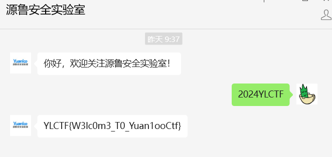

#  whatmusic
拿到一个压缩包，里面两个文件，其中有一个 password 文件没被加密。

010 看一下，发现是字节翻转的 PNG，丢入 cyberchef reverse 一下即可。

还原出来的 PNG 还需要 CRC 宽高爆破，然后得到密码的图片，还需要水平翻转+旋转处理。

解压后得到 flag 文件，里面都是很乱的字节。

结合给出的 hint1，以及题目名称，之前羊城杯和 ISCC 有个类似的题，也就是 lyra 解码器，试了一下，用它可以把 flag 文件的内容转成一个 wav 音频，听一下就是 flag。

:::danger
Lyra 环境很难配，这里用了 Github 的 Codespace，配起来方便一些。

:::

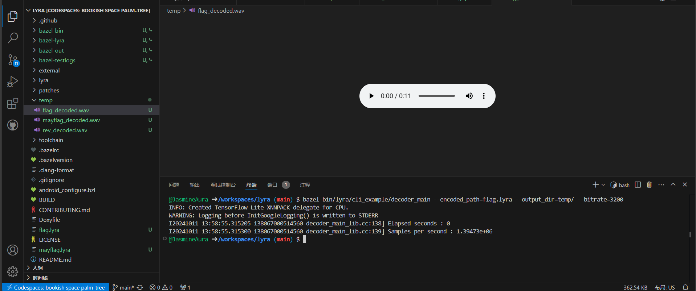


# hide_png
拿到一张图片，上面有一些点阵，适当缩放可以看清一点点。


很明显这就是 flag，但是完全看不清，借助一下 stegsolve。

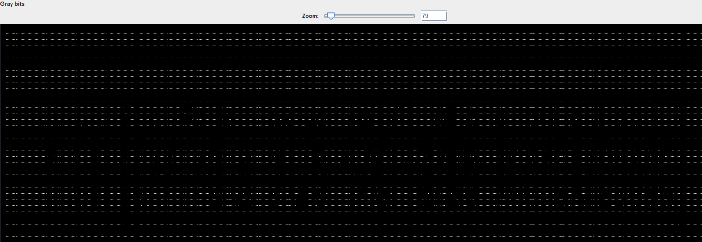

有几个字符实在看不清，排列组合稍微试一下就对了。


# pngorzip
拿到一张图片，看不出什么东西。

丢入 stegsolve，猜一手 LSB 隐写，可以看到有个 PK 头，把这个压缩包提出来。

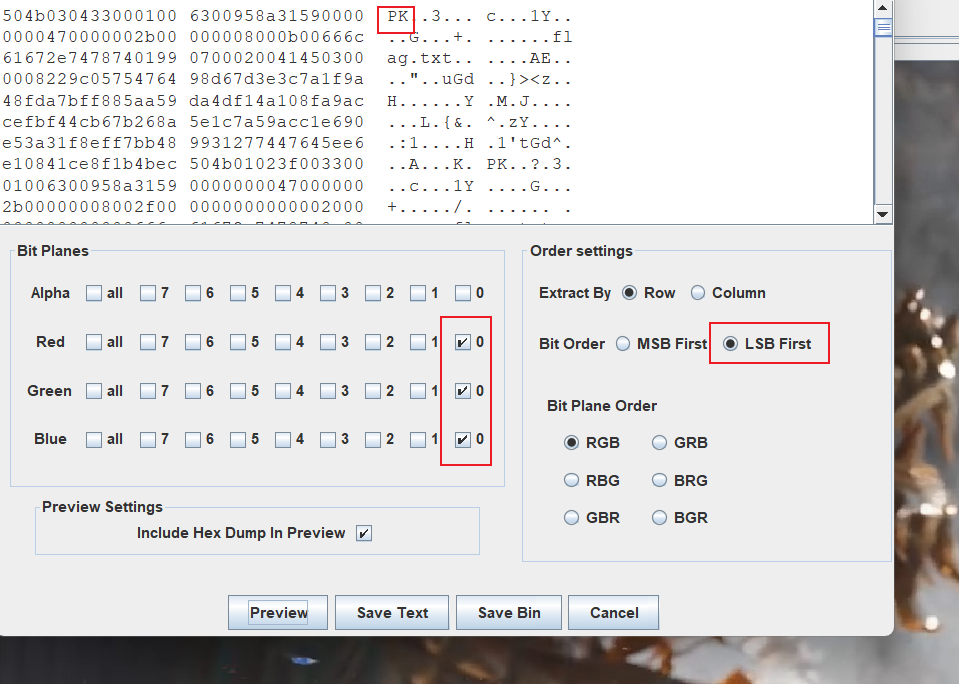

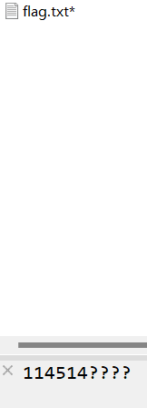

掩码爆破，爆出来密码。

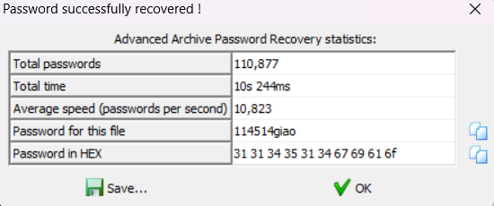

解压后打开 txt 就是 flag。

# trafficdet
通过 csv 训练模型识别攻击类型，不太会搞这种东西，陪 GPT 玩出来了，然后需要自己微调一下。

有几个细节，需要注意测试集 test.csv 没有 Label 列，然后输出的时候注意 id 从 1 开始。

```python
import pandas as pd
from sklearn.ensemble import RandomForestClassifier
from sklearn.preprocessing import LabelEncoder
import joblib

# 1. 加载数据
train_data = pd.read_csv('train.csv')
test_data = pd.read_csv('test.csv')

# 2. 数据预处理
# 查看缺失值
print(train_data.isnull().sum())
print(test_data.isnull().sum())

# 标签编码
label_encoder = LabelEncoder()
train_data['label'] = label_encoder.fit_transform(train_data['Label'])

# 划分特征和标签
X_train = train_data.drop(['label', 'Label'], axis=1)  # 特征
y_train = train_data['label']                             # 标签

# 测试集特征
X_test = test_data.drop(columns=['Label'], errors='ignore')  # 移除目标列（如存在）

# 3. 训练模型
model = RandomForestClassifier(random_state=42)
model.fit(X_train, y_train)

# 4. 进行预测
y_pred = model.predict(X_test)

# 5. 保存预测结果
output = pd.DataFrame({
    'Label': label_encoder.inverse_transform(y_pred)  # 将预测结果转换为原始标签
})

# 生成 id 列，从 1 开始
output['id'] = range(1, len(output) + 1)

# 重新调整列顺序
output = output[['id', 'Label']]

output.to_csv('predictions.csv', index=False)

# 6. 保存模型（可选）
joblib.dump(model, 'trained_model.pkl')

```

# plain_crack
拿到一个 build.py 和一个带密码的压缩包，里面也有个 build.py，还有个 flag.docx，根据这些特征，以及题目名称，很明显这就是已知明文攻击。

先把 build.py 单独压缩一下，发现压缩包中它的 CRC 值和另一个压缩包中它的 CRC 值一样，可以进行攻击。

要爆出来密码是不可能的，我们只需要知道 flag.docx 的内容就好了。

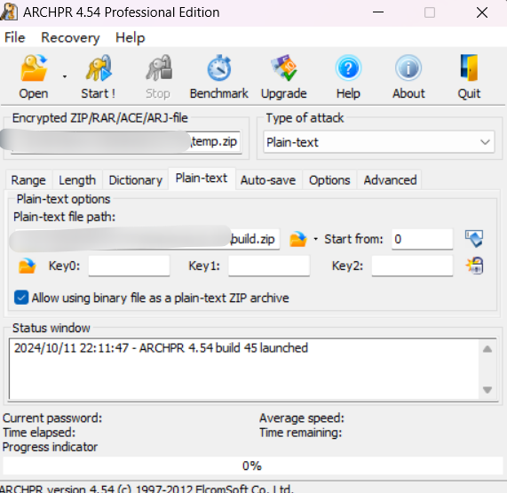

调成如上配置，然后开始爆破，差不多 3-4 分钟就出了，然后解压出 flag.docx。

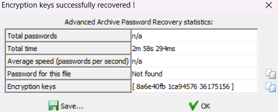

直接打不开，改成 zip 后缀解压，在 media 文件夹中发现 flag。

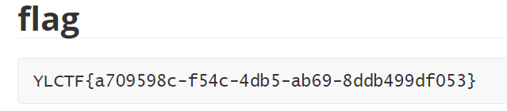


# SinCosTan
非常极限，在结束前 3 分钟做出来了。

拿到一个怪怪的文件，010 看一下发现是 wav音频。

一开始用 Audacity 看了一下，发现有一段音频离奇消失，于是又在 010 里面看了一下。

翻了一会，发现藏了 3 个文件，一个 zip，两个 png，分别把他们提出来，都是 hex 的形式。

用 cyberchef 转出来，是如下内容。

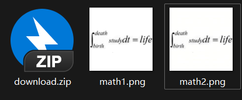

压缩包无密码，解出来有个 txt，看一下。


一眼零宽，解一下得到一个应该是 seed 的东西，即 114514。

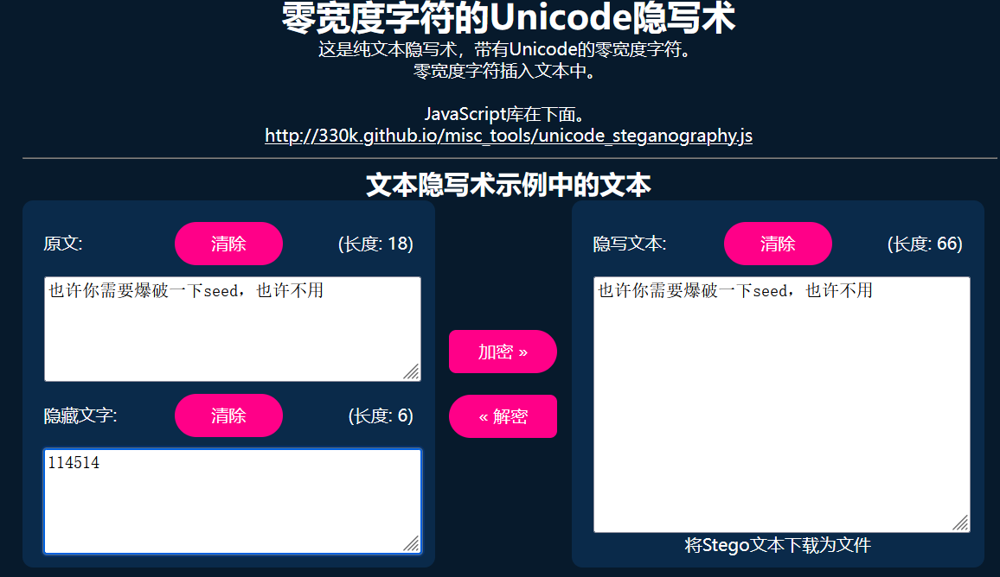

分析这两张图片，大小不一样，但是显示出来一样，可能是盲水印，这里用 BlindWaterMark 跑一下。

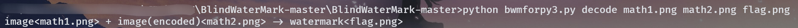

但是跑出来是一张怪图。

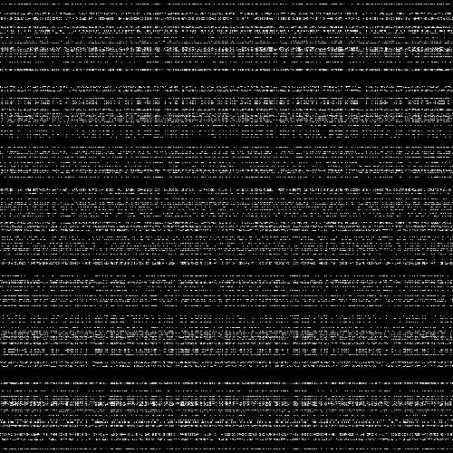

应该还有信息没用上，想起来刚才有个 seed，这里直接看工具源码。

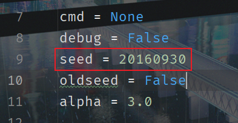

第 9 行就是 seed，改成刚才的 114514，再跑一次就出 flag 了。

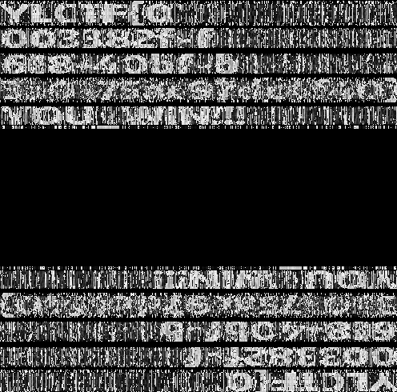

