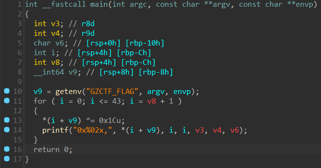
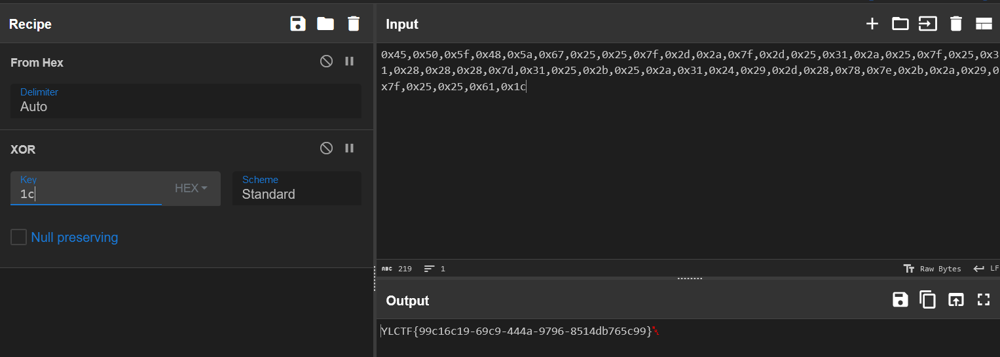
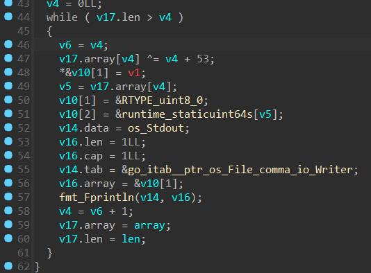
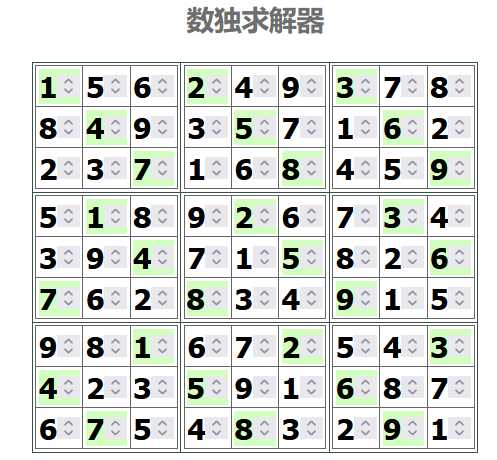
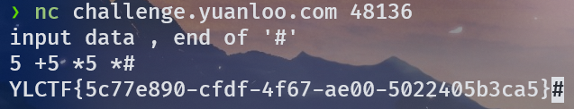
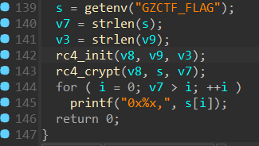
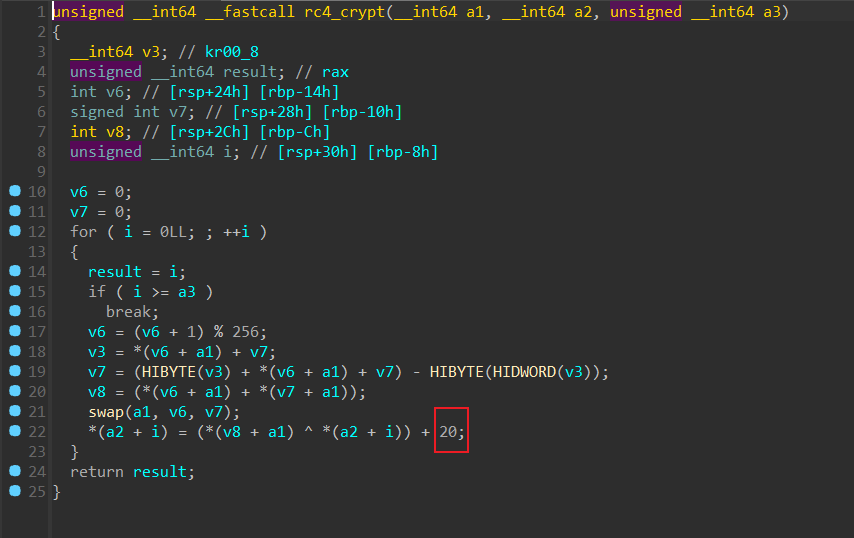

# xor
用 DIE 看了一下，发现有个 UPX 壳，直接 upd -d 脱壳。



逆一下，就是个简单的异或。

:::danger
nc 连接直接复制密文可能带有不可见字符，异或出来的 flag 可能是错的，需要用 pwntools 交互一下（后面好像修复了，变成输入 16 进制数了，这里就用 cyberchef 了）

:::




# ezgo


这里很明显是一个加密，异或了 v4 + 53，v4 每次加一。

nc 取一下密文，直接每次异或 (53+索引值) 即可。

```python
enc = [108,122,116,108,127,65,9,12,91,11,7,115,112,114,110,118,116,34,33,101,125,126,40,126,96,119,120,103,48,127,49,50,48,110,103,104,63,57,108,57,107,56,34]
flag = ''
pos = 53
for i in range(len(enc)):
    flag += chr(enc[i]^pos)
    pos+=1
print(flag)
#YLCTF{20f58310-21df-44c2-977a-bfe800fc7e6f}


```


# math


读入一个 9*9 矩阵，当前位是 0 的话就接受用户的输入。

后面有个 check 进去看一下。


就是检测每行每列的和是否都为 45，符合条件就给出 flag。

思考一下，9*9 的矩阵，要求每行每列的和都是 45，也就是说每行每列，1-9 这 9 个数都只能出现一次，这不就是数独吗？

动调一下，发现矩阵一开始就有一些数，原来前面还有个 init 函数用来初始化矩阵，提前填了一些数，全部取出来即可。

```plain
1 0 0 2 0 0 3 0 0 
0 4 0 0 5 0 0 6 0 
0 0 7 0 0 8 0 0 9 
0 1 0 0 2 0 0 3 0 
0 0 4 0 0 5 0 0 6 
7 0 0 8 0 0 9 0 0 
0 0 1 0 0 2 0 0 3 
4 0 0 5 0 0 6 0 0 
0 7 0 0 8 0 0 9 0 


```

然后使用在线数独求解器。



nc 交互，把空位上面的数字依次输入，然后得到 flag。


# calc
拿到一个 .c 文件，点开发现一大堆 #define，数量不是很多，直接手动替换，得到完整代码。

换行都没了，很丑，手动修复一下。

```c
#include<stdio.h>
#include<math.h>
#include<string.h>
#include<stdlib.h>
typedef struct Stack {
    double* top;
    double* low;
    int size;
}
stack;
void init(stack* s) {
    s->low = (double*)malloc((sizeof(double)));
    s->top = s->low;
    s->size = 100;
}
void push(stack* s, double e) {
    *(s->top) = e;
    s->top++;
}
static void pop(stack* s, double* e) {
    *e = *--(s->top);
}
int main() {
    setbuf(stdin, 0);
    setbuf(stdout, 0);
    stack s;
    char ch;
    double d, e;
    printf("d=%lf\n",d);
    printf("e=%lf\n",e);
    char num[100];
    int  i = 0;
    init(&s);
    puts("input data , end of '#'");
    scanf("%s", &ch);
    while (ch != '#') {
        while (ch >= '0' && ch <= '9') {
            num[i] = ch;
            scanf("%c", &ch);
            if (ch == ' ') {
                d = atof(num);
                push(&s, d);
                //printf("%d",d);
                i = 0;
                break;
            }
        }
        switch (ch) {
            case'+':pop(&s, &d);
            pop(&s, &e);
            push(&s, e + d);
            break;
            case'-':pop(&s, &d);
            pop(&s, &e);
            push(&s, e - d);
            break;
            case'*':pop(&s, &d);
            pop(&s, &e);
            push(&s, e * d);
            break;
            case'/':pop(&s, &d);
            pop(&s, &e);
            push(&s, e / d);
            break;
        }
        scanf("%c", &ch);
    }
    pop(&s, &d);
    printf("%lf\n",d);
    printf((d==125?"YES":"NO"));
    if (d == 125) {
        printf("%s", getenv("GZCTF_FLAG"));
    }
}
```

大致就是模拟了一个计算器，用手写栈实现，要求运算结果是 125。

可以直接用 5*5*5，需要根据代码改一下格式。

读入的数后面必须加空格，读入运算符会把当前数字和栈顶的数字进行运算，井号代表算式结束。

构造一个算式，使用 `5 +5 *5 *#` 即可。




# xorplus


看一下是个 RC4，是吗？稍微魔改了一下。



可以看到 RC4 以后又加了 20，那就先减回去再解 RC4。

这里为了方便，动调直接把异或的值取出来，然后 nc 取一下密文跑一下即可。

:::danger
动调可能会卡在输出获取 GZCTF_FLAG 环境变量的时候，自己随便赋个变量，或者把这行 patch 掉都行。

:::

```python
key =[0x24,0x3e,0x44,0x4d,0xcc,0x20,0x71,0x2b,0x56,0xee,0xbd,0xbb,0x88,0x4c,0x23,0x30,0x1f,0xea,0x7a,0x34,0x58,0x23,0x50,0x31,0x75,0x3,0xe,0x6,0xe,0x3f,0x97,0xb2,0x12,0x54,0x2c,0x88,0x90,0x58,0x77,0xd7,0xc1,0x10,0xef,0x8c,0x83,0x1d,0xe1,0xf7,0x2d,0x4b,0x73,0xcc,0x69,0xb0,0x3,0x1e,0xb4,0x2c,0xa1,0xe1,0xbb]
enc = [0x91,0x86,0x1b,0x2d,0x9e,0x6f,0x26,0x5c,0x7a,0xec,0xed,0xa0,0xfd,0x91,0x22,0x68,0x8d,0x9c,0x56,0x2d,0x80,0x25,0x47,0x14,0x6c,0x4e,0x51,0x52,0x4b,0x26,0x7,0xe8,0x35,0x4a,0x61,0xfd,0xbd,0x7e,0x63,0xfb,0x8,0x38,0xa6]
flag = ''
for i in range(len(enc)):
    flag+=chr(((enc[i]-20)^key[i])&0xff)
print(flag)
#YLCTF{cc06d7a1-dfb8-42c1-9389-df3baa928054}


```

