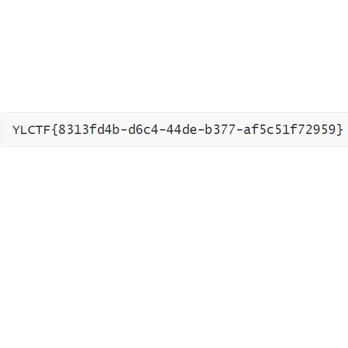
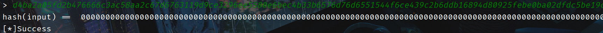

## <font style="color:#D22D8D;">ezAES</font>
```shell

this is a AES,you maybe need full padding.
key is YLCTF-CRYPTO
iv is YLCTF-IV
AES define is  

from Crypto.Cipher import AES
AES.new(key,2,iv) 
result = b""
padded_data = pad(flag, AES.block_size)
endata = aes.encrypt(padded_data)
print(endata)


\xed\x1d]\xe6p\xb7\xfa\x90/Gu\xf4\xe2\x96\x84\xef90\x92e\xb4\xf8]"\xfc6\xf8\x8cS\xe9b\x19
input your result:error

```

就是个简单的 AES，key 和 iv 都给了，长度不足用 \0 填充，然后直接解。

```python
from Crypto.Cipher import AES
from Crypto.Util.Padding import unpad

# Your provided key and IV
key = b'YLCTF-CRYPTO\0\0\0\0'
iv = b'YLCTF-IV\0\0\0\0\0\0\0\0'

# The encrypted data
encrypted_data = b'\xed\x1d\x5d\xe6p\xb7\xfa\x90/Gu\xf4\xe2\x96\x84\xef90\x92e\xb4\xf8]"\xfc6\xf8\x8cS\xe9b\x19'

# Create a new AES cipher
aes = AES.new(key, AES.MODE_CBC, iv)

# Decrypt the data
decrypted_data = aes.decrypt(encrypted_data)

# Unpad the decrypted data
try:
    unpadded_data = unpad(decrypted_data, AES.block_size)
    print(unpadded_data)
except ValueError as e:
    print("An error occurred during unpadding:", e)
#b'keysauikoydasuicxs'


```


## <font style="color:#D22D8D;">ancat</font>
个人感觉这题更应该是 Misc。

给了一个加密脚本以及被加密的图片。

```python

import matplotlib.pyplot as plt
import cv2
import numpy as np
from PIL import Image
def arnold_encode(image, shuffle_times, a, b):
    """ Arnold shuffle for rgb image
    Args:
        image: input original rgb image
        shuffle_times: how many times to shuffle
    Returns:
        Arnold encode image
    """
    arnold_image = np.zeros(shape=image.shape)

    h, w = image.shape[0], image.shape[1]
    N = h

    for time in range(shuffle_times):
        for ori_x in range(h):
            for ori_y in range(w):

                new_x = (1*ori_x + b*ori_y)% N
                new_y = (a*ori_x + (a*b+1)*ori_y) % N

                arnold_image[new_x, new_y, :] = image[ori_x, ori_y, :]

        image = np.copy(arnold_image)

    cv2.imwrite('en_flag.png', arnold_image, [int(cv2.IMWRITE_PNG_COMPRESSION), 0])
    return arnold_image

img = cv2.imread('flag.png')
arnold_encode(img,3,6,9)


```

上网搜一下加密脚本里面的注释，直接找到了一模一样的加密脚本。

这是猫脸变换，文章里面还给了解密脚本，直接粘下来用。

```python

import matplotlib.pyplot as plt
import cv2
import numpy as np
from PIL import Image

def arnold_decode(image, shuffle_times, a, b):
    """ decode for rgb image that encoded by Arnold
    Args:
        image: rgb image encoded by Arnold
        shuffle_times: how many times to shuffle
    Returns:
        decode image
    """
    # 1:创建新图像
    decode_image = np.zeros(shape=image.shape,dtype=int)

    # 2：计算N
    h, w = image.shape[0], image.shape[1]
    N = w  # 或N=w

    # 3：遍历像素坐标变换
    for time in range(shuffle_times):
        for ori_x in range(h):
            for ori_y in range(w):
                # 按照公式坐标变换
                new_x = ((a * b + 1) * ori_x + (-b) * ori_y) % N
                new_y = ((-a) * ori_x + ori_y) % N
                decode_image[new_x, new_y, :] = image[ori_x, ori_y, :]
        image = np.copy(decode_image)
    cv2.imwrite('de_flag.png', decode_image)
    return decode_image

img = cv2.imread('en_flag.png')
arnold_decode(img,3,6,9)


```




## <font style="color:#D22D8D;">hhhhhash</font>
```python
from Crypto.Util.number import getPrime, isPrime

e = 65537
N = 1
while (N - 1) % e == 0:
    N = getPrime(2048)

def x(a, b):
    return bytes(x^y for x,y in zip(a,b))

class C():
    def __init__(self, N, e):
        self.N = N
        self.e = e
        self._state = b"\x00" * 256
        self.s = set()

    def _h(self, block):
        assert len(block) == 256

        if block in self.s:
            raise ValueError("bad")
        self.s.add(block)

        data = int.from_bytes(block, "big")
        if data < 2 or data >= N-1:
            raise ValueError("bad")

        data = pow(data, self.e, self.N)
        if data in self.s:
            raise ValueError("bad")
        self.s.add(data)

        return data.to_bytes(256, "big")

    def u(self, data):
        assert len(data) % 256 == 0

        for block in range(0, len(data), 256):
            block = data[block:block+256]
            self._state = x(self._state, self._h(block))

        return self

    def hd(self):
        return self._state.hex()

    def __repr__(self):
        return f"C({self.N}, {self.e})"

def m():
    h = C(N, e)
    print(h)

    print("Input the data you'd like to process:")
    p = bytes.fromhex(input("> "))
    if len(p) < 256 or len(p) % 256 != 0:
        raise ValueError("Invalid input!")

    z = h.u(p).hd()
    print("hash(input) == ", z)
    if z == "00" * 256:
        with open("/flag","r") as f:
            print(f.read())
    else:
        print("...")

m()

```

过程很好理解，其实就是传入一个长度大于 256 且是 256 的整数倍的 hex 字符串，然后将其以每段长度为 256 分成若干个块，每块进行一次 RSA。

最后要求每块最终异或的结果为 0。

其实很好构造，这里 RSA 用的 n 是素数，那么 phi 就是 n-1，把我们的目标字符串当作密文 c，那我们传入的就是 m，其实就是解 RSA。

```python
import libnum
n = ?
e = 65537
payload = ''
def RSA(c):
    c = libnum.s2n(c)
    phi = n-1
    d = libnum.invmod(e,phi)
    m = pow(c,d,n)
    ans = hex(m).replace('0x','')
    print(ans)
    return ans
    #print(libnum.n2s(pow(m,e,n)))
payload+=RSA('\x01'*256)
payload+=RSA('\x02'*256)
payload+=RSA('\x03'*256)
print(payload)


```

本地跑一下，通了，远程环境有点怪，需要多试几次。




