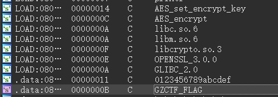

## <font style="color:#D22D8D;">ezwasm</font>
给了一个 wasm 文件，网上搜个教程给他转成 wat 文件，看不懂。

取一下密文，解一下 hex，发现很像 ROT，试几个偏移量直接出了。。。。。


然后大小写互换一下就好了。

PS: 不记得数字需不需要偏移了，赛后交不了，反正试一下就好了。

## <font style="color:#D22D8D;">三点几啦饮茶先</font>


就是个小改的 XTEA，delta 改一下，key 改一下，轮数改一下就好了，跑出来的结果丢到交互

里面，然后出 flag。

```cpp
#include <bits/stdc++.h>
using namespace std;
int key[] = {0x1001,0x2002,0x3003,0x4004};
void decrypt(uint32_t &v4,uint32_t &v5)
{
    uint32_t delta = 0x114514B9;
    uint32_t v3 = delta*40;
    for(int i=0;i<40;i++)
    {
        v5 -= (((16 * v4) ^ (v4 >> 5)) + v4) ^ (key[((((v3>>11) & 3)))]+v3);
        v3 -= delta;
        v4 -= (((v5 >> 3) ^ (4 * v5)) + v5) ^ ((key[(v3&3)])+v3);
    }
}
string ToString(uint32_t x)
{
    uint32_t temp = 256*256*256;
    string ans="";
    for(int i=0;i<=3;i++)
    {
        int c = x/temp;
        ans+=char(c);
        x-=c*temp;
        temp/=256;
    }
    reverse(ans.begin(),ans.end());
    return ans;
}
uint32_t v4s[]={0x72093D7C};
uint32_t v5s[]={0xB60BF47D};
int main()
{
    for(int i=0;i<1;i++)
    {
        decrypt(v4s[i],v5s[i]);
        //cout<<v4s[i]<<" "<<v5s[i]<<endl;
        //cout<<v4s[i]<<" "<<v5s[i]<<endl;
        printf("%x\n",v4s[i]);
        printf("%x\n",v5s[i]);
        //cout<<ToString(v4s[i])<<ToString(v5s[i]);
    }
    return 0;
}


```


## <font style="color:#D22D8D;">ezapk</font>
进一下 MainActivity，看到一个检查 key 的过程，以及对 flag 的 SM4 加密。

```java
private boolean validateFlag(byte[] data) throws Exception {
        if (data.length < 21) {
            return false;
        }
        byte[] key = new byte[16];
        System.arraycopy(data, 5, key, 0, 16);
        if ((((((((((((((((key[0] * Integer.parseInt("41")) - (key[1] * Integer.parseInt("16"))) + (key[2] * Integer.parseInt("84"))) + (key[3] * Integer.parseInt("35"))) - (key[4] * Integer.parseInt("74"))) + (key[5] * Integer.parseInt("33"))) + (key[6] * Integer.parseInt("58"))) + (key[7] * Integer.parseInt("70"))) - (key[8] * Integer.parseInt("83"))) - (key[9] * Integer.parseInt("48"))) + (key[10] * Integer.parseInt("68"))) + (key[11] * Integer.parseInt("82"))) + (key[12] * Integer.parseInt("90"))) - (key[13] * Integer.parseInt("37"))) - (key[14] * Integer.parseInt("60"))) + (key[15] * Integer.parseInt("23")) != 22064 || (((((((((((((((-key[0]) * Integer.parseInt("63")) - (key[1] * Integer.parseInt("76"))) - (key[2] * Integer.parseInt("79"))) - (key[3] * Integer.parseInt("34"))) + (key[4] * Integer.parseInt("64"))) - (key[5] * Integer.parseInt("93"))) - (key[6] * Integer.parseInt("16"))) - (key[7] * Integer.parseInt("69"))) - (key[8] * Integer.parseInt("34"))) + (key[9] * Integer.parseInt("19"))) + (key[10] * Integer.parseInt("17"))) + (key[11] * Integer.parseInt("66"))) + (key[12] * Integer.parseInt("93"))) - (key[13] * Integer.parseInt("57"))) + (key[14] * Integer.parseInt("77")) + (key[15] * Integer.parseInt("45")) != -9131 || ((((((((((((((((-key[0]) * Integer.parseInt("28")) + (key[1] * Integer.parseInt("79"))) - (key[2] * Integer.parseInt("43"))) + (key[3] * Integer.parseInt("19"))) + (key[4] * Integer.parseInt("58"))) + (key[5] * Integer.parseInt("82"))) - (key[6] * Integer.parseInt("20"))) + (key[7] * Integer.parseInt("15"))) - (key[8] * Integer.parseInt("15"))) - (key[9] * Integer.parseInt("65"))) + (key[10] * Integer.parseInt("92"))) + (key[11] * Integer.parseInt("71"))) + (key[12] * Integer.parseInt("34"))) + (key[13] * Integer.parseInt("71"))) - (key[14] * Integer.parseInt("26"))) + (key[15] * Integer.parseInt("37")) != 30351 || (((((((((((((((key[0] * Integer.parseInt("60")) + (key[1] * Integer.parseInt("38"))) - (key[2] * Integer.parseInt("24"))) + (key[3] * Integer.parseInt("24"))) + (key[4] * Integer.parseInt("36"))) + (key[5] * Integer.parseInt("50"))) - (key[6] * Integer.parseInt("56"))) - (key[7] * Integer.parseInt("25"))) - (key[8] * Integer.parseInt("88"))) - (key[9] * Integer.parseInt("14"))) - (key[10] * Integer.parseInt("77"))) + (key[11] * Integer.parseInt("77"))) + (key[12] * Integer.parseInt("80"))) - (key[13] * Integer.parseInt("41"))) - (key[14] * Integer.parseInt("42"))) + (key[15] * Integer.parseInt("90")) != 9755 || (((((((((((((((key[0] * Integer.parseInt("13")) - (key[1] * Integer.parseInt("21"))) - (key[2] * Integer.parseInt("96"))) + (key[3] * Integer.parseInt("82"))) + (key[4] * Integer.parseInt("63"))) + (key[5] * Integer.parseInt("87"))) - (key[6] * Integer.parseInt("71"))) - (key[7] * Integer.parseInt("77"))) + (key[8] * Integer.parseInt("34"))) + (key[9] * Integer.parseInt("95"))) - (key[10] * Integer.parseInt("21"))) + (key[11] * Integer.parseInt("51"))) + (key[12] * Integer.parseInt("54"))) + (key[13] * Integer.parseInt("81"))) - (key[14] * Integer.parseInt("70"))) + (key[15] * Integer.parseInt("86")) != 25623 || (((((((((((((((key[0] * Integer.parseInt("18")) + (key[1] * Integer.parseInt("70"))) - (key[2] * Integer.parseInt("82"))) + (key[3] * Integer.parseInt("69"))) + (key[4] * Integer.parseInt("77"))) + (key[5] * Integer.parseInt("44"))) + (key[6] * Integer.parseInt("41"))) - (key[7] * Integer.parseInt("43"))) - (key[8] * Integer.parseInt("76"))) + (key[9] * Integer.parseInt("67"))) + (key[10] * Integer.parseInt("36"))) + (key[11] * Integer.parseInt("32"))) - (key[12] * Integer.parseInt("19"))) - (key[13] * Integer.parseInt("41"))) - (key[14] * Integer.parseInt("69"))) + (key[15] * Integer.parseInt("39")) != 18410 || (((((((((((((((key[0] * Integer.parseInt("59")) - (key[1] * Integer.parseInt("83"))) - (key[2] * Integer.parseInt("34"))) - (key[3] * Integer.parseInt("55"))) - (key[4] * Integer.parseInt("42"))) - (key[5] * Integer.parseInt("86"))) + (key[6] * Integer.parseInt("93"))) + (key[7] * Integer.parseInt("97"))) - (key[8] * Integer.parseInt("88"))) - (key[9] * Integer.parseInt("90"))) - (key[10] * Integer.parseInt("63"))) - (key[11] * Integer.parseInt("76"))) - (key[12] * Integer.parseInt("84"))) - (key[13] * Integer.parseInt("84"))) + (key[14] * Integer.parseInt("96"))) - (key[15] * Integer.parseInt("76")) != -39929 || (((((((((((((-key[0]) * Integer.parseInt("72")) + (key[1] * Integer.parseInt("81"))) - (key[2] * Integer.parseInt("10"))) - (key[3] * Integer.parseInt("58"))) - (key[4] * Integer.parseInt("55"))) - (key[5] * Integer.parseInt("94"))) - (key[6] * Integer.parseInt("48"))) + (key[7] * Integer.parseInt("79"))) - (key[8] * Integer.parseInt("81"))) - (key[9] * Integer.parseInt("83"))) - (key[10] * Integer.parseInt("32"))) - (key[11] * Integer.parseInt("77"))) + (key[12] * Integer.parseInt("17")) + (key[13] * Integer.parseInt("78")) + (key[14] * Integer.parseInt("97")) + (key[15] * Integer.parseInt("97")) != -11909 || (((((((((((((((key[0] * Integer.parseInt("81")) + (key[1] * Integer.parseInt("45"))) - (key[2] * Integer.parseInt("37"))) + (key[3] * Integer.parseInt("69"))) + (key[4] * Integer.parseInt("48"))) - (key[5] * Integer.parseInt("22"))) - (key[6] * Integer.parseInt("61"))) - (key[7] * Integer.parseInt("44"))) - (key[8] * Integer.parseInt("26"))) - (key[9] * Integer.parseInt("30"))) + (key[10] * Integer.parseInt("21"))) + (key[11] * Integer.parseInt("41"))) + (key[12] * Integer.parseInt("33"))) - (key[13] * Integer.parseInt("49"))) - (key[14] * Integer.parseInt("98"))) + (key[15] * Integer.parseInt("94")) != 11780 || (((((((((((((((key[0] * Integer.parseInt("72")) - (key[1] * Integer.parseInt("94"))) + (key[2] * Integer.parseInt("77"))) - (key[3] * Integer.parseInt("70"))) + (key[4] * Integer.parseInt("10"))) - (key[5] * Integer.parseInt("33"))) + (key[6] * Integer.parseInt("58"))) - (key[7] * Integer.parseInt("48"))) + (key[8] * Integer.parseInt("65"))) + (key[9] * Integer.parseInt("21"))) + (key[10] * Integer.parseInt("33"))) - (key[11] * Integer.parseInt("35"))) - (key[12] * Integer.parseInt("90"))) + (key[13] * Integer.parseInt("69"))) - (key[14] * Integer.parseInt("10"))) - (key[15] * Integer.parseInt("20")) != -6077 || ((((((((((((key[0] * Integer.parseInt("11")) + (key[1] * Integer.parseInt("28"))) + (key[2] * Integer.parseInt("13"))) + (key[3] * Integer.parseInt("92"))) + (key[4] * Integer.parseInt("24"))) - (key[5] * Integer.parseInt("35"))) + (key[6] * Integer.parseInt("80"))) + (key[7] * Integer.parseInt("51"))) + (key[8] * Integer.parseInt("41"))) + (key[9] * Integer.parseInt("42"))) - (key[10] * Integer.parseInt("19"))) - (key[11] * Integer.parseInt("78"))) + (key[12] * Integer.parseInt("32")) + (key[13] * Integer.parseInt("33")) + (key[14] * Integer.parseInt("27")) + (key[15] * Integer.parseInt("40")) != 22889 || (((((((((((((((key[0] * Integer.parseInt("62")) + (key[1] * Integer.parseInt("33"))) + (key[2] * Integer.parseInt("67"))) + (key[3] * Integer.parseInt("13"))) + (key[4] * Integer.parseInt("24"))) - (key[5] * Integer.parseInt("96"))) + (key[6] * Integer.parseInt("46"))) - (key[7] * Integer.parseInt("94"))) - (key[8] * Integer.parseInt("91"))) + (key[9] * Integer.parseInt("25"))) - (key[10] * Integer.parseInt("37"))) + (key[11] * Integer.parseInt("17"))) + (key[12] * Integer.parseInt("39"))) + (key[13] * Integer.parseInt("80"))) - (key[14] * Integer.parseInt("94"))) - (key[15] * Integer.parseInt("22")) != -8594 || ((((((((((((key[0] * Integer.parseInt("57")) - (key[1] * Integer.parseInt("83"))) - (key[2] * Integer.parseInt("82"))) + (key[3] * Integer.parseInt("78"))) - (key[4] * Integer.parseInt("37"))) - (key[5] * Integer.parseInt("76"))) + (key[6] * Integer.parseInt("84"))) + (key[7] * Integer.parseInt("63"))) + (key[8] * Integer.parseInt("33"))) + (key[9] * Integer.parseInt("50"))) - (key[10] * Integer.parseInt("96"))) - (key[11] * Integer.parseInt("12"))) + (key[12] * Integer.parseInt("96")) + (key[13] * Integer.parseInt("19")) + (key[14] * Integer.parseInt("62")) + (key[15] * Integer.parseInt("51")) != 7626 || ((((((((((((((((-key[0]) * Integer.parseInt("67")) - (key[1] * Integer.parseInt("85"))) + (key[2] * Integer.parseInt("13"))) + (key[3] * Integer.parseInt("11"))) - (key[4] * Integer.parseInt("53"))) + (key[5] * Integer.parseInt("40"))) + (key[6] * Integer.parseInt("52"))) - (key[7] * Integer.parseInt("43"))) - (key[8] * Integer.parseInt("63"))) + (key[9] * Integer.parseInt("61"))) - (key[10] * Integer.parseInt("18"))) + (key[11] * Integer.parseInt("14"))) - (key[12] * Integer.parseInt("92"))) + (key[13] * Integer.parseInt("77"))) - (key[14] * Integer.parseInt("91"))) + (key[15] * Integer.parseInt("42")) != -7984 || (((((((((((((((key[0] * Integer.parseInt("53")) + (key[1] * Integer.parseInt("69"))) - (key[2] * Integer.parseInt("57"))) + (key[3] * Integer.parseInt("40"))) + (key[4] * Integer.parseInt("48"))) - (key[5] * Integer.parseInt("50"))) - (key[6] * Integer.parseInt("40"))) - (key[7] * Integer.parseInt("90"))) + (key[8] * Integer.parseInt("69"))) + (key[9] * Integer.parseInt("84"))) + (key[10] * Integer.parseInt("65"))) - (key[11] * Integer.parseInt("56"))) + (key[12] * Integer.parseInt("90"))) + (key[13] * Integer.parseInt("56"))) - (key[14] * Integer.parseInt("50"))) + (key[15] * Integer.parseInt("97")) != 23771 || (((((((((((((((key[0] * Integer.parseInt("85")) + (key[1] * Integer.parseInt("86"))) + (key[2] * Integer.parseInt("19"))) - (key[3] * Integer.parseInt("47"))) + (key[4] * Integer.parseInt("16"))) - (key[5] * Integer.parseInt("17"))) - (key[6] * Integer.parseInt("77"))) + (key[7] * Integer.parseInt("54"))) + (key[8] * Integer.parseInt("59"))) - (key[9] * Integer.parseInt("19"))) - (key[10] * Integer.parseInt("53"))) + (key[11] * Integer.parseInt("52"))) - (key[12] * Integer.parseInt("64"))) + (key[13] * Integer.parseInt("95"))) - (key[14] * Integer.parseInt("66"))) - (key[15] * Integer.parseInt("61")) != -6025) {
            return false;
        }
        System.out.println(Myjni.encode(Myjni.getkey()));
        byte[] encrypt = Sm4Util.encrypt("SM4/CBC/PKCS7PADDING", key, Myjni.encode(Myjni.getkey()).getBytes(), data);
        return Base64.encodeToString(encrypt, 2).equals("3egreyyixRkVtvuCbyuWRmWpmZa562dweKpSajvGUnxrSBx2gFxz2AjnL4eUdcUO");
    }


```

key 很好解决，z3 求解器跑一下就出了。

IV 应该是 `Myjni.encode(Myjni.getkey()).getBytes()` 跑出来的，还需要去逆一下 .so 文件。

```python
import z3
k0,k1,k2,k3,k4,k5,k6,k7,k8,k9,k10,k11,k12,k13,k14,k15 = z3.Ints('k0 k1 k2 k3 k4 k5 k6 k7 k8 k9 k10 k11 k12 k13 k14 k15')
s = z3.Solver()
s.add((((((((((((((((k0 * 41) - (k1 * 16)) + (k2 * 84)) + (k3 * 35)) - (k4 * 74)) + (k5 * 33)) + (k6 * 58)) + (k7 * 70)) - (k8 * 83)) - (k9 * 48)) + (k10 * 68)) + (k11 * 82)) + (k12 * 90)) - (k13 * 37)) - (k14 * 60)) + (k15 * 23) == 22064)
s.add((((((((((((((((-k0) * 63) - (k1 * 76)) - (k2 * 79)) - (k3 * 34)) + (k4 * 64)) - (k5 * 93)) - (k6 * 16)) - (k7 * 69)) - (k8 * 34)) + (k9 * 19)) + (k10 * 17)) + (k11 * 66)) + (k12 * 93)) - (k13 * 57)) + (k14 * 77) + (k15 * 45) == -9131)
s.add(((((((((((((((((-k0) * 28) + (k1 * 79)) - (k2 * 43)) + (k3 * 19)) + (k4 * 58)) + (k5 * 82)) - (k6 * 20)) + (k7 * 15)) - (k8 * 15)) - (k9 * 65)) + (k10 * 92)) + (k11 * 71)) + (k12 * 34)) + (k13 * 71)) - (k14 * 26)) + (k15 * 37) == 30351)
s.add((((((((((((((((k0 * 60) + (k1 * 38)) - (k2 * 24)) + (k3 * 24)) + (k4 * 36)) + (k5 * 50)) - (k6 * 56)) - (k7 * 25)) - (k8 * 88)) - (k9 * 14)) - (k10 * 77)) + (k11 * 77)) + (k12 * 80)) - (k13 * 41)) - (k14 * 42)) + (k15 * 90) == 9755)
s.add((((((((((((((((k0 * 13) - (k1 * 21)) - (k2 * 96)) + (k3 * 82)) + (k4 * 63)) + (k5 * 87)) - (k6 * 71)) - (k7 * 77)) + (k8 * 34)) + (k9 * 95)) - (k10 * 21)) + (k11 * 51)) + (k12 * 54)) + (k13 * 81)) - (k14 * 70)) + (k15 * 86) == 25623)
s.add((((((((((((((((k0 * 18) + (k1 * 70)) - (k2 * 82)) + (k3 * 69)) + (k4 * 77)) + (k5 * 44)) + (k6 * 41)) - (k7 * 43)) - (k8 * 76)) + (k9 * 67)) + (k10 * 36)) + (k11 * 32)) - (k12 * 19)) - (k13 * 41)) - (k14 * 69)) + (k15 * 39) == 18410)
s.add((((((((((((((((k0 * 59) - (k1 * 83)) - (k2 * 34)) - (k3 * 55)) - (k4 * 42)) - (k5 * 86)) + (k6 * 93)) + (k7 * 97)) - (k8 * 88)) - (k9 * 90)) - (k10 * 63)) - (k11 * 76)) - (k12 * 84)) - (k13 * 84)) + (k14 * 96)) - (k15 * 76) == -39929)
s.add((((((((((((((-k0) * 72) + (k1 * 81)) - (k2 * 10)) - (k3 * 58)) - (k4 * 55)) - (k5 * 94)) - (k6 * 48)) + (k7 * 79)) - (k8 * 81)) - (k9 * 83)) - (k10 * 32)) - (k11 * 77)) + (k12 * 17) + (k13 * 78) + (k14 * 97) + (k15 * 97) == -11909)
s.add((((((((((((((((k0 * 81) + (k1 * 45)) - (k2 * 37)) + (k3 * 69)) + (k4 * 48)) - (k5 * 22)) - (k6 * 61)) - (k7 * 44)) - (k8 * 26)) - (k9 * 30)) + (k10 * 21)) + (k11 * 41)) + (k12 * 33)) - (k13 * 49)) - (k14 * 98)) + (k15 * 94) == 11780)
s.add((((((((((((((((k0 * 72) - (k1 * 94)) + (k2 * 77)) - (k3 * 70)) + (k4 * 10)) - (k5 * 33)) + (k6 * 58)) - (k7 * 48)) + (k8 * 65)) + (k9 * 21)) + (k10 * 33)) - (k11 * 35)) - (k12 * 90)) + (k13 * 69)) - (k14 * 10)) - (k15 * 20) == -6077)
s.add(((((((((((((k0 * 11) + (k1 * 28)) + (k2 * 13)) + (k3 * 92)) + (k4 * 24)) - (k5 * 35)) + (k6 * 80)) + (k7 * 51)) + (k8 * 41)) + (k9 * 42)) - (k10 * 19)) - (k11 * 78)) + (k12 * 32) + (k13 * 33) + (k14 * 27) + (k15 * 40) == 22889)
s.add((((((((((((((((k0 * 62) + (k1 * 33)) + (k2 * 67)) + (k3 * 13)) + (k4 * 24)) - (k5 * 96)) + (k6 * 46)) - (k7 * 94)) - (k8 * 91)) + (k9 * 25)) - (k10 * 37)) + (k11 * 17)) + (k12 * 39)) + (k13 * 80)) - (k14 * 94)) - (k15 * 22) == -8594)
s.add(((((((((((((k0 * 57) - (k1 * 83)) - (k2 * 82)) + (k3 * 78)) - (k4 * 37)) - (k5 * 76)) + (k6 * 84)) + (k7 * 63)) + (k8 * 33)) + (k9 * 50)) - (k10 * 96)) - (k11 * 12)) + (k12 * 96) + (k13 * 19) + (k14 * 62) + (k15 * 51) == 7626)
s.add(((((((((((((((((-k0) * 67) - (k1 * 85)) + (k2 * 13)) + (k3 * 11)) - (k4 * 53)) + (k5 * 40)) + (k6 * 52)) - (k7 * 43)) - (k8 * 63)) + (k9 * 61)) - (k10 * 18)) + (k11 * 14)) - (k12 * 92)) + (k13 * 77)) - (k14 * 91)) + (k15 * 42) == -7984)
s.add((((((((((((((((k0 * 53) + (k1 * 69)) - (k2 * 57)) + (k3 * 40)) + (k4 * 48)) - (k5 * 50)) - (k6 * 40)) - (k7 * 90)) + (k8 * 69)) + (k9 * 84)) + (k10 * 65)) - (k11 * 56)) + (k12 * 90)) + (k13 * 56)) - (k14 * 50)) + (k15 * 97) == 23771)
s.add((((((((((((((((k0 * 85) + (k1 * 86)) + (k2 * 19)) - (k3 * 47)) + (k4 * 16)) - (k5 * 17)) - (k6 * 77)) + (k7 * 54)) + (k8 * 59)) - (k9 * 19)) - (k10 * 53)) + (k11 * 52)) - (k12 * 64)) + (k13 * 95)) - (k14 * 66)) - (k15 * 61) == -6025)
s.check()
print(s.model())
'''
48 55 51 99 56 99 48 55 45 52 102 53 55 45 52 98
'''
'''
[
k0 = 48,
k1 = 55,
k2 = 51,
k3 = 99
k4 = 56,
k5 = 99,
k6 = 48,
k7 = 55,
k8 = 45,
k9 = 52,
k10 = 102,
k11 = 53,
k12 = 55,
k13 = 45,
k14 = 52,
k15 = 98,
 
 ]
 '''


```

跑出来是 073c8c07-4f57-4b。

接下来去逆 .so。

太长了，不放代码了，直接说逻辑。

getkey() 函数看起来很恶心，其实就是一个换表 base64，表能够在 strings 里面找到，大致就是给字符串 ylctfezapkgi base64 加密，然后丢入 encode() 函数。

encode() 函数也有点恶心，但其实就是把刚才传入的字符串进行了一个 ROT17，然后打乱了一下顺序，最后就是最终的 IV。

```python
box = [1,7,3,6,4,5,2,0]
enc = "eJsxdRZgehQra2dk"
str = []
def rot17(text):
    result = ""
    for char in text:
        if 'A' <= char <= 'Z':
            result += chr((ord(char) - ord('A') + 17) % 26 + ord('A'))
        elif 'a' <= char <= 'z':
            result += chr((ord(char) - ord('a') + 17) % 26 + ord('a'))
        else:
            result += char
    return result
for i in enc:
    str.append(i)
iv = ""
str1 = str[:8]
str2 = str[8:]
# print(str1)
# print(str2)
for i in range(len(str1)):
    iv+=str1[box[i]]
for i in range(len(str2)):
    iv+=str2[box[i]]
print(rot17(iv))
#AxoQuIjvybiur2Hv


```


## <font style="color:#D22D8D;">mmmmmmmov</font>
汇编全是 mov，吓死了，先看了一眼 strings。



有 AES，先去取一下密文，看看是什么东西。


分了 3 段，可能是拼起来解？key 又是多少呢？


这个 0123456789abcdef 在这里被用了，而且长度恰好 16，大概率是 key，IV 的话没找到，那就暂且认为不需要。

看一眼 R2 寄存器，貌似有个异或，大概率是这 3 个字符串分别异或了 0x11，0x22，0x33，用 cyberchef 解一下试试。


