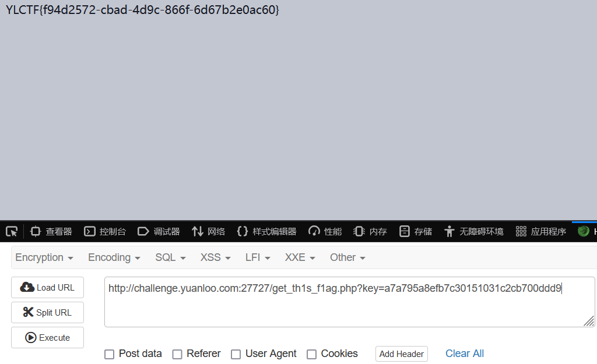

## <font style="color:#D22D8D;">Cmnts</font>
看源码，解 base64。

访问 /get_th1s_f1ag.php。

```php
<?php
include 'flag.php';
parse_str($_SERVER['QUERY_STRING']);

if (isset($pass)) {
    $key = md5($pass);
}
if (isset($key) && $key === 'a7a795a8efb7c30151031c2cb700ddd9') {
    echo $flag;
}
else {
    highlight_file(__FILE__);
}
```

谁说我必须要传 pass，我只传一个符合条件的 key 就好了。



