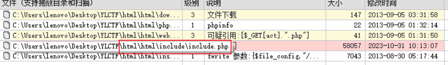
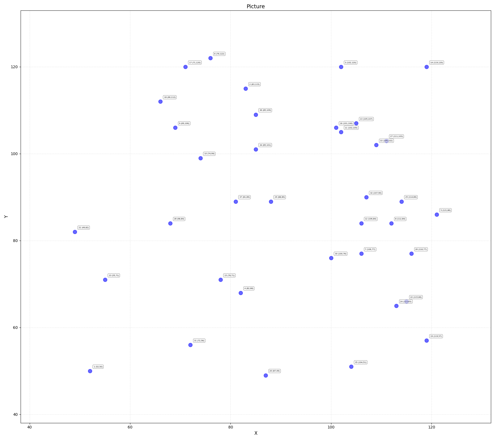
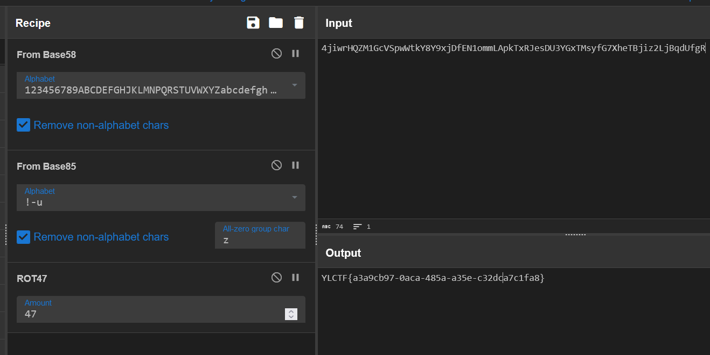
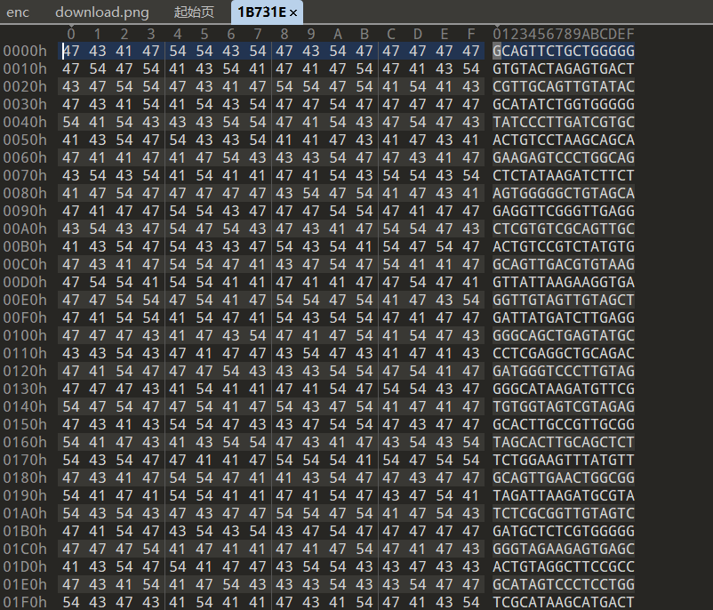
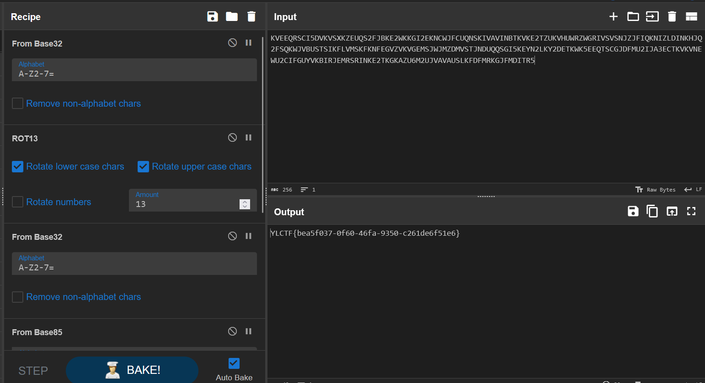

## <font style="color:#117CEE;">B</font><font style="color:#000000;">lackdoor</font>
唯一正常的题目

小明的网站被黑了，你能帮小明分析一下网站后门吗？   
Webshell后门的密码（已经做了md5加密）即为答案。   
FLAG格式：YLCTF{后门密码}  

直接丢入 D 盾扫，扫到后门。



打开看一眼，找到后门密码。


## <font style="color:#117CEE;">T</font><font style="color:#000000;">inted</font>


给了这张图片，用画图软件打开，去看颜色的 hex 值，按顺序取出所有颜色 hex 值的后两位，然后拖入 cyberchef 解。

```plain
67657249664a6a42525a663152676274524c523954644a75526375755374577551674a74695a573954674a7a54645276544c69755274627170623535
```


## <font style="color:#117CEE;">f</font><font style="color:#000000;">igure</font>
:::tip
 奇怪的数据，请你来破译一下  

:::


给了一个很长的 hex，发现是倒过来的 PNG，reverse 一下解出来一张 PNG。




接下来根据点的坐标，按照 x1 x2 x3 ... xn yn ... y3 y2 y1 的顺序拼接坐标。

```plain
X: 52 83 102 82 121 76 106 112 69 74 102 106 105 119 78 101 71 66 119 87 49 115 55 113 114 116 111 68 88 100 72 107 109 85 104 85 81         
Y: 50 115 120 68 86 122 77 84 106 99 105 84 107 120 71 106 120 112 57 49 82 66 71 65 89 77 103 84 89 76 56 90 102 101 51 109 89                 


enc: 4SfRyLjpEJfjiwNeGBwW1s7qrtoDXdHkmUhUQYm3efZ8LYTgMYAGBR19pxjGx


```

接下来是套套套套套套套套套套套套套套套套套套套套套套套套套套套套套套套套套套套套套套套娃。

栅栏 block=13，然后如下图。




## <font style="color:#117CEE;">C</font><font style="color:#000000;">heckImg</font>
:::tip
 你这又是隐写又是编码的，我看不懂啊  

:::


图片很大，使我的电脑卡顿。

stegsolve 看一眼，有个通道的上半部分全乱，很有问题，用脚本把这个通道提取出来。


```python
from cv2 import *
import cv2
img=cv2.imread('flag.png')
src_value=cv2.cvtColor(img, cv2.COLOR_BGR2RGB)
a, b, c = cv2.split(src_value)   #使用cv.split分离通道
cv2.imwrite('a.png', (a % 2) * 255)   #对三个通道中的数据分别根据奇偶做二值化处理，并分别保存为图片
cv2.imwrite('b.png', (b % 2) * 255)
cv2.imwrite('c.png', (c % 2) * 255)

```

把提取出来的图丢入 stegsolve，按照如下参数配置，可以看到很长的 hex 串。


仔细观察，发现将这个 hex 串每四位翻转，再解可以得到一张 png。

```python
with open("output","r") as f:
    enc = f.read()
with open("rev","w") as f:
    for i in range(0,len(enc),4):
        f.write(enc[i:i+4][::-1])


```

得到的 png 没什么东西，用 binwalk 分离一下可以得到一堆怪文件，点开第一个，看到类似 DNA 的东西，是 DNA 编码。



找个脚本跑一下，得到密文。

```python
mapping = {

    'AAA': 'a',
    'AAC': 'b',
    'AAG': 'c',
    'AAT': 'd',
    'ACA': 'e',
    'ACC': 'f',
    'ACG': 'g',
    'ACT': 'h',
    'AGA': 'i',
    'AGC': 'j',
    'AGG': 'k',
    'AGT': 'l',
    'ATA': 'm',
    'ATC': 'n',
    'ATG': 'o',
    'ATT': 'p',
    'CAA': 'q',
    'CAC': 'r',
    'CAG': 's',
    'CAT': 't',
    'CCA': 'u',
    'CCC': 'v',
    'CCG': 'w',
    'CCT': 'x',
    'CGA': 'y',
    'CGC': 'z',
    'CGG': 'A',
    'CGT': 'B',
    'CTA': 'C',
    'CTC': 'D',
    'CTG': 'E',
    'CTT': 'F',
    'GAA': 'G',
    'GAC': 'H',
    'GAG': 'I',
    'GAT': 'J',
    'GCA': 'K',
    'GCC': 'L',
    'GCG': 'M',
    'GCT': 'N',
    'GGA': 'O',
    'GGC': 'P',
    'GGG': 'Q',
    'GGT': 'R',
    'GTA': 'S',
    'GTC': 'T',
    'GTG': 'U',
    'GTT': 'V',
    'TAA': 'W',
    'TAC': 'X',
    'TAG': 'Y',
    'TAT': 'Z',
    'TCA': '1',
    'TCC': '2',
    'TCG': '3',
    'TCT': '4',
    'TGA': '5',
    'TGC': '6',
    'TGG': '7',
    'TGT': '8',
    'TTA': '9',
    'TTC': '0',
    'TTG': ' ',
    'TTT': '.'

}

encode_string = 'OME'

decode_string = 'GCAGTTCTGCTGGGGGGTGTACTAGAGTGACTCGTTGCAGTTGTATACGCATATCTGGTGGGGGTATCCCTTGATCGTGCACTGTCCTAAGCAGCAGAAGAGTCCCTGGCAGCTCTATAAGATCTTCTAGTGGGGGCTGTAGCAGAGGTTCGGGTTGAGGCTCGTGTCGCAGTTGCACTGTCCGTCTATGTGGCAGTTGACGTGTAAGGTTATTAAGAAGGTGAGGTTGTAGTTGTAGCTGATTATGATCTTGAGGGGGCAGCTGAGTATGCCCTCGAGGCTGCAGACGATGGGTCCCTTGTAGGGGCATAAGATGTTCGTGTGGTAGTCGTAGAGGCACTTGCCGTTGCGGTAGCACTTGCAGCTCTTCTGGAAGTTTATGTTGCAGTTGAACTGGCGGTAGATTAAGATGCGTATCTCGCGGTTGTAGTCGATGCTCTCGTGGGGGGGGTAGAAGAGTGAGCACTGTAGGCTTCCGCCGCATAGTCCCTCCTGGTCGCATAAGCATGACTGCTGGGGGTCGTACTAGAAGATCTCCTTGCGGTGTCCGAGGATCGGTCGCTGCTAGTCGCAGTTGCAGTTGCTCTGTAAGTGTCCCTAGAGCTTGAAGTGTAGGTTGCACGTGAGGGTGATCTGGCGGGTGTAGGTGAGGCTGCACTGTCCGTCGCAGAAGCACGGTATGTGTGCGCGTCCGTGGATGTTCGGGTTCGGGTGGTAGCCGCACTTCTCCTTGCGGGTGCAGAAGATCTTGCGCTCGAGGTCGGTTGA'

inverted_mapping = dict(zip(mapping.values(), mapping.keys()))


def decode_dna(decode_string):
    pieces = []
    for i in range(0, len(decode_string), 3):
        piece = decode_string[i:i + 3]
        # pieces.append()
        pieces.append(mapping[piece])

    return "".join(pieces)


def encode_dna(encode_string):
    pieces = []
    for i in encode_string:
        piece = inverted_mapping[i]
        pieces.append(piece)
    return "".join(pieces)


print('Decoded String is:- ' + decode_dna(decode_string))
#print('Encoded DNA String is:- ' + encode_dna(encode_string))

```

```plain
KVEEQRSCI5DVKVSXKZEUQS2FJBKE2WKKGI2EKNCWJFCUQNSKIVAVINBTKVKE2TZUKVHUWRZWGRIVSVSNJZJFIQKNIZLDINKHJQ2FSQKWJVBUSTSIKFLVMSKFKNFEGVZVKVGEMSJWJMZDMVSTJNDUQQSGI5KEYN2LKY2DETKWK5EEQTSCGJDFMU2IJA3ECTKVKVNEWU2CIFGUYVKBIRJEMRSRINKE2TKGKAZU6M2UJVAVAUSLKFDFMRKGJFMDITR5
```

接下来又是套娃，不过 ciphey 也可以跑出来，嗯，很不错。

base32->ROT13->base32->base85->base58->base62




