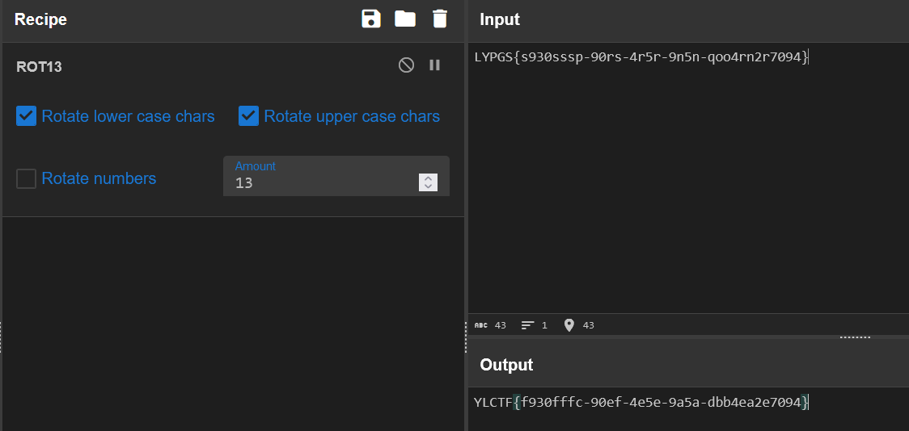

## <font style="color:#117CEE;">e</font><font style="color:#000000;">zmaze</font>
不太一样的迷宫，仔细分析逻辑，只要朝一个方向走就会一直走到底，需要注意这个细节。

由于地图很小，手玩就出了。

```plain
1111100111
1111110111
1110100111
1110001111
1F10111111
1010001111
1011100111
1011101111
1011101011
1000000011
1111111111

dsasasdsaw
```


## <font style="color:#117CEE;">C</font><font style="color:#000000;">ASE</font>
类似 pwn 题的猜随机数。

加密流程就是先对 flag 进行 ROT13，然后以当前时间戳为种子，每一位异或一个随机数。

既然给了 libc，那就直接远程交互，把随机数和密文都取出来，然后本地玩就行了。

```python
#!/usr/bin/env python
# coding=utf-8
from pwn import *
from ctypes import *
context(os='linux', arch='amd64', log_level='debug')

p = remote('challenge.yuanloo.com',21232)
libc = cdll.LoadLibrary("libc.so.6")

seed = libc.time(0)
libc.srand(seed)
enc = p.recv()
box = []
for i in range(100):
    box.append(libc.rand()%255)
print(enc.decode())
print(box)
```

```python
enc = [0xfd,0xf5,0xf5,0x4f,0xd9,0xb4,0x1f,0x5d,0x34,0x9b,0x1d,0xf8,0x79,0xa9,0xb1,0xf9,0xac,0x97,0x16,0xe1,0xfc,0xf8,0xef,0x8f,0x6c,0x7d,0x5c,0xb1,0x47,0x81,0x81,0x35,0xb6,0xa3,0x93,0x8d,0x55,0x3c,0x7f,0xdd,0xc0,0x82,0x85]
box = [177, 172, 165, 8, 138, 207, 108, 100, 7, 171, 110, 139, 10, 217, 156, 192, 156, 229, 101, 204, 200, 138, 218, 253, 65, 68, 50, 132, 41, 172, 240, 90, 217, 151, 225, 227, 103, 78, 72, 237, 249, 182, 248, 132, 16, 150, 196, 173, 124, 43, 249, 197, 53, 213, 195, 118, 26, 245, 122, 67, 35, 234, 29, 124, 130, 254, 96, 106, 205, 169, 215, 199, 223, 209, 203, 240, 231, 145, 158, 227, 188, 152, 169, 113, 237, 110, 231, 8, 227, 225, 202, 7, 204, 103, 131, 80, 103, 100, 58, 53]
res = ""
for i in range(len(enc)):
    res+=chr(enc[i]^box[i])
print(res)
```




