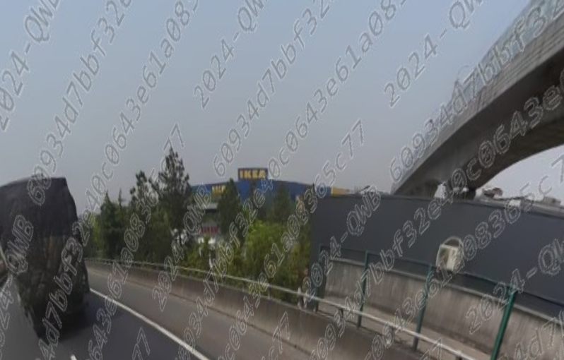

为了方便，使用全景图查看工具。

[360° Panorama Viewer Online](https://renderstuff.com/tools/360-panorama-web-viewer/)

# P1
图片中是一片草场，右半部分是一片矮山，首先猜测的就是我国西北地区，但是左半部分远处是一片海，又将我的思路转移到我国的东南沿海地区，但是地形地貌肯定是不符合的，于是就只能想到我国最大的湖——青海湖了，只有这样大面积的水才能起到图中的效果

地图定位到了青海湖附近之后，发现环绕的基本上都是高速公路，只有寥寥几条正常公路，而图中的公路明显与高速公路的车道数不同，因此把所有高速公路都排除，再对比远处的湖与公路的相对位置，得到这条路应该是青海湖正南方的倒湖茶公路

由于一开始并没有发现这个是全景图，我试了很多路口发现都不对，后面发现这其实是全景图，于是开启实景地图一个点一个点看，直到看到了图中的房子得到了具体坐标。

# P2

这个楼很有标志性，直接谷歌识图即可搜到。

# P3

有个塔，谷歌识图可以得知这是成都双流机场。

用百度街景，跑一会就能找到这里。

# P4

有个 IKEA，在此基础上找桥，桥很有特征，耐心找一下即可。

# P5

远处有个桥，总感觉去过，原来是鹅公岩大桥，百度街景跑一会就找到了。

# P7
作为一个湖南人我是真走过这条路，就是长沙的橘子洲头，横跨橘子洲头的橘子洲大桥。

# P8

百度识图直接找到，然后跑街景。

还有 [#回家路上那些事#沪陕高速 上海长江大桥](https://mbd.baidu.com/newspage/data/videolanding?nid=sv_4379338497763361690&sourceFrom=qmj)。

在上海长江大桥上面逛一会即可找到。

# P9
全景图的左半边的桥挺有特色的，于是截了一半放百度识图里面搜搜看，发现一张很像的图，连旁边的栏杆也一样，我点进该图片的链接进入了一个网站：[途经天兴洲大桥一路拍…… - 我行我摄 - 阳逻在线 - 长江新区,武汉新洲](https://www.yangluo.cn/forum.php?mod=viewthread&tid=47053&mobile=no)

得到图中的桥是武汉天兴洲大桥，多试了几个点之后就得到坐标了。

# P10

可以先定位到浙江，可以稍微看清上面字是 “中铁三局集团携手促进浙江xx发展”，可以找到这个铁路，顺着找就能找到，开街景可以核对。

