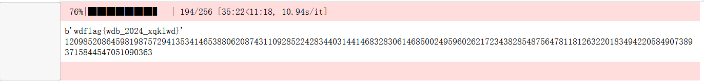

```plain
各位朱雀组参赛选手请注意，平台新增“CRYPTO02”赛题提示：
提示信息如下：请根据提示信息进一步完成解题。

（1）RSA模数 n：

0x00b8cb1cca99b6ac41876c18845732a5cbfc875df346ee9002ce608508b5fcf6b60a5ac7722a2d64ef74e1443a338e70a73e63a303f3ac9adf198595699f6e9f30c009d219c7d98c4ec84203610834029c79567efc08f66b4bc3f564bfb571546a06b7e48fb35bb9ccea9a2cd44349f829242078dfa64d525927bfd55d099c024f

（2）素数 p 的高位：

0xe700568ff506bd5892af92592125e06cbe9bd45dfeafe931a333c13463023d4f0000000000000000000000000000000000000000000000000000000000000000

（3）加密指数 e：

0x10001

（4）加密消息文件：flag.enc，你需要读取并解密此文件。

你的任务是通过给定的信息恢复素数 p，计算私钥 d，并解密加密消息以获得 flag。@全体成员 
```

先检查一下 p 的位数，发现是 512 位。

p部分高位泄露到一定位数可以进行攻击，满足 可以进行攻击。

这里需要额外再爆破 8 位，才能降低时间复杂度。

flag 是以文件形式给的，先转成整数。

```python
import libnum
print(libnum.s2n(open("flag.enc","rb").read()))
#78801842876663907719354273437826290767430398293375991701139877332577740544928924614323249688097249819609084569605125416734887204677523131511785700710569817284349014995243236969400373643115868530288431843888501237064682340821612730764202145516531059035925469586936288008533580133155750894068086055488552713879


```

通过 Copper Smith 来恢复 p，然后解出 flag。

```python
#sage
import libnum
from tqdm import trange
 
n = 0x00b8cb1cca99b6ac41876c18845732a5cbfc875df346ee9002ce608508b5fcf6b60a5ac7722a2d64ef74e1443a338e70a73e63a303f3ac9adf198595699f6e9f30c009d219c7d98c4ec84203610834029c79567efc08f66b4bc3f564bfb571546a06b7e48fb35bb9ccea9a2cd44349f829242078dfa64d525927bfd55d099c024f 
p_high = 0xe700568ff506bd5892af92592125e06cbe9bd45dfeafe931a333c13463023d4f 
pbits = 512 
e = 0x10001 
c = 78801842876663907719354273437826290767430398293375991701139877332577740544928924614323249688097249819609084569605125416734887204677523131511785700710569817284349014995243236969400373643115868530288431843888501237064682340821612730764202145516531059035925469586936288008533580133155750894068086055488552713879 
 
for i in trange(2**8): 
     p4 = p_high<<8
     p4 = p4 + i 
     kbits = pbits - p4.nbits() 
     p4 = p4 << kbits 
     R.<x> = PolynomialRing(Zmod(n)) 
     f = x + p4 
     x = f.small_roots(X=2^kbits, beta=0.4, epsilon=0.01) 
     if x: 
         p = p4 + int(x[0]) 
         q = n // p 
         phi = (p-1)*(q-1)
         d = libnum.invmod(e,phi) 
         m = pow(c,d,n) 
         print(libnum.n2s(int(m))) 
         print(p)
         break

         
```




