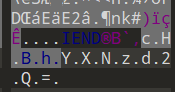

附件是一个 01 字符串，尝试 from binary，发现什么都没有。

询问了一下 AI，可能是曼彻斯特编码。


搜索曼彻斯特编码，找到一篇文章。

[【计算机网络】快速做题向 一张图搞懂曼彻斯特编码，差分曼彻斯特编码，归零编码，非归零编码_曼彻斯特和差分曼彻斯特编码规则画图-CSDN博客](https://blog.csdn.net/m0_61709053/article/details/135233168)


尝试将其视作曼彻斯特编码进行解码，发现解不出来。

用差分曼彻斯特编码时，可以解出来，里面有很明显的 504b0304 的 zip 文件头。

```python
def diff(str_bin):
    # 确保输入字符串长度为偶数
    if len(str_bin) % 2 != 0:
        raise ValueError("Input binary string length must be even.")

    ret = ""
    # 遍历字符串，每次跳过两个字符
    for i in range(0, len(str_bin) // 2 - 1):
        x1 = str_bin[i * 2:i * 2 + 2]  # 获取第一个字符
        x2 = str_bin[i * 2 + 2:i * 2 + 4]  # 获取第二个字符
        if x1 == x2:
            ret += "0"
        else:
            ret += "1"
    return ret
def process_file(input_filename, output_filename):
    with open(input_filename, 'r') as f:
        enc = f.read()
    result = diff(enc)
    with open(output_filename, 'w') as f:
        f.write(hex(int(result, 2)))

# 使用函数处理文件
process_file('data', 'out')


```


这里需要手动删去 504b0304 前面多余的字符。

用 cyberchef from hex 解一下，发现解出来的压缩包是损坏的，可能其中有冗余数据。

仔细观察一下，发现每 44 个字符的最后 12 个字符有规律。


格式都为 00014xxx0015，可能是某种标记，删去这些标记即可。

```python
def read_and_slice(input_string):
    # 将字符串分割成每44个字符的块
    chunks = [input_string[i:i+44] for i in range(0, len(input_string), 44)]
    # 从每个块中取出前32个字符
    sliced_chunks = [chunk[:32] for chunk in chunks]
    # 将所有处理过的块重新连接成一个字符串
    return ''.join(sliced_chunks)

# 假设有一个长字符串
long_string = open("out","r").read()

# 调用函数并打印结果
result = read_and_slice(long_string)
with open("output.txt","w") as f:
    f.write(result)

    
```

from hex 可以得到正常的压缩包，压缩包有密码，这里使用 rockyou.txt 字典可以爆出来密码是 12345678。




解出来一张 png，png 最后藏有一串 base64，删去 \x00 解出来是 ppaasswd。

可能是密钥，试了很多工具，最后发现这是 PixelJihad 隐写，使用在线网站解密。

[PixelJihad](https://sekao.net/pixeljihad/)


 

