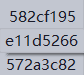
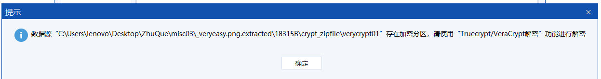
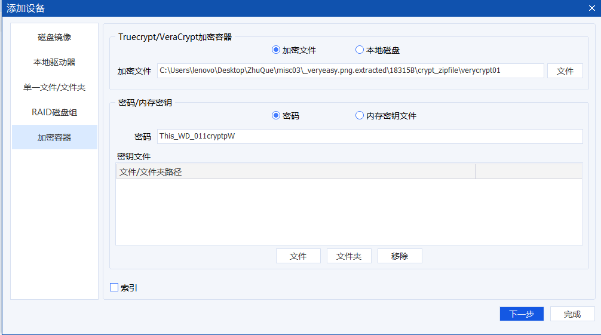
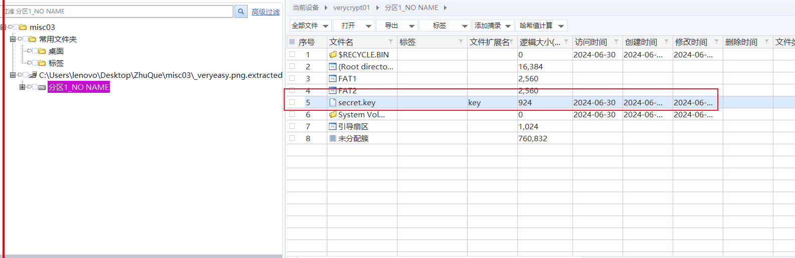
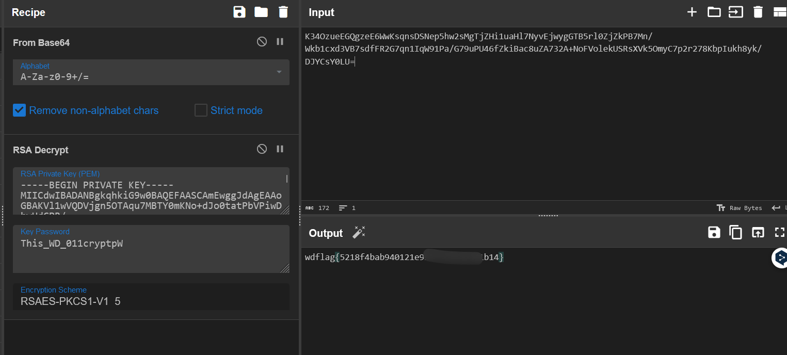

拿到一张 png，里面有个 zip，用 binwalk 分离，得到一个带密码的压缩包，用 foremost 分，得到一个有 flag.txt 的压缩包，里面是密文。

看带密码的压缩包，里面有 3 个 6 字节的 txt，应该是 CRC 爆破，用脚本跑一下。



```shell
Administrator in misc03\crc32-0.1\crc32-0.1 via 🐍 v3.11.5
❯ python crc32.py reverse 0x582cf195
4 bytes: {0xab, 0xe5, 0x29, 0x4d}
verification checksum: 0x582cf195 (OK)
alternative: 2fHgQE (OK)
alternative: 4cA4ac (OK)
alternative: D_011c (OK)
alternative: HpeCUd (OK)
alternative: PWWnDC (OK)
alternative: UrUN7u (OK)
alternative: WNPPnh (OK)
alternative: aiNtxD (OK)
alternative: fpIJRo (OK)
alternative: ofQDDJ (OK)
alternative: u0KJax (OK)
alternative: wAciUm (OK)
alternative: xRr4sn (OK)


Administrator in misc03\crc32-0.1\crc32-0.1 via 🐍 v3.11.5
❯ python crc32.py reverse 0xe11d5266
4 bytes: {0x63, 0xb4, 0x79, 0x22}
verification checksum: 0xe11d5266 (OK)
alternative: 26tgjA (OK)
alternative: 365VqX (OK)
alternative: 4CAE_7 (OK)
alternative: 9QDJHq (OK)
alternative: A6AMxE (OK)
alternative: CGinLP (OK)
alternative: GCtoM3 (OK)
alternative: HPe2k0 (OK)
alternative: KQ0QAl (OK)
alternative: LH7okG (OK)
alternative: LTx3jS (OK)
alternative: Nt2q2Z (OK)
alternative: RvCMKR (OK)
alternative: UoDsay (OK)
alternative: WSAm8d (OK)
alternative: cHZWwU (OK)
alternative: gLGVv6 (OK)
alternative: hbGG8m (OK)
alternative: iCXfJ8 (OK)
alternative: j21te4 (OK)
alternative: ryptpW (OK)
alternative: sy1EkN (OK)


Administrator in misc03\crc32-0.1\crc32-0.1 via 🐍 v3.11.5
❯ python crc32.py reverse 0x572a3c82
4 bytes: {0xac, 0x10, 0x38, 0x8b}
verification checksum: 0x572a3c82 (OK)
alternative: 31YgTo (OK)
alternative: 54P4dI (OK)
alternative: 6YvzJQ (OK)
alternative: 7Y7KQH (OK)
alternative: 8ViJv_ (OK)
alternative: EYCPXU (OK)
alternative: ORAae8 (OK)
alternative: This_W (OK)
alternative: ZgvCcY (OK)
alternative: aRmhb3 (OK)
alternative: cO6fRb (OK)
alternative: dV1XxI (OK)
alternative: eVpicP (OK)
alternative: jEa4ES (OK)
alternative: pcGKe1 (OK)
alternative: r31x8h (OK)
alternative: tgZJdR (OK)
```

拼接顺序是 3->1->2，用 python 跑一个字典，然后爆破。

```python
box1 = ["2fHgQE",
    "4cA4ac",
    "D_011c",
    "HpeCUd",
    "PWWnDC",
    "UrUN7u",
    "WNPPnh",
    "aiNtxD",
    "fpIJRo",
    "ofQDDJ",
    "u0KJax",
    "wAciUm",
    "xRr4sn"]
box2 = ["26tgjA",
    "365VqX",
    "4CAE_7",
    "9QDJHq",
    "A6AMxE",
    "CGinLP",
    "GCtoM3",
    "HPe2k0",
    "KQ0QAl",
    "LH7okG",
    "LTx3jS",
    "Nt2q2Z",
    "RvCMKR",
    "UoDsay",
    "WSAm8d",
    "cHZWwU",
    "gLGVv6",
    "hbGG8m",
    "iCXfJ8",
    "j21te4",
    "ryptpW",
    "sy1EkN"]
box3 = ["31YgTo",
    "54P4dI",
    "6YvzJQ",
    "7Y7KQH",
    "8ViJv_",
    "EYCPXU",
    "ORAae8",
    "This_W",
    "ZgvCcY",
    "aRmhb3",
    "cO6fRb",
    "dV1XxI",
    "eVpicP",
    "jEa4ES",
    "pcGKe1",
    "r31x8h",
    "tgZJdR"]

with open("dic.txt","w") as f:
    for p1 in box3:
        for p2 in box1:
            for p3 in box2:
                passwd = p1+p2+p3
                f.write(passwd+'\n')

```

密码是 This_WD_011cryptpW。

解开压缩包，里面有个 docx 文档，但用 010 分析以后发现并不是。

可能是磁盘，这里用取证大师挂载，发现提示需要密钥。



选择加密容器添加设备，密钥为刚才的压缩包密码。





发现有个 secret.key 文件，直接导出。

里面是 RSA 的私钥，用这个去解 flag 的密文，注意要把字符串 "ENCRYPTED" 去掉。

解 RSA 的时候 key 还是刚才的压缩包密码。



