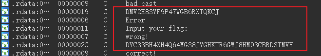
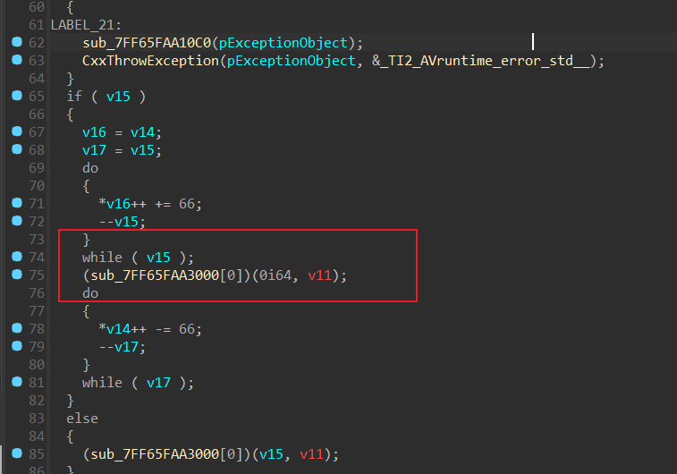
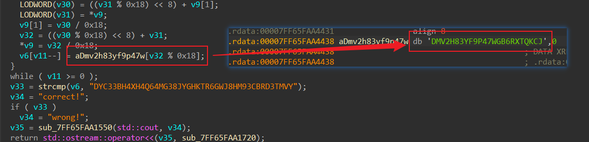
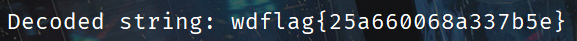

IDA 打开，strings 查看字符串，发现类似密文的东西。



交叉引用过去，发现没有被引用，可能是程序对自身进行了加密。



找到 sub_7FF65FAA3000 函数，在这里下一个断点，然后动调。

在汇编界面点击这个函数，依次按 U，P 重新反汇编，得到主要的逻辑。

```c
__int64 sub_7FF65FAA3000()
{
  __int64 v0; // rax
  __int64 v1; // rax
  __int64 v2; // rdx
  __int64 v3; // rax
  __int64 v4; // rax
  HANDLE ProcessHeap; // rax
  const char *v6; // rbx
  __int64 v7; // rax
  HANDLE v8; // rax
  unsigned __int8 *v9; // rax
  __int64 v10; // rax
  __int64 v11; // r10
  __int128 v12; // xmm1
  __int64 v13; // xmm0_8
  unsigned __int64 v14; // rcx
  int v15; // r8d
  unsigned __int64 v16; // rcx
  unsigned int v17; // r8d
  int v18; // r8d
  unsigned int v19; // r8d
  int v20; // r8d
  unsigned int v21; // r8d
  unsigned __int64 v22; // rcx
  int v23; // r8d
  unsigned int v24; // r8d
  int v25; // r8d
  unsigned int v26; // r8d
  int v27; // r8d
  unsigned int v28; // r8d
  int v29; // r8d
  unsigned __int64 v30; // r8
  unsigned __int64 v31; // rcx
  unsigned __int64 v32; // rcx
  int v33; // eax
  const char *v34; // rdx
  __int64 v35; // rax
  char v37[16]; // [rsp+20h] [rbp-128h] BYREF
  __int128 v38; // [rsp+30h] [rbp-118h] BYREF
  __int128 v39; // [rsp+40h] [rbp-108h]
  __int64 v40; // [rsp+50h] [rbp-F8h]
  __int16 v41; // [rsp+58h] [rbp-F0h]
  unsigned __int8 v42; // [rsp+5Ah] [rbp-EEh]

  v38 = 0i64;
  *&v39 = 0i64;
  v0 = sub_7FF65FAA1550(std::cout, "Input your flag:");
  std::ostream::operator<<(v0, sub_7FF65FAA1720);
  v1 = std::setw(v37, 255i64);
  (*v1)(&std::cin + *(std::cin + 4i64), *(v1 + 8));
  sub_7FF65FAA17F0(std::cin, v2, &v38);
  v3 = -1i64;
  do
    ++v3;
  while ( *(&v38 + v3) );
  if ( v3 != 24 )
  {
    v4 = sub_7FF65FAA1550(std::cout, "wrong!");
    std::ostream::operator<<(v4, sub_7FF65FAA1720);
    exit(-1);
  }
  ProcessHeap = GetProcessHeap();
  v6 = HeapAlloc(ProcessHeap, 8u, 0x2Cui64);
  if ( !v6 )
  {
    v7 = sub_7FF65FAA1550(std::cout, "Error");
    std::ostream::operator<<(v7, sub_7FF65FAA1720);
    exit(-1);
  }
  v8 = GetProcessHeap();
  v9 = HeapAlloc(v8, 8u, 0x2Cui64);
  if ( !v9 )
  {
    v10 = sub_7FF65FAA1550(std::cout, "Error");
    std::ostream::operator<<(v10, sub_7FF65FAA1720);
    exit(-1);
  }
  v11 = 42i64;
  v12 = v39;
  *v9 = v38;
  v13 = v40;
  *(v9 + 1) = v12;
  *(v9 + 4) = v13;
  *(v9 + 20) = v41;
  v9[42] = v42;
  *(v6 + 43) = 0;
  do
  {
    v14 = v9[23];
    v15 = v9[21];
    v9[23] /= 0x18u;
    v16 = v9[22] + ((v14 % 0x18) << 8);
    v9[22] = v16 / 0x18;
    v17 = ((v16 % 0x18) << 8) + v15;
    LODWORD(v16) = v9[20];
    v9[21] = v17 / 0x18;
    LODWORD(v16) = ((v17 % 0x18) << 8) + v16;
    v18 = v9[19];
    v9[20] = v16 / 0x18;
    v19 = ((v16 % 0x18) << 8) + v18;
    LODWORD(v16) = v9[18];
    v9[19] = v19 / 0x18;
    LODWORD(v16) = ((v19 % 0x18) << 8) + v16;
    v20 = v9[17];
    v9[18] = v16 / 0x18;
    v21 = ((v16 % 0x18) << 8) + v20;
    LODWORD(v16) = v9[16];
    v9[17] = v21 / 0x18;
    v22 = ((v21 % 0x18) << 8) + v16;
    v23 = v9[15];
    v9[16] = v22 / 0x18;
    v24 = ((v22 % 0x18) << 8) + v23;
    LODWORD(v22) = v9[14];
    v9[15] = v24 / 0x18;
    LODWORD(v22) = ((v24 % 0x18) << 8) + v22;
    v25 = v9[13];
    v9[14] = v22 / 0x18;
    v26 = ((v22 % 0x18) << 8) + v25;
    LODWORD(v22) = v9[12];
    v9[13] = v26 / 0x18;
    LODWORD(v22) = ((v26 % 0x18) << 8) + v22;
    v27 = v9[11];
    v9[12] = v22 / 0x18;
    v28 = ((v22 % 0x18) << 8) + v27;
    LODWORD(v22) = v9[10];
    v9[11] = v28 / 0x18;
    LODWORD(v22) = ((v28 % 0x18) << 8) + v22;
    v29 = v9[9];
    v9[10] = v22 / 0x18;
    v30 = ((v22 % 0x18) << 8) + v29;
    LODWORD(v22) = v9[8];
    v9[9] = v30 / 0x18;
    LODWORD(v22) = ((v30 % 0x18) << 8) + v22;
    LODWORD(v30) = v9[7];
    v9[8] = v22 / 0x18;
    LODWORD(v30) = ((v22 % 0x18) << 8) + v30;
    LODWORD(v22) = v9[6];
    v9[7] = v30 / 0x18;
    LODWORD(v22) = ((v30 % 0x18) << 8) + v22;
    LODWORD(v30) = v9[5];
    v9[6] = v22 / 0x18;
    LODWORD(v30) = ((v22 % 0x18) << 8) + v30;
    LODWORD(v22) = v9[4];
    v9[5] = v30 / 0x18;
    LODWORD(v22) = ((v30 % 0x18) << 8) + v22;
    LODWORD(v30) = v9[3];
    v9[4] = v22 / 0x18;
    LODWORD(v30) = ((v22 % 0x18) << 8) + v30;
    LODWORD(v22) = v9[2];
    v9[3] = v30 / 0x18;
    v31 = ((v30 % 0x18) << 8) + v22;
    v9[2] = v31 / 0x18;
    LODWORD(v30) = ((v31 % 0x18) << 8) + v9[1];
    LODWORD(v31) = *v9;
    v9[1] = v30 / 0x18;
    v32 = ((v30 % 0x18) << 8) + v31;
    *v9 = v32 / 0x18;
    v6[v11--] = aDmv2h83yf9p47w[v32 % 0x18];
  }
  while ( v11 >= 0 );
  v33 = strcmp(v6, "DYC33BH4XH4Q64MG38JYGHKTR6GWJ8HM93CBRD3TMVY");
  v34 = "correct!";
  if ( v33 )
    v34 = "wrong!";
  v35 = sub_7FF65FAA1550(std::cout, v34);
  return std::ostream::operator<<(v35, sub_7FF65FAA1720);
}


```

 

其实就是一个换表的 base24，直接 GPT 跑一个解密脚本即可。

```python
def base24_decode(encoded_str):
    base24_chars = "DMV2H83YF9P47WGB6RXTQKCJ"
    base = len(base24_chars)
    decoded_value = 0

    for index, char in enumerate(reversed(encoded_str)):
        if char not in base24_chars:
            raise ValueError(f"Invalid character {char} in input string.")
        decoded_value += base24_chars.index(char) * (base ** index)

    # 将解码后的值转换为字符串
    decoded_bytes = decoded_value.to_bytes((decoded_value.bit_length() + 7) // 8, 'little')
    return decoded_bytes.decode('utf-8', errors='ignore')


# 测试
encoded_str = "DYC33BH4XH4Q64MG38JYGHKTR6GWJ8HM93CBRD3TMVY"  # 这里可以替换为你的 Base24 字符串
try:
    decoded_string = base24_decode(encoded_str)
    print(f"Decoded string: {decoded_string}")
except ValueError as e:
    print(e)


```




